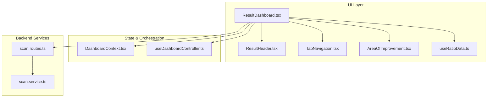
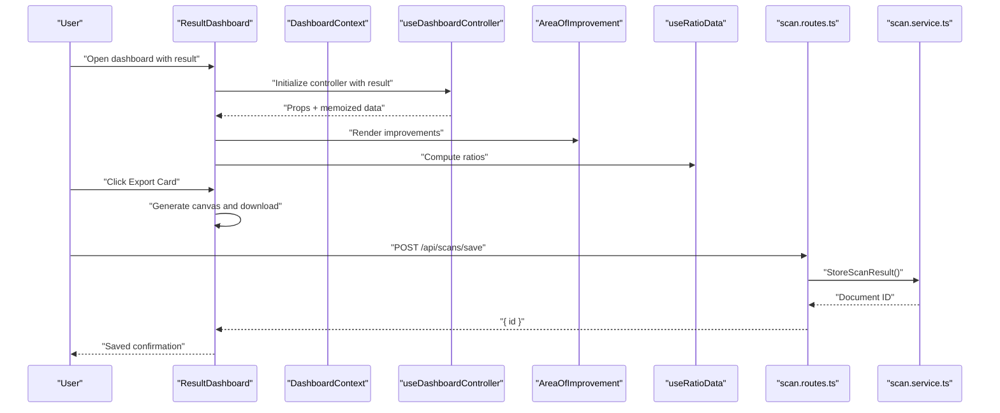
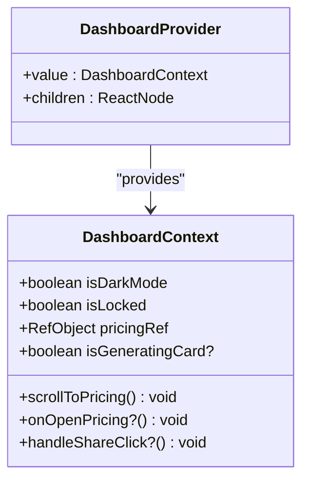
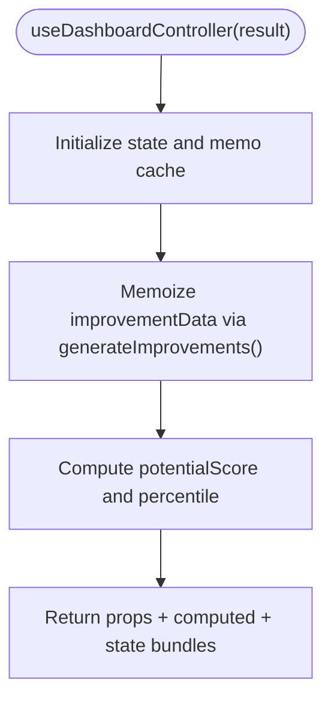
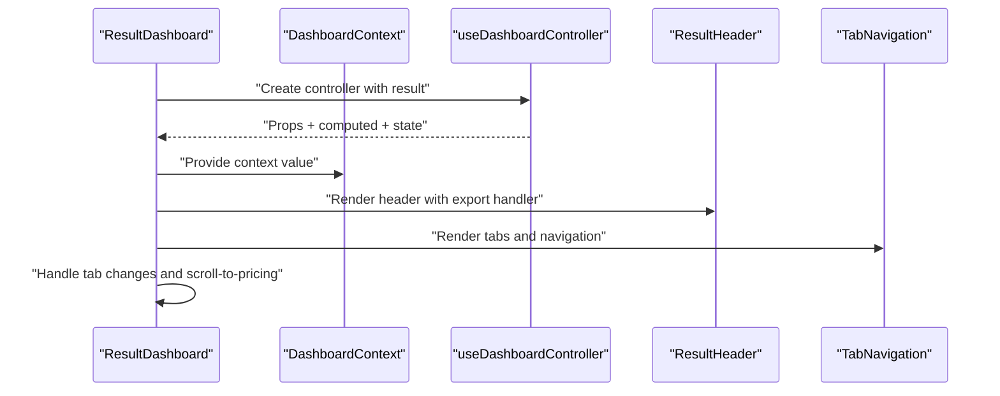
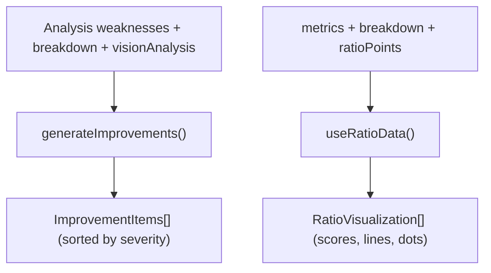
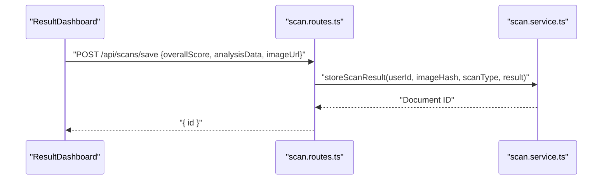
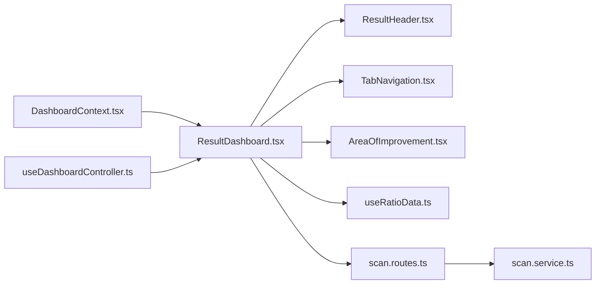

# DashboardContext

<cite>
**Referenced Files in This Document**
- [DashboardContext.tsx](file://src/context/DashboardContext.tsx)
- [useDashboardController.ts](file://src/features/dashboard/useDashboardController.ts)
- [ResultDashboard.tsx](file://src/components/ResultDashboard.tsx)
- [ResultHeader.tsx](file://src/components/dashboard/ResultHeader.tsx)
- [TabNavigation.tsx](file://src/components/dashboard/TabNavigation.tsx)
- [AreaOfImprovement.tsx](file://src/components/AreaOfImprovement.tsx)
- [useRatioData.ts](file://src/components/facial-ratio/useRatioData.ts)
- [scan.routes.ts](file://backend/routes/scan.routes.ts)
- [scan.service.ts](file://backend/services/scan.service.ts)
</cite>

## Table of Contents
1. [Introduction](#introduction)
2. [Project Structure](#project-structure)
3. [Core Components](#core-components)
4. [Architecture Overview](#architecture-overview)
5. [Detailed Component Analysis](#detailed-component-analysis)
6. [Dependency Analysis](#dependency-analysis)
7. [Performance Considerations](#performance-considerations)
8. [Troubleshooting Guide](#troubleshooting-guide)
9. [Conclusion](#conclusion)

## Introduction
This document explains the DashboardContext component and the surrounding orchestration layer that powers analytics coordination and data aggregation in FaceAnalytics Pro. It focuses on how the dashboard coordinates data fetching, state management, and analytics transformations across multiple components, and how it integrates with the analytics engine and historical data management. It also documents real-time update mechanisms, caching strategies, performance optimizations for large datasets, error handling, and user interaction patterns.

## Project Structure
The dashboard is implemented as a composition of:
- A lightweight context provider (DashboardContext) that exposes UI-level actions and flags to child components.
- A controller hook (useDashboardController) that centralizes derived analytics data, computed metrics, and UI state.
- A dashboard shell (ResultDashboard) that wires the controller, composes subcomponents, and handles user interactions.
- Supporting components for rendering insights, tabs, and ratio visualizations.
- Backend services for saving and retrieving scan results, including caching and pagination.

**Diagram sources**
- [ResultDashboard.tsx:315-1306](file://src/components/ResultDashboard.tsx#L315-L1306)
- [DashboardContext.tsx:1-33](file://src/context/DashboardContext.tsx#L1-L33)
- [useDashboardController.ts:1-101](file://src/features/dashboard/useDashboardController.ts#L1-L101)
- [ResultHeader.tsx:1-135](file://src/components/dashboard/ResultHeader.tsx#L1-L135)
- [TabNavigation.tsx:1-167](file://src/components/dashboard/TabNavigation.tsx#L1-L167)
- [AreaOfImprovement.tsx:492-629](file://src/components/AreaOfImprovement.tsx#L492-L629)
- [useRatioData.ts:1-649](file://src/components/facial-ratio/useRatioData.ts#L1-L649)
- [scan.routes.ts:1-63](file://backend/routes/scan.routes.ts#L1-L63)
- [scan.service.ts:1-134](file://backend/services/scan.service.ts#L1-L134)

**Section sources**
- [DashboardContext.tsx:1-33](file://src/context/DashboardContext.tsx#L1-L33)
- [useDashboardController.ts:1-101](file://src/features/dashboard/useDashboardController.ts#L1-L101)
- [ResultDashboard.tsx:315-1306](file://src/components/ResultDashboard.tsx#L315-L1306)

## Core Components
- DashboardContext: Provides a minimal, UI-focused context with flags (dark mode, locked state), navigation helpers (scroll to pricing), and a shared action flag for card generation. It ensures downstream components can coordinate without duplicating global state.
- useDashboardController: Centralizes:
  - Derived analytics data (e.g., improvement recommendations).
  - Promotional code state and errors.
  - UI and action flags (e.g., card generation).
  - Celebrity analysis state and errors.
  - Memoized computations for performance.
- ResultDashboard: The dashboard shell that:
  - Creates the DashboardContext provider value.
  - Wires the controller and passes props to child components.
  - Manages tab switching, deferred rendering, and scroll-to-pricing.
  - Orchestrates export-card generation and promotional code redemption.
- Supporting components:
  - ResultHeader: Export card button and reset action.
  - TabNavigation: Overview/Analysis/Plan tabs and quick links.
  - AreaOfImprovement: Transforms analysis weaknesses into actionable items.
  - useRatioData: Computes 16+ facial ratio visualizations from metrics and landmarks.

**Section sources**
- [DashboardContext.tsx:1-33](file://src/context/DashboardContext.tsx#L1-L33)
- [useDashboardController.ts:1-101](file://src/features/dashboard/useDashboardController.ts#L1-L101)
- [ResultDashboard.tsx:315-1306](file://src/components/ResultDashboard.tsx#L315-L1306)
- [ResultHeader.tsx:1-135](file://src/components/dashboard/ResultHeader.tsx#L1-L135)
- [TabNavigation.tsx:1-167](file://src/components/dashboard/TabNavigation.tsx#L1-L167)
- [AreaOfImprovement.tsx:492-629](file://src/components/AreaOfImprovement.tsx#L492-L629)
- [useRatioData.ts:1-649](file://src/components/facial-ratio/useRatioData.ts#L1-L649)

## Architecture Overview
The dashboard orchestrates analytics coordination through a unidirectional data flow:
- Data enters via the dashboard shell (ResultDashboard) with a result payload.
- The controller computes derived insights and memoizes expensive work.
- Child components render UI and trigger actions (e.g., export card, apply promo code).
- Backend APIs persist results and serve cached results to reduce latency and load.

**Diagram sources**
- [ResultDashboard.tsx:315-1306](file://src/components/ResultDashboard.tsx#L315-L1306)
- [useDashboardController.ts:1-101](file://src/features/dashboard/useDashboardController.ts#L1-L101)
- [AreaOfImprovement.tsx:492-629](file://src/components/AreaOfImprovement.tsx#L492-L629)
- [useRatioData.ts:1-649](file://src/components/facial-ratio/useRatioData.ts#L1-L649)
- [scan.routes.ts:22-44](file://backend/routes/scan.routes.ts#L22-L44)
- [scan.service.ts:68-94](file://backend/services/scan.service.ts#L68-L94)

## Detailed Component Analysis

### DashboardContext and Provider
- Purpose: Expose a small set of global UI flags and actions to descendant components.
- Key exports:
  - Flags: dark mode, locked state.
  - Actions: scroll-to-pricing handler, optional pricing open callback, and a ref to the pricing section.
  - Shared UI state: card generation flag.
- Consumers: Any component under the dashboard shell can call the context to coordinate actions (e.g., exporting cards, navigating to pricing).

**Diagram sources**
- [DashboardContext.tsx:3-32](file://src/context/DashboardContext.tsx#L3-L32)

**Section sources**
- [DashboardContext.tsx:1-33](file://src/context/DashboardContext.tsx#L1-L33)

### useDashboardController
- Responsibilities:
  - Derive and memoize improvement data from analysis, breakdown, and vision analysis.
  - Compute potential score and percentile estimates.
  - Manage UI and action state (promo code, leaderboard, pricing offer timer, card generation).
  - Track celebrity analysis state and errors.
- Data flow:
  - Accepts a result object containing scores, breakdown, metrics, analysis, and vision analysis.
  - Returns:
    - Props: raw analytics props.
    - Computed data: improvementData, potentialScore, potentialPercentile.
    - State bundles: promoState, uiState, celebState.

**Diagram sources**
- [useDashboardController.ts:4-101](file://src/features/dashboard/useDashboardController.ts#L4-L101)
- [AreaOfImprovement.tsx:492-629](file://src/components/AreaOfImprovement.tsx#L492-L629)

**Section sources**
- [useDashboardController.ts:1-101](file://src/features/dashboard/useDashboardController.ts#L1-L101)

### ResultDashboard Shell
- Orchestrates:
  - Creating the DashboardContext provider value from UI flags and handlers.
  - Wiring the controller and passing props to child components.
  - Managing tab transitions and resetting motion budgets.
  - Handling export-card generation with a canvas-based renderer.
  - Applying referral codes via a backend endpoint.
- Real-time update mechanisms:
  - Uses memoization to avoid recomputing expensive data.
  - Resets motion budgets on tab change to maintain smooth animations.
  - Defers rendering of certain panels to improve initial load performance.

**Diagram sources**
- [ResultDashboard.tsx:315-1306](file://src/components/ResultDashboard.tsx#L315-L1306)
- [ResultHeader.tsx:1-135](file://src/components/dashboard/ResultHeader.tsx#L1-L135)
- [TabNavigation.tsx:1-167](file://src/components/dashboard/TabNavigation.tsx#L1-L167)

**Section sources**
- [ResultDashboard.tsx:315-1306](file://src/components/ResultDashboard.tsx#L315-L1306)

### Data Transformation Pipelines
- Improvements pipeline:
  - Converts weaknesses into structured improvement items with severity, impact, affected metrics, and recommended actions.
  - Integrates AI vision analysis improvements.
  - Sorts by severity for prioritized presentation.
- Ratio visualization pipeline:
  - Computes 16+ facial ratios from metrics and normalized landmark points.
  - Produces visual metadata (lines, dots, scores, units) for ratio explorer components.

**Diagram sources**
- [AreaOfImprovement.tsx:492-629](file://src/components/AreaOfImprovement.tsx#L492-L629)
- [useRatioData.ts:10-649](file://src/components/facial-ratio/useRatioData.ts#L10-L649)

**Section sources**
- [AreaOfImprovement.tsx:492-629](file://src/components/AreaOfImprovement.tsx#L492-L629)
- [useRatioData.ts:10-649](file://src/components/facial-ratio/useRatioData.ts#L10-L649)

### Integration with Analytics Engine and Historical Data
- Backend endpoints:
  - Save scan: POST /api/scans/save stores analysis results with user identity and image hash.
  - History: GET /api/scans/history retrieves paginated scan history for the authenticated user.
- Caching and deduplication:
  - Results are stored with an image hash to enable cache hits for identical images.
  - Cached results are returned with metadata indicating cache origin.

**Diagram sources**
- [scan.routes.ts:22-44](file://backend/routes/scan.routes.ts#L22-L44)
- [scan.service.ts:68-94](file://backend/services/scan.service.ts#L68-L94)

**Section sources**
- [scan.routes.ts:1-63](file://backend/routes/scan.routes.ts#L1-L63)
- [scan.service.ts:1-134](file://backend/services/scan.service.ts#L1-L134)

### Real-Time Update Mechanisms
- Memoization:
  - Controller memoizes improvement data and derived metrics to prevent unnecessary re-computation.
  - Ratio computations are memoized based on metrics, breakdown, and normalized landmark points.
- Deferred rendering:
  - Certain panels are shown after an initial timeout to improve perceived performance.
- Motion budget resets:
  - On tab change, motion budgets are reset to ensure smooth animations in the newly visible panel.

**Section sources**
- [useDashboardController.ts:37-40](file://src/features/dashboard/useDashboardController.ts#L37-L40)
- [ResultDashboard.tsx:334-344](file://src/components/ResultDashboard.tsx#L334-L344)
- [useRatioData.ts:15-15](file://src/components/facial-ratio/useRatioData.ts#L15-L15)

### Examples of Dashboard State Updates, Filtering, and Component Communication
- State updates:
  - Export card generation toggles a UI flag to disable controls and show a loader overlay.
  - Promotional code state tracks input, loading, errors, and success messages.
  - Celebrity analysis state tracks scanning steps, history, and results.
- Filtering:
  - Improvement items are filtered by category and severity; totals are computed for each category.
- Component communication:
  - DashboardContext provides a shared action surface (e.g., scrollToPricing) to child components.
  - Tabs communicate via callbacks to switch views and reset motion budgets.

**Section sources**
- [ResultDashboard.tsx:482-689](file://src/components/ResultDashboard.tsx#L482-L689)
- [useDashboardController.ts:63-98](file://src/features/dashboard/useDashboardController.ts#L63-L98)
- [AreaOfImprovement.tsx:313-329](file://src/components/AreaOfImprovement.tsx#L313-L329)
- [TabNavigation.tsx:18-40](file://src/components/dashboard/TabNavigation.tsx#L18-L40)

## Dependency Analysis
- DashboardContext depends on:
  - UI flags and handlers provided by the dashboard shell.
  - No external dependencies; acts as a thin layer for component coordination.
- useDashboardController depends on:
  - Analysis data and vision analysis to compute improvements.
  - Memoization to optimize derived data.
- ResultDashboard depends on:
  - Controller for props and state.
  - Child components for rendering.
  - Backend routes for saving and retrieving results.
- Backend services depend on:
  - Firestore for persistence and caching.
  - Rate limiters for safety.

**Diagram sources**
- [DashboardContext.tsx:1-33](file://src/context/DashboardContext.tsx#L1-L33)
- [useDashboardController.ts:1-101](file://src/features/dashboard/useDashboardController.ts#L1-L101)
- [ResultDashboard.tsx:315-1306](file://src/components/ResultDashboard.tsx#L315-L1306)
- [ResultHeader.tsx:1-135](file://src/components/dashboard/ResultHeader.tsx#L1-L135)
- [TabNavigation.tsx:1-167](file://src/components/dashboard/TabNavigation.tsx#L1-L167)
- [AreaOfImprovement.tsx:492-629](file://src/components/AreaOfImprovement.tsx#L492-L629)
- [useRatioData.ts:1-649](file://src/components/facial-ratio/useRatioData.ts#L1-L649)
- [scan.routes.ts:1-63](file://backend/routes/scan.routes.ts#L1-L63)
- [scan.service.ts:1-134](file://backend/services/scan.service.ts#L1-L134)

**Section sources**
- [DashboardContext.tsx:1-33](file://src/context/DashboardContext.tsx#L1-L33)
- [useDashboardController.ts:1-101](file://src/features/dashboard/useDashboardController.ts#L1-L101)
- [ResultDashboard.tsx:315-1306](file://src/components/ResultDashboard.tsx#L315-L1306)

## Performance Considerations
- Memoization:
  - Controller memoizes improvement data and derived metrics to avoid recomputation on re-renders.
  - Ratio computations are memoized based on inputs to prevent redundant calculations.
- Deferred rendering:
  - Non-critical panels are shown after an initial delay to improve first paint and perceived performance.
- Motion budget resets:
  - Resetting motion budgets on tab changes prevents animation starvation and maintains smooth UX.
- Backend caching:
  - Image hashing enables cache hits for identical images, reducing server load and latency.
- Canvas generation:
  - Export-card generation uses a canvas renderer; ensure to release resources and avoid blocking the UI thread.

[No sources needed since this section provides general guidance]

## Troubleshooting Guide
- Export card generation fails:
  - The dashboard sets a generation flag and disables controls during generation. If it fails, an error is logged and the user is notified. Verify image availability and canvas context creation.
- Referral code redemption:
  - Requires authentication; ensure the user is signed in and network connectivity is available. The endpoint returns an error message on failure.
- Backend save or history retrieval:
  - Errors are caught and reported; check server logs for database availability and rate limiter violations.

**Section sources**
- [ResultDashboard.tsx:683-731](file://src/components/ResultDashboard.tsx#L683-L731)
- [scan.routes.ts:40-60](file://backend/routes/scan.routes.ts#L40-L60)
- [scan.service.ts:87-93](file://backend/services/scan.service.ts#L87-L93)

## Conclusion
DashboardContext and its orchestration layer provide a clean separation of concerns for analytics coordination in FaceAnalytics Pro. By centralizing derived data, memoizing expensive computations, and exposing a minimal context surface, the dashboard remains responsive and maintainable. Integration with backend services enables persistent storage, caching, and historical tracking, while frontend optimizations ensure a smooth user experience across large datasets and complex visualizations.