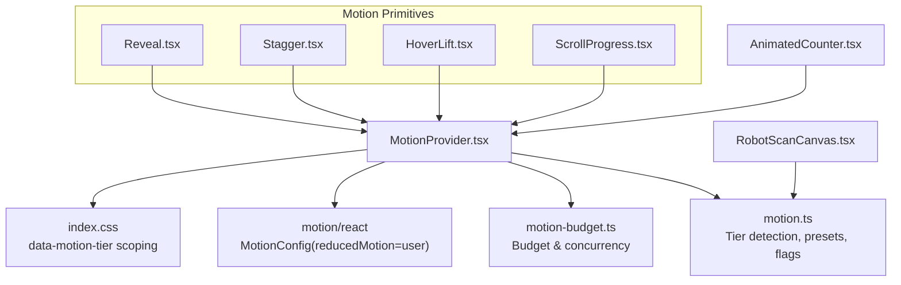
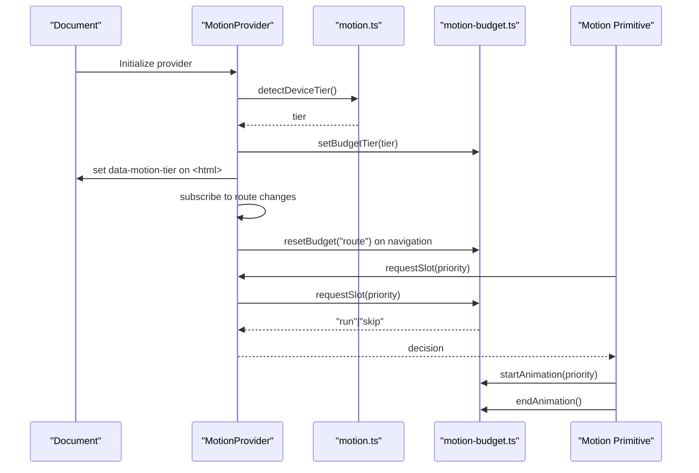
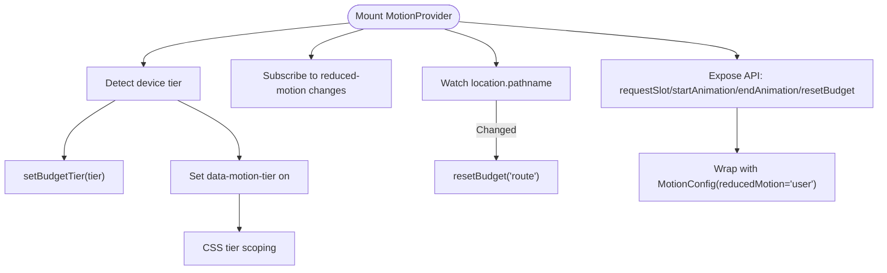
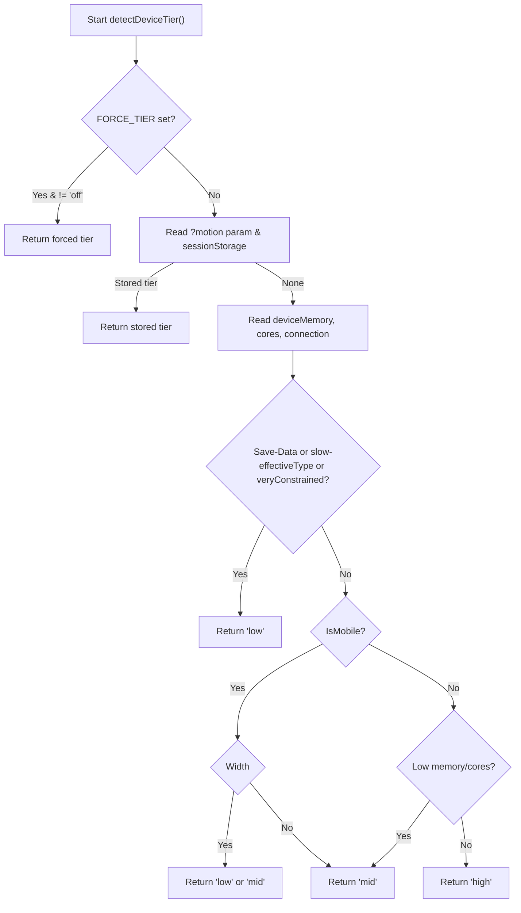
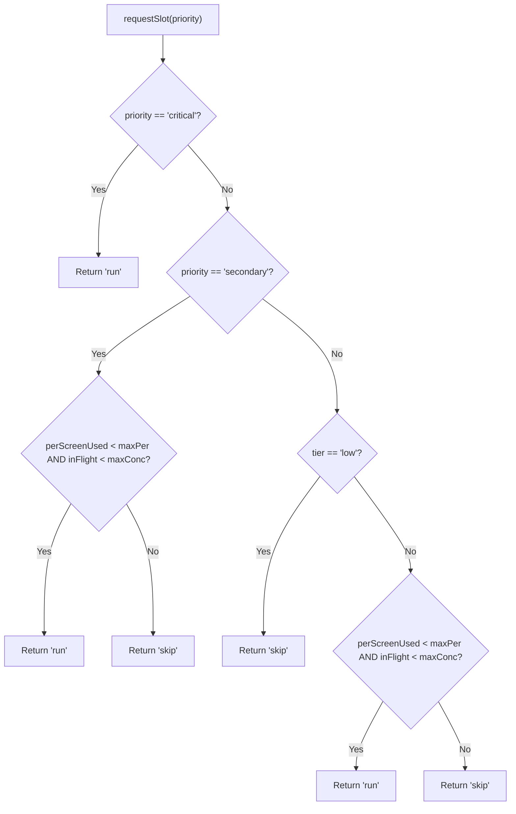
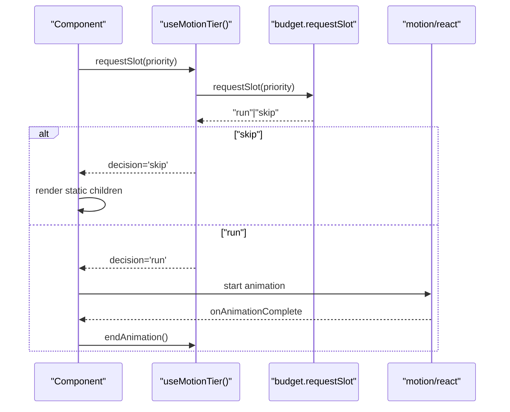
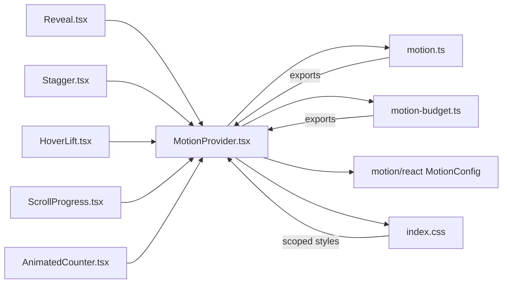

# MotionProvider

<cite>
**Referenced Files in This Document**
- [MotionProvider.tsx](file://src/context/MotionProvider.tsx)
- [motion.ts](file://src/lib/motion.ts)
- [motion-budget.ts](file://src/lib/motion-budget.ts)
- [index.css](file://src/index.css)
- [MOTION.md](file://docs/MOTION.md)
- [Reveal.tsx](file://src/components/motion/Reveal.tsx)
- [Stagger.tsx](file://src/components/motion/Stagger.tsx)
- [HoverLift.tsx](file://src/components/motion/HoverLift.tsx)
- [ScrollProgress.tsx](file://src/components/motion/ScrollProgress.tsx)
- [AnimatedCounter.tsx](file://src/components/AnimatedCounter.tsx)
- [RobotScanCanvas.tsx](file://src/components/FaceAnalyzer/canvas/RobotScanCanvas.tsx)
</cite>

## Table of Contents
1. [Introduction](#introduction)
2. [Project Structure](#project-structure)
3. [Core Components](#core-components)
4. [Architecture Overview](#architecture-overview)
5. [Detailed Component Analysis](#detailed-component-analysis)
6. [Dependency Analysis](#dependency-analysis)
7. [Performance Considerations](#performance-considerations)
8. [Troubleshooting Guide](#troubleshooting-guide)
9. [Conclusion](#conclusion)
10. [Appendices](#appendices)

## Introduction
MotionProvider orchestrates animation orchestration and device performance optimization for FaceAnalytics Pro. It detects device capability tiers, applies adaptive motion presets, enforces animation budgets and concurrency, and coordinates complex motion sequences across the UI. It integrates tightly with the Motion library, exposes a consistent motion API to components, and ensures smooth experiences across a wide range of devices.

## Project Structure
MotionProvider lives in the context layer and collaborates with:
- Motion library for tier detection, presets, easing, and flags
- Motion budget singleton for screen budget and concurrency control
- CSS tier scoping for runtime adjustments
- Motion primitives that gate behavior based on tier and budget

**Diagram sources**
- [MotionProvider.tsx:45-132](file://src/context/MotionProvider.tsx#L45-L132)
- [motion.ts:167-225](file://src/lib/motion.ts#L167-L225)
- [motion-budget.ts:30-79](file://src/lib/motion-budget.ts#L30-L79)
- [index.css:45-68](file://src/index.css#L45-L68)
- [Reveal.tsx:54-137](file://src/components/motion/Reveal.tsx#L54-L137)
- [Stagger.tsx:36-131](file://src/components/motion/Stagger.tsx#L36-L131)
- [HoverLift.tsx:34-57](file://src/components/motion/HoverLift.tsx#L34-L57)
- [ScrollProgress.tsx:12-37](file://src/components/motion/ScrollProgress.tsx#L12-L37)
- [AnimatedCounter.tsx:20-45](file://src/components/AnimatedCounter.tsx#L20-L45)
- [RobotScanCanvas.tsx:2058-2089](file://src/components/FaceAnalyzer/canvas/RobotScanCanvas.tsx#L2058-L2089)

**Section sources**
- [MotionProvider.tsx:45-132](file://src/context/MotionProvider.tsx#L45-L132)
- [motion.ts:167-225](file://src/lib/motion.ts#L167-L225)
- [motion-budget.ts:30-79](file://src/lib/motion-budget.ts#L30-L79)
- [index.css:45-68](file://src/index.css#L45-L68)

## Core Components
- MotionProvider: Detects device tier, tracks reduced-motion preference, reflects tier on HTML, resets screen budget on route changes, and exposes a cohesive motion API to consumers.
- Motion library: Provides tier detection, presets, easing, flags, and constants for budgets and concurrency.
- Motion budget: Singleton managing per-screen budget and concurrency counters, plus reset and inspection utilities.
- Motion primitives: Components that honor tier, budget, and reduced-motion preferences.

Key responsibilities:
- Device capability tiering and adaptive presets
- Animation budget and concurrency enforcement
- Reduced-motion preference gating
- Route-based budget reset
- Developer debugging hooks

**Section sources**
- [MotionProvider.tsx:45-132](file://src/context/MotionProvider.tsx#L45-L132)
- [motion.ts:123-134](file://src/lib/motion.ts#L123-L134)
- [motion-budget.ts:44-79](file://src/lib/motion-budget.ts#L44-L79)

## Architecture Overview
MotionProvider composes a tier-aware motion ecosystem:
- Tier detection drives presets and feature flags
- Budget and concurrency control limit simultaneous animations
- Reduced-motion preference gates decorative animations
- CSS tier scoping applies additional runtime adjustments
- MotionConfig aligns library behavior with user preference

**Diagram sources**
- [MotionProvider.tsx:46-80](file://src/context/MotionProvider.tsx#L46-L80)
- [motion.ts:167-225](file://src/lib/motion.ts#L167-L225)
- [motion-budget.ts:30-79](file://src/lib/motion-budget.ts#L30-L79)

## Detailed Component Analysis

### MotionProvider
Responsibilities:
- Detect device tier on mount and persist it
- Track reduced-motion preference via matchMedia
- Reflect tier on <html> for CSS scoping
- Reset screen budget on route changes
- Expose requestSlot/startAnimation/endAnimation/resetBudget
- Gate motion primitives via reduced-motion and disabled flag

Implementation highlights:
- Uses memoization to avoid unnecessary recalculations
- Syncs budget tier with device tier
- Attaches a dev-only debug hook to inspect budget state
- Wraps children with MotionConfig reducedMotion="user" to align with user preference

**Diagram sources**
- [MotionProvider.tsx:46-132](file://src/context/MotionProvider.tsx#L46-L132)
- [index.css:45-68](file://src/index.css#L45-L68)

**Section sources**
- [MotionProvider.tsx:45-132](file://src/context/MotionProvider.tsx#L45-L132)

### Motion Library (Tier Detection and Presets)
Tier detection logic:
- Supports forced tier for debugging and a passthrough mode
- Reads deviceMemory, hardwareConcurrency, network connection, and Save-Data
- Applies mobile width thresholds and tier-specific feature flags
- Returns low/mid/high tiers with distinct budgets and presets

Presets and flags:
- Durations per tier (fast/med/slow)
- Stagger delays per tier
- Feature flags controlling which effects are enabled per tier
- Max concurrent and per-screen animation caps

**Diagram sources**
- [motion.ts:167-225](file://src/lib/motion.ts#L167-L225)

**Section sources**
- [motion.ts:167-225](file://src/lib/motion.ts#L167-L225)
- [motion.ts:123-134](file://src/lib/motion.ts#L123-L134)

### Motion Budget (Concurrency and Screen Budget)
Budget singleton maintains:
- Current tier
- Per-screen animations used
- In-flight animations

Rules:
- critical animations always run (subject to reduced-motion)
- secondary animations require both per-screen capacity and concurrency allowance
- decorative animations require tier > low, per-screen capacity, and concurrency allowance; they never queue

**Diagram sources**
- [motion-budget.ts:44-64](file://src/lib/motion-budget.ts#L44-L64)

**Section sources**
- [motion-budget.ts:30-79](file://src/lib/motion-budget.ts#L30-L79)

### Motion Primitives and Conditional Rendering
Primitives coordinate with MotionProvider to decide whether to animate or render static content:
- Reveal: scroll- or mount-triggered fade+translate; respects reduced-motion and budget
- Stagger: child-by-child staggered reveal; static passthrough when denied
- HoverLift: hover/tap micro-interaction gated by tier and reduced-motion
- ScrollProgress: compositor-friendly progress bar gated by tier and reduced-motion

**Diagram sources**
- [Reveal.tsx:70-91](file://src/components/motion/Reveal.tsx#L70-L91)
- [Stagger.tsx:54-75](file://src/components/motion/Stagger.tsx#L54-L75)
- [HoverLift.tsx:34-43](file://src/components/motion/HoverLift.tsx#L34-L43)
- [ScrollProgress.tsx:22-24](file://src/components/motion/ScrollProgress.tsx#L22-L24)

**Section sources**
- [Reveal.tsx:54-137](file://src/components/motion/Reveal.tsx#L54-L137)
- [Stagger.tsx:36-131](file://src/components/motion/Stagger.tsx#L36-L131)
- [HoverLift.tsx:34-57](file://src/components/motion/HoverLift.tsx#L34-L57)
- [ScrollProgress.tsx:12-37](file://src/components/motion/ScrollProgress.tsx#L12-L37)

### Adaptive Animation Strategies and Resource Optimization
- Tier-driven feature flags disable expensive effects on low tier (e.g., parallax, blur, ambient glow)
- CSS tier scoping reduces or disables long-running animations on low tier
- AnimatedCounter falls back to static values when tweening is disabled or reduced-motion is preferred
- Canvas-based effects adapt visual intensity by tier

Examples:
- CSS tier scoping: [index.css:45-68](file://src/index.css#L45-L68)
- Feature flags per tier: [motion.ts:90-121](file://src/lib/motion.ts#L90-L121)
- Counter fallback: [AnimatedCounter.tsx:31-42](file://src/components/AnimatedCounter.tsx#L31-L42)
- Canvas tier scaling: [RobotScanCanvas.tsx:2081](file://src/components/FaceAnalyzer/canvas/RobotScanCanvas.tsx#L2081)

**Section sources**
- [motion.ts:90-121](file://src/lib/motion.ts#L90-L121)
- [index.css:45-68](file://src/index.css#L45-L68)
- [AnimatedCounter.tsx:31-42](file://src/components/AnimatedCounter.tsx#L31-L42)
- [RobotScanCanvas.tsx:2081](file://src/components/FaceAnalyzer/canvas/RobotScanCanvas.tsx#L2081)

### Accessibility Considerations for Reduced Motion Preferences
- Reduced-motion preference is detected and tracked separately from tier
- Decorative animations are skipped when reduced-motion is preferred (except critical)
- Critical animations still run but are simplified (fade-only transforms)
- MotionConfig is set to user preference to align library behavior

References:
- Reduced-motion detection: [motion.ts:137-144](file://src/lib/motion.ts#L137-L144)
- Provider reduced-motion subscription: [MotionProvider.tsx:56-63](file://src/context/MotionProvider.tsx#L56-L63)
- Reveal reduced-motion handling: [Reveal.tsx:93-94](file://src/components/motion/Reveal.tsx#L93-L94)

**Section sources**
- [motion.ts:137-144](file://src/lib/motion.ts#L137-L144)
- [MotionProvider.tsx:56-63](file://src/context/MotionProvider.tsx#L56-L63)
- [Reveal.tsx:93-94](file://src/components/motion/Reveal.tsx#L93-L94)

## Dependency Analysis

**Diagram sources**
- [MotionProvider.tsx:10-30](file://src/context/MotionProvider.tsx#L10-L30)
- [motion.ts:167-225](file://src/lib/motion.ts#L167-L225)
- [motion-budget.ts:30-79](file://src/lib/motion-budget.ts#L30-L79)
- [index.css:45-68](file://src/index.css#L45-L68)
- [Reveal.tsx:3](file://src/components/motion/Reveal.tsx#L3)
- [Stagger.tsx:3](file://src/components/motion/Stagger.tsx#L3)
- [HoverLift.tsx:3](file://src/components/motion/HoverLift.tsx#L3)
- [ScrollProgress.tsx:3](file://src/components/motion/ScrollProgress.tsx#L3)
- [AnimatedCounter.tsx:3](file://src/components/AnimatedCounter.tsx#L3)

**Section sources**
- [MotionProvider.tsx:10-30](file://src/context/MotionProvider.tsx#L10-L30)
- [motion.ts:167-225](file://src/lib/motion.ts#L167-L225)
- [motion-budget.ts:30-79](file://src/lib/motion-budget.ts#L30-L79)
- [index.css:45-68](file://src/index.css#L45-L68)

## Performance Considerations
- Budget resets on route changes prevent accumulation of pending animations
- Concurrency caps prevent overwhelming the device; per-screen budgets cap total animated elements
- Reduced-motion preference reduces visual load for sensitive users
- CSS tier scoping disables expensive animations on low tier
- Feature flags disable heavy effects (parallax, blur, ambient glow) on lower tiers
- Duration tokens enforce consistent timing across tiers and avoid hard-coded durations

[No sources needed since this section provides general guidance]

## Troubleshooting Guide
Common issues and remedies:
- Animations not triggering: Verify requestSlot decision and that the primitive did not render static
  - Check budget state via dev debug hook
  - Confirm tier and reduced-motion conditions
- Too many animations running: Reduce decorative priority usage or increase tier
- Budget not resetting: Ensure route changes trigger reset or manually call resetBudget('route'|'tab'|'modal')
- Reduced-motion overrides: Understand that decorative animations are skipped when preferred

Debugging aids:
- Dev-only debug hook attached to window in provider
- Budget state inspection via debug function
- Review tier detection conditions and feature flags

**Section sources**
- [MotionProvider.tsx:82-88](file://src/context/MotionProvider.tsx#L82-L88)
- [motion-budget.ts:82-88](file://src/lib/motion-budget.ts#L82-L88)
- [MOTION.md:67-74](file://docs/MOTION.md#L67-L74)
- [MOTION.md:104-107](file://docs/MOTION.md#L104-L107)

## Conclusion
MotionProvider delivers a robust, tier-aware motion system that balances visual richness with performance and accessibility. By combining device capability detection, strict budgeting, reduced-motion awareness, and CSS scoping, it ensures consistent experiences across diverse devices while enabling powerful animations on capable hardware.

[No sources needed since this section summarizes without analyzing specific files]

## Appendices

### Best Practices for Motion Optimization
- Use priority semantics: reserve critical for essential UX, secondary for supporting cues, decorative for polish
- Prefer single, well-placed animations over multiple small ones
- Use preset durations and easing from useMotionTier()
- Reset budget on tab switches and modal open/close
- Disable heavy effects on low tier via feature flags and CSS scoping

**Section sources**
- [MOTION.md:5-10](file://docs/MOTION.md#L5-L10)
- [MOTION.md:26-35](file://docs/MOTION.md#L26-L35)
- [MOTION.md:67-74](file://docs/MOTION.md#L67-L74)
- [motion.ts:123-134](file://src/lib/motion.ts#L123-L134)