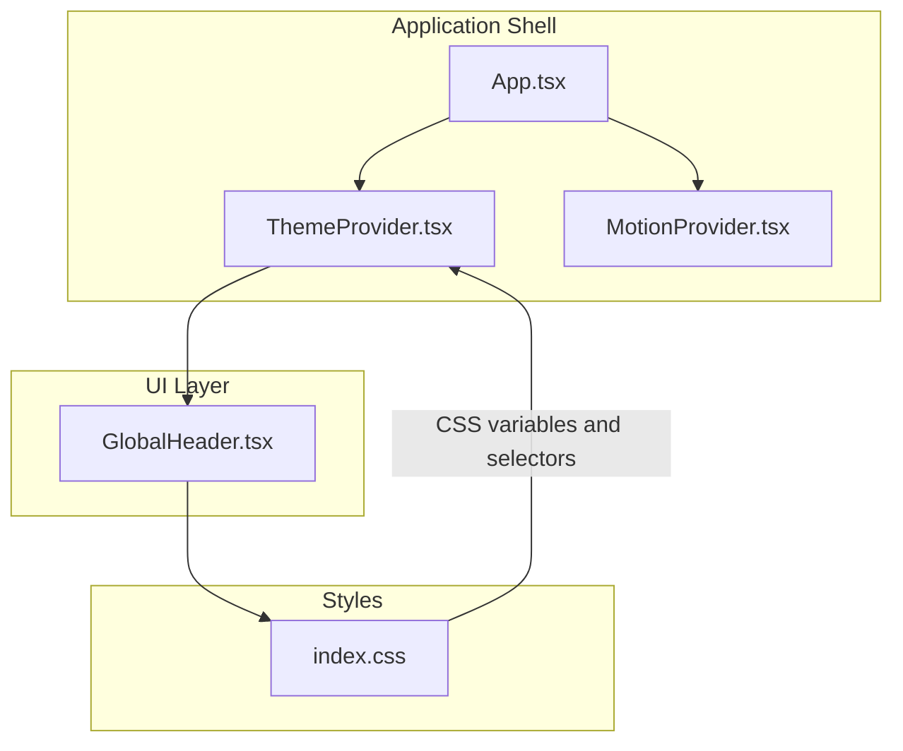
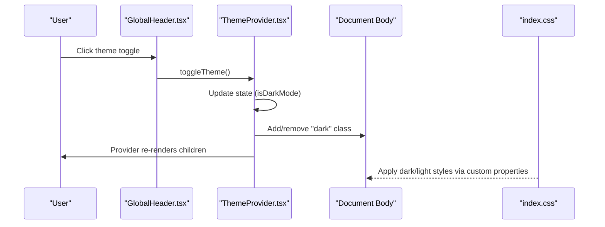
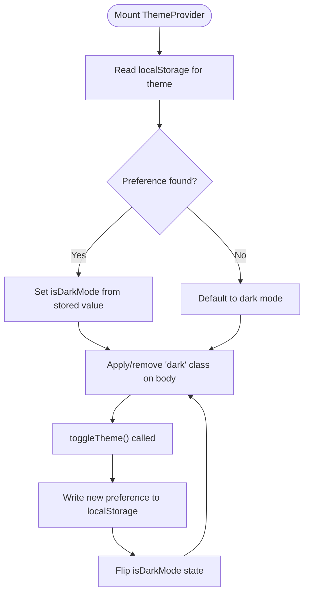
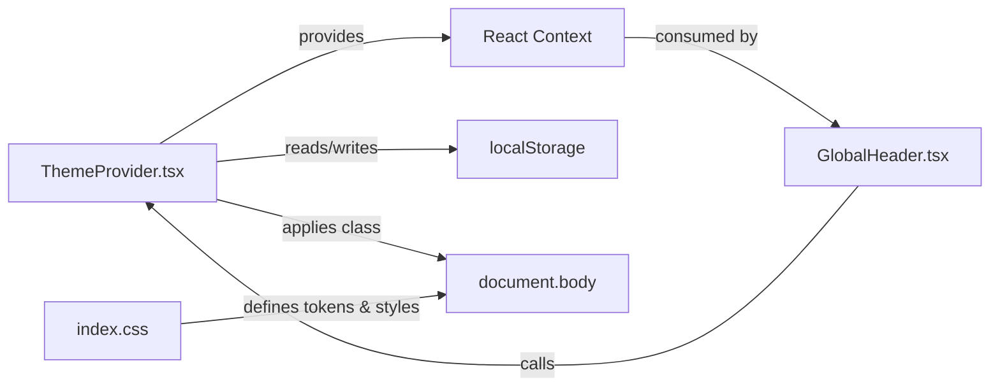

# ThemeProvider

<cite>
**Referenced Files in This Document**
- [ThemeProvider.tsx](file://src/context/ThemeProvider.tsx)
- [index.css](file://src/index.css)
- [App.tsx](file://src/App.tsx)
- [GlobalHeader.tsx](file://src/components/GlobalHeader.tsx)
- [MotionProvider.tsx](file://src/context/MotionProvider.tsx)
- [MOTION.md](file://docs/MOTION.md)
- [useHydrated.ts](file://src/hooks/useHydrated.ts)
</cite>

## Table of Contents
1. [Introduction](#introduction)
2. [Project Structure](#project-structure)
3. [Core Components](#core-components)
4. [Architecture Overview](#architecture-overview)
5. [Detailed Component Analysis](#detailed-component-analysis)
6. [Dependency Analysis](#dependency-analysis)
7. [Performance Considerations](#performance-considerations)
8. [Troubleshooting Guide](#troubleshooting-guide)
9. [Conclusion](#conclusion)

## Introduction
This document explains the ThemeProvider component that powers UI theming and dark/light mode in FaceAnalytics Pro. It covers theme switching, CSS variable management, responsive design patterns, state management, color scheme handling, transition animations, persistence across browser sessions, system preference detection, manual selection, integration with Tailwind CSS and the motion system, accessibility considerations, performance optimizations, and fallback mechanisms for unsupported browsers.

## Project Structure
ThemeProvider is a React context provider that exposes a simple theme API to the rest of the application. It is wired into the application shell and consumed by UI components such as the global header.

**Diagram sources**
- [App.tsx:456-472](file://src/App.tsx#L456-L472)
- [ThemeProvider.tsx:12-39](file://src/context/ThemeProvider.tsx#L12-L39)
- [MotionProvider.tsx:45-132](file://src/context/MotionProvider.tsx#L45-L132)
- [GlobalHeader.tsx:31](file://src/components/GlobalHeader.tsx#L31)
- [index.css:13-643](file://src/index.css#L13-L643)

**Section sources**
- [App.tsx:456-472](file://src/App.tsx#L456-L472)
- [ThemeProvider.tsx:12-39](file://src/context/ThemeProvider.tsx#L12-L39)

## Core Components
- ThemeProvider: Provides theme state and a toggle function via React Context. Persists user choice to localStorage and toggles a CSS class on the document body.
- useTheme: Hook to consume theme state and toggle function.
- index.css: Defines CSS variables for brand colors, surfaces, glows, and motion tokens; applies theme-specific styles and transitions.

Key responsibilities:
- Persist theme preference across sessions using localStorage.
- Apply a CSS class to the document body to enable dark-mode styles.
- Expose isDarkMode and toggleTheme to consumers.
- Integrate with Tailwind utilities and CSS custom properties.

**Section sources**
- [ThemeProvider.tsx:3-47](file://src/context/ThemeProvider.tsx#L3-L47)
- [index.css:13-643](file://src/index.css#L13-L643)

## Architecture Overview
The ThemeProvider sits at the top of the component tree and is rendered alongside other providers (authentication, credits, motion). Consumers use the useTheme hook to read isDarkMode and call toggleTheme. Styles adapt via CSS custom properties and a body class.

**Diagram sources**
- [GlobalHeader.tsx:130-136](file://src/components/GlobalHeader.tsx#L130-L136)
- [ThemeProvider.tsx:21-34](file://src/context/ThemeProvider.tsx#L21-L34)
- [index.css:173-176](file://src/index.css#L173-L176)

## Detailed Component Analysis

### ThemeProvider Implementation
- State initialization reads from localStorage under a fixed key. Defaults to dark mode when no preference is found.
- Toggle writes the new preference to localStorage and flips the state.
- A side effect adds/removes the "dark" class on the document body to activate dark styles.
- The provider exposes isDarkMode and toggleTheme to descendants.

**Diagram sources**
- [ThemeProvider.tsx:13-34](file://src/context/ThemeProvider.tsx#L13-L34)

**Section sources**
- [ThemeProvider.tsx:12-39](file://src/context/ThemeProvider.tsx#L12-L39)

### CSS Variable Management and Color Schemes
- Brand tokens define primary colors and gradients.
- Surface tokens define background, card, and border colors for both dark and light modes.
- Glow tokens define blur and emission effects used across components.
- Motion tokens define easing curves and durations for transitions and animations.

These variables are consumed by:
- Base body styles and dark variants.
- Utility classes for buttons, badges, cards, and inputs.
- Animations and keyframes for interactive feedback.

**Section sources**
- [index.css:13-643](file://src/index.css#L13-L643)

### Responsive Design Patterns and Motion Integration
- The motion system adapts durations and animation budgets based on device tier and user preferences. ThemeProvider does not directly manage motion tiers, but CSS respects the motion tier applied to the document element by the motion provider.
- Low-motion and reduced-motion preferences disable or minimize animations and transitions, ensuring accessibility and performance parity with theme changes.

**Section sources**
- [MotionProvider.tsx:45-132](file://src/context/MotionProvider.tsx#L45-L132)
- [MOTION.md:1-107](file://docs/MOTION.md#L1-L107)
- [index.css:46-68](file://src/index.css#L46-L68)
- [index.css:624-643](file://src/index.css#L624-L643)

### Transition Animations Between Themes
- Transitions are defined globally for body and interactive elements using CSS custom properties for duration and easing.
- Buttons, links, inputs, and cards apply transitions to color, background, borders, shadows, transform, and opacity.
- Page-level entrance animations and reveal effects use motion tokens for consistent timing.

**Section sources**
- [index.css:83-121](file://src/index.css#L83-L121)
- [index.css:137-144](file://src/index.css#L137-L144)
- [index.css:419-495](file://src/index.css#L419-L495)

### Theme Persistence Across Sessions and Manual Selection
- Persistence: Theme preference is stored in localStorage under a dedicated key and restored on mount.
- Manual selection: A consumer component (e.g., GlobalHeader) calls toggleTheme to switch modes and updates the UI immediately.

**Section sources**
- [ThemeProvider.tsx:13-26](file://src/context/ThemeProvider.tsx#L13-L26)
- [GlobalHeader.tsx:130-136](file://src/components/GlobalHeader.tsx#L130-L136)

### Integration with Tailwind CSS Classes
- Tailwind utilities are mixed with CSS custom properties. For example, color classes switch based on isDarkMode while transition durations and easing are driven by CSS variables.
- Components conditionally apply Tailwind classes depending on theme state.

**Section sources**
- [GlobalHeader.tsx:91](file://src/components/GlobalHeader.tsx#L91)
- [GlobalHeader.tsx:104-107](file://src/components/GlobalHeader.tsx#L104-L107)
- [GlobalHeader.tsx:140-146](file://src/components/GlobalHeader.tsx#L140-L146)

### Accessibility Considerations for Theme Switching
- Reduced-motion compatibility: Animations and transitions are minimized or disabled when the user prefers reduced motion.
- Pointer/hover capability: Hover effects are disabled on coarse or no-hover devices to avoid unintended interactions.
- ARIA labels: The theme toggle button includes an appropriate label indicating the current mode and action.

**Section sources**
- [index.css:70-73](file://src/index.css#L70-L73)
- [index.css:624-643](file://src/index.css#L624-L643)
- [GlobalHeader.tsx:131-136](file://src/components/GlobalHeader.tsx#L131-L136)

### Examples of Theme-Aware Components
- GlobalHeader demonstrates:
  - Reading isDarkMode to choose color classes and text colors.
  - Using a theme toggle button with an accessible label.
  - Applying transitions and hover states that respect theme and motion tiers.

**Section sources**
- [GlobalHeader.tsx:31](file://src/components/GlobalHeader.tsx#L31)
- [GlobalHeader.tsx:91](file://src/components/GlobalHeader.tsx#L91)
- [GlobalHeader.tsx:130-136](file://src/components/GlobalHeader.tsx#L130-L136)

### Animation Timing Adjustments for Different Themes
- CSS custom properties define durations and easing curves. These are consumed by components and utilities to keep timing consistent across themes.
- Motion tiers further tune durations and disable certain animations on lower tiers, ensuring smooth experiences regardless of theme.

**Section sources**
- [index.css:34-60](file://src/index.css#L34-L60)
- [MotionProvider.tsx:46-72](file://src/context/MotionProvider.tsx#L46-L72)
- [MOTION.md:15-24](file://docs/MOTION.md#L15-L24)

### Fallback Mechanisms for Unsupported Browsers
- CSS custom properties are widely supported; older browsers receive sensible defaults from base styles.
- Reduced-motion media queries and prefers-reduced-motion media queries ensure graceful degradation.
- On mobile devices, heavy backdrop-filter and blur effects are disabled in CSS for performance and compatibility.

**Section sources**
- [index.css:597-622](file://src/index.css#L597-L622)
- [index.css:624-643](file://src/index.css#L624-L643)

## Dependency Analysis
ThemeProvider depends on:
- React Context for state distribution.
- localStorage for persistence.
- The document body for applying a theme class.

Consumers depend on:
- useTheme hook for theme state and actions.
- index.css for theme-driven styles and transitions.

**Diagram sources**
- [ThemeProvider.tsx:12-39](file://src/context/ThemeProvider.tsx#L12-L39)
- [GlobalHeader.tsx:31](file://src/components/GlobalHeader.tsx#L31)
- [index.css:13-643](file://src/index.css#L13-L643)

**Section sources**
- [ThemeProvider.tsx:12-39](file://src/context/ThemeProvider.tsx#L12-L39)
- [GlobalHeader.tsx:31](file://src/components/GlobalHeader.tsx#L31)

## Performance Considerations
- Efficient state updates: toggleTheme performs minimal work—updating state and persisting to localStorage—then triggers a single re-render of the provider subtree.
- CSS-driven theme application: Adding/removing a body class is inexpensive and leverages the cascade for broad style changes.
- Motion system alignment: CSS respects motion tiers, reducing or disabling animations on constrained devices, which complements theme changes without extra JS.
- Hydration awareness: The application uses hydration helpers to avoid visible flashes when prerendered content is followed by client-side mounts, ensuring smooth theme transitions.

**Section sources**
- [useHydrated.ts:24-33](file://src/hooks/useHydrated.ts#L24-L33)
- [MotionProvider.tsx:46-72](file://src/context/MotionProvider.tsx#L46-L72)
- [index.css:597-622](file://src/index.css#L597-L622)

## Troubleshooting Guide
Common issues and resolutions:
- Theme not persisting across reloads
  - Verify localStorage availability and that the key matches the provider’s constant.
  - Confirm the provider wraps the app and that consumers are rendered within it.
- Theme toggle not changing visuals
  - Ensure the "dark" class is being added/removed on the document body.
  - Check that CSS selectors target the dark variant appropriately.
- Animations feel sluggish on low-end devices
  - Confirm motion tier is applied to the document element and CSS respects low-tier overrides.
  - Validate reduced-motion media queries are respected.
- Accessibility concerns
  - Confirm the theme toggle has an accessible label.
  - Ensure hover effects are disabled on coarse/no-hover devices.

**Section sources**
- [ThemeProvider.tsx:13-34](file://src/context/ThemeProvider.tsx#L13-L34)
- [index.css:28-33](file://src/index.css#L28-L33)
- [index.css:624-643](file://src/index.css#L624-L643)
- [MotionProvider.tsx:56-72](file://src/context/MotionProvider.tsx#L56-L72)

## Conclusion
ThemeProvider provides a lightweight, robust foundation for theming in FaceAnalytics Pro. It integrates seamlessly with CSS custom properties, Tailwind utilities, and the motion system to deliver consistent, accessible, and performant theme switching across devices and user preferences. Its design ensures persistence, responsiveness, and graceful fallbacks for diverse environments.