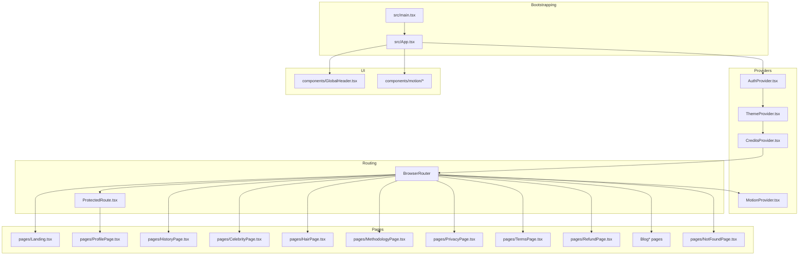
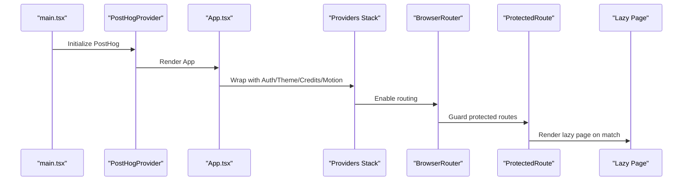
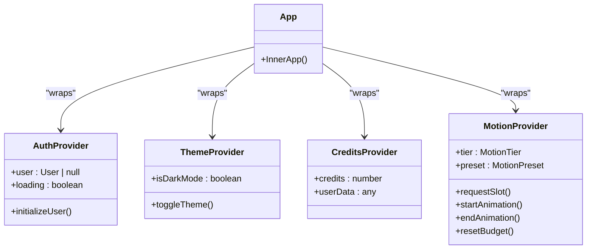
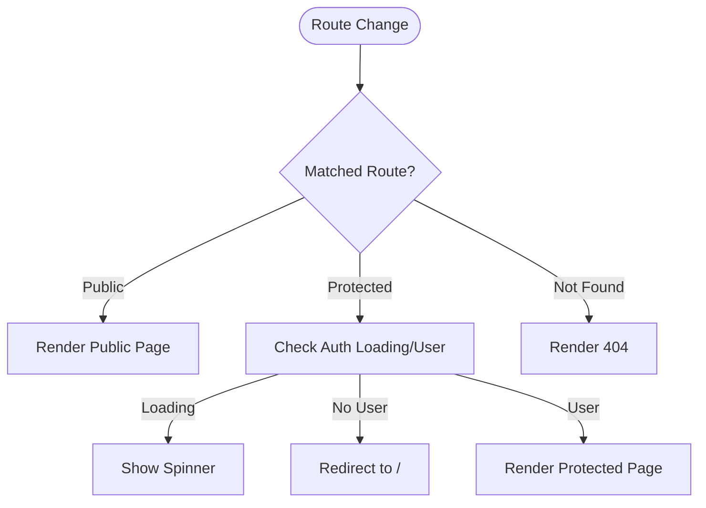
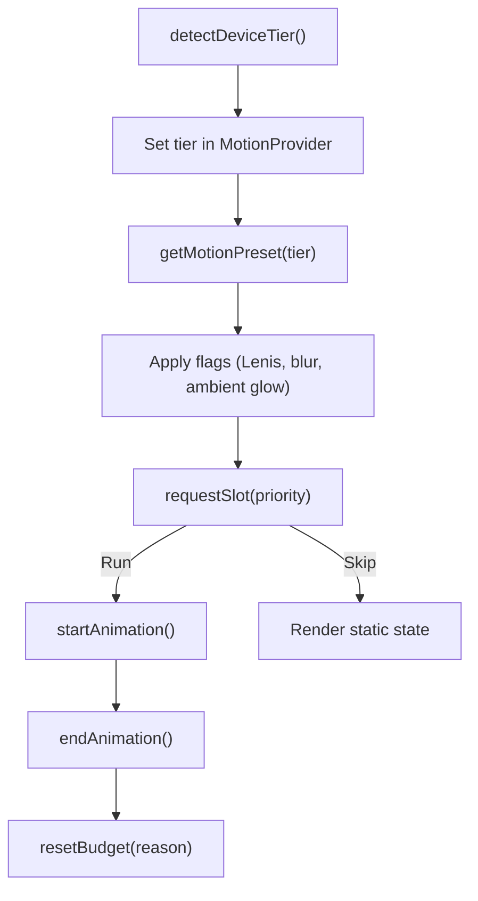
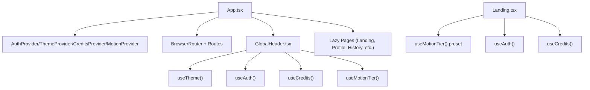
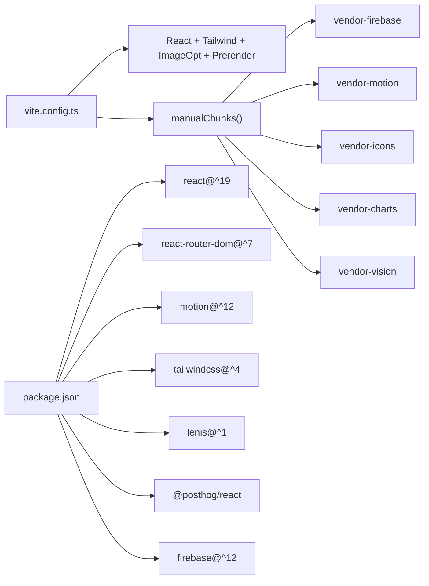

# Frontend Architecture

<cite>
**Referenced Files in This Document**
- [main.tsx](file://src/main.tsx)
- [App.tsx](file://src/App.tsx)
- [vite.config.ts](file://vite.config.ts)
- [package.json](file://package.json)
- [AuthProvider.tsx](file://src/context/AuthProvider.tsx)
- [CreditsProvider.tsx](file://src/context/CreditsProvider.tsx)
- [ThemeProvider.tsx](file://src/context/ThemeProvider.tsx)
- [MotionProvider.tsx](file://src/context/MotionProvider.tsx)
- [ProtectedRoute.tsx](file://src/routes/ProtectedRoute.tsx)
- [GlobalHeader.tsx](file://src/components/GlobalHeader.tsx)
- [motion.ts](file://src/lib/motion.ts)
- [motion-budget.ts](file://src/lib/motion-budget.ts)
- [index.css](file://src/index.css)
- [Landing.tsx](file://src/pages/Landing.tsx)
</cite>

## Table of Contents
1. [Introduction](#introduction)
2. [Project Structure](#project-structure)
3. [Core Components](#core-components)
4. [Architecture Overview](#architecture-overview)
5. [Detailed Component Analysis](#detailed-component-analysis)
6. [Dependency Analysis](#dependency-analysis)
7. [Performance Considerations](#performance-considerations)
8. [Troubleshooting Guide](#troubleshooting-guide)
9. [Conclusion](#conclusion)

## Introduction
This document describes the frontend architecture of FaceAnalytics Pro, a React 19 application built with Vite. It explains the provider-based state model, routing with protected routes, animation orchestration via Framer Motion and a custom motion budget system, and styling with Tailwind CSS. It also covers build-time optimizations, lazy loading, code splitting, and performance strategies tailored to a wide range of devices.

## Project Structure
The frontend is organized around a strict provider hierarchy, feature-based pages, reusable components, and a motion system designed for device-tiered performance. Providers wrap the application to supply global state and capabilities to all components.

**Diagram sources**
- [main.tsx:1-40](file://src/main.tsx#L1-L40)
- [App.tsx:456-472](file://src/App.tsx#L456-L472)
- [AuthProvider.tsx:13-66](file://src/context/AuthProvider.tsx#L13-L66)
- [ThemeProvider.tsx:12-38](file://src/context/ThemeProvider.tsx#L12-L38)
- [CreditsProvider.tsx:13-45](file://src/context/CreditsProvider.tsx#L13-L45)
- [MotionProvider.tsx:45-131](file://src/context/MotionProvider.tsx#L45-L131)
- [ProtectedRoute.tsx:5-21](file://src/routes/ProtectedRoute.tsx#L5-L21)
- [Landing.tsx:18-278](file://src/pages/Landing.tsx#L18-L278)
- [GlobalHeader.tsx:24-341](file://src/components/GlobalHeader.tsx#L24-L341)

**Section sources**
- [main.tsx:1-40](file://src/main.tsx#L1-L40)
- [App.tsx:456-472](file://src/App.tsx#L456-L472)

## Core Components
- Provider stack: AuthProvider supplies Firebase user state and initializes backend user records; CreditsProvider mirrors Firestore user data for credits and profile; ThemeProvider manages dark/light mode and persistence; MotionProvider detects device tier, exposes presets, and enforces a motion budget.
- Routing: BrowserRouter wraps the app; ProtectedRoute guards authenticated-only pages; lazy-loaded pages improve initial load performance.
- UI shell: GlobalHeader integrates navigation, account actions, and theme switching, leveraging motion presets and credit balances.
- Styling: Tailwind CSS with custom design tokens and tier-scoped CSS variables; motion tokens enforce consistent timing across components.

**Section sources**
- [AuthProvider.tsx:13-75](file://src/context/AuthProvider.tsx#L13-L75)
- [CreditsProvider.tsx:13-55](file://src/context/CreditsProvider.tsx#L13-L55)
- [ThemeProvider.tsx:12-48](file://src/context/ThemeProvider.tsx#L12-L48)
- [MotionProvider.tsx:45-153](file://src/context/MotionProvider.tsx#L45-L153)
- [ProtectedRoute.tsx:5-22](file://src/routes/ProtectedRoute.tsx#L5-L22)
- [GlobalHeader.tsx:24-342](file://src/components/GlobalHeader.tsx#L24-L342)
- [index.css:44-643](file://src/index.css#L44-L643)

## Architecture Overview
The application bootstraps PostHog, then renders the provider stack. App composes routing, lazy pages, and global UI. Motion presets and budgets are consumed by components and primitives to deliver smooth experiences across tiers.

**Diagram sources**
- [main.tsx:33-39](file://src/main.tsx#L33-L39)
- [App.tsx:456-472](file://src/App.tsx#L456-L472)
- [ProtectedRoute.tsx:5-21](file://src/routes/ProtectedRoute.tsx#L5-L21)

## Detailed Component Analysis

### Provider Pattern and State Management
- AuthProvider
  - Subscribes to Firebase auth state, caches initialization per tab/session, and calls a backend endpoint to ensure user records exist.
  - Exposes loading and user state; prevents redundant initialization calls.
- CreditsProvider
  - Listens to Firestore user document snapshots to keep credits and profile data reactive.
  - Memoizes value to avoid unnecessary re-renders.
- ThemeProvider
  - Persists theme preference in localStorage and toggles a body class for Tailwind variants.
- MotionProvider
  - Detects device tier via network/device metrics and user preferences.
  - Exposes preset timings, flags, and a motion budget API to components.
  - Resets budget on route/tab/modal changes and reflects tier on HTML dataset for scoped CSS.

**Diagram sources**
- [AuthProvider.tsx:13-75](file://src/context/AuthProvider.tsx#L13-L75)
- [CreditsProvider.tsx:13-55](file://src/context/CreditsProvider.tsx#L13-L55)
- [ThemeProvider.tsx:12-48](file://src/context/ThemeProvider.tsx#L12-L48)
- [MotionProvider.tsx:45-153](file://src/context/MotionProvider.tsx#L45-L153)
- [App.tsx:456-472](file://src/App.tsx#L456-L472)

**Section sources**
- [AuthProvider.tsx:13-75](file://src/context/AuthProvider.tsx#L13-L75)
- [CreditsProvider.tsx:13-55](file://src/context/CreditsProvider.tsx#L13-L55)
- [ThemeProvider.tsx:12-48](file://src/context/ThemeProvider.tsx#L12-L48)
- [MotionProvider.tsx:45-153](file://src/context/MotionProvider.tsx#L45-L153)

### Routing Architecture and Protected Routes
- BrowserRouter is the root router.
- ProtectedRoute checks auth loading and presence; navigates unauthenticated users to home.
- Routes include public pages (Landing, Methodology, Privacy, Terms, Refund, Blog collection) and protected pages (Profile, History, Celebrity, Hair).
- Lazy loading is applied to all pages to defer bundle parsing until navigation.

**Diagram sources**
- [ProtectedRoute.tsx:5-21](file://src/routes/ProtectedRoute.tsx#L5-L21)
- [App.tsx:282-349](file://src/App.tsx#L282-L349)

**Section sources**
- [ProtectedRoute.tsx:5-22](file://src/routes/ProtectedRoute.tsx#L5-L22)
- [App.tsx:282-349](file://src/App.tsx#L282-L349)

### Animation Orchestration and Motion Budget
- Motion presets define durations, stagger, flags, and limits per tier (low/mid/high).
- A budget singleton controls per-screen and concurrent animation limits; components request slots before animating.
- Components and primitives consume useMotionTier() to access preset.durations and flags, ensuring consistent UX across devices.

**Diagram sources**
- [motion.ts:123-220](file://src/lib/motion.ts#L123-L220)
- [motion-budget.ts:44-79](file://src/lib/motion-budget.ts#L44-L79)
- [MotionProvider.tsx:90-125](file://src/context/MotionProvider.tsx#L90-L125)

**Section sources**
- [motion.ts:15-226](file://src/lib/motion.ts#L15-L226)
- [motion-budget.ts:1-89](file://src/lib/motion-budget.ts#L1-L89)
- [MotionProvider.tsx:45-153](file://src/context/MotionProvider.tsx#L45-L153)

### Component Hierarchy and Organization
- App.tsx composes providers, routing, and global UI. It orchestrates scroll restoration, route transitions with Framer Motion, and modal managers.
- GlobalHeader integrates theme, auth, credits, and motion context to render navigation and account actions.
- Landing.tsx coordinates analysis lifecycle, hydration from session storage, and conditional rendering between hero and dashboard views.

**Diagram sources**
- [App.tsx:456-472](file://src/App.tsx#L456-L472)
- [GlobalHeader.tsx:24-342](file://src/components/GlobalHeader.tsx#L24-L342)
- [Landing.tsx:18-278](file://src/pages/Landing.tsx#L18-L278)

**Section sources**
- [App.tsx:456-472](file://src/App.tsx#L456-L472)
- [GlobalHeader.tsx:24-342](file://src/components/GlobalHeader.tsx#L24-L342)
- [Landing.tsx:18-278](file://src/pages/Landing.tsx#L18-L278)

## Dependency Analysis
- Build toolchain: Vite with React plugin, TailwindCSS integration, image optimization, prerendering, and manual chunking by vendor family.
- Runtime dependencies include React 19, React Router DOM v7, Framer Motion, Tailwind CSS v4, Lenis, Lucide icons, PostHog, and Firebase.

**Diagram sources**
- [vite.config.ts:14-74](file://vite.config.ts#L14-L74)
- [package.json:19-52](file://package.json#L19-L52)

**Section sources**
- [vite.config.ts:14-74](file://vite.config.ts#L14-L74)
- [package.json:19-79](file://package.json#L19-L79)

## Performance Considerations
- Lazy loading and code splitting: All pages are lazy-loaded; Suspense fallbacks provide a polished loading experience.
- Vendor chunking: Rollup manualChunks groups heavy libraries into named chunks to improve caching and parallel loading.
- Motion budget: Limits per-screen and concurrent animations; reduces cost on lower tiers and respects reduced-motion preferences.
- CSS tier scoping: Motion tier is reflected on HTML dataset; CSS adjusts durations and disables expensive animations on low tiers.
- Prerendering: Static HTML generation for marketing pages improves first-load performance and SEO.
- Console noise suppression: TensorFlow Lite logs are filtered to reduce console pollution during development.

**Section sources**
- [App.tsx:23-43](file://src/App.tsx#L23-L43)
- [vite.config.ts:58-72](file://vite.config.ts#L58-L72)
- [motion-budget.ts:44-79](file://src/lib/motion-budget.ts#L44-L79)
- [index.css:44-643](file://src/index.css#L44-L643)
- [vite.config.ts:27-45](file://vite.config.ts#L27-L45)
- [main.tsx:14-31](file://src/main.tsx#L14-L31)

## Troubleshooting Guide
- Authentication initialization loops or extra backend calls:
  - Verify local storage cache key and initialization guard logic in AuthProvider.
- Credits not updating:
  - Confirm Firestore listener subscription and memoization in CreditsProvider.
- Theme not persisting:
  - Check localStorage key and body class toggling in ThemeProvider.
- Animations not firing:
  - Inspect MotionProvider tier detection and reduced-motion preference; use debug hook in dev if enabled.
- Route transitions not animating:
  - Ensure AnimatePresence and motion keys are present and route location is stable.
- Build failures or missing prerendered pages:
  - Validate Vite prerender routes and chunk configuration.

**Section sources**
- [AuthProvider.tsx:18-63](file://src/context/AuthProvider.tsx#L18-L63)
- [CreditsProvider.tsx:18-40](file://src/context/CreditsProvider.tsx#L18-L40)
- [ThemeProvider.tsx:12-38](file://src/context/ThemeProvider.tsx#L12-L38)
- [MotionProvider.tsx:56-88](file://src/context/MotionProvider.tsx#L56-L88)
- [App.tsx:265-280](file://src/App.tsx#L265-L280)
- [vite.config.ts:27-45](file://vite.config.ts#L27-L45)

## Conclusion
FaceAnalytics Pro’s frontend leverages a robust provider stack, device-aware motion system, and modern build tooling to deliver a responsive, accessible, and visually engaging experience. The architecture balances performance across tiers, ensures secure and efficient routing, and maintains a clean separation of concerns through lazy loading and modular components.