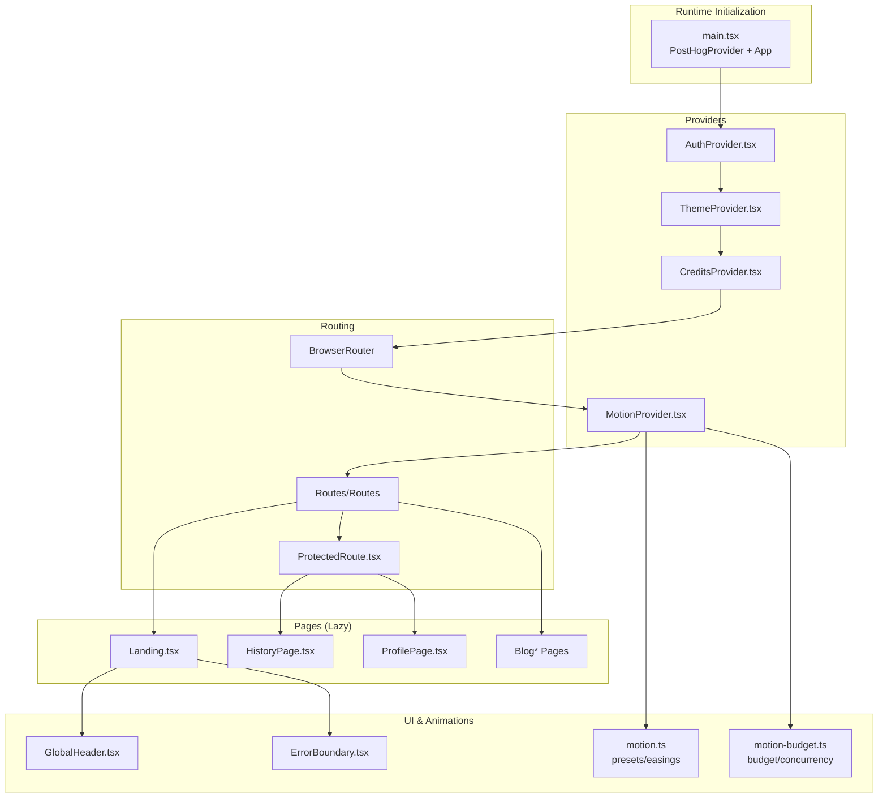
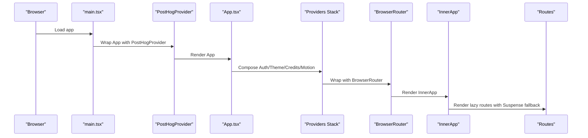
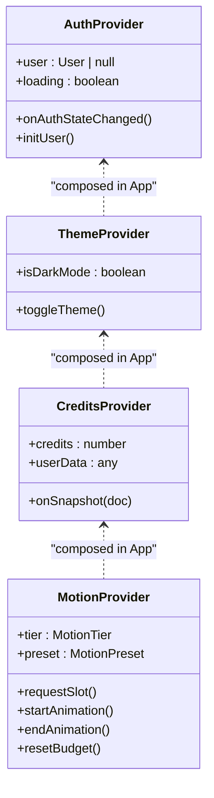
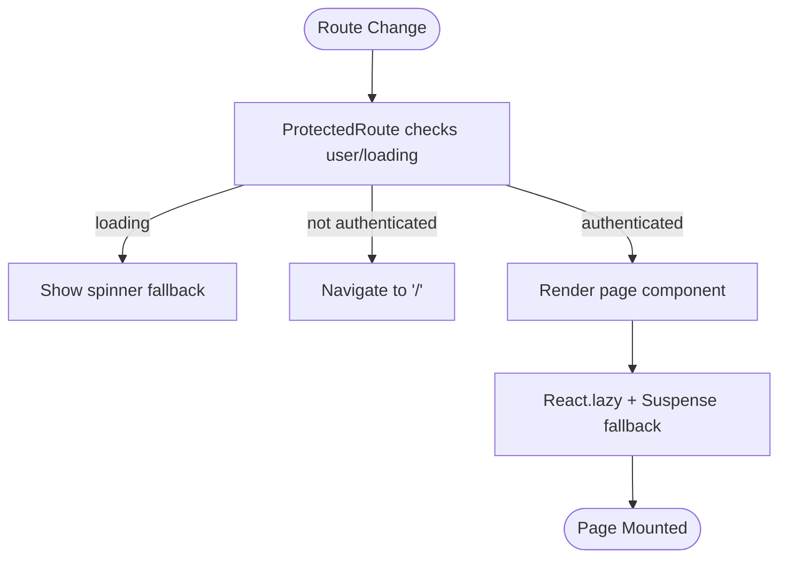
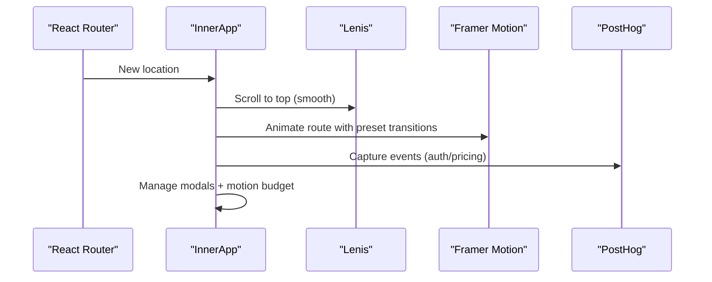
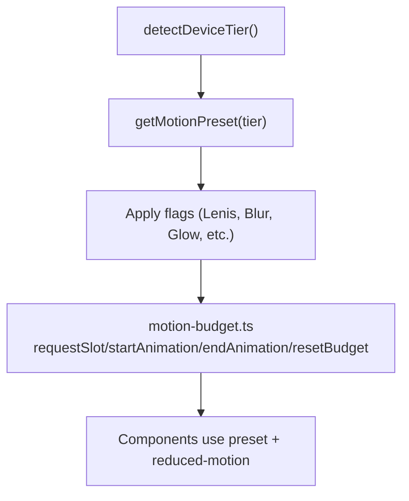
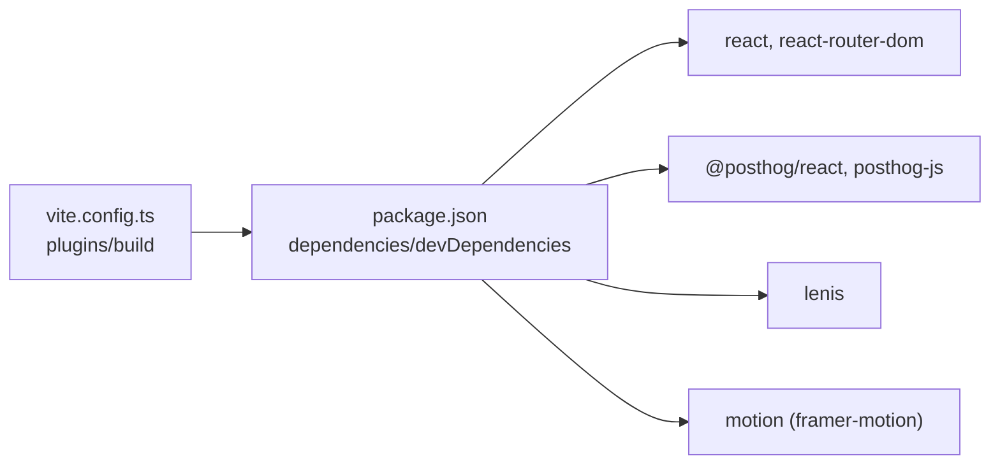

# React Application Structure

<cite>
**Referenced Files in This Document**
- [App.tsx](file://src/App.tsx)
- [main.tsx](file://src/main.tsx)
- [vite.config.ts](file://vite.config.ts)
- [ProtectedRoute.tsx](file://src/routes/ProtectedRoute.tsx)
- [AuthProvider.tsx](file://src/context/AuthProvider.tsx)
- [ThemeProvider.tsx](file://src/context/ThemeProvider.tsx)
- [CreditsProvider.tsx](file://src/context/CreditsProvider.tsx)
- [MotionProvider.tsx](file://src/context/MotionProvider.tsx)
- [ErrorBoundary.tsx](file://src/components/ErrorBoundary.tsx)
- [motion.ts](file://src/lib/motion.ts)
- [motion-budget.ts](file://src/lib/motion-budget.ts)
- [Landing.tsx](file://src/pages/Landing.tsx)
- [LandingSections.tsx](file://src/components/LandingSections.tsx)
- [GlobalHeader.tsx](file://src/components/GlobalHeader.tsx)
- [firebase.ts](file://src/firebase.ts)
- [package.json](file://package.json)
</cite>

## Table of Contents
1. [Introduction](#introduction)
2. [Project Structure](#project-structure)
3. [Core Components](#core-components)
4. [Architecture Overview](#architecture-overview)
5. [Detailed Component Analysis](#detailed-component-analysis)
6. [Dependency Analysis](#dependency-analysis)
7. [Performance Considerations](#performance-considerations)
8. [Troubleshooting Guide](#troubleshooting-guide)
9. [Conclusion](#conclusion)

## Introduction
This document explains the React 19 application structure of FaceAnalytics Pro, focusing on initialization via Vite, provider wrapper patterns, routing with React Router 7, lazy loading, and the InnerApp component’s orchestration of global state, modals, animations, and integrations. It also covers authentication gating, scroll-to-top behavior, external library integrations (PostHog analytics, Lenis smooth scrolling, Framer Motion animations), error boundaries, suspense fallbacks, and performance optimizations such as code splitting and dynamic imports.

## Project Structure
The application follows a feature-based and provider-centric structure:
- Entry point initializes PostHog, strict mode, and mounts the root App.
- App.tsx composes providers and renders routes with lazy-loaded pages.
- InnerApp centralizes global state, modals, animations, and scroll behavior.
- Providers manage theme, auth, credits, and motion budgets.
- ProtectedRoute enforces authentication for protected areas.
- Vite build configuration enables code splitting, image optimization, prerendering, and vendor chunking.

**Diagram sources**
- [main.tsx:33-39](file://src/main.tsx#L33-L39)
- [App.tsx:456-472](file://src/App.tsx#L456-L472)
- [AuthProvider.tsx:13-66](file://src/context/AuthProvider.tsx#L13-L66)
- [ThemeProvider.tsx:12-39](file://src/context/ThemeProvider.tsx#L12-L39)
- [CreditsProvider.tsx:13-46](file://src/context/CreditsProvider.tsx#L13-L46)
- [MotionProvider.tsx:45-132](file://src/context/MotionProvider.tsx#L45-L132)
- [ProtectedRoute.tsx:5-21](file://src/routes/ProtectedRoute.tsx#L5-L21)
- [Landing.tsx:18-26](file://src/pages/Landing.tsx#L18-L26)
- [ErrorBoundary.tsx:16-56](file://src/components/ErrorBoundary.tsx#L16-L56)
- [motion.ts:123-134](file://src/lib/motion.ts#L123-L134)
- [motion-budget.ts:34-79](file://src/lib/motion-budget.ts#L34-L79)

**Section sources**
- [main.tsx:1-40](file://src/main.tsx#L1-L40)
- [App.tsx:1-473](file://src/App.tsx#L1-L473)
- [vite.config.ts:14-75](file://vite.config.ts#L14-L75)

## Core Components
- Provider Wrapper Pattern: App.tsx composes AuthProvider, ThemeProvider, CreditsProvider, BrowserRouter, and MotionProvider around InnerApp. This ensures all downstream components can consume context without prop drilling.
- InnerApp: Manages global state, modals, animations, scroll behavior, and integrates PostHog and Lenis.
- ProtectedRoute: Guards protected routes by checking auth state and redirecting unauthenticated users.
- ErrorBoundary: Provides graceful error handling with a user-friendly fallback and reload action.
- Motion System: Device-tiered presets, reduced-motion awareness, and a motion budget ensure smooth experiences across devices.

**Section sources**
- [App.tsx:456-472](file://src/App.tsx#L456-L472)
- [ProtectedRoute.tsx:5-21](file://src/routes/ProtectedRoute.tsx#L5-L21)
- [ErrorBoundary.tsx:16-56](file://src/components/ErrorBoundary.tsx#L16-L56)
- [MotionProvider.tsx:45-132](file://src/context/MotionProvider.tsx#L45-L132)

## Architecture Overview
The runtime initialization and provider stack establish a robust foundation for the UI layer. Routing leverages React Router 7 with lazy-loaded pages. InnerApp orchestrates route transitions, modals, scroll behavior, and animations powered by Framer Motion and Lenis. Authentication state drives UI behavior and protected routes.

**Diagram sources**
- [main.tsx:33-39](file://src/main.tsx#L33-L39)
- [App.tsx:456-472](file://src/App.tsx#L456-L472)

## Detailed Component Analysis

### React 19 Application Initialization
- Strict Mode and PostHog initialization occur at the root.
- TensorFlow Lite logs are suppressed to reduce console noise.
- App is wrapped with PostHogProvider and rendered inside createRoot.

**Section sources**
- [main.tsx:14-31](file://src/main.tsx#L14-L31)
- [main.tsx:33-39](file://src/main.tsx#L33-L39)

### Provider Wrapper Pattern and Contexts
- AuthProvider: Subscribes to Firebase auth state, initializes user on backend, and caches initialization to avoid excessive reads.
- ThemeProvider: Persists user’s theme preference and toggles body classes.
- CreditsProvider: Subscribes to Firestore user doc snapshot to keep credits and user data in sync.
- MotionProvider: Detects device tier, respects reduced motion, exposes motion budget APIs, and scopes presets globally.

**Diagram sources**
- [AuthProvider.tsx:13-66](file://src/context/AuthProvider.tsx#L13-L66)
- [ThemeProvider.tsx:12-39](file://src/context/ThemeProvider.tsx#L12-L39)
- [CreditsProvider.tsx:13-46](file://src/context/CreditsProvider.tsx#L13-L46)
- [MotionProvider.tsx:45-132](file://src/context/MotionProvider.tsx#L45-L132)

**Section sources**
- [AuthProvider.tsx:18-62](file://src/context/AuthProvider.tsx#L18-L62)
- [ThemeProvider.tsx:12-39](file://src/context/ThemeProvider.tsx#L12-L39)
- [CreditsProvider.tsx:18-40](file://src/context/CreditsProvider.tsx#L18-L40)
- [MotionProvider.tsx:46-132](file://src/context/MotionProvider.tsx#L46-L132)

### Routing System with React Router 7 and Lazy Loading
- BrowserRouter wraps the entire app.
- Routes include public pages (e.g., Landing, Methodology, Privacy, Terms, Refund, Blog pages) and protected routes (Profile, History, Celebrity, Hair).
- ProtectedRoute checks auth state and either renders children or redirects to home.
- Pages are lazy-loaded using React.lazy and loaded within Suspense fallbacks.

**Diagram sources**
- [ProtectedRoute.tsx:5-21](file://src/routes/ProtectedRoute.tsx#L5-L21)
- [App.tsx:24-43](file://src/App.tsx#L24-L43)
- [App.tsx:313-349](file://src/App.tsx#L313-L349)

**Section sources**
- [ProtectedRoute.tsx:5-21](file://src/routes/ProtectedRoute.tsx#L5-L21)
- [App.tsx:24-43](file://src/App.tsx#L24-L43)
- [App.tsx:313-349](file://src/App.tsx#L313-L349)

### InnerApp: Global State, Modals, Animations, and Scroll Behavior
- Accesses Theme, Auth, Credits, PostHog, and Motion tier/context.
- Manages auth/pricing modals, initial referral code handling, and login toast lifecycle.
- Integrates Lenis smooth scrolling with device-tiered configuration and visibility-aware RAF loop.
- Controls body overflow during modal open/close and resets motion budget accordingly.
- Renders GlobalHeader, ErrorBoundary, Suspense fallback, and animated route transitions with Framer Motion.
- Implements ScrollToTop to smoothly scroll to the top on route changes using Lenis when available.

**Diagram sources**
- [App.tsx:46-61](file://src/App.tsx#L46-L61)
- [App.tsx:127-187](file://src/App.tsx#L127-L187)
- [App.tsx:265-280](file://src/App.tsx#L265-L280)
- [App.tsx:232-353](file://src/App.tsx#L232-L353)

**Section sources**
- [App.tsx:64-426](file://src/App.tsx#L64-L426)

### ProtectedRoute Implementation
- Displays a spinner while auth state is resolving.
- Redirects unauthenticated users to the home route.
- Renders children when authenticated.

**Section sources**
- [ProtectedRoute.tsx:5-21](file://src/routes/ProtectedRoute.tsx#L5-L21)

### Scroll-to-Top Functionality
- ScrollToTop uses useLocation to detect pathname changes.
- Uses requestAnimationFrame to ensure rendering completes before scrolling.
- Prefers Lenis scrollTo when initialized; otherwise falls back to window.scrollTo with smooth behavior.

**Section sources**
- [App.tsx:46-61](file://src/App.tsx#L46-L61)

### External Library Integrations
- PostHog Analytics: Initialized in main.tsx with environment-specific host and key; used in InnerApp for capturing events (e.g., modal opens, login success).
- Lenis Smooth Scrolling: Dynamically configured in InnerApp based on motion tier and device characteristics; stops/resumes with modals and cleans up on unmount.
- Framer Motion Animations: Used for route transitions, header hide/show, and micro-interactions; driven by MotionProvider presets and reduced-motion preferences.

**Section sources**
- [main.tsx:8-12](file://src/main.tsx#L8-L12)
- [App.tsx:68-91](file://src/App.tsx#L68-L91)
- [App.tsx:127-187](file://src/App.tsx#L127-L187)
- [App.tsx:265-280](file://src/App.tsx#L265-L280)
- [LandingSections.tsx:43-49](file://src/components/LandingSections.tsx#L43-L49)
- [GlobalHeader.tsx:56-70](file://src/components/GlobalHeader.tsx#L56-L70)

### Error Boundary and Suspense Fallback Handling
- ErrorBoundary catches errors and displays a friendly message with a reload button.
- Suspense fallback is shown during lazy-loaded route rendering, displaying a centered loader with branding.

**Section sources**
- [ErrorBoundary.tsx:16-56](file://src/components/ErrorBoundary.tsx#L16-L56)
- [App.tsx:233-264](file://src/App.tsx#L233-L264)

### Motion System and Animation Orchestration
- Device tier detection considers network/connection, device memory, CPU cores, and viewport width.
- Preset durations, stagger delays, flags, and concurrency caps are derived per tier.
- Motion budget enforces per-screen and concurrent limits; requests are granted based on priority and capacity.
- Components use MotionProvider’s preset and reduced-motion awareness for safe, performant animations.

**Diagram sources**
- [motion.ts:167-220](file://src/lib/motion.ts#L167-L220)
- [motion.ts:123-134](file://src/lib/motion.ts#L123-L134)
- [motion-budget.ts:44-79](file://src/lib/motion-budget.ts#L44-L79)
- [MotionProvider.tsx:113-125](file://src/context/MotionProvider.tsx#L113-L125)

**Section sources**
- [motion.ts:167-220](file://src/lib/motion.ts#L167-L220)
- [motion.ts:123-134](file://src/lib/motion.ts#L123-L134)
- [motion-budget.ts:44-79](file://src/lib/motion-budget.ts#L44-L79)
- [MotionProvider.tsx:113-125](file://src/context/MotionProvider.tsx#L113-L125)

### Authentication Gating and Firebase Integration
- AuthProvider subscribes to onAuthStateChanged and initializes user on backend only once per session.
- Uses local storage to cache initialization and avoids redundant backend calls.
- Firebase app, auth, and Firestore are initialized centrally.

**Section sources**
- [AuthProvider.tsx:18-62](file://src/context/AuthProvider.tsx#L18-L62)
- [firebase.ts:1-21](file://src/firebase.ts#L1-L21)

### Public Pages and Route Organization
- Public routes include Landing, Methodology, Privacy, Terms, Refund, and a set of Blog pages.
- Protected routes include Profile, History, Celebrity, and Hair.
- NotFoundPage acts as a catch-all for unmatched routes.

**Section sources**
- [App.tsx:282-349](file://src/App.tsx#L282-L349)

## Dependency Analysis
- React 19 and React Router 7 power the UI and routing.
- PostHog SDK integrates analytics with environment-driven configuration.
- Lenis provides smooth scrolling; motion/react integrates with Framer Motion primitives.
- Vite handles bundling, code splitting, image optimization, prerendering, and vendor chunking.

**Diagram sources**
- [package.json:19-52](file://package.json#L19-L52)
- [vite.config.ts:17-72](file://vite.config.ts#L17-L72)

**Section sources**
- [package.json:19-52](file://package.json#L19-L52)
- [vite.config.ts:17-72](file://vite.config.ts#L17-L72)

## Performance Considerations
- Code Splitting and Dynamic Imports: Pages are lazily imported and wrapped in Suspense, reducing initial bundle size.
- Vendor Chunking: Rollup manualChunks separate major vendors (Firebase, motion/framer-motion, icons, charts, vision) to improve caching and parallel loading.
- Image Optimization: ViteImageOptimizer reduces payload sizes for PNG/JPEG/WebP/AVIF.
- Prerendering: Static HTML generation for key public routes improves First Contentful Paint and SEO.
- Motion Budget and Reduced Motion: Limits concurrent and per-screen animations; respects user preferences to maintain responsiveness.
- Lenis Efficiency: Visibility-aware RAF loop and conditional smooth scrolling reduce overhead when inactive.

**Section sources**
- [App.tsx:24-43](file://src/App.tsx#L24-L43)
- [vite.config.ts:58-72](file://vite.config.ts#L58-L72)
- [vite.config.ts:20-26](file://vite.config.ts#L20-L26)
- [vite.config.ts:27-45](file://vite.config.ts#L27-L45)
- [motion-budget.ts:44-79](file://src/lib/motion-budget.ts#L44-L79)
- [motion.ts:137-144](file://src/lib/motion.ts#L137-L144)

## Troubleshooting Guide
- Authentication Initialization Failures: Verify AuthProvider subscription and backend init endpoint; check local storage caching keys.
- Suspense Fallback Stuck: Ensure lazy-loaded components resolve and Suspense fallback is not permanently mounted.
- Lenis Not Scrolling: Confirm device tier enables Lenis and InnerApp sets window.lenis; verify cleanup on unmount.
- Excessive Animations: Review motion budget usage and reduced-motion behavior; adjust priorities and flags.
- PostHog Events Not Capturing: Validate PostHogProvider configuration and environment variables.

**Section sources**
- [AuthProvider.tsx:18-62](file://src/context/AuthProvider.tsx#L18-L62)
- [App.tsx:233-264](file://src/App.tsx#L233-L264)
- [App.tsx:127-187](file://src/App.tsx#L127-L187)
- [motion-budget.ts:44-79](file://src/lib/motion-budget.ts#L44-L79)
- [main.tsx:8-12](file://src/main.tsx#L8-L12)

## Conclusion
FaceAnalytics Pro employs a clean provider stack, robust routing with lazy loading, and a device-aware motion system to deliver a responsive, accessible, and visually engaging experience. The InnerApp component centralizes cross-cutting concerns—modals, animations, scroll behavior, and analytics—while ProtectedRoute and ErrorBoundary ensure secure and resilient navigation. Vite’s build configuration further optimizes performance through code splitting, vendor chunking, and prerendering.