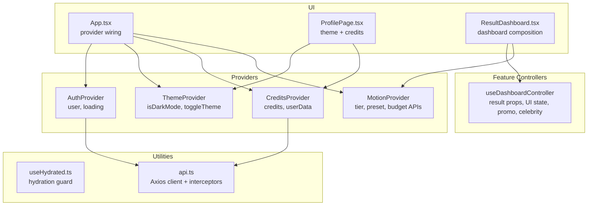
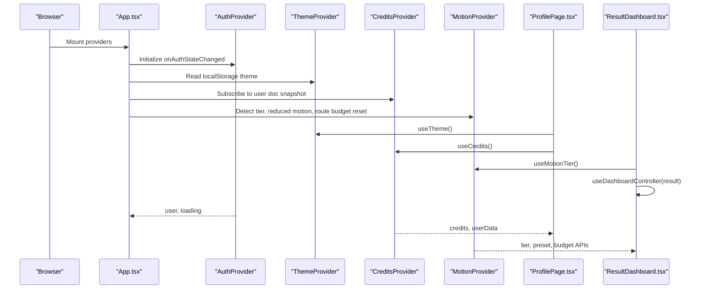
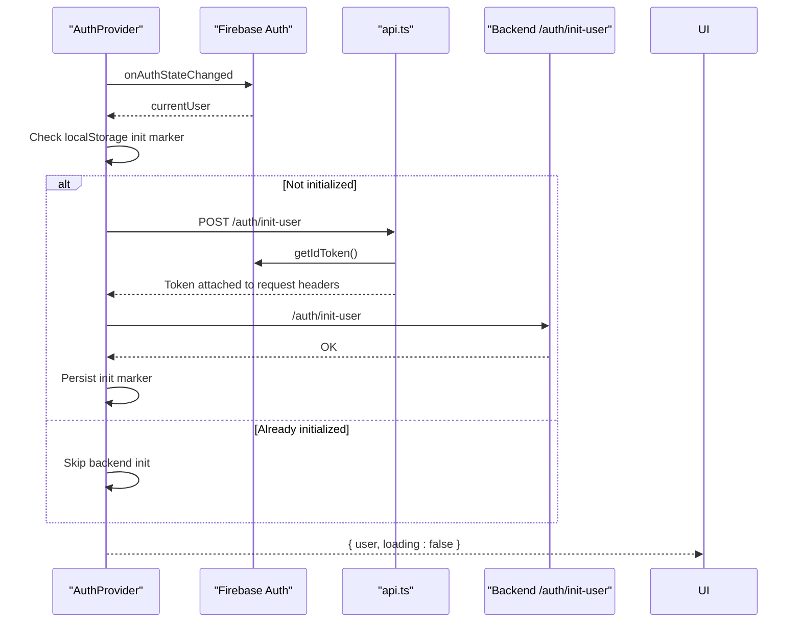
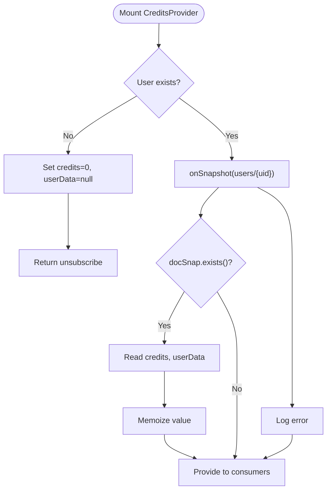
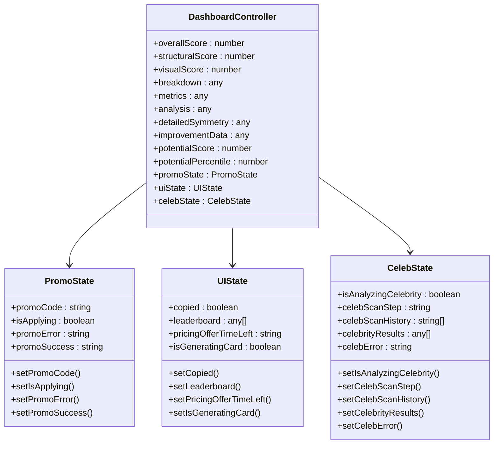
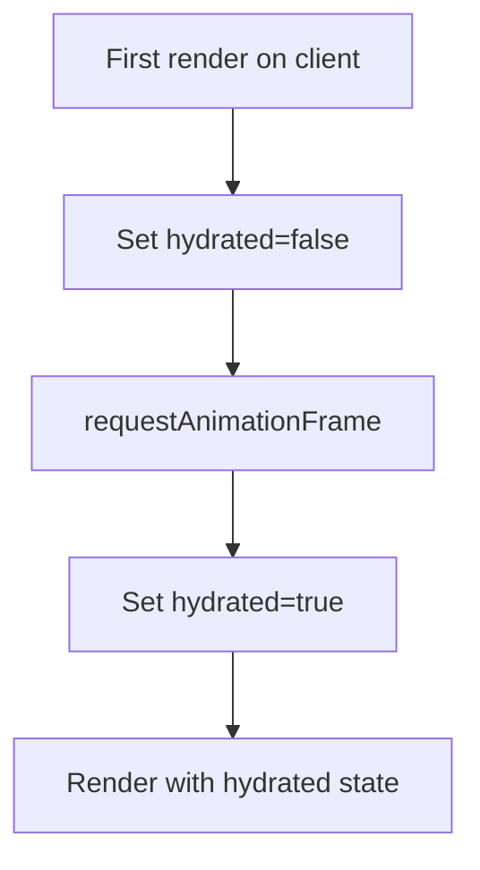
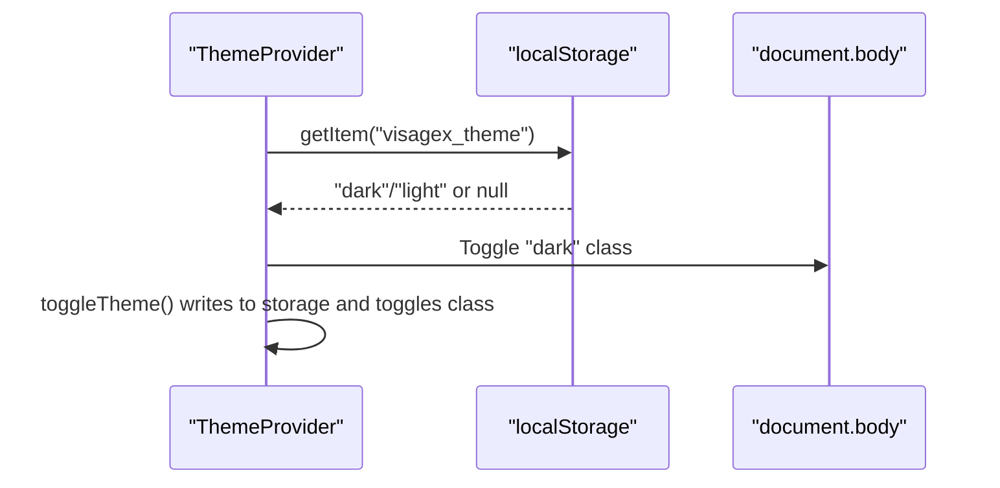
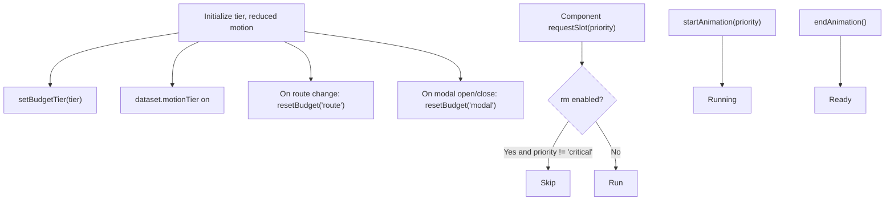
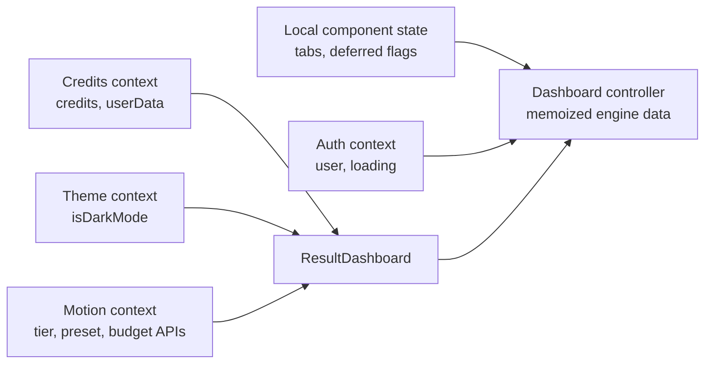
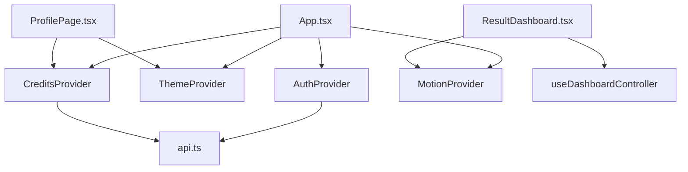

# State Management

<cite>
**Referenced Files in This Document**
- [useHydrated.ts](file://src/hooks/useHydrated.ts)
- [AuthProvider.tsx](file://src/context/AuthProvider.tsx)
- [CreditsProvider.tsx](file://src/context/CreditsProvider.tsx)
- [DashboardContext.tsx](file://src/context/DashboardContext.tsx)
- [useDashboardController.ts](file://src/features/dashboard/useDashboardController.ts)
- [MotionProvider.tsx](file://src/context/MotionProvider.tsx)
- [ThemeProvider.tsx](file://src/context/ThemeProvider.tsx)
- [api.ts](file://src/lib/api.ts)
- [ResultDashboard.tsx](file://src/components/ResultDashboard.tsx)
- [ProfilePage.tsx](file://src/pages/ProfilePage.tsx)
- [App.tsx](file://src/App.tsx)
</cite>

## Table of Contents
1. [Introduction](#introduction)
2. [Project Structure](#project-structure)
3. [Core Components](#core-components)
4. [Architecture Overview](#architecture-overview)
5. [Detailed Component Analysis](#detailed-component-analysis)
6. [Dependency Analysis](#dependency-analysis)
7. [Performance Considerations](#performance-considerations)
8. [Troubleshooting Guide](#troubleshooting-guide)
9. [Conclusion](#conclusion)

## Introduction
This document explains the state management architecture in FaceAnalytics Pro. It focuses on the hybrid approach that combines React hooks, context providers, and custom controllers. It documents how authentication state, credit balances, and user preferences flow across layers, how hydration mismatches are prevented, and how complex state is coordinated in the dashboard. It also covers patterns for persistence, synchronization with backend services, handling asynchronous updates, and best practices to avoid unnecessary re-renders and optimize performance.

## Project Structure
The state management stack is organized into layered providers and feature-specific controllers:
- Global providers manage cross-cutting concerns: authentication, theme, credits, and motion budgets.
- Feature-specific controllers encapsulate complex UI and analysis state.
- Utility hooks address client-side hydration concerns.
- API clients centralize backend communication and authentication integration.

**Diagram sources**
- [App.tsx:456-472](file://src/App.tsx#L456-L472)
- [AuthProvider.tsx:13-65](file://src/context/AuthProvider.tsx#L13-L65)
- [ThemeProvider.tsx:12-38](file://src/context/ThemeProvider.tsx#L12-L38)
- [CreditsProvider.tsx:13-45](file://src/context/CreditsProvider.tsx#L13-L45)
- [MotionProvider.tsx:45-131](file://src/context/MotionProvider.tsx#L45-L131)
- [useDashboardController.ts:4-100](file://src/features/dashboard/useDashboardController.ts#L4-L100)
- [ProfilePage.tsx:10-28](file://src/pages/ProfilePage.tsx#L10-L28)
- [ResultDashboard.tsx:315-800](file://src/components/ResultDashboard.tsx#L315-L800)
- [useHydrated.ts:24-33](file://src/hooks/useHydrated.ts#L24-L33)
- [api.ts:5-35](file://src/lib/api.ts#L5-L35)

**Section sources**
- [App.tsx:456-472](file://src/App.tsx#L456-L472)
- [AuthProvider.tsx:13-65](file://src/context/AuthProvider.tsx#L13-L65)
- [CreditsProvider.tsx:13-45](file://src/context/CreditsProvider.tsx#L13-L45)
- [ThemeProvider.tsx:12-38](file://src/context/ThemeProvider.tsx#L12-L38)
- [MotionProvider.tsx:45-131](file://src/context/MotionProvider.tsx#L45-L131)
- [useDashboardController.ts:4-100](file://src/features/dashboard/useDashboardController.ts#L4-L100)
- [ProfilePage.tsx:10-28](file://src/pages/ProfilePage.tsx#L10-L28)
- [ResultDashboard.tsx:315-800](file://src/components/ResultDashboard.tsx#L315-L800)
- [useHydrated.ts:24-33](file://src/hooks/useHydrated.ts#L24-L33)
- [api.ts:5-35](file://src/lib/api.ts#L5-L35)

## Core Components
- Authentication Provider: Manages Firebase user state, initialization guard, and loading lifecycle. It persists a user initialization marker to avoid repeated backend initialization calls.
- Credits Provider: Subscribes to Firestore user data for credits and user profile, memoizes the payload to prevent re-renders, and handles errors.
- Theme Provider: Persists user’s theme preference in localStorage and applies a class to the document body.
- Motion Provider: Detects device motion tier, reflects it on the document, tracks reduced motion preference, resets animation budgets on navigation, and exposes budget APIs.
- Dashboard Controller: Encapsulates complex dashboard state (promotions, UI flags, celebrity analysis, card generation) and memoizes derived data.
- Hydration Hook: Defers state updates until after the first client paint to prevent hydration mismatches with prerendered content.
- API Client: Adds Firebase ID tokens and CAPTCHA tokens to outgoing requests and centralizes baseURL.

**Section sources**
- [AuthProvider.tsx:13-65](file://src/context/AuthProvider.tsx#L13-L65)
- [CreditsProvider.tsx:13-45](file://src/context/CreditsProvider.tsx#L13-L45)
- [ThemeProvider.tsx:12-38](file://src/context/ThemeProvider.tsx#L12-L38)
- [MotionProvider.tsx:45-131](file://src/context/MotionProvider.tsx#L45-L131)
- [useDashboardController.ts:4-100](file://src/features/dashboard/useDashboardController.ts#L4-L100)
- [useHydrated.ts:24-33](file://src/hooks/useHydrated.ts#L24-L33)
- [api.ts:5-35](file://src/lib/api.ts#L5-L35)

## Architecture Overview
The application composes state across three layers:
- Local component state: UI flags, tab selections, and transient UI effects.
- Context providers: Shared global state (auth, theme, credits, motion).
- Feature-specific controllers: Single source of truth for complex feature state and memoized computations.

**Diagram sources**
- [App.tsx:456-472](file://src/App.tsx#L456-L472)
- [AuthProvider.tsx:18-62](file://src/context/AuthProvider.tsx#L18-L62)
- [CreditsProvider.tsx:18-40](file://src/context/CreditsProvider.tsx#L18-L40)
- [MotionProvider.tsx:46-80](file://src/context/MotionProvider.tsx#L46-L80)
- [ProfilePage.tsx:10-28](file://src/pages/ProfilePage.tsx#L10-L28)
- [ResultDashboard.tsx:315-347](file://src/components/ResultDashboard.tsx#L315-L347)

## Detailed Component Analysis

### Authentication State Flow
Authentication state originates from Firebase and is normalized into a simple context with user and loading flags. It guards backend initialization to avoid redundant calls and persists a marker to localStorage. The API client automatically attaches Firebase ID tokens to requests.

**Diagram sources**
- [AuthProvider.tsx:18-62](file://src/context/AuthProvider.tsx#L18-L62)
- [api.ts:9-29](file://src/lib/api.ts#L9-L29)

**Section sources**
- [AuthProvider.tsx:18-62](file://src/context/AuthProvider.tsx#L18-L62)
- [api.ts:9-29](file://src/lib/api.ts#L9-L29)

### Credit Balances and User Data
CreditsProvider subscribes to the user document in Firestore and exposes credits and user data. It memoizes the payload to minimize downstream re-renders. Errors are logged and state is cleared when the user logs out.

**Diagram sources**
- [CreditsProvider.tsx:18-40](file://src/context/CreditsProvider.tsx#L18-L40)

**Section sources**
- [CreditsProvider.tsx:18-40](file://src/context/CreditsProvider.tsx#L18-L40)

### Dashboard Controller Pattern
The dashboard controller consolidates complex state and derived data for the result dashboard. It separates concerns into distinct state groups (promo, UI/action, celebrity) and memoizes expensive computations.

**Diagram sources**
- [useDashboardController.ts:4-100](file://src/features/dashboard/useDashboardController.ts#L4-L100)

**Section sources**
- [useDashboardController.ts:4-100](file://src/features/dashboard/useDashboardController.ts#L4-L100)
- [ResultDashboard.tsx:347-358](file://src/components/ResultDashboard.tsx#L347-L358)

### Hydration Prevention Hook
The useHydrated hook ensures that motion components and other UI elements do not flash or jump when prerendered HTML is replaced by client-rendered content. It defers hydration to the next animation frame.

**Diagram sources**
- [useHydrated.ts:24-33](file://src/hooks/useHydrated.ts#L24-L33)

**Section sources**
- [useHydrated.ts:24-33](file://src/hooks/useHydrated.ts#L24-L33)

### Theme Persistence and Application
ThemeProvider reads a persisted preference from localStorage, defaults to dark mode, toggles and persists the preference, and applies a class to the document body for styling.

**Diagram sources**
- [ThemeProvider.tsx:12-38](file://src/context/ThemeProvider.tsx#L12-L38)

**Section sources**
- [ThemeProvider.tsx:12-38](file://src/context/ThemeProvider.tsx#L12-L38)

### Motion Budget and Device Tier
MotionProvider detects device tier, reflects it on the document, tracks reduced motion preference, resets budgets on route and modal changes, and exposes budget APIs for components to request slots and coordinate animations.

**Diagram sources**
- [MotionProvider.tsx:46-108](file://src/context/MotionProvider.tsx#L46-L108)

**Section sources**
- [MotionProvider.tsx:46-108](file://src/context/MotionProvider.tsx#L46-L108)

### State Flow Across Layers
- Local component state: Tabs, deferred renders, and transient UI flags.
- Context providers: Auth, theme, credits, and motion state.
- Feature-specific controllers: Dashboard controller for memoized engine data and UI state.

**Diagram sources**
- [ResultDashboard.tsx:315-347](file://src/components/ResultDashboard.tsx#L315-L347)
- [useDashboardController.ts:4-100](file://src/features/dashboard/useDashboardController.ts#L4-L100)
- [AuthProvider.tsx:13-65](file://src/context/AuthProvider.tsx#L13-L65)
- [CreditsProvider.tsx:13-45](file://src/context/CreditsProvider.tsx#L13-L45)
- [ThemeProvider.tsx:12-38](file://src/context/ThemeProvider.tsx#L12-L38)
- [MotionProvider.tsx:45-131](file://src/context/MotionProvider.tsx#L45-L131)

**Section sources**
- [ResultDashboard.tsx:315-347](file://src/components/ResultDashboard.tsx#L315-L347)
- [useDashboardController.ts:4-100](file://src/features/dashboard/useDashboardController.ts#L4-L100)
- [AuthProvider.tsx:13-65](file://src/context/AuthProvider.tsx#L13-L65)
- [CreditsProvider.tsx:13-45](file://src/context/CreditsProvider.tsx#L13-L45)
- [ThemeProvider.tsx:12-38](file://src/context/ThemeProvider.tsx#L12-L38)
- [MotionProvider.tsx:45-131](file://src/context/MotionProvider.tsx#L45-L131)

## Dependency Analysis
- Provider coupling: App wires providers; consumers depend on specific contexts.
- Controller coupling: Dashboard controller depends on analysis inputs and generates memoized outputs.
- External dependencies: Firebase for auth and Firestore; Axios for API; PostHog for analytics.

**Diagram sources**
- [App.tsx:456-472](file://src/App.tsx#L456-L472)
- [ProfilePage.tsx:10-28](file://src/pages/ProfilePage.tsx#L10-L28)
- [ResultDashboard.tsx:315-347](file://src/components/ResultDashboard.tsx#L315-L347)
- [useDashboardController.ts:4-100](file://src/features/dashboard/useDashboardController.ts#L4-L100)
- [AuthProvider.tsx:13-65](file://src/context/AuthProvider.tsx#L13-L65)
- [CreditsProvider.tsx:13-45](file://src/context/CreditsProvider.tsx#L13-L45)
- [api.ts:5-35](file://src/lib/api.ts#L5-L35)

**Section sources**
- [App.tsx:456-472](file://src/App.tsx#L456-L472)
- [ProfilePage.tsx:10-28](file://src/pages/ProfilePage.tsx#L10-L28)
- [ResultDashboard.tsx:315-347](file://src/components/ResultDashboard.tsx#L315-L347)
- [useDashboardController.ts:4-100](file://src/features/dashboard/useDashboardController.ts#L4-L100)
- [AuthProvider.tsx:13-65](file://src/context/AuthProvider.tsx#L13-L65)
- [CreditsProvider.tsx:13-45](file://src/context/CreditsProvider.tsx#L13-L45)
- [api.ts:5-35](file://src/lib/api.ts#L5-L35)

## Performance Considerations
- Memoization: Use useMemo for derived data and expensive computations in controllers and providers to avoid unnecessary re-renders.
- Context value memoization: CreditsProvider memoizes the context value to prevent churn.
- Budget-aware animations: MotionProvider’s budget APIs and reduced motion detection ensure smooth experiences on low-tier devices.
- Deferred hydration: useHydrated defers state changes to prevent layout shifts after prerendering.
- Controlled re-renders: Separate concerns into local state, context, and controller state to limit re-render scope.

[No sources needed since this section provides general guidance]

## Troubleshooting Guide
- Hydration mismatches: Ensure components using prerendered state defer updates until after the first client paint using the hydration hook.
- Auth initialization loops: Verify the initialization marker and localStorage usage to avoid repeated backend initialization calls.
- Firestore sync errors: Check onSnapshot error callbacks and ensure user presence is handled properly.
- Animation budget starvation: Reset budgets on route and modal transitions; components should request slots before animating.
- Token attachment failures: Confirm Firebase auth state and interceptor logic for adding Authorization headers.

**Section sources**
- [useHydrated.ts:24-33](file://src/hooks/useHydrated.ts#L24-L33)
- [AuthProvider.tsx:18-62](file://src/context/AuthProvider.tsx#L18-L62)
- [CreditsProvider.tsx:34-36](file://src/context/CreditsProvider.tsx#L34-L36)
- [MotionProvider.tsx:74-80](file://src/context/MotionProvider.tsx#L74-L80)
- [api.ts:9-29](file://src/lib/api.ts#L9-L29)

## Conclusion
FaceAnalytics Pro employs a layered state management strategy:
- Context providers supply global, cross-cutting state with careful memoization and persistence.
- Feature-specific controllers encapsulate complex state and derived data, ensuring a single source of truth.
- Hydration and motion budget utilities address client-server rendering and performance constraints.
- API integration is centralized with automatic token injection.
This hybrid approach yields predictable state flows, robust synchronization with backend services, and optimized performance across devices.