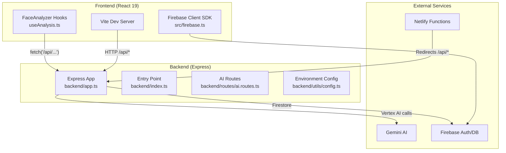
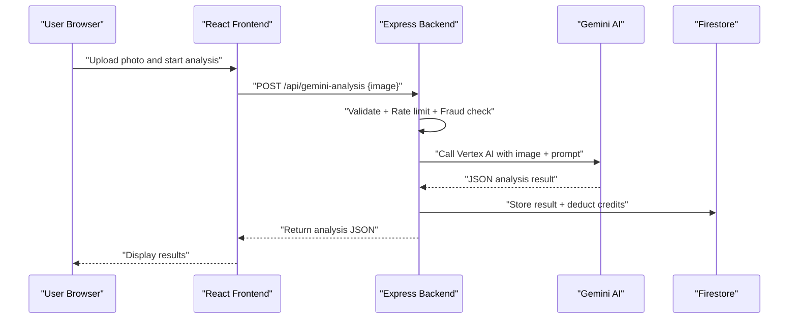
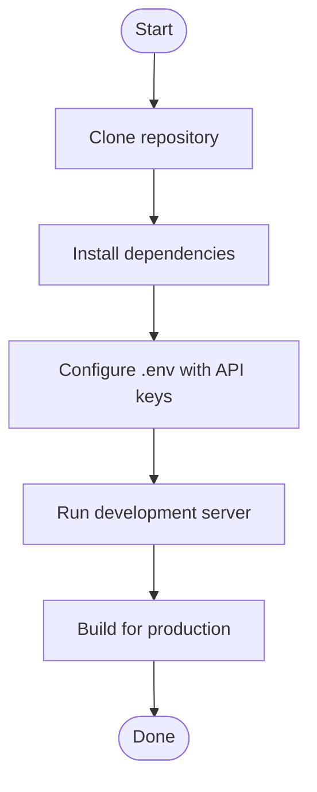
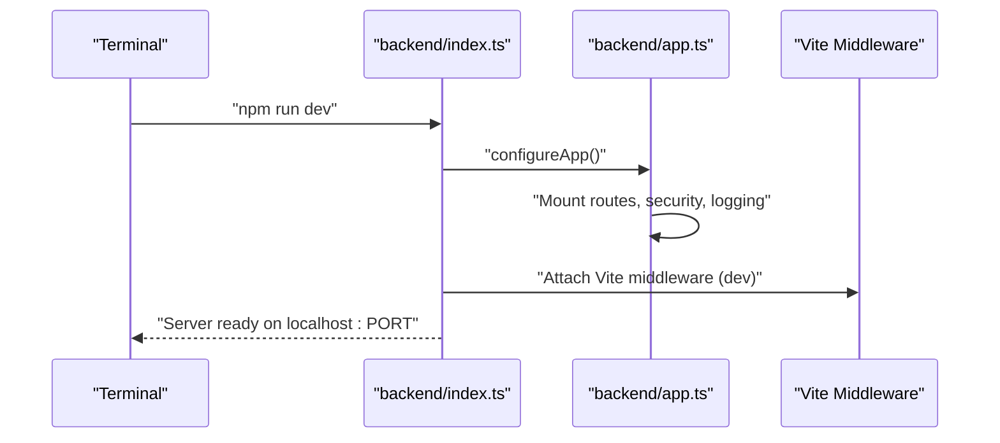
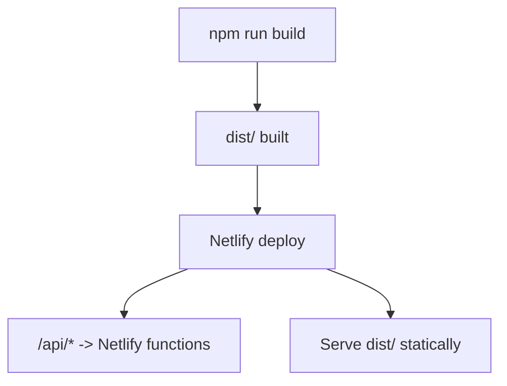
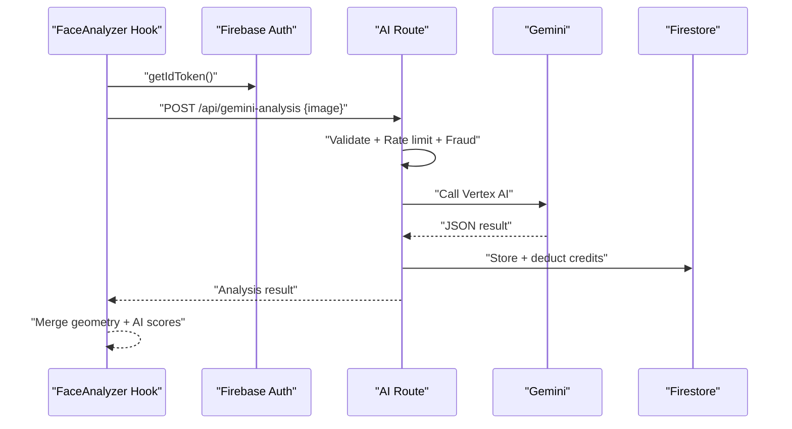
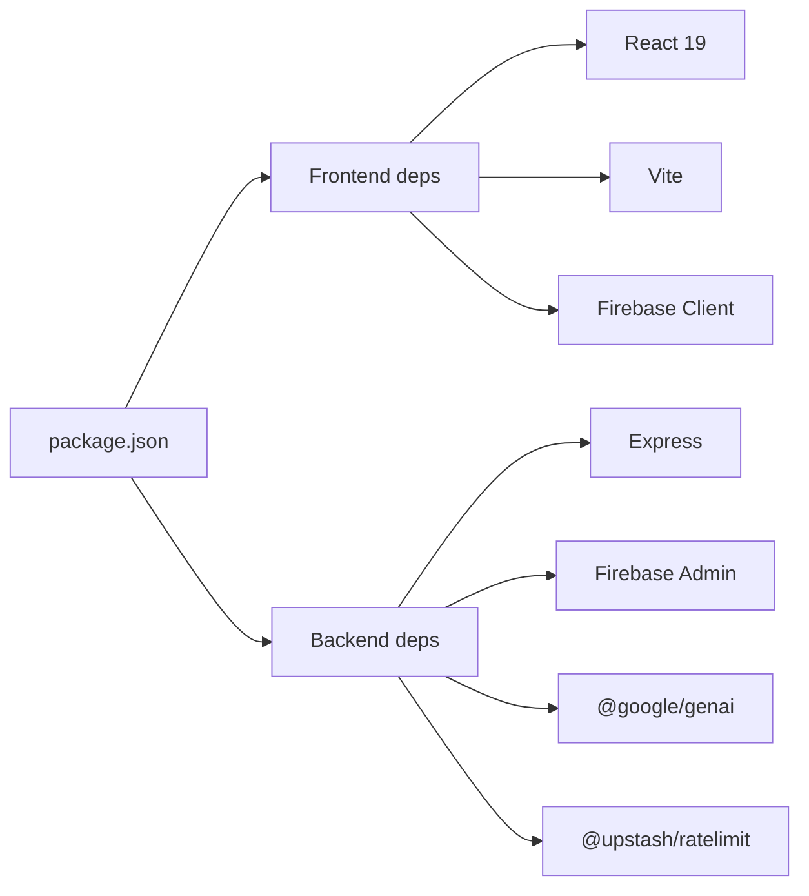

# Getting Started

<cite>
**Referenced Files in This Document**
- [README.md](file://README.md)
- [package.json](file://package.json)
- [backend/index.ts](file://backend/index.ts)
- [backend/app.ts](file://backend/app.ts)
- [backend/utils/config.ts](file://backend/utils/config.ts)
- [vite.config.ts](file://vite.config.ts)
- [netlify.toml](file://netlify.toml)
- [src/firebase.ts](file://src/firebase.ts)
- [firebase-applet-config.json](file://firebase-applet-config.json)
- [backend/routes/ai.routes.ts](file://backend/routes/ai.routes.ts)
- [src/components/FaceAnalyzer/hooks/useAnalysis.ts](file://src/components/FaceAnalyzer/hooks/useAnalysis.ts)
- [src/lib/api.ts](file://src/lib/api.ts)
- [backend/services/scan.service.ts](file://backend/services/scan.service.ts)
- [backend/utils/validation.ts](file://backend/utils/validation.ts)
</cite>

## Table of Contents
1. [Introduction](#introduction)
2. [Project Structure](#project-structure)
3. [Core Components](#core-components)
4. [Architecture Overview](#architecture-overview)
5. [Detailed Component Analysis](#detailed-component-analysis)
6. [Dependency Analysis](#dependency-analysis)
7. [Performance Considerations](#performance-considerations)
8. [Troubleshooting Guide](#troubleshooting-guide)
9. [Conclusion](#conclusion)
10. [Appendices](#appendices)

## Introduction
This guide helps you set up FaceAnalytics Pro for the first time. You will configure prerequisites, install dependencies, set up environment variables, run the development server, and perform your first facial analysis. It also covers production deployment considerations and common troubleshooting steps.

## Project Structure
The project is a full-stack React + Express application with a TypeScript backend, Firebase for authentication and data, and Gemini AI for advanced facial analysis. The frontend uses Vite and React 19, while the backend exposes REST endpoints under /api.

**Diagram sources**
- [backend/index.ts:1-29](file://backend/index.ts#L1-L29)
- [backend/app.ts:1-205](file://backend/app.ts#L1-L205)
- [backend/routes/ai.routes.ts:1-120](file://backend/routes/ai.routes.ts#L1-L120)
- [src/firebase.ts:1-21](file://src/firebase.ts#L1-L21)

**Section sources**
- [README.md:18-23](file://README.md#L18-L23)
- [vite.config.ts:14-75](file://vite.config.ts#L14-L75)
- [backend/app.ts:15-201](file://backend/app.ts#L15-L201)

## Core Components
- Frontend: React 19 with Vite, Tailwind, and Firebase client SDK.
- Backend: Express server with route handlers for AI analysis, geometry, payments, referrals, email, auth, and scans.
- AI: Gemini (Vertex AI) integration for facial analysis and lookalike comparisons.
- Database/Auth: Firebase Authentication and Firestore.
- Build and Deploy: Vite for frontend bundling, Netlify for serverless functions and redirects.

**Section sources**
- [README.md:18-23](file://README.md#L18-L23)
- [package.json:19-53](file://package.json#L19-L53)
- [backend/app.ts:171-179](file://backend/app.ts#L171-L179)

## Architecture Overview
The frontend communicates with the backend via /api endpoints. The backend validates requests, enforces rate limits and fraud checks, authenticates users, and calls Gemini AI. Results are stored in Firestore and cached for reuse.

**Diagram sources**
- [src/components/FaceAnalyzer/hooks/useAnalysis.ts:25-160](file://src/components/FaceAnalyzer/hooks/useAnalysis.ts#L25-L160)
- [backend/routes/ai.routes.ts:271-516](file://backend/routes/ai.routes.ts#L271-L516)
- [backend/services/scan.service.ts:68-94](file://backend/services/scan.service.ts#L68-L94)

## Detailed Component Analysis

### Prerequisites
- Node.js: The project requires Node.js 18+ for local development and 20+ for production builds. Confirm your version before proceeding.
- Firebase Project: Required for authentication, storage, and Firestore. The frontend initializes Firebase using a client-side config file.
- Gemini API Key: The backend expects a Vertex AI/Gemini API key to power facial analysis.

**Section sources**
- [README.md:26-29](file://README.md#L26-L29)
- [package.json:7-9](file://package.json#L7-L9)
- [backend/utils/config.ts:15-19](file://backend/utils/config.ts#L15-L19)

### Installation
1. Clone the repository and navigate to the project directory.
2. Install dependencies using npm.
3. Configure environment variables by copying the example to .env and adding your keys.

**Section sources**
- [README.md:31-56](file://README.md#L31-L56)
- [package.json:10-17](file://package.json#L10-L17)

### Environment Variables
- Backend environment validation enforces required variables and defaults for optional ones. At minimum, set the Vertex AI key and Firebase service account details.
- The frontend uses a client-side Firebase config file to initialize the client SDK.

Key variables (selection):
- VERTEX_API_KEY (required)
- FIREBASE_SERVICE_ACCOUNT (required for backend admin operations)
- FIRESTORE_DATABASE_ID (optional)
- GCP_PROJECT, GCP_REGION, GEMINI_MODEL (optional)
- APP_URL (used for CORS allowlist)
- UPSTASH_REDIS_* (optional, for rate limiting)
- PAYPAL_* (optional)
- RESEND_API_KEY (optional, for email)

**Section sources**
- [backend/utils/config.ts:7-48](file://backend/utils/config.ts#L7-L48)
- [src/firebase.ts:5](file://src/firebase.ts#L5)
- [firebase-applet-config.json:1-10](file://firebase-applet-config.json#L1-L10)

### Development Server
- Start the development server with the provided script. The backend entry initializes the Express app and optionally mounts Vite middleware for hot module replacement in development.
- The server listens on the configured port (default 3000) and logs environment details.

**Diagram sources**
- [backend/index.ts:7-26](file://backend/index.ts#L7-L26)
- [backend/app.ts:15-201](file://backend/app.ts#L15-L201)

**Section sources**
- [backend/index.ts:5-26](file://backend/index.ts#L5-L26)
- [package.json:10-11](file://package.json#L10-L11)

### Production Build and Deployment
- Build the frontend bundle with the provided script.
- Netlify configuration defines build commands, function bundler, and redirects from /api/* to the serverless function handler.
- The backend app is mounted to serve static assets in production and proxies analytics traffic.

**Diagram sources**
- [netlify.toml:1-42](file://netlify.toml#L1-L42)
- [vite.config.ts:58-72](file://vite.config.ts#L58-L72)
- [backend/app.ts:193-195](file://backend/app.ts#L193-L195)

**Section sources**
- [README.md:52-56](file://README.md#L52-L56)
- [netlify.toml:1-42](file://netlify.toml#L1-L42)
- [vite.config.ts:14-75](file://vite.config.ts#L14-L75)

### Initial Setup Verification
- Health check: Call the backend health endpoint to confirm the server is running.
- Firebase connection: Ensure the client SDK initializes without errors using the provided config.
- AI endpoint test: Trigger a small analysis request and verify the response includes expected fields.

**Section sources**
- [backend/app.ts:166-169](file://backend/app.ts#L166-L169)
- [src/firebase.ts:7-13](file://src/firebase.ts#L7-L13)

### Performing Your First Facial Analysis
- Upload a clear frontal photo and trigger the analysis flow.
- The frontend calls the backend’s Gemini analysis endpoint, passing the cropped image and landmarks.
- The backend validates the request, checks credits and rate limits, calls Gemini, stores the result, and returns the combined analysis.

**Diagram sources**
- [src/components/FaceAnalyzer/hooks/useAnalysis.ts:9-160](file://src/components/FaceAnalyzer/hooks/useAnalysis.ts#L9-L160)
- [backend/routes/ai.routes.ts:271-516](file://backend/routes/ai.routes.ts#L271-L516)
- [backend/services/scan.service.ts:68-94](file://backend/services/scan.service.ts#L68-L94)

**Section sources**
- [src/components/FaceAnalyzer/hooks/useAnalysis.ts:25-160](file://src/components/FaceAnalyzer/hooks/useAnalysis.ts#L25-L160)
- [backend/routes/ai.routes.ts:364-516](file://backend/routes/ai.routes.ts#L364-L516)

## Dependency Analysis
- Frontend dependencies include React, React DOM, Tailwind, Firebase client SDK, and AI/visualization libraries.
- Backend dependencies include Express, Firebase Admin SDK, Gemini client, rate limiting, and HTTP proxy middleware.
- Scripts define dev, build, preview, lint, format, and test tasks.

**Diagram sources**
- [package.json:19-53](file://package.json#L19-L53)

**Section sources**
- [package.json:19-53](file://package.json#L19-L53)
- [package.json:10-17](file://package.json#L10-L17)

## Performance Considerations
- Image compression reduces payload sizes before sending to Gemini, improving latency.
- Rate limiting and daily caps protect resources and prevent abuse.
- Chunking vendor libraries in the build improves caching and load performance.
- Timeout budgets differ between local dev and Netlify functions to accommodate long-running AI calls.

**Section sources**
- [backend/routes/ai.routes.ts:330-332](file://backend/routes/ai.routes.ts#L330-L332)
- [vite.config.ts:58-72](file://vite.config.ts#L58-L72)
- [backend/routes/ai.routes.ts:164-166](file://backend/routes/ai.routes.ts#L164-L166)

## Troubleshooting Guide
Common issues and resolutions:
- Missing or invalid API key:
  - Ensure VERTEX_API_KEY is set and correctly formatted. The backend logs which endpoint path was selected for the call.
- Insufficient credits:
  - Requests return 403 when credits are insufficient. The frontend detects this and skips premium analysis.
- Network timeouts:
  - Gemini Vision calls can take several seconds. The frontend waits longer than the platform timeout to avoid premature aborts.
- CORS errors:
  - Verify APP_URL matches your frontend origin; the backend sets Access-Control-Allow-Origin accordingly.
- Firebase initialization:
  - Confirm the client config file is present and initialized. The frontend imports and uses it to initialize auth, storage, and Firestore.

**Section sources**
- [backend/utils/config.ts:64-82](file://backend/utils/config.ts#L64-L82)
- [src/components/FaceAnalyzer/hooks/useAnalysis.ts:62-90](file://src/components/FaceAnalyzer/hooks/useAnalysis.ts#L62-L90)
- [backend/routes/ai.routes.ts:194-196](file://backend/routes/ai.routes.ts#L194-L196)
- [backend/app.ts:145-164](file://backend/app.ts#L145-L164)
- [src/firebase.ts:5-13](file://src/firebase.ts#L5-L13)

## Conclusion
You now have the essentials to set up FaceAnalytics Pro, configure environment variables, run the development server, and perform your first facial analysis. For production, use the provided build and Netlify configuration, and monitor environment validation and rate limits to maintain reliability.

## Appendices

### Quick Start Checklist
- Install Node.js 18+ and npm.
- Create a Firebase project and enable Authentication and Firestore.
- Obtain a Gemini API key and configure backend environment variables.
- Run the development server and verify the health endpoint.
- Perform a test facial analysis and review the results.

**Section sources**
- [README.md:26-56](file://README.md#L26-L56)
- [backend/utils/config.ts:15-19](file://backend/utils/config.ts#L15-L19)