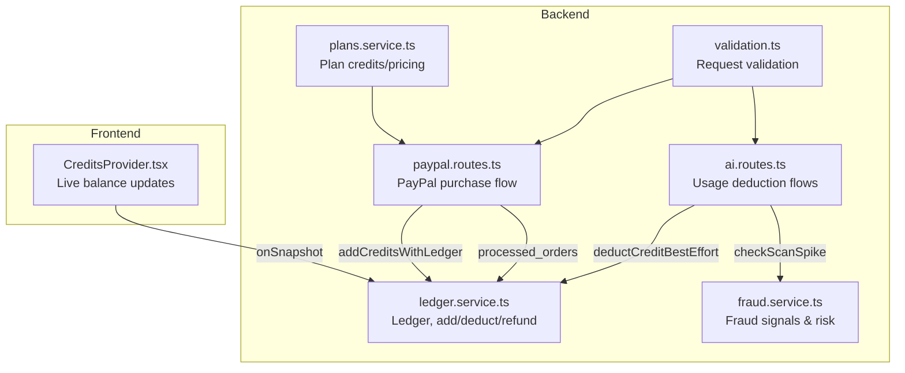
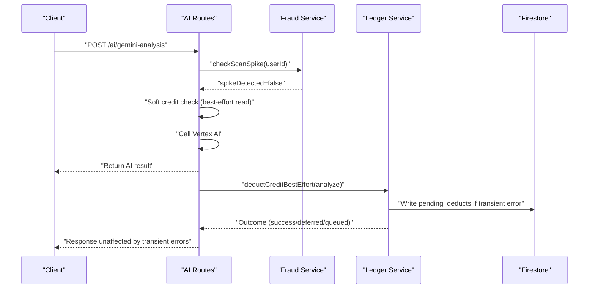
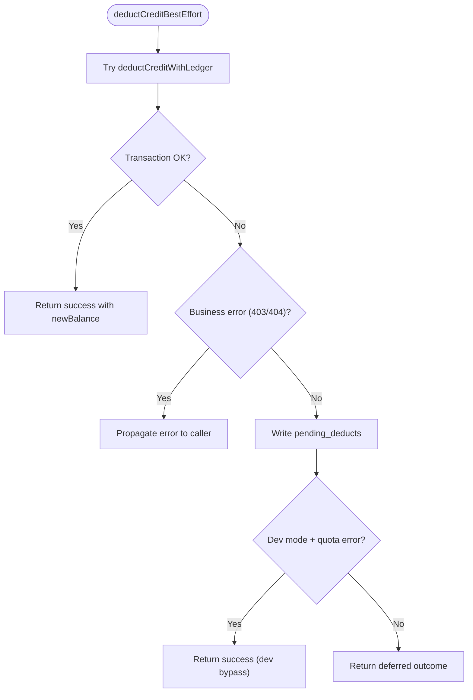
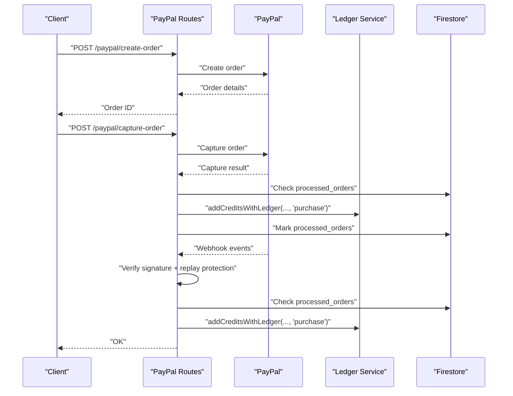
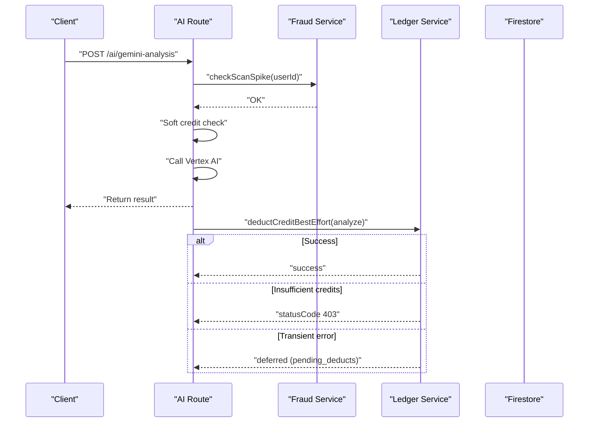
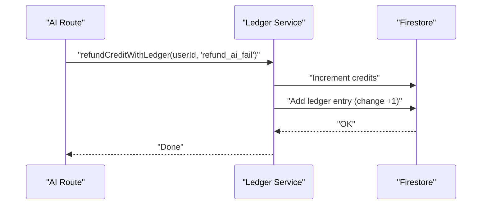
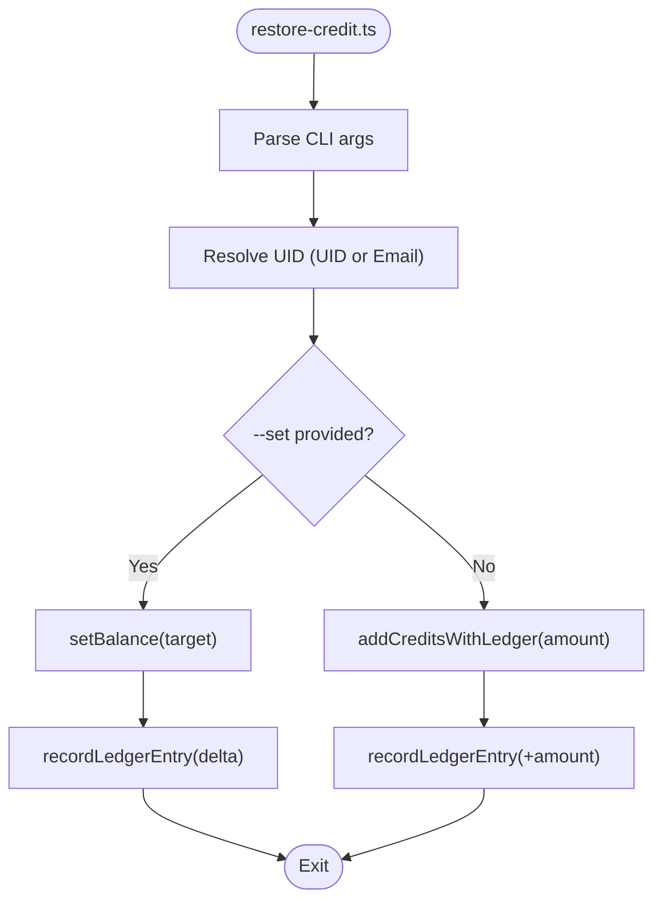
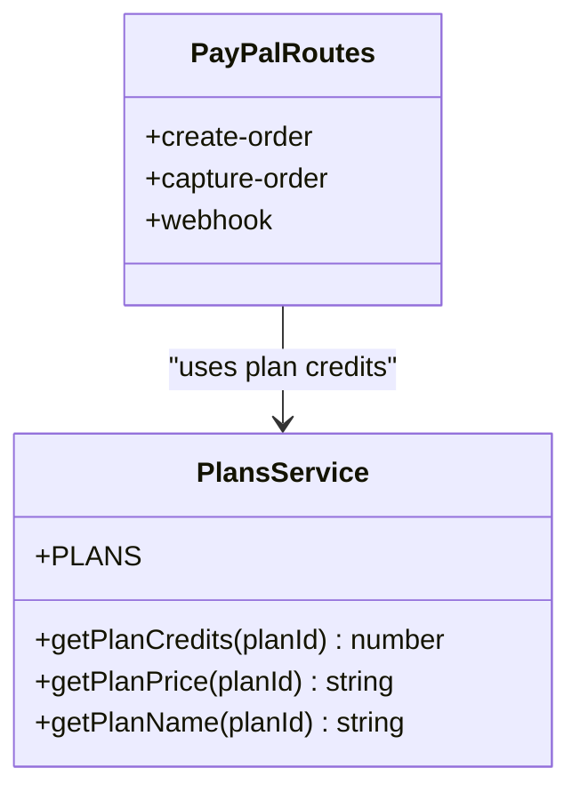
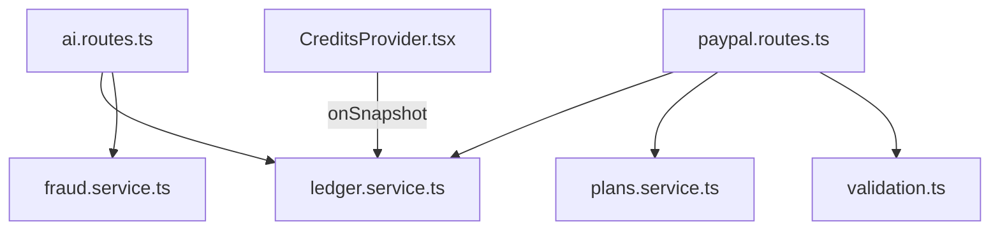

# Credit System

<cite>
**Referenced Files in This Document**
- [ledger.service.ts](file://backend/services/ledger.service.ts)
- [restore-credit.ts](file://backend/scripts/restore-credit.ts)
- [paypal.routes.ts](file://backend/routes/paypal.routes.ts)
- [plans.service.ts](file://backend/services/plans.service.ts)
- [ai.routes.ts](file://backend/routes/ai.routes.ts)
- [CreditsProvider.tsx](file://src/context/CreditsProvider.tsx)
- [fraud.service.ts](file://backend/services/fraud.service.ts)
- [validation.ts](file://backend/utils/validation.ts)
</cite>

## Table of Contents
1. [Introduction](#introduction)
2. [Project Structure](#project-structure)
3. [Core Components](#core-components)
4. [Architecture Overview](#architecture-overview)
5. [Detailed Component Analysis](#detailed-component-analysis)
6. [Dependency Analysis](#dependency-analysis)
7. [Performance Considerations](#performance-considerations)
8. [Troubleshooting Guide](#troubleshooting-guide)
9. [Conclusion](#conclusion)
10. [Appendices](#appendices)

## Introduction
This document explains the credit-based payment system powering premium features. It covers how credits are allocated, tracked, and consumed; how purchases are processed; how usage deductions and refunds are handled; and how the system restores credits after failures. It also documents fraud safeguards, reconciliation mechanisms, and the relationship between credits and subscription plans. Finally, it outlines reporting and analytics capabilities for financial oversight.

## Project Structure
The credit system spans backend services and frontend providers:
- Backend services manage credit accounting, purchases, usage, refunds, and fraud checks.
- Frontend context provides live balance updates for users.
- Scripts enable administrative restoration and reconciliation.

**Diagram sources**
- [CreditsProvider.tsx:13-46](file://src/context/CreditsProvider.tsx#L13-L46)
- [ledger.service.ts:60-268](file://backend/services/ledger.service.ts#L60-L268)
- [paypal.routes.ts:134-151](file://backend/routes/paypal.routes.ts#L134-L151)
- [plans.service.ts:13-33](file://backend/services/plans.service.ts#L13-L33)
- [ai.routes.ts:271-516](file://backend/routes/ai.routes.ts#L271-L516)
- [fraud.service.ts:315-341](file://backend/services/fraud.service.ts#L315-L341)
- [validation.ts:57-64](file://backend/utils/validation.ts#L57-L64)

**Section sources**
- [CreditsProvider.tsx:13-46](file://src/context/CreditsProvider.tsx#L13-L46)
- [ledger.service.ts:60-268](file://backend/services/ledger.service.ts#L60-L268)
- [paypal.routes.ts:134-151](file://backend/routes/paypal.routes.ts#L134-L151)
- [plans.service.ts:13-33](file://backend/services/plans.service.ts#L13-L33)
- [ai.routes.ts:271-516](file://backend/routes/ai.routes.ts#L271-L516)
- [fraud.service.ts:315-341](file://backend/services/fraud.service.ts#L315-L341)
- [validation.ts:57-64](file://backend/utils/validation.ts#L57-L64)

## Core Components
- Ledger service: Atomic credit adjustments, immutable audit trail, and best-effort reconciliation.
- PayPal routes: Purchase orchestration, webhook verification, and credit crediting.
- Plans service: Centralized plan configuration mapping planId to credits.
- AI routes: Premium feature usage flows with credit-safe ordering and post-success deduction.
- Credits provider: Real-time balance synchronization for the UI.
- Fraud service: Risk profiling and scan-spike detection to protect the system.

**Section sources**
- [ledger.service.ts:22-268](file://backend/services/ledger.service.ts#L22-L268)
- [paypal.routes.ts:134-151](file://backend/routes/paypal.routes.ts#L134-L151)
- [plans.service.ts:13-33](file://backend/services/plans.service.ts#L13-L33)
- [ai.routes.ts:271-516](file://backend/routes/ai.routes.ts#L271-L516)
- [CreditsProvider.tsx:13-46](file://src/context/CreditsProvider.tsx#L13-L46)
- [fraud.service.ts:315-341](file://backend/services/fraud.service.ts#L315-L341)

## Architecture Overview
The system enforces a credit-safe usage model:
- Premium features are attempted first (AI calls), then credits are deducted.
- Deductions are atomic where possible; otherwise queued for reconciliation.
- Purchases add credits with a ledger entry.
- Refunds add credits and record a ledger entry.
- Fraud detection prevents abuse and flags risky behavior.

**Diagram sources**
- [ai.routes.ts:271-516](file://backend/routes/ai.routes.ts#L271-L516)
- [fraud.service.ts:315-341](file://backend/services/fraud.service.ts#L315-L341)
- [ledger.service.ts:189-240](file://backend/services/ledger.service.ts#L189-L240)

## Detailed Component Analysis

### Ledger Service
Responsibilities:
- Immutable audit trail via ledger entries.
- Atomic credit adjustments with transactions.
- Best-effort deduction with reconciliation queue.
- Refund handling with ledger entries.
- Dev-mode bypass for quota exhaustion.

Key behaviors:
- Transactional deduction ensures consistency and records a ledger entry in the same transaction.
- Best-effort deduction proceeds even if Firestore is temporarily unavailable, queuing pending_deducts for later reconciliation.
- Refund adds credits and logs a refund ledger entry.
- recordLedgerEntry writes standalone entries for side effects or administrative actions.

**Diagram sources**
- [ledger.service.ts:189-240](file://backend/services/ledger.service.ts#L189-L240)

**Section sources**
- [ledger.service.ts:60-91](file://backend/services/ledger.service.ts#L60-L91)
- [ledger.service.ts:97-141](file://backend/services/ledger.service.ts#L97-L141)
- [ledger.service.ts:147-169](file://backend/services/ledger.service.ts#L147-L169)
- [ledger.service.ts:189-240](file://backend/services/ledger.service.ts#L189-L240)
- [ledger.service.ts:245-268](file://backend/services/ledger.service.ts#L245-L268)

### PayPal Purchase Workflow
Responsibilities:
- Create and capture orders via PayPal.
- Webhook verification and replay protection.
- Credit allocation upon successful capture/webhook.
- Receipt email dispatch.

Flow:
- Create order with plan metadata.
- Capture order and add credits if not already processed.
- Webhook verifies signature and marks order as processed; adds credits and sends receipt.

**Diagram sources**
- [paypal.routes.ts:25-76](file://backend/routes/paypal.routes.ts#L25-L76)
- [paypal.routes.ts:79-159](file://backend/routes/paypal.routes.ts#L79-L159)
- [paypal.routes.ts:162-299](file://backend/routes/paypal.routes.ts#L162-L299)
- [plans.service.ts:13-33](file://backend/services/plans.service.ts#L13-L33)
- [ledger.service.ts:245-268](file://backend/services/ledger.service.ts#L245-L268)

**Section sources**
- [paypal.routes.ts:25-76](file://backend/routes/paypal.routes.ts#L25-L76)
- [paypal.routes.ts:79-159](file://backend/routes/paypal.routes.ts#L79-L159)
- [paypal.routes.ts:162-299](file://backend/routes/paypal.routes.ts#L162-L299)
- [validation.ts:57-64](file://backend/utils/validation.ts#L57-L64)
- [plans.service.ts:13-33](file://backend/services/plans.service.ts#L13-L33)
- [ledger.service.ts:245-268](file://backend/services/ledger.service.ts#L245-L268)

### Premium Feature Usage Deduction
Responsibilities:
- Credit-safe ordering: AI called first; credits deducted after success.
- Deduction outcomes: success, insufficient credits, deferred, or queued.
- Fraud checks to prevent abuse.

Key flows:
- Gemini analysis, celebrity lookalike, and hair analysis all follow the same pattern.
- Deduction occurs post-success; transient failures queue reconciliation.

**Diagram sources**
- [ai.routes.ts:271-516](file://backend/routes/ai.routes.ts#L271-L516)
- [fraud.service.ts:315-341](file://backend/services/fraud.service.ts#L315-L341)
- [ledger.service.ts:189-240](file://backend/services/ledger.service.ts#L189-L240)

**Section sources**
- [ai.routes.ts:271-516](file://backend/routes/ai.routes.ts#L271-L516)
- [fraud.service.ts:315-341](file://backend/services/fraud.service.ts#L315-L341)
- [ledger.service.ts:189-240](file://backend/services/ledger.service.ts#L189-L240)

### Refund Processing
Responsibilities:
- Refund credits when AI calls fail after deduction.
- Record refund ledger entries.
- Administrative restoration via a dedicated script.

**Diagram sources**
- [ledger.service.ts:147-169](file://backend/services/ledger.service.ts#L147-L169)

**Section sources**
- [ledger.service.ts:147-169](file://backend/services/ledger.service.ts#L147-L169)

### Credit Restoration Script
Responsibilities:
- Administrative tool to add or set credits.
- Writes explicit ledger entries for auditability.
- Supports both UID and email-based resolution.

Capabilities:
- Add credits: increments balance and logs a ledger entry.
- Set balance: writes target credits and logs delta.

**Diagram sources**
- [restore-credit.ts:122-154](file://backend/scripts/restore-credit.ts#L122-L154)
- [restore-credit.ts:65-120](file://backend/scripts/restore-credit.ts#L65-L120)
- [ledger.service.ts:245-268](file://backend/services/ledger.service.ts#L245-L268)

**Section sources**
- [restore-credit.ts:122-154](file://backend/scripts/restore-credit.ts#L122-L154)
- [restore-credit.ts:65-120](file://backend/scripts/restore-credit.ts#L65-L120)
- [ledger.service.ts:245-268](file://backend/services/ledger.service.ts#L245-L268)

### Subscription Billing and Credits
Relationship:
- Plans define credit allocations and prices.
- PayPal routes use plan credits to credit user accounts upon successful capture or webhook.

**Diagram sources**
- [plans.service.ts:13-33](file://backend/services/plans.service.ts#L13-L33)
- [paypal.routes.ts:134-151](file://backend/routes/paypal.routes.ts#L134-L151)

**Section sources**
- [plans.service.ts:13-33](file://backend/services/plans.service.ts#L13-L33)
- [paypal.routes.ts:134-151](file://backend/routes/paypal.routes.ts#L134-L151)

### Credit Expiration, Rollover, and Audit Trail
- Expiration and rollover: Not implemented in the analyzed code.
- Audit trail: Every credit change is logged in the ledger with immutable entries and optional IP metadata.

**Section sources**
- [ledger.service.ts:60-91](file://backend/services/ledger.service.ts#L60-L91)
- [ledger.service.ts:245-268](file://backend/services/ledger.service.ts#L245-L268)

### Security Measures and Reconciliation
- Security:
  - Webhook signature verification and replay protection.
  - Fraud signals and risk profiles to block or require CAPTCHA for suspicious users.
  - Device fingerprinting and IP tracking.
- Reconciliation:
  - pending_deducts queue for transient failures.
  - Dev-mode bypass for quota exhaustion during development.

**Section sources**
- [paypal.routes.ts:162-299](file://backend/routes/paypal.routes.ts#L162-L299)
- [fraud.service.ts:315-341](file://backend/services/fraud.service.ts#L315-L341)
- [fraud.service.ts:429-472](file://backend/services/fraud.service.ts#L429-L472)
- [ledger.service.ts:189-240](file://backend/services/ledger.service.ts#L189-L240)

### Credit Reporting and Analytics
- Financial oversight:
  - credits_ledger provides immutable audit trail.
  - processed_orders prevents duplicate credit allocation.
  - pending_deducts enables reconciliation of transient failures.
- UI reporting:
  - CreditsProvider.tsx subscribes to user doc for live balance updates.

**Section sources**
- [paypal.routes.ts:134-151](file://backend/routes/paypal.routes.ts#L134-L151)
- [ledger.service.ts:60-91](file://backend/services/ledger.service.ts#L60-L91)
- [CreditsProvider.tsx:13-46](file://src/context/CreditsProvider.tsx#L13-L46)

## Dependency Analysis

**Diagram sources**
- [ai.routes.ts:271-516](file://backend/routes/ai.routes.ts#L271-L516)
- [ledger.service.ts:60-268](file://backend/services/ledger.service.ts#L60-L268)
- [fraud.service.ts:315-341](file://backend/services/fraud.service.ts#L315-L341)
- [paypal.routes.ts:134-151](file://backend/routes/paypal.routes.ts#L134-L151)
- [plans.service.ts:13-33](file://backend/services/plans.service.ts#L13-L33)
- [validation.ts:57-64](file://backend/utils/validation.ts#L57-L64)
- [CreditsProvider.tsx:13-46](file://src/context/CreditsProvider.tsx#L13-L46)

**Section sources**
- [ai.routes.ts:271-516](file://backend/routes/ai.routes.ts#L271-L516)
- [ledger.service.ts:60-268](file://backend/services/ledger.service.ts#L60-L268)
- [fraud.service.ts:315-341](file://backend/services/fraud.service.ts#L315-L341)
- [paypal.routes.ts:134-151](file://backend/routes/paypal.routes.ts#L134-L151)
- [plans.service.ts:13-33](file://backend/services/plans.service.ts#L13-L33)
- [validation.ts:57-64](file://backend/utils/validation.ts#L57-L64)
- [CreditsProvider.tsx:13-46](file://src/context/CreditsProvider.tsx#L13-L46)

## Performance Considerations
- Best-effort deduction avoids blocking responses during transient failures, maintaining responsiveness.
- Fraud checks and rate limits bound abuse and reduce load.
- Batched activity logging reduces Firestore write volume.

[No sources needed since this section provides general guidance]

## Troubleshooting Guide
Common issues and resolutions:
- Insufficient credits:
  - API returns 403 with INSUFFICIENT_CREDITS; ensure user has credits before attempting premium features.
- Transient errors during deduction:
  - Deduction may be deferred; check pending_deducts and reconcile later.
- Duplicate order credits:
  - processed_orders prevents double-credit; verify order status before manual intervention.
- Webhook signature failures:
  - Ensure PAYPAL_WEBHOOK_ID is configured and verify signatures; otherwise webhook is rejected.
- Fraud flags:
  - Users may be soft-banned or required to solve CAPTCHA; review risk profiles and adjust thresholds.

**Section sources**
- [ledger.service.ts:189-240](file://backend/services/ledger.service.ts#L189-L240)
- [paypal.routes.ts:162-299](file://backend/routes/paypal.routes.ts#L162-L299)
- [fraud.service.ts:429-472](file://backend/services/fraud.service.ts#L429-L472)

## Conclusion
The credit system is designed for safety, auditability, and resilience. Premium features are executed first, ensuring users receive results even if credit deduction fails transiently. Purchases are securely processed with verification and replay protection. Fraud safeguards and reconciliation queues maintain system integrity. The immutable ledger and UI synchronization provide transparency for financial oversight.

## Appendices

### Credit Flow Scenarios

- Purchase credits
  - Create order, capture order, add credits via addCreditsWithLedger, mark processed_orders.
  - [paypal.routes.ts:134-151](file://backend/routes/paypal.routes.ts#L134-L151)
  - [ledger.service.ts:245-268](file://backend/services/ledger.service.ts#L245-L268)

- Use premium feature
  - Soft credit check, call AI, return result, deduct credits post-success with best-effort.
  - [ai.routes.ts:271-516](file://backend/routes/ai.routes.ts#L271-L516)
  - [ledger.service.ts:189-240](file://backend/services/ledger.service.ts#L189-L240)

- Refund credit after failure
  - Increment credits and record refund ledger entry.
  - [ledger.service.ts:147-169](file://backend/services/ledger.service.ts#L147-L169)

- Restore credits via script
  - Add or set credits and log ledger entry for auditability.
  - [restore-credit.ts:122-154](file://backend/scripts/restore-credit.ts#L122-L154)
  - [restore-credit.ts:65-120](file://backend/scripts/restore-credit.ts#L65-L120)