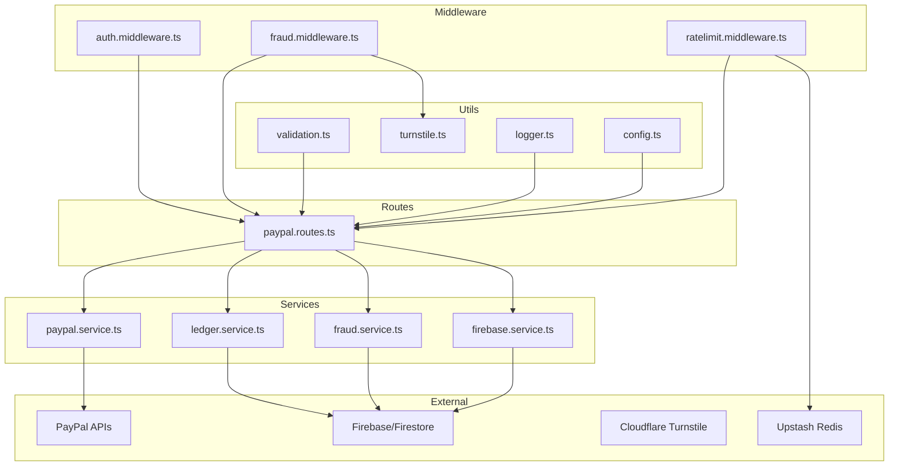
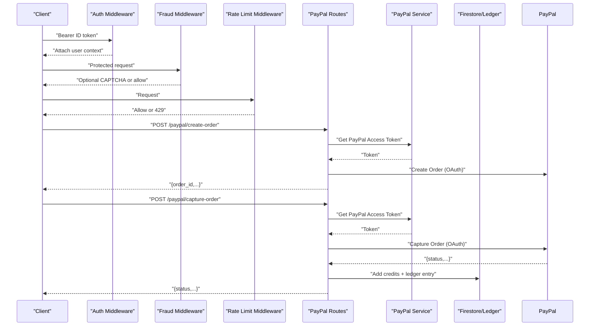
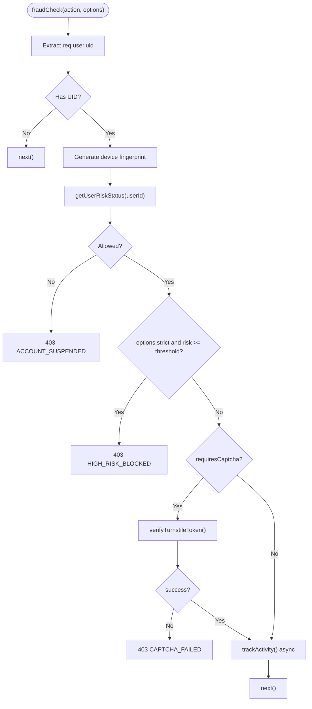
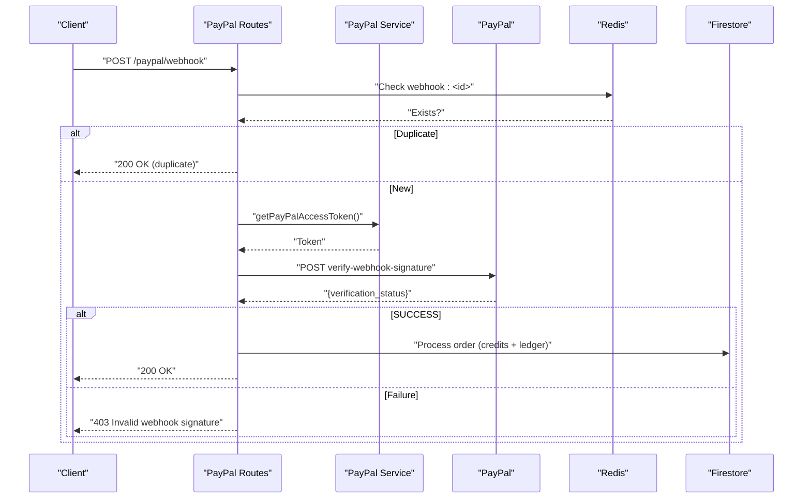
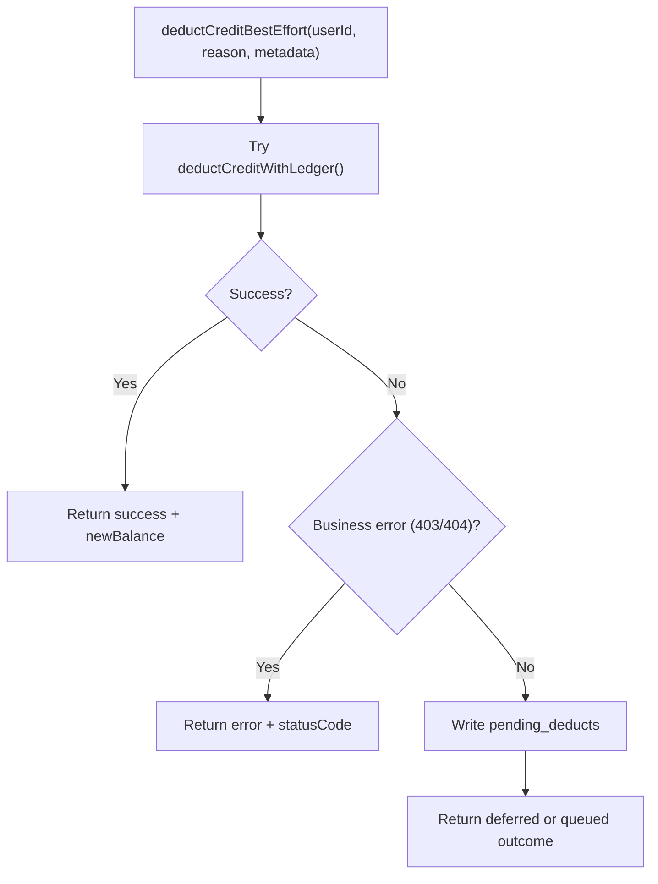
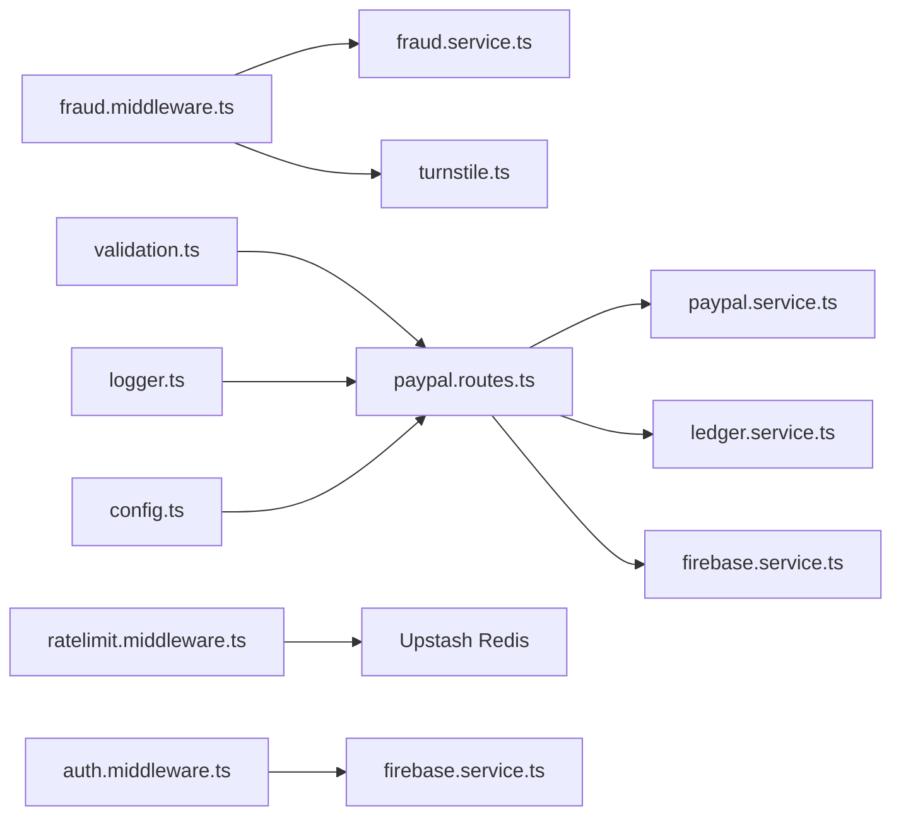

# Financial Security and Compliance

<cite>
**Referenced Files in This Document**
- [fraud.middleware.ts](file://backend/middleware/fraud.middleware.ts)
- [fraud.service.ts](file://backend/services/fraud.service.ts)
- [paypal.routes.ts](file://backend/routes/paypal.routes.ts)
- [paypal.service.ts](file://backend/services/paypal.service.ts)
- [auth.middleware.ts](file://backend/middleware/auth.middleware.ts)
- [ratelimit.middleware.ts](file://backend/middleware/ratelimit.middleware.ts)
- [turnstile.ts](file://backend/utils/turnstile.ts)
- [validation.ts](file://backend/utils/validation.ts)
- [ledger.service.ts](file://backend/services/ledger.service.ts)
- [firebase.service.ts](file://backend/services/firebase.service.ts)
- [logger.ts](file://backend/utils/logger.ts)
- [config.ts](file://backend/utils/config.ts)
- [admin.routes.ts](file://backend/routes/admin.routes.ts)
</cite>

## Table of Contents
1. [Introduction](#introduction)
2. [Project Structure](#project-structure)
3. [Core Components](#core-components)
4. [Architecture Overview](#architecture-overview)
5. [Detailed Component Analysis](#detailed-component-analysis)
6. [Dependency Analysis](#dependency-analysis)
7. [Performance Considerations](#performance-considerations)
8. [Troubleshooting Guide](#troubleshooting-guide)
9. [Conclusion](#conclusion)
10. [Appendices](#appendices)

## Introduction
This document details the financial security measures and compliance requirements implemented in the payment system. It explains the fraud detection middleware and risk assessment mechanisms, PayPal API integration security controls (signature verification, webhook replay protection, and secure credential storage), money laundering and KYC considerations, error handling for security violations and transaction reversals, logging and audit requirements, and secure development practices.

## Project Structure
The payment and security logic is primarily implemented in the backend:
- Middleware enforces authentication, rate limits, CAPTCHA verification, and fraud checks.
- Services encapsulate PayPal OAuth, ledger operations, fraud detection, and Firebase access.
- Routes expose payment endpoints and webhooks with validation and security safeguards.
- Utilities provide environment validation, logger configuration, and CAPTCHA verification.

**Diagram sources**
- [paypal.routes.ts:1-302](file://backend/routes/paypal.routes.ts#L1-L302)
- [paypal.service.ts:1-41](file://backend/services/paypal.service.ts#L1-L41)
- [ledger.service.ts:1-269](file://backend/services/ledger.service.ts#L1-L269)
- [fraud.service.ts:1-634](file://backend/services/fraud.service.ts#L1-L634)
- [firebase.service.ts:1-120](file://backend/services/firebase.service.ts#L1-L120)
- [auth.middleware.ts:1-40](file://backend/middleware/auth.middleware.ts#L1-L40)
- [ratelimit.middleware.ts:1-134](file://backend/middleware/ratelimit.middleware.ts#L1-L134)
- [turnstile.ts:1-146](file://backend/utils/turnstile.ts#L1-L146)
- [validation.ts:1-103](file://backend/utils/validation.ts#L1-L103)
- [logger.ts:1-71](file://backend/utils/logger.ts#L1-L71)
- [config.ts:1-110](file://backend/utils/config.ts#L1-L110)

**Section sources**
- [paypal.routes.ts:1-302](file://backend/routes/paypal.routes.ts#L1-L302)
- [fraud.middleware.ts:1-133](file://backend/middleware/fraud.middleware.ts#L1-L133)
- [ratelimit.middleware.ts:1-134](file://backend/middleware/ratelimit.middleware.ts#L1-L134)
- [turnstile.ts:1-146](file://backend/utils/turnstile.ts#L1-L146)
- [validation.ts:1-103](file://backend/utils/validation.ts#L1-L103)
- [ledger.service.ts:1-269](file://backend/services/ledger.service.ts#L1-L269)
- [paypal.service.ts:1-41](file://backend/services/paypal.service.ts#L1-L41)
- [firebase.service.ts:1-120](file://backend/services/firebase.service.ts#L1-L120)
- [logger.ts:1-71](file://backend/utils/logger.ts#L1-L71)
- [config.ts:1-110](file://backend/utils/config.ts#L1-L110)

## Core Components
- Authentication and Authorization: Firebase Admin SDK verifies ID tokens and attaches user context to requests.
- Fraud Detection Middleware: Enforces risk-aware access, optional CAPTCHA gating, device/IP anchoring, and preemptive blocking for expensive operations.
- PayPal Integration: Secure order creation and capture with server-side metadata validation; webhook verification and replay protection; token caching with expiry.
- Ledger and Credits: Immutable audit trail for all credit changes; best-effort deduction with reconciliation for outages.
- Rate Limiting and Abuse Prevention: Sliding window rate limits with per-user and per-IP checks; daily usage caps; Turnstile circuit breaker.
- Logging and Environment Validation: Centralized logger with redaction; strict environment validation with early failure in production.

**Section sources**
- [auth.middleware.ts:18-39](file://backend/middleware/auth.middleware.ts#L18-L39)
- [fraud.middleware.ts:30-104](file://backend/middleware/fraud.middleware.ts#L30-L104)
- [paypal.routes.ts:18-159](file://backend/routes/paypal.routes.ts#L18-L159)
- [paypal.service.ts:12-40](file://backend/services/paypal.service.ts#L12-L40)
- [ledger.service.ts:55-240](file://backend/services/ledger.service.ts#L55-L240)
- [ratelimit.middleware.ts:25-92](file://backend/middleware/ratelimit.middleware.ts#L25-L92)
- [turnstile.ts:59-145](file://backend/utils/turnstile.ts#L59-L145)
- [logger.ts:21-71](file://backend/utils/logger.ts#L21-L71)
- [config.ts:59-82](file://backend/utils/config.ts#L59-L82)

## Architecture Overview
The payment flow integrates client-side PayPal with server-side verification and reconciliation. The fraud middleware and rate limits protect resources and detect suspicious behavior. Logs and ledgers provide audit trails.

**Diagram sources**
- [paypal.routes.ts:25-159](file://backend/routes/paypal.routes.ts#L25-L159)
- [paypal.service.ts:12-40](file://backend/services/paypal.service.ts#L12-L40)
- [auth.middleware.ts:18-39](file://backend/middleware/auth.middleware.ts#L18-L39)
- [fraud.middleware.ts:30-104](file://backend/middleware/fraud.middleware.ts#L30-L104)
- [ratelimit.middleware.ts:38-92](file://backend/middleware/ratelimit.middleware.ts#L38-L92)
- [ledger.service.ts:245-268](file://backend/services/ledger.service.ts#L245-L268)

## Detailed Component Analysis

### Fraud Detection Middleware and Risk Assessment
The middleware orchestrates:
- Device fingerprint generation from request headers and optional client-provided fingerprint.
- Risk status retrieval from cache/profile to decide allow/block/verification-required.
- Optional preemptive block for expensive operations based on configurable thresholds.
- CAPTCHA verification via Cloudflare Turnstile when required, with graceful degradation and circuit breaker logic.

**Diagram sources**
- [fraud.middleware.ts:30-104](file://backend/middleware/fraud.middleware.ts#L30-L104)
- [turnstile.ts:71-145](file://backend/utils/turnstile.ts#L71-L145)
- [fraud.service.ts:429-472](file://backend/services/fraud.service.ts#L429-L472)

**Section sources**
- [fraud.middleware.ts:30-104](file://backend/middleware/fraud.middleware.ts#L30-L104)
- [turnstile.ts:59-145](file://backend/utils/turnstile.ts#L59-L145)
- [fraud.service.ts:429-472](file://backend/services/fraud.service.ts#L429-L472)

### PayPal API Integration Security
Security controls include:
- OAuth token caching with expiry and buffer to reduce external calls.
- Signature verification for webhooks using PayPal’s verification endpoint and stored webhook ID.
- Replay attack protection using Redis keyed by event ID with TTL.
- Metadata validation for custom_id and planId to prevent injection and mismatch.
- Receipt email dispatch upon successful webhook processing.

**Diagram sources**
- [paypal.routes.ts:161-299](file://backend/routes/paypal.routes.ts#L161-L299)
- [paypal.service.ts:12-40](file://backend/services/paypal.service.ts#L12-L40)
- [ratelimit.middleware.ts:15-17](file://backend/middleware/ratelimit.middleware.ts#L15-L17)

**Section sources**
- [paypal.routes.ts:161-299](file://backend/routes/paypal.routes.ts#L161-L299)
- [paypal.service.ts:1-41](file://backend/services/paypal.service.ts#L1-L41)

### Ledger and Transaction Integrity
Ledger operations ensure immutability and auditability:
- Immutable entries for every credit change with timestamps and metadata.
- Transactional deduction and ledger recording to maintain consistency.
- Best-effort deduction with pending queue for transient failures and dev-mode bypass for quota exhaustion.
- Admin endpoint to purge old activity logs with controlled batching.

**Diagram sources**
- [ledger.service.ts:189-240](file://backend/services/ledger.service.ts#L189-L240)

**Section sources**
- [ledger.service.ts:55-240](file://backend/services/ledger.service.ts#L55-L240)
- [admin.routes.ts:121-133](file://backend/routes/admin.routes.ts#L121-L133)

### Rate Limiting and Abuse Controls
- Composite identifiers (userId or IP) to prevent rotation abuse.
- Per-user sliding window and per-IP sliding window checks.
- Daily cap resets at midnight UTC with TTL.
- Graceful degradation when Redis is slow or unavailable.

**Section sources**
- [ratelimit.middleware.ts:25-133](file://backend/middleware/ratelimit.middleware.ts#L25-L133)

### Authentication and Authorization
- ID token verification via Firebase Admin Auth.
- User context attached to request for downstream middleware and routes.

**Section sources**
- [auth.middleware.ts:18-39](file://backend/middleware/auth.middleware.ts#L18-L39)
- [firebase.service.ts:113-119](file://backend/services/firebase.service.ts#L113-L119)

### Logging and Audit Trail
- Centralized logger with redaction of sensitive headers and bodies.
- Firestore-backed activity logs buffered and batched to reduce write volume.
- Admin endpoint to purge logs older than a retention period.

**Section sources**
- [logger.ts:21-71](file://backend/utils/logger.ts#L21-L71)
- [fraud.service.ts:531-633](file://backend/services/fraud.service.ts#L531-L633)
- [admin.routes.ts:121-133](file://backend/routes/admin.routes.ts#L121-L133)

## Dependency Analysis

**Diagram sources**
- [fraud.middleware.ts:1-133](file://backend/middleware/fraud.middleware.ts#L1-L133)
- [fraud.service.ts:1-634](file://backend/services/fraud.service.ts#L1-L634)
- [turnstile.ts:1-146](file://backend/utils/turnstile.ts#L1-L146)
- [paypal.routes.ts:1-302](file://backend/routes/paypal.routes.ts#L1-L302)
- [paypal.service.ts:1-41](file://backend/services/paypal.service.ts#L1-L41)
- [ledger.service.ts:1-269](file://backend/services/ledger.service.ts#L1-L269)
- [firebase.service.ts:1-120](file://backend/services/firebase.service.ts#L1-L120)
- [ratelimit.middleware.ts:1-134](file://backend/middleware/ratelimit.middleware.ts#L1-L134)
- [auth.middleware.ts:1-40](file://backend/middleware/auth.middleware.ts#L1-L40)
- [validation.ts:1-103](file://backend/utils/validation.ts#L1-L103)
- [logger.ts:1-71](file://backend/utils/logger.ts#L1-L71)
- [config.ts:1-110](file://backend/utils/config.ts#L1-L110)

**Section sources**
- [fraud.middleware.ts:1-133](file://backend/middleware/fraud.middleware.ts#L1-L133)
- [paypal.routes.ts:1-302](file://backend/routes/paypal.routes.ts#L1-L302)
- [ratelimit.middleware.ts:1-134](file://backend/middleware/ratelimit.middleware.ts#L1-L134)
- [turnstile.ts:1-146](file://backend/utils/turnstile.ts#L1-L146)
- [validation.ts:1-103](file://backend/utils/validation.ts#L1-L103)
- [ledger.service.ts:1-269](file://backend/services/ledger.service.ts#L1-L269)
- [paypal.service.ts:1-41](file://backend/services/paypal.service.ts#L1-L41)
- [firebase.service.ts:1-120](file://backend/services/firebase.service.ts#L1-L120)
- [logger.ts:1-71](file://backend/utils/logger.ts#L1-L71)
- [config.ts:1-110](file://backend/utils/config.ts#L1-L110)

## Performance Considerations
- In-memory risk profile cache reduces Firestore reads; TTL balances freshness and cost.
- Batched activity logging minimizes Firestore writes under load.
- Prefer REST transport for Firestore in serverless to avoid cold-start gRPC overhead.
- Token caching for PayPal reduces OAuth round-trips.

[No sources needed since this section provides general guidance]

## Troubleshooting Guide
Common scenarios and mitigations:
- Fraud middleware denies requests:
  - Check risk status and thresholds; verify device fingerprint and IP handling.
  - Review CAPTCHA verification outcomes and Turnstile circuit breaker state.
- PayPal webhook rejected:
  - Confirm webhook ID is configured; verify signature verification response.
  - Check Redis availability for replay protection.
- Rate limit exceeded:
  - Inspect X-RateLimit-* headers; confirm per-user and per-IP checks.
- Ledger write failures:
  - Deduction may be deferred; pending_deducts will reconcile later.
  - Dev-mode bypass occurs only for quota exhaustion with configured dev emails.

**Section sources**
- [fraud.middleware.ts:98-103](file://backend/middleware/fraud.middleware.ts#L98-L103)
- [turnstile.ts:119-145](file://backend/utils/turnstile.ts#L119-L145)
- [paypal.routes.ts:161-299](file://backend/routes/paypal.routes.ts#L161-L299)
- [ratelimit.middleware.ts:86-91](file://backend/middleware/ratelimit.middleware.ts#L86-L91)
- [ledger.service.ts:208-240](file://backend/services/ledger.service.ts#L208-L240)

## Conclusion
The system employs layered financial security controls: robust authentication, adaptive fraud detection with device/IP anchoring, strict PayPal integration with signature verification and replay protection, immutable audit trails via the ledger, and resilient rate limiting. These measures collectively mitigate fraud, protect revenue, and support compliance readiness.

[No sources needed since this section summarizes without analyzing specific files]

## Appendices

### PCI DSS and Payment Card Security Notes
- The codebase integrates with PayPal for payment capture and receipts. While card data is handled by PayPal, ensure:
  - Server-to-server communication uses HTTPS/TLS 1.2+.
  - Credentials are stored securely (environment variables) and rotated periodically.
  - Token caching aligns with PCI guidance to minimize exposure windows.
  - Webhook verification and replay protection are enabled and monitored.

[No sources needed since this section provides general guidance]

### Money Laundering Prevention and KYC
- Implement customer due diligence and KYC checks at user registration and high-risk thresholds.
- Monitor behavioral anomalies (e.g., rapid credit spikes) and geographic mismatches.
- Freeze accounts exceeding risk thresholds and require manual review.
- Maintain audit logs for regulatory requests.

[No sources needed since this section provides general guidance]

### Logging and Audit Retention
- Activity logs are batched and stored in Firestore; purge older entries via admin endpoint.
- Configure retention policies aligned with regulatory requirements.
- Redact sensitive fields in logs to protect personal data.

**Section sources**
- [fraud.service.ts:595-633](file://backend/services/fraud.service.ts#L595-L633)
- [admin.routes.ts:121-133](file://backend/routes/admin.routes.ts#L121-L133)
- [logger.ts:41-44](file://backend/utils/logger.ts#L41-L44)

### Secure Development Practices
- Validate environment variables at startup; crash in production if critical variables are missing.
- Use Zod schemas for request validation.
- Apply middleware ordering: auth → fraud → rate limit → route handlers.
- Avoid logging sensitive data; rely on redaction and minimal logging.

**Section sources**
- [config.ts:59-82](file://backend/utils/config.ts#L59-L82)
- [validation.ts:89-102](file://backend/utils/validation.ts#L89-L102)
- [logger.ts:41-44](file://backend/utils/logger.ts#L41-L44)