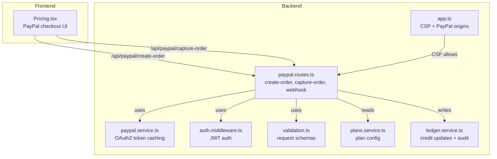
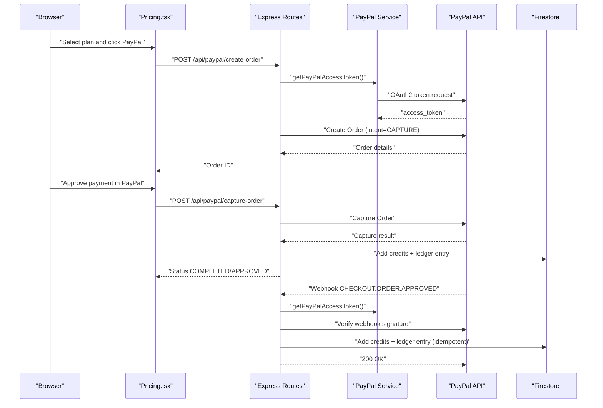
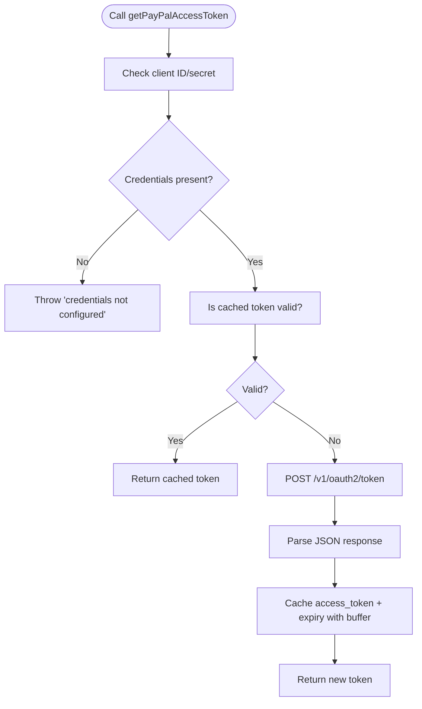
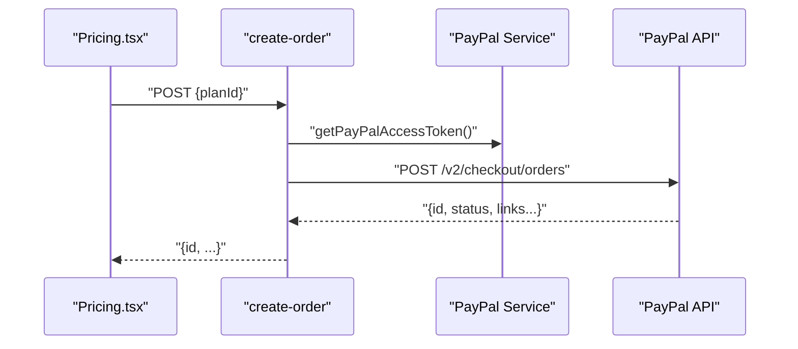
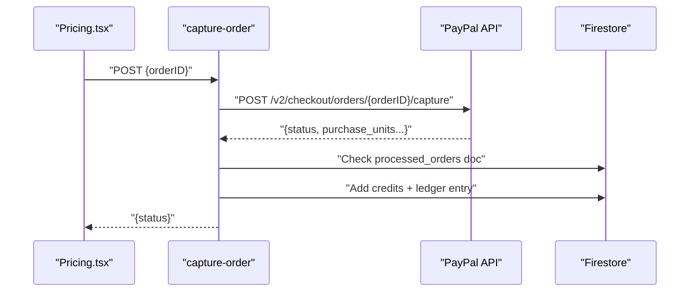
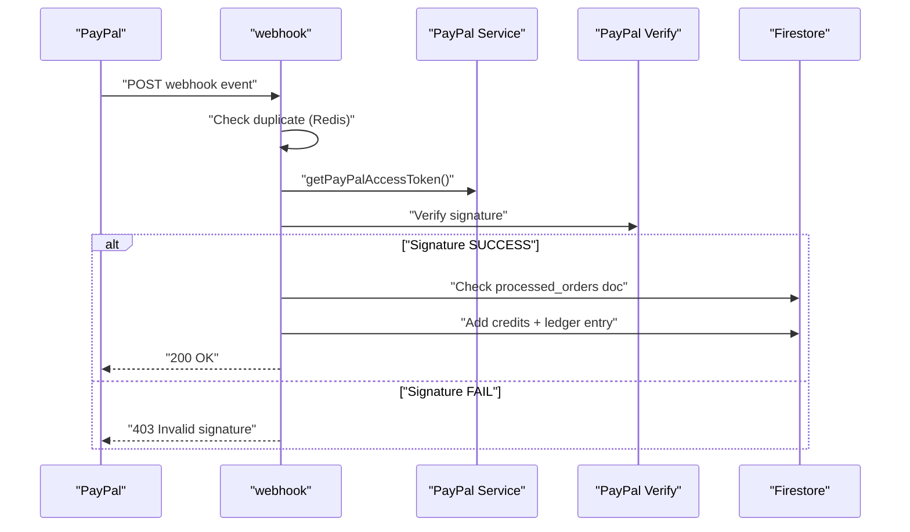
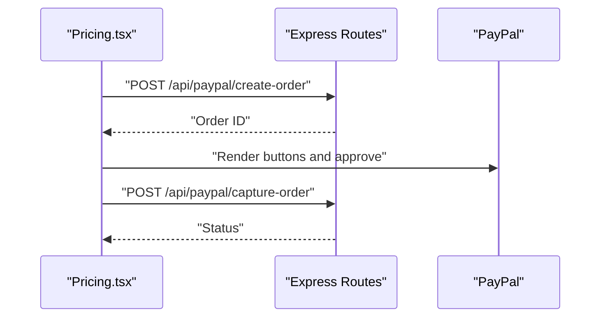
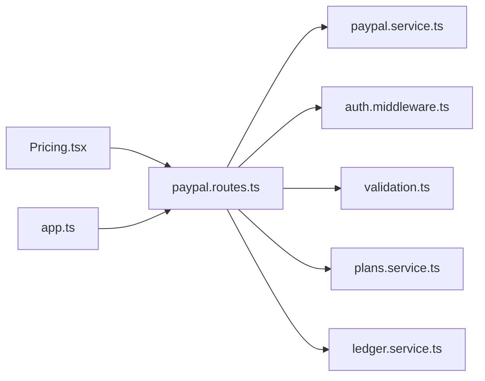

# PayPal Integration

<cite>
**Referenced Files in This Document**
- [paypal.service.ts](file://backend/services/paypal.service.ts)
- [paypal.routes.ts](file://backend/routes/paypal.routes.ts)
- [config.ts](file://backend/utils/config.ts)
- [auth.middleware.ts](file://backend/middleware/auth.middleware.ts)
- [validation.ts](file://backend/utils/validation.ts)
- [plans.service.ts](file://backend/services/plans.service.ts)
- [ledger.service.ts](file://backend/services/ledger.service.ts)
- [app.ts](file://backend/app.ts)
- [Pricing.tsx](file://src/components/Pricing.tsx)
</cite>

## Table of Contents
1. [Introduction](#introduction)
2. [Project Structure](#project-structure)
3. [Core Components](#core-components)
4. [Architecture Overview](#architecture-overview)
5. [Detailed Component Analysis](#detailed-component-analysis)
6. [Dependency Analysis](#dependency-analysis)
7. [Performance Considerations](#performance-considerations)
8. [Security Considerations](#security-considerations)
9. [Error Handling and Troubleshooting](#error-handling-and-troubleshooting)
10. [Conclusion](#conclusion)

## Introduction
This document explains the PayPal payment integration for the platform, focusing on the backend service implementation, token management, API endpoints, and frontend integration. It covers OAuth2 token caching, sandbox/live environment configuration, secure credential handling, token refresh with buffer timing, webhook verification and replay protection, and the end-to-end flows for one-time payments. It also documents the integration patterns for adding credits upon payment completion, along with security and error handling guidance.

## Project Structure
The PayPal integration spans backend services and routes, frontend components, and shared configuration utilities. The key areas are:
- Backend services: PayPal OAuth2 token retrieval and caching, plan configuration, credit ledger, and Firebase integrations
- Backend routes: Payment creation, capture, and webhook handling
- Frontend component: PayPal checkout UI and flow orchestration
- Shared configuration: Environment validation and CSP policies

**Diagram sources**
- [paypal.routes.ts:1-302](file://backend/routes/paypal.routes.ts#L1-L302)
- [paypal.service.ts:1-41](file://backend/services/paypal.service.ts#L1-L41)
- [auth.middleware.ts:1-40](file://backend/middleware/auth.middleware.ts#L1-L40)
- [validation.ts:1-103](file://backend/utils/validation.ts#L1-L103)
- [plans.service.ts:1-34](file://backend/services/plans.service.ts#L1-L34)
- [ledger.service.ts:1-269](file://backend/services/ledger.service.ts#L1-L269)
- [app.ts:90-140](file://backend/app.ts#L90-L140)
- [Pricing.tsx:137-263](file://src/components/Pricing.tsx#L137-L263)

**Section sources**
- [paypal.routes.ts:1-302](file://backend/routes/paypal.routes.ts#L1-L302)
- [paypal.service.ts:1-41](file://backend/services/paypal.service.ts#L1-L41)
- [app.ts:90-140](file://backend/app.ts#L90-L140)
- [Pricing.tsx:137-263](file://src/components/Pricing.tsx#L137-L263)

## Core Components
- PayPal OAuth2 token service: Manages client credentials, fetches access tokens, caches them with a buffer window, and enforces configuration validation
- PayPal routes: Expose create-order, capture-order, and webhook endpoints with authentication, validation, and error handling
- Plan configuration: Centralized pricing and credits mapping used across flows
- Credit ledger: Atomic credit additions and audit trail for purchases
- Frontend integration: React component that orchestrates PayPal checkout and calls backend endpoints

Key responsibilities:
- Secure credential handling via environment variables and schema validation
- Token refresh strategy with buffer timing to avoid expiry during API calls
- Webhook verification and replay protection to prevent spoofing and duplicate processing
- Idempotent credit updates using Firestore transactions and a processed orders collection

**Section sources**
- [paypal.service.ts:1-41](file://backend/services/paypal.service.ts#L1-L41)
- [paypal.routes.ts:18-302](file://backend/routes/paypal.routes.ts#L18-L302)
- [plans.service.ts:1-34](file://backend/services/plans.service.ts#L1-L34)
- [ledger.service.ts:245-269](file://backend/services/ledger.service.ts#L245-L269)
- [Pricing.tsx:137-263](file://src/components/Pricing.tsx#L137-L263)

## Architecture Overview
The system integrates PayPal via:
- Frontend PayPal Buttons SDK loads PayPal scripts and invokes the backend to create and capture orders
- Backend routes validate requests, enforce authentication, call PayPal APIs, and update credits
- Webhooks provide asynchronous confirmation and a secondary safety net for credit updates
- Environment validation ensures credentials and webhook ID are configured appropriately

**Diagram sources**
- [paypal.routes.ts:25-159](file://backend/routes/paypal.routes.ts#L25-L159)
- [paypal.service.ts:12-40](file://backend/services/paypal.service.ts#L12-L40)
- [Pricing.tsx:137-190](file://src/components/Pricing.tsx#L137-L190)
- [ledger.service.ts:245-269](file://backend/services/ledger.service.ts#L245-L269)

## Detailed Component Analysis

### PayPal OAuth2 Token Management
- Credentials are loaded from environment variables and validated at runtime
- Tokens are cached with an internal expiry derived from PayPal’s expires_in plus a buffer window
- On each call, if cached token is still valid, it is reused; otherwise a new token is fetched and cached
- Throws a clear error if credentials are missing

**Diagram sources**
- [paypal.service.ts:12-40](file://backend/services/paypal.service.ts#L12-L40)

**Section sources**
- [paypal.service.ts:1-41](file://backend/services/paypal.service.ts#L1-L41)
- [config.ts:25-28](file://backend/utils/config.ts#L25-L28)

### API Endpoints and Flows

#### Create Order
- Requires authenticated user and planId
- Fetches PayPal access token, constructs a CAPTURE intent order with plan metadata
- Returns the order payload for the client to pass to PayPal

**Diagram sources**
- [paypal.routes.ts:25-76](file://backend/routes/paypal.routes.ts#L25-L76)
- [paypal.service.ts:12-40](file://backend/services/paypal.service.ts#L12-L40)
- [validation.ts:57-59](file://backend/utils/validation.ts#L57-L59)
- [auth.middleware.ts:18-39](file://backend/middleware/auth.middleware.ts#L18-L39)

**Section sources**
- [paypal.routes.ts:18-76](file://backend/routes/paypal.routes.ts#L18-L76)
- [validation.ts:57-59](file://backend/utils/validation.ts#L57-L59)
- [auth.middleware.ts:18-39](file://backend/middleware/auth.middleware.ts#L18-L39)

#### Capture Order
- Requires authenticated user and orderID
- Calls PayPal capture endpoint and, on success, parses planId from order metadata
- Adds credits and writes a ledger entry; prevents duplicate processing via a Firestore document

**Diagram sources**
- [paypal.routes.ts:78-159](file://backend/routes/paypal.routes.ts#L78-L159)
- [ledger.service.ts:245-269](file://backend/services/ledger.service.ts#L245-L269)

**Section sources**
- [paypal.routes.ts:78-159](file://backend/routes/paypal.routes.ts#L78-L159)
- [ledger.service.ts:245-269](file://backend/services/ledger.service.ts#L245-L269)

#### Webhook Verification and Replay Protection
- Receives webhook events publicly
- Verifies signature using PayPal’s verification endpoint with headers and webhook ID
- Blocks duplicates using Redis with a TTL
- On approved events, adds credits and sends a receipt email

**Diagram sources**
- [paypal.routes.ts:161-299](file://backend/routes/paypal.routes.ts#L161-L299)
- [paypal.service.ts:12-40](file://backend/services/paypal.service.ts#L12-L40)

**Section sources**
- [paypal.routes.ts:161-299](file://backend/routes/paypal.routes.ts#L161-L299)

### Frontend Integration Pattern
- Loads PayPal SDK with client ID from environment
- Creates an order via backend, then captures on approval
- Displays success state and triggers analytics

**Diagram sources**
- [Pricing.tsx:137-190](file://src/components/Pricing.tsx#L137-L190)
- [paypal.routes.ts:25-159](file://backend/routes/paypal.routes.ts#L25-L159)

**Section sources**
- [Pricing.tsx:137-263](file://src/components/Pricing.tsx#L137-L263)

## Dependency Analysis
- Routes depend on:
  - PayPal service for OAuth2 tokens
  - Authentication middleware for user context
  - Validation schemas for request bodies
  - Plans service for pricing and credits
  - Ledger service for credit updates and audit trail
- Frontend depends on:
  - Backend routes for order lifecycle
  - PayPal SDK for checkout UI

**Diagram sources**
- [paypal.routes.ts:1-302](file://backend/routes/paypal.routes.ts#L1-L302)
- [paypal.service.ts:1-41](file://backend/services/paypal.service.ts#L1-L41)
- [auth.middleware.ts:1-40](file://backend/middleware/auth.middleware.ts#L1-L40)
- [validation.ts:1-103](file://backend/utils/validation.ts#L1-L103)
- [plans.service.ts:1-34](file://backend/services/plans.service.ts#L1-L34)
- [ledger.service.ts:1-269](file://backend/services/ledger.service.ts#L1-L269)
- [app.ts:172-179](file://backend/app.ts#L172-L179)
- [Pricing.tsx:137-263](file://src/components/Pricing.tsx#L137-L263)

**Section sources**
- [paypal.routes.ts:1-302](file://backend/routes/paypal.routes.ts#L1-L302)
- [paypal.service.ts:1-41](file://backend/services/paypal.service.ts#L1-L41)
- [auth.middleware.ts:1-40](file://backend/middleware/auth.middleware.ts#L1-L40)
- [validation.ts:1-103](file://backend/utils/validation.ts#L1-L103)
- [plans.service.ts:1-34](file://backend/services/plans.service.ts#L1-L34)
- [ledger.service.ts:1-269](file://backend/services/ledger.service.ts#L1-L269)
- [app.ts:172-179](file://backend/app.ts#L172-L179)
- [Pricing.tsx:137-263](file://src/components/Pricing.tsx#L137-L263)

## Performance Considerations
- Token caching reduces OAuth2 round trips and minimizes latency for PayPal API calls
- Buffer timing avoids last-minute token expiry during capture and webhook verification
- Webhook replay protection with Redis prevents redundant processing and reduces load
- Idempotent processing via Firestore documents avoids double-credit scenarios

[No sources needed since this section provides general guidance]

## Security Considerations
- HTTPS and TLS: All PayPal API calls are made over HTTPS to secure transport
- Credential handling: Client ID and secret are loaded from environment variables and validated at startup; the service throws if missing
- Webhook verification: Signature verification is mandatory in production; verification uses PayPal’s verification endpoint with headers and webhook ID
- Replay protection: Duplicate webhook events are blocked using Redis with a TTL
- CSP: Content Security Policy explicitly allows PayPal domains for scripts and frames
- Authentication: Payment routes require a valid Firebase ID token
- Sensitive data: Tokens and order metadata are not logged beyond necessary diagnostic info; receipts are sent via a trusted email provider

**Section sources**
- [paypal.service.ts:12-40](file://backend/services/paypal.service.ts#L12-L40)
- [paypal.routes.ts:161-221](file://backend/routes/paypal.routes.ts#L161-L221)
- [app.ts:90-140](file://backend/app.ts#L90-L140)
- [auth.middleware.ts:18-39](file://backend/middleware/auth.middleware.ts#L18-L39)
- [config.ts:25-28](file://backend/utils/config.ts#L25-L28)

## Error Handling and Troubleshooting
Common scenarios and handling:
- Invalid or missing credentials: The token service throws a clear error; ensure environment variables are set
- Authentication failures: 401 responses when JWT is missing or invalid; verify client token usage
- Validation errors: 400 responses for malformed payloads; confirm schema adherence
- Network failures: PayPal API calls may fail; implement retry with exponential backoff on the client and log errors
- Duplicate webhook events: Automatically blocked by Redis; inspect logs for repeated IDs
- Webhook signature verification failure: Indicates misconfiguration or tampering; verify webhook ID and headers
- Order metadata parsing: If custom_id is missing or malformed, return 400; ensure planId is included in order creation
- Idempotent processing: If an order is already processed, subsequent attempts are ignored; check processed_orders collection

Operational tips:
- Monitor webhook verification logs and signature failures
- Confirm CSP allows PayPal domains in production
- Validate environment variables with the configuration schema
- For sandbox testing, ensure the frontend client ID and backend API base URL align with sandbox

**Section sources**
- [paypal.service.ts:12-40](file://backend/services/paypal.service.ts#L12-L40)
- [paypal.routes.ts:71-74](file://backend/routes/paypal.routes.ts#L71-L74)
- [paypal.routes.ts:111-114](file://backend/routes/paypal.routes.ts#L111-L114)
- [paypal.routes.ts:207-214](file://backend/routes/paypal.routes.ts#L207-L214)
- [paypal.routes.ts:172-178](file://backend/routes/paypal.routes.ts#L172-L178)
- [auth.middleware.ts:18-39](file://backend/middleware/auth.middleware.ts#L18-L39)
- [config.ts:64-82](file://backend/utils/config.ts#L64-L82)

## Conclusion
The PayPal integration implements a robust, secure, and resilient payment pipeline:
- OAuth2 tokens are cached with buffer timing to minimize downtime
- Endpoints enforce authentication and validation, and handle capture and webhook events
- Webhook verification and replay protection harden the system against spoofing and duplication
- Credits are added atomically with an audit trail for transparency and compliance
- Frontend integration leverages PayPal’s SDK with a clean approval and capture flow

This design supports one-time payments effectively and provides a foundation for future enhancements such as subscriptions and refunds, while maintaining strong security and operational hygiene.