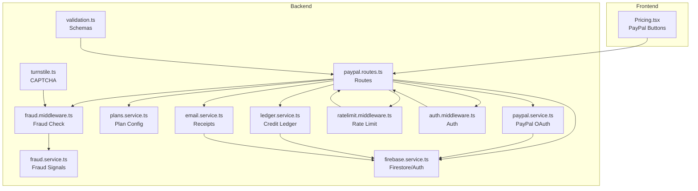
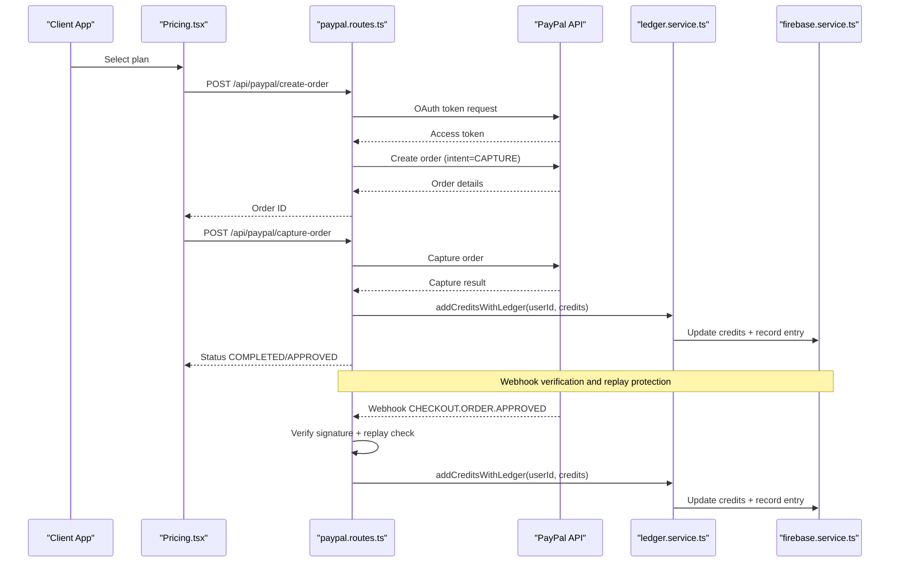
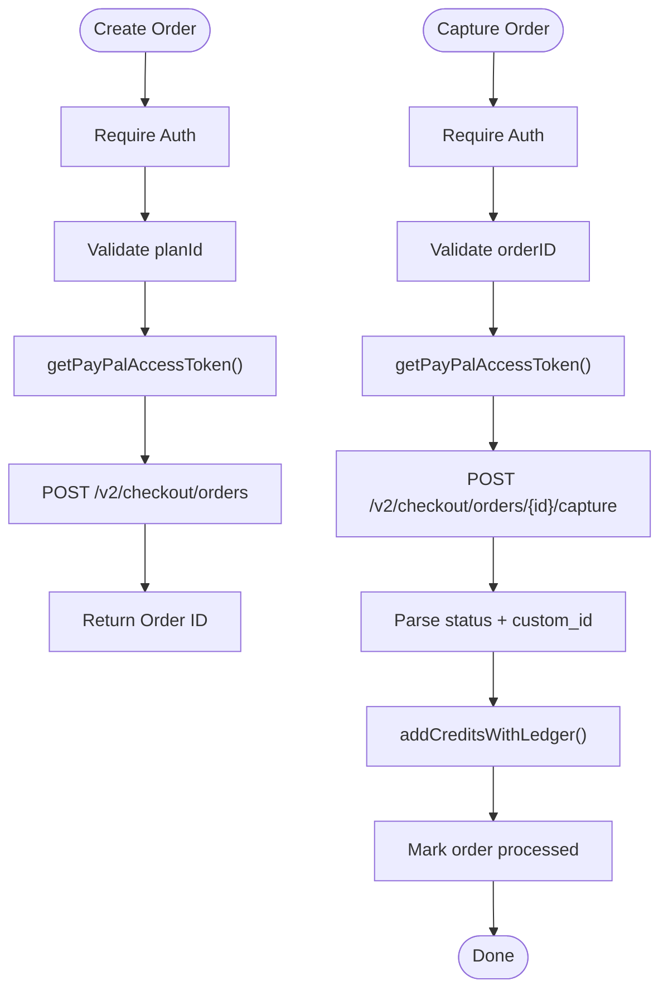
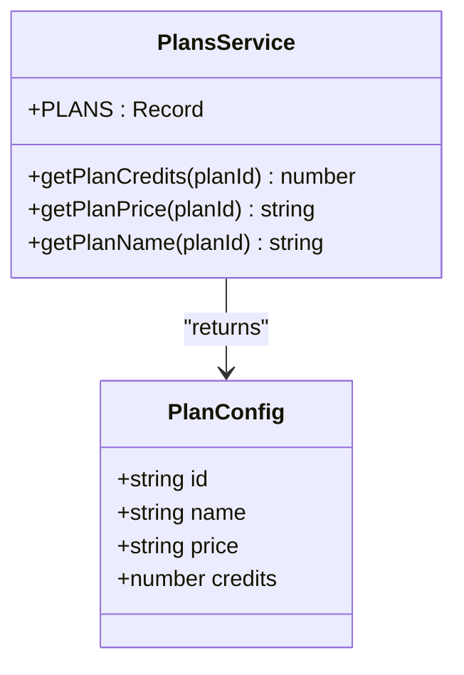
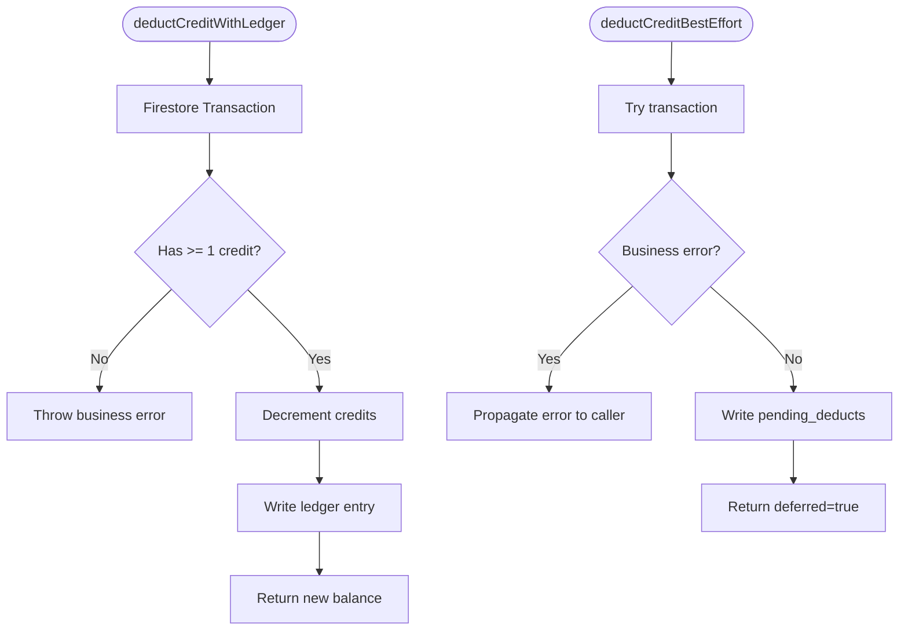
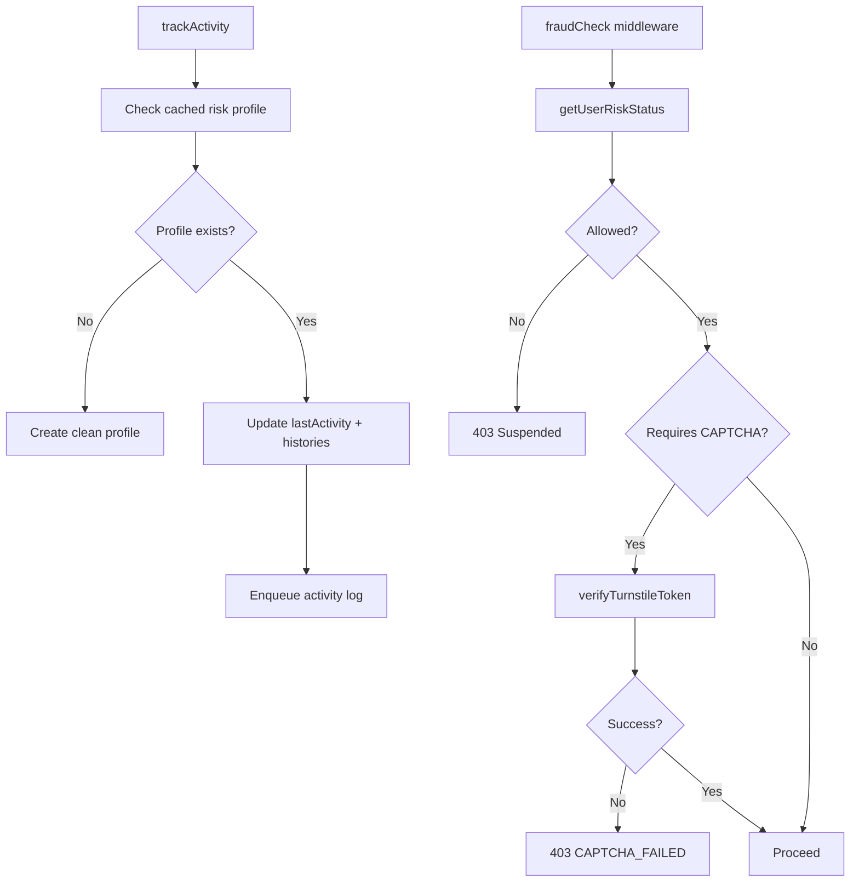
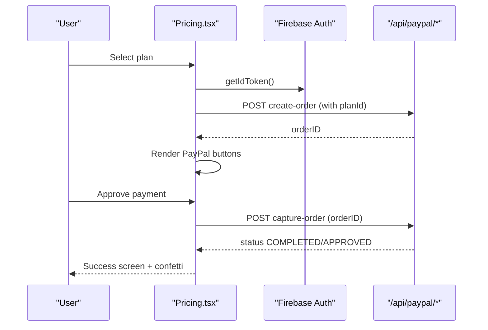
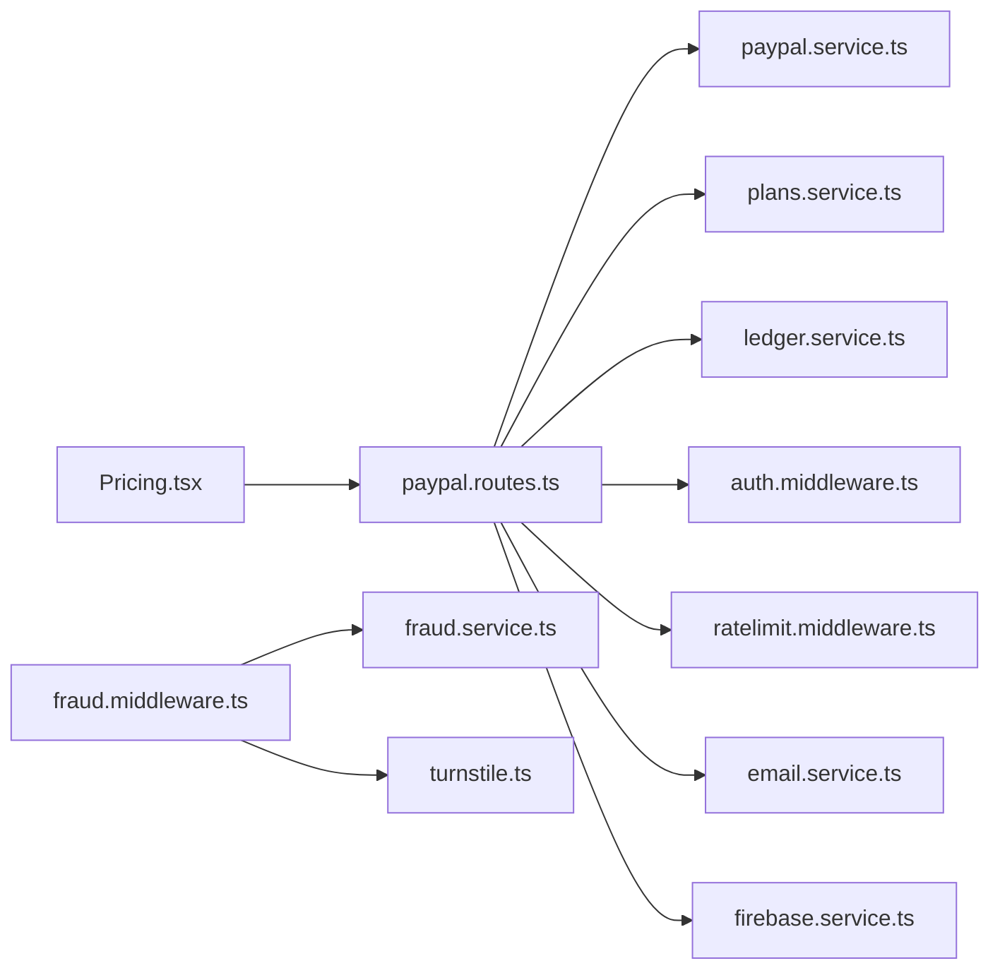
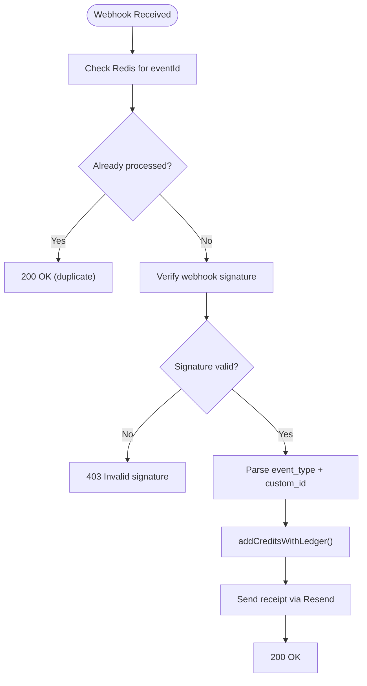

# Payment and Subscription System

<cite>
**Referenced Files in This Document**
- [paypal.service.ts](file://backend/services/paypal.service.ts)
- [paypal.routes.ts](file://backend/routes/paypal.routes.ts)
- [plans.service.ts](file://backend/services/plans.service.ts)
- [ledger.service.ts](file://backend/services/ledger.service.ts)
- [fraud.middleware.ts](file://backend/middleware/fraud.middleware.ts)
- [fraud.service.ts](file://backend/services/fraud.service.ts)
- [ratelimit.middleware.ts](file://backend/middleware/ratelimit.middleware.ts)
- [auth.middleware.ts](file://backend/middleware/auth.middleware.ts)
- [firebase.service.ts](file://backend/services/firebase.service.ts)
- [email.service.ts](file://backend/services/email.service.ts)
- [turnstile.ts](file://backend/utils/turnstile.ts)
- [validation.ts](file://backend/utils/validation.ts)
- [Pricing.tsx](file://src/components/Pricing.tsx)
</cite>

## Table of Contents
1. [Introduction](#introduction)
2. [Project Structure](#project-structure)
3. [Core Components](#core-components)
4. [Architecture Overview](#architecture-overview)
5. [Detailed Component Analysis](#detailed-component-analysis)
6. [Dependency Analysis](#dependency-analysis)
7. [Performance Considerations](#performance-considerations)
8. [Security and Compliance](#security-and-compliance)
9. [Subscription Lifecycle Management](#subscription-lifecycle-management)
10. [Webhook Handling](#webhook-handling)
11. [Error Handling and Retry Mechanisms](#error-handling-and-retry-mechanisms)
12. [Troubleshooting Guide](#troubleshooting-guide)
13. [Conclusion](#conclusion)

## Introduction
This document explains the payment and subscription system, focusing on PayPal integration, credit management, financial ledger, fraud prevention, and webhook handling. It covers the end-to-end payment flow from plan selection to credit allocation, the robust ledger service for auditing and reconciliation, and the layered security controls ensuring PCI-friendly processing and fraud mitigation.

## Project Structure
The payment system spans frontend and backend:
- Frontend: Pricing modal integrates PayPal buttons and orchestrates create/capture flows.
- Backend: Routes handle PayPal order creation and capture, with webhook verification and replay protection. Services manage plans, credits, fraud detection, and ledger entries. Middleware enforces authentication, rate limits, and fraud checks.

**Diagram sources**
- [paypal.routes.ts:1-302](file://backend/routes/paypal.routes.ts#L1-L302)
- [paypal.service.ts:1-41](file://backend/services/paypal.service.ts#L1-L41)
- [plans.service.ts:1-34](file://backend/services/plans.service.ts#L1-L34)
- [ledger.service.ts:1-269](file://backend/services/ledger.service.ts#L1-L269)
- [fraud.middleware.ts:1-133](file://backend/middleware/fraud.middleware.ts#L1-L133)
- [fraud.service.ts:1-634](file://backend/services/fraud.service.ts#L1-L634)
- [ratelimit.middleware.ts:1-134](file://backend/middleware/ratelimit.middleware.ts#L1-L134)
- [auth.middleware.ts:1-40](file://backend/middleware/auth.middleware.ts#L1-L40)
- [firebase.service.ts:1-120](file://backend/services/firebase.service.ts#L1-L120)
- [email.service.ts:1-17](file://backend/services/email.service.ts#L1-L17)
- [turnstile.ts:1-146](file://backend/utils/turnstile.ts#L1-L146)
- [validation.ts:1-103](file://backend/utils/validation.ts#L1-L103)
- [Pricing.tsx:1-718](file://src/components/Pricing.tsx#L1-L718)

**Section sources**
- [paypal.routes.ts:1-302](file://backend/routes/paypal.routes.ts#L1-L302)
- [paypal.service.ts:1-41](file://backend/services/paypal.service.ts#L1-L41)
- [plans.service.ts:1-34](file://backend/services/plans.service.ts#L1-L34)
- [ledger.service.ts:1-269](file://backend/services/ledger.service.ts#L1-L269)
- [fraud.middleware.ts:1-133](file://backend/middleware/fraud.middleware.ts#L1-L133)
- [fraud.service.ts:1-634](file://backend/services/fraud.service.ts#L1-L634)
- [ratelimit.middleware.ts:1-134](file://backend/middleware/ratelimit.middleware.ts#L1-L134)
- [auth.middleware.ts:1-40](file://backend/middleware/auth.middleware.ts#L1-L40)
- [firebase.service.ts:1-120](file://backend/services/firebase.service.ts#L1-L120)
- [email.service.ts:1-17](file://backend/services/email.service.ts#L1-L17)
- [turnstile.ts:1-146](file://backend/utils/turnstile.ts#L1-L146)
- [validation.ts:1-103](file://backend/utils/validation.ts#L1-L103)
- [Pricing.tsx:1-718](file://src/components/Pricing.tsx#L1-L718)

## Core Components
- PayPal Integration: Secure order creation and capture with server-side token caching and plan-driven pricing.
- Plans Service: Centralized pricing and credit allocation configuration.
- Credit Ledger: Immutable audit trail for all credit changes with best-effort reconciliation.
- Fraud Prevention: Device fingerprinting, risk scoring, CAPTCHA gating, and activity logging.
- Security Controls: Authentication, rate limiting, webhook signature verification, and replay protection.

**Section sources**
- [paypal.routes.ts:18-159](file://backend/routes/paypal.routes.ts#L18-L159)
- [paypal.service.ts:12-40](file://backend/services/paypal.service.ts#L12-L40)
- [plans.service.ts:13-33](file://backend/services/plans.service.ts#L13-L33)
- [ledger.service.ts:22-268](file://backend/services/ledger.service.ts#L22-L268)
- [fraud.middleware.ts:30-104](file://backend/middleware/fraud.middleware.ts#L30-L104)
- [turnstile.ts:71-145](file://backend/utils/turnstile.ts#L71-L145)

## Architecture Overview
End-to-end payment flow from plan selection to credit allocation and webhook reconciliation.

**Diagram sources**
- [paypal.routes.ts:25-159](file://backend/routes/paypal.routes.ts#L25-L159)
- [paypal.service.ts:12-40](file://backend/services/paypal.service.ts#L12-L40)
- [ledger.service.ts:245-268](file://backend/services/ledger.service.ts#L245-L268)
- [firebase.service.ts:75-120](file://backend/services/firebase.service.ts#L75-L120)
- [Pricing.tsx:137-190](file://src/components/Pricing.tsx#L137-L190)

## Detailed Component Analysis

### PayPal Integration
- Order Creation: Requires authentication, validates planId, fetches PayPal access token, and creates a CAPTURE intent order with plan metadata.
- Order Capture: Requires authentication and orderID, verifies status, parses planId from metadata, and credits user via ledger.
- Webhook Handling: Public endpoint with signature verification and replay protection; processes APPROVAL and CAPTURE events to credit users and send receipts.

**Diagram sources**
- [paypal.routes.ts:25-159](file://backend/routes/paypal.routes.ts#L25-L159)
- [paypal.service.ts:12-40](file://backend/services/paypal.service.ts#L12-L40)
- [ledger.service.ts:245-268](file://backend/services/ledger.service.ts#L245-L268)

**Section sources**
- [paypal.routes.ts:18-159](file://backend/routes/paypal.routes.ts#L18-L159)
- [paypal.service.ts:1-41](file://backend/services/paypal.service.ts#L1-L41)
- [validation.ts:57-64](file://backend/utils/validation.ts#L57-L64)

### Plans Service
- Centralized plan configuration with id, name, price, and credits.
- Utility functions to resolve price, name, and credits by planId.

**Diagram sources**
- [plans.service.ts:6-33](file://backend/services/plans.service.ts#L6-L33)

**Section sources**
- [plans.service.ts:1-34](file://backend/services/plans.service.ts#L1-L34)

### Credit Ledger Service
- Immutable audit trail for all credit changes with reasons (purchase, analyze, refund, etc.).
- Transactional credit deduction with ledger entry; best-effort handling for transient failures with pending_deducts reconciliation.
- Best-effort credit addition with ledger entry.

**Diagram sources**
- [ledger.service.ts:97-141](file://backend/services/ledger.service.ts#L97-L141)
- [ledger.service.ts:189-240](file://backend/services/ledger.service.ts#L189-L240)

**Section sources**
- [ledger.service.ts:22-268](file://backend/services/ledger.service.ts#L22-L268)

### Fraud Prevention and Security
- Device fingerprinting and risk scoring with cache for performance.
- Middleware enforces CAPTCHA verification and preemptive blocking for expensive operations.
- Turnstile verification with circuit breaker and fail-open policy for trusted users.

**Diagram sources**
- [fraud.service.ts:127-204](file://backend/services/fraud.service.ts#L127-L204)
- [fraud.middleware.ts:30-104](file://backend/middleware/fraud.middleware.ts#L30-L104)
- [turnstile.ts:71-145](file://backend/utils/turnstile.ts#L71-L145)

**Section sources**
- [fraud.service.ts:1-634](file://backend/services/fraud.service.ts#L1-L634)
- [fraud.middleware.ts:1-133](file://backend/middleware/fraud.middleware.ts#L1-L133)
- [turnstile.ts:1-146](file://backend/utils/turnstile.ts#L1-L146)

### Frontend Payment Flow (Client)
- Uses PayPal buttons to create orders and capture payments after approval.
- Displays secure messaging and instant credit delivery feedback.

**Diagram sources**
- [Pricing.tsx:137-190](file://src/components/Pricing.tsx#L137-L190)
- [paypal.routes.ts:25-159](file://backend/routes/paypal.routes.ts#L25-L159)

**Section sources**
- [Pricing.tsx:1-718](file://src/components/Pricing.tsx#L1-L718)

## Dependency Analysis
- Routes depend on PayPal service for tokens, plans service for pricing, ledger service for credit updates, and Firebase service for persistence.
- Fraud middleware depends on fraud service and Turnstile utility.
- Frontend depends on PayPal SDK and Firebase for authentication.

**Diagram sources**
- [paypal.routes.ts:1-16](file://backend/routes/paypal.routes.ts#L1-L16)
- [paypal.service.ts:1-10](file://backend/services/paypal.service.ts#L1-L10)
- [plans.service.ts:1-4](file://backend/services/plans.service.ts#L1-L4)
- [ledger.service.ts:1-2](file://backend/services/ledger.service.ts#L1-L2)
- [fraud.middleware.ts:1-7](file://backend/middleware/fraud.middleware.ts#L1-L7)
- [fraud.service.ts:1-3](file://backend/services/fraud.service.ts#L1-L3)
- [ratelimit.middleware.ts:1-3](file://backend/middleware/ratelimit.middleware.ts#L1-L3)
- [auth.middleware.ts:1-2](file://backend/middleware/auth.middleware.ts#L1-L2)
- [firebase.service.ts:1-3](file://backend/services/firebase.service.ts#L1-L3)
- [email.service.ts:1-3](file://backend/services/email.service.ts#L1-L3)
- [turnstile.ts:1-3](file://backend/utils/turnstile.ts#L1-L3)
- [Pricing.tsx:1-24](file://src/components/Pricing.tsx#L1-L24)

**Section sources**
- [paypal.routes.ts:1-302](file://backend/routes/paypal.routes.ts#L1-L302)
- [paypal.service.ts:1-41](file://backend/services/paypal.service.ts#L1-L41)
- [plans.service.ts:1-34](file://backend/services/plans.service.ts#L1-L34)
- [ledger.service.ts:1-269](file://backend/services/ledger.service.ts#L1-L269)
- [fraud.middleware.ts:1-133](file://backend/middleware/fraud.middleware.ts#L1-L133)
- [fraud.service.ts:1-634](file://backend/services/fraud.service.ts#L1-L634)
- [ratelimit.middleware.ts:1-134](file://backend/middleware/ratelimit.middleware.ts#L1-L134)
- [auth.middleware.ts:1-40](file://backend/middleware/auth.middleware.ts#L1-L40)
- [firebase.service.ts:1-120](file://backend/services/firebase.service.ts#L1-L120)
- [email.service.ts:1-17](file://backend/services/email.service.ts#L1-L17)
- [turnstile.ts:1-146](file://backend/utils/turnstile.ts#L1-L146)
- [Pricing.tsx:1-718](file://src/components/Pricing.tsx#L1-L718)

## Performance Considerations
- Token caching: PayPal access tokens are cached with a buffer to minimize refresh overhead.
- In-memory risk profile cache: Reduces Firestore reads for fraud checks.
- Batched activity logging: Writes aggregated activity logs periodically to reduce Firestore load.
- Redis-backed rate limiting: Sliding window with timeouts and graceful fallback when offline.
- Firestore HTTP/1.1 preference: Optimizes cold start latency in serverless environments.

[No sources needed since this section provides general guidance]

## Security and Compliance
- PCI-friendly model: Never receive sensitive card data; all payment orchestration happens via PayPal APIs.
- Token caching: Tokens refreshed securely and cached locally to avoid repeated network calls.
- Webhook verification: Signature verification endpoint ensures authenticity; replay protection via Redis.
- Authentication: Firebase ID tokens validated on protected endpoints.
- Rate limiting: Prevents abuse and protects downstream systems.
- Fraud controls: Device fingerprinting, risk scoring, CAPTCHA gating, and soft/hard bans.
- Email receipts: Optional via Resend with environment-based configuration.

**Section sources**
- [paypal.routes.ts:161-299](file://backend/routes/paypal.routes.ts#L161-L299)
- [paypal.service.ts:12-40](file://backend/services/paypal.service.ts#L12-L40)
- [auth.middleware.ts:18-39](file://backend/middleware/auth.middleware.ts#L18-L39)
- [ratelimit.middleware.ts:25-92](file://backend/middleware/ratelimit.middleware.ts#L25-L92)
- [fraud.middleware.ts:30-104](file://backend/middleware/fraud.middleware.ts#L30-L104)
- [turnstile.ts:71-145](file://backend/utils/turnstile.ts#L71-L145)
- [email.service.ts:5-16](file://backend/services/email.service.ts#L5-L16)

## Subscription Lifecycle Management
- Current implementation supports one-off purchases that allocate credits immediately. There is no recurring billing or subscription management in the reviewed code.
- Upgrade/downgrade and cancellation procedures are not implemented in the backend routes or services examined.

**Section sources**
- [paypal.routes.ts:18-159](file://backend/routes/paypal.routes.ts#L18-L159)
- [plans.service.ts:13-18](file://backend/services/plans.service.ts#L13-L18)

## Webhook Handling
- Public endpoint receives PayPal events with signature verification and replay protection.
- Processes APPROVAL and CAPTURE events to credit users and send receipt emails.
- Duplicate event IDs are blocked using Redis with TTL.

**Diagram sources**
- [paypal.routes.ts:161-299](file://backend/routes/paypal.routes.ts#L161-L299)
- [email.service.ts:5-16](file://backend/services/email.service.ts#L5-L16)

**Section sources**
- [paypal.routes.ts:161-299](file://backend/routes/paypal.routes.ts#L161-L299)

## Error Handling and Retry Mechanisms
- PayPal routes: Structured error responses with detailed messages; server logs for debugging.
- Ledger best-effort deduction: Business errors (insufficient credits, user not found) propagate to the client; transient errors queue pending_deducts for later reconciliation.
- Turnstile circuit breaker: Prevents service lockout during outages; trusted users may be allowed through on transient failures.
- Rate limit middleware: Graceful fallback when Redis is unavailable; timeouts are bounded.

**Section sources**
- [paypal.routes.ts:71-75](file://backend/routes/paypal.routes.ts#L71-L75)
- [paypal.routes.ts:155-158](file://backend/routes/paypal.routes.ts#L155-L158)
- [ledger.service.ts:189-240](file://backend/services/ledger.service.ts#L189-L240)
- [turnstile.ts:119-145](file://backend/utils/turnstile.ts#L119-L145)
- [ratelimit.middleware.ts:62-91](file://backend/middleware/ratelimit.middleware.ts#L62-L91)

## Troubleshooting Guide
- PayPal credentials missing: getPayPalAccessToken throws if client ID or secret are not configured.
- Webhook signature verification failing: Check webhook ID and environment configuration; verify headers are forwarded.
- Duplicate webhook events: Investigate Redis connectivity and TTL settings.
- Insufficient credits or user not found: Deduction transactional function returns explicit status codes.
- Fraud blocked: Review risk score and flags; adjust thresholds if needed.
- Turnstile service unavailable: Circuit breaker will lock down; monitor consecutive failures and recovery.

**Section sources**
- [paypal.service.ts:13-14](file://backend/services/paypal.service.ts#L13-L14)
- [paypal.routes.ts:182-221](file://backend/routes/paypal.routes.ts#L182-L221)
- [ledger.service.ts:110-120](file://backend/services/ledger.service.ts#L110-L120)
- [turnstile.ts:119-145](file://backend/utils/turnstile.ts#L119-L145)

## Conclusion
The system implements a PCI-friendly, PayPal-powered payment flow with immediate credit allocation, robust fraud controls, and immutable ledger auditing. While the current backend focuses on one-off purchases, the modular design enables future extension for recurring billing, subscription upgrades/downgrades, and advanced refund handling.