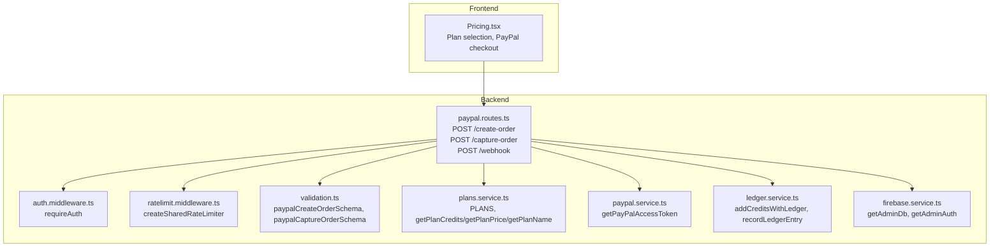
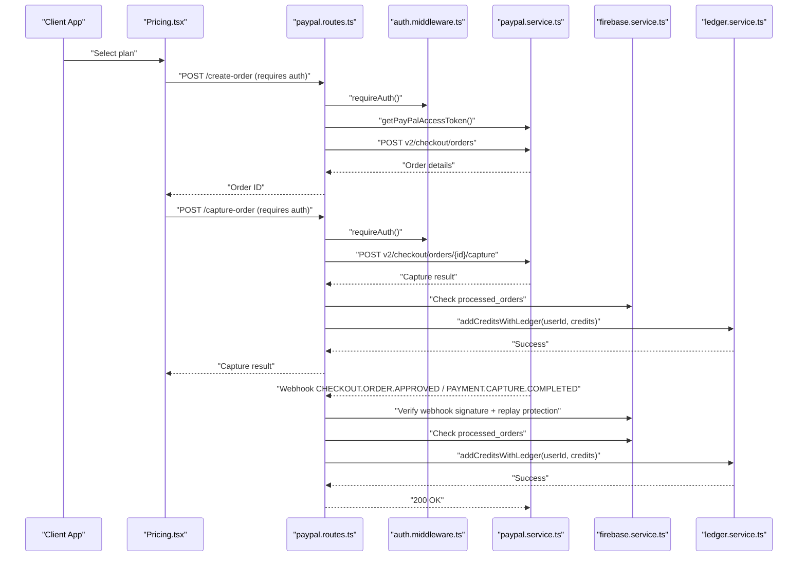
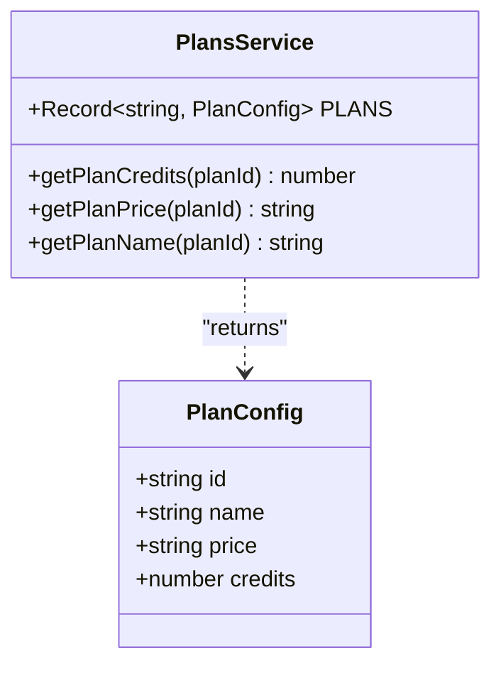
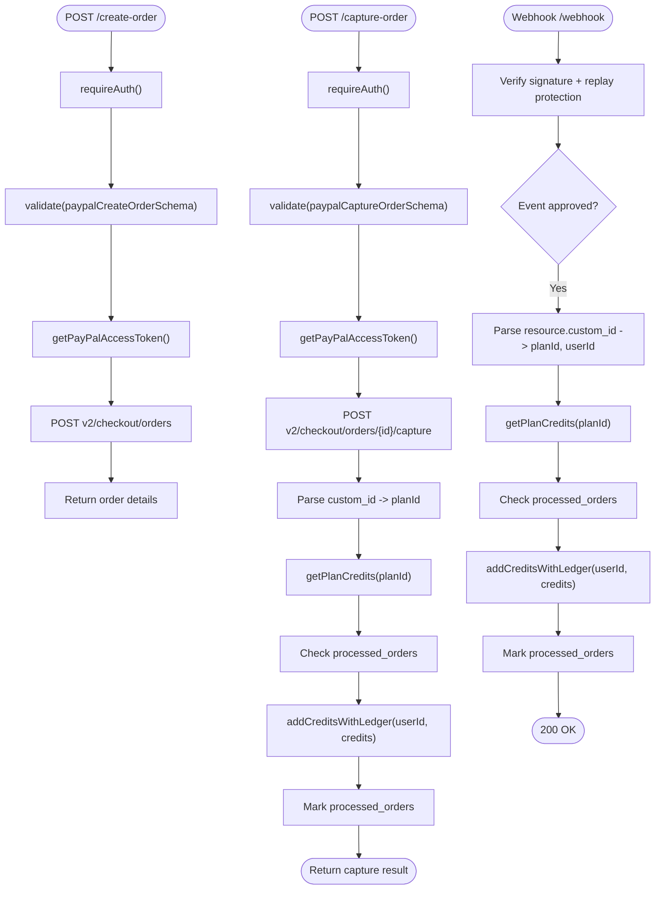
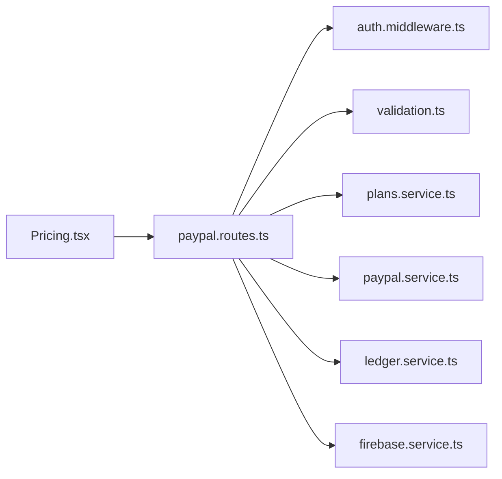

# Subscription Management

<cite>
**Referenced Files in This Document**
- [plans.service.ts](file://backend/services/plans.service.ts)
- [paypal.routes.ts](file://backend/routes/paypal.routes.ts)
- [paypal.service.ts](file://backend/services/paypal.service.ts)
- [ledger.service.ts](file://backend/services/ledger.service.ts)
- [auth.middleware.ts](file://backend/middleware/auth.middleware.ts)
- [firebase.service.ts](file://backend/services/firebase.service.ts)
- [ratelimit.middleware.ts](file://backend/middleware/ratelimit.middleware.ts)
- [validation.ts](file://backend/utils/validation.ts)
- [Pricing.tsx](file://src/components/Pricing.tsx)
</cite>

## Table of Contents
1. [Introduction](#introduction)
2. [Project Structure](#project-structure)
3. [Core Components](#core-components)
4. [Architecture Overview](#architecture-overview)
5. [Detailed Component Analysis](#detailed-component-analysis)
6. [Dependency Analysis](#dependency-analysis)
7. [Performance Considerations](#performance-considerations)
8. [Troubleshooting Guide](#troubleshooting-guide)
9. [Conclusion](#conclusion)

## Introduction
This document describes the subscription management system centered around credits and PayPal checkout. The system provides:
- Pricing tiers and plan configuration
- Secure PayPal checkout with order creation and capture
- Webhook-driven status synchronization
- Credit ledger and audit trail
- Authentication and rate limiting safeguards
- Frontend integration for plan selection and checkout

It does not implement recurring billing or subscription lifecycle management beyond immediate credit delivery upon payment confirmation.

## Project Structure
The subscription flow spans frontend and backend:
- Frontend: Pricing component renders plans and orchestrates PayPal checkout
- Backend: Routes handle order creation/capture and webhooks; services manage plans, PayPal access tokens, ledger, and Firebase access

**Diagram sources**
- [Pricing.tsx:137-190](file://src/components/Pricing.tsx#L137-L190)
- [paypal.routes.ts:18-159](file://backend/routes/paypal.routes.ts#L18-L159)
- [auth.middleware.ts:18-39](file://backend/middleware/auth.middleware.ts#L18-L39)
- [ratelimit.middleware.ts:25-92](file://backend/middleware/ratelimit.middleware.ts#L25-L92)
- [validation.ts:57-64](file://backend/utils/validation.ts#L57-L64)
- [plans.service.ts:6-33](file://backend/services/plans.service.ts#L6-L33)
- [paypal.service.ts:12-40](file://backend/services/paypal.service.ts#L12-L40)
- [ledger.service.ts:245-268](file://backend/services/ledger.service.ts#L245-L268)
- [firebase.service.ts:75-119](file://backend/services/firebase.service.ts#L75-L119)

**Section sources**
- [Pricing.tsx:137-190](file://src/components/Pricing.tsx#L137-L190)
- [paypal.routes.ts:18-159](file://backend/routes/paypal.routes.ts#L18-L159)
- [auth.middleware.ts:18-39](file://backend/middleware/auth.middleware.ts#L18-L39)
- [ratelimit.middleware.ts:25-92](file://backend/middleware/ratelimit.middleware.ts#L25-L92)
- [validation.ts:57-64](file://backend/utils/validation.ts#L57-L64)
- [plans.service.ts:6-33](file://backend/services/plans.service.ts#L6-L33)
- [paypal.service.ts:12-40](file://backend/services/paypal.service.ts#L12-L40)
- [ledger.service.ts:245-268](file://backend/services/ledger.service.ts#L245-L268)
- [firebase.service.ts:75-119](file://backend/services/firebase.service.ts#L75-L119)

## Core Components
- Plans service: Centralized plan configuration and getters for credits, price, and name.
- PayPal routes: Order creation, order capture, and webhook handling with signature verification and replay protection.
- PayPal service: OAuth2 token caching for PayPal API calls.
- Ledger service: Atomic credit additions and immutable ledger entries; best-effort handling for transient failures.
- Authentication middleware: Enforces Firebase ID token verification.
- Rate limit middleware: Sliding-window rate limiting and daily usage caps.
- Validation utilities: Zod schemas for request bodies.
- Frontend Pricing component: Renders plans, initiates PayPal checkout, and handles approval.

**Section sources**
- [plans.service.ts:6-33](file://backend/services/plans.service.ts#L6-L33)
- [paypal.routes.ts:18-159](file://backend/routes/paypal.routes.ts#L18-L159)
- [paypal.service.ts:12-40](file://backend/services/paypal.service.ts#L12-L40)
- [ledger.service.ts:245-268](file://backend/services/ledger.service.ts#L245-L268)
- [auth.middleware.ts:18-39](file://backend/middleware/auth.middleware.ts#L18-L39)
- [ratelimit.middleware.ts:25-92](file://backend/middleware/ratelimit.middleware.ts#L25-L92)
- [validation.ts:57-64](file://backend/utils/validation.ts#L57-L64)
- [Pricing.tsx:137-190](file://src/components/Pricing.tsx#L137-L190)

## Architecture Overview
The system integrates PayPal with a credit-based entitlement model:
- Frontend triggers order creation and capture
- Backend verifies authenticity and adds credits atomically
- Webhooks provide asynchronous confirmation and idempotent credit updates
- Ledger ensures auditability and resilience during transient failures

**Diagram sources**
- [Pricing.tsx:137-190](file://src/components/Pricing.tsx#L137-L190)
- [paypal.routes.ts:18-159](file://backend/routes/paypal.routes.ts#L18-L159)
- [auth.middleware.ts:18-39](file://backend/middleware/auth.middleware.ts#L18-L39)
- [paypal.service.ts:12-40](file://backend/services/paypal.service.ts#L12-L40)
- [firebase.service.ts:75-119](file://backend/services/firebase.service.ts#L75-L119)
- [ledger.service.ts:245-268](file://backend/services/ledger.service.ts#L245-L268)

## Detailed Component Analysis

### Plans Service
- Defines the canonical plan catalog and exposes getters for credits, price, and name.
- Ensures consistent pricing and entitlement mapping across order creation, capture, and webhooks.

**Diagram sources**
- [plans.service.ts:6-33](file://backend/services/plans.service.ts#L6-L33)

**Section sources**
- [plans.service.ts:6-33](file://backend/services/plans.service.ts#L6-L33)

### PayPal Routes: Order Creation and Capture
- Order creation:
  - Requires authentication and validates planId
  - Fetches PayPal access token and creates a PayPal order with custom_id containing userId and planId
  - Returns order details to the client
- Capture order:
  - Requires authentication and validates orderID
  - Calls PayPal capture endpoint
  - Parses custom_id to derive planId and credits
  - Adds credits via ledger and marks order as processed
- Webhook:
  - Verifies signature and replay protection
  - Handles approved/capture-completed events
  - Idempotently adds credits and marks order processed
  - Sends receipt email on successful credit addition

**Diagram sources**
- [paypal.routes.ts:18-159](file://backend/routes/paypal.routes.ts#L18-L159)
- [paypal.routes.ts:161-299](file://backend/routes/paypal.routes.ts#L161-L299)
- [paypal.service.ts:12-40](file://backend/services/paypal.service.ts#L12-L40)
- [ledger.service.ts:245-268](file://backend/services/ledger.service.ts#L245-L268)
- [firebase.service.ts:75-119](file://backend/services/firebase.service.ts#L75-L119)

**Section sources**
- [paypal.routes.ts:18-159](file://backend/routes/paypal.routes.ts#L18-L159)
- [paypal.routes.ts:161-299](file://backend/routes/paypal.routes.ts#L161-L299)
- [paypal.service.ts:12-40](file://backend/services/paypal.service.ts#L12-L40)
- [ledger.service.ts:245-268](file://backend/services/ledger.service.ts#L245-L268)
- [firebase.service.ts:75-119](file://backend/services/firebase.service.ts#L75-L119)

### PayPal Access Token Caching
- Implements client-credential OAuth2 token caching with buffer-based refresh
- Throws if credentials are missing

**Section sources**
- [paypal.service.ts:12-40](file://backend/services/paypal.service.ts#L12-L40)

### Ledger Service: Credits and Audit Trail
- Provides atomic credit addition with ledger entry
- Offers best-effort deduction with pending queue for transient failures
- Includes dev-mode bypass for quota exhaustion to keep testing viable
- Records immutable ledger entries for refunds and purchases

**Section sources**
- [ledger.service.ts:245-268](file://backend/services/ledger.service.ts#L245-L268)
- [ledger.service.ts:189-240](file://backend/services/ledger.service.ts#L189-L240)

### Authentication Middleware
- Enforces Bearer token authentication via Firebase Admin SDK
- Attaches decoded user info to the request

**Section sources**
- [auth.middleware.ts:18-39](file://backend/middleware/auth.middleware.ts#L18-L39)
- [firebase.service.ts:113-119](file://backend/services/firebase.service.ts#L113-L119)

### Rate Limiting and Daily Caps
- Sliding window rate limiter combining userId and IP
- Daily usage cap per user stored in Redis with TTL

**Section sources**
- [ratelimit.middleware.ts:25-92](file://backend/middleware/ratelimit.middleware.ts#L25-L92)
- [ratelimit.middleware.ts:98-133](file://backend/middleware/ratelimit.middleware.ts#L98-L133)

### Frontend Pricing Component
- Renders selectable plans with pricing and credits
- Initiates PayPal checkout and captures order on approval
- Displays success state and error messaging

**Section sources**
- [Pricing.tsx:137-190](file://src/components/Pricing.tsx#L137-L190)
- [Pricing.tsx:501-532](file://src/components/Pricing.tsx#L501-L532)

## Dependency Analysis
- Routes depend on:
  - Authentication middleware for secure endpoints
  - Validation schemas for request body integrity
  - Plans service for pricing and entitlement mapping
  - PayPal service for access tokens
  - Ledger service for credit updates
  - Firebase service for Firestore/Auth access
- Frontend depends on:
  - PayPal SDK for checkout
  - Firebase for user session

**Diagram sources**
- [Pricing.tsx:137-190](file://src/components/Pricing.tsx#L137-L190)
- [paypal.routes.ts:18-159](file://backend/routes/paypal.routes.ts#L18-L159)
- [auth.middleware.ts:18-39](file://backend/middleware/auth.middleware.ts#L18-L39)
- [validation.ts:57-64](file://backend/utils/validation.ts#L57-L64)
- [plans.service.ts:6-33](file://backend/services/plans.service.ts#L6-L33)
- [paypal.service.ts:12-40](file://backend/services/paypal.service.ts#L12-L40)
- [ledger.service.ts:245-268](file://backend/services/ledger.service.ts#L245-L268)
- [firebase.service.ts:75-119](file://backend/services/firebase.service.ts#L75-L119)

**Section sources**
- [paypal.routes.ts:18-159](file://backend/routes/paypal.routes.ts#L18-L159)
- [auth.middleware.ts:18-39](file://backend/middleware/auth.middleware.ts#L18-L39)
- [validation.ts:57-64](file://backend/utils/validation.ts#L57-L64)
- [plans.service.ts:6-33](file://backend/services/plans.service.ts#L6-L33)
- [paypal.service.ts:12-40](file://backend/services/paypal.service.ts#L12-L40)
- [ledger.service.ts:245-268](file://backend/services/ledger.service.ts#L245-L268)
- [firebase.service.ts:75-119](file://backend/services/firebase.service.ts#L75-L119)
- [Pricing.tsx:137-190](file://src/components/Pricing.tsx#L137-L190)

## Performance Considerations
- PayPal token caching reduces latency and API calls
- Firestore preferRest setting improves cold-start performance in serverless environments
- Redis-backed rate limiting and daily caps protect resources
- Ledger writes are non-blocking to main flows; pending queues handle transient failures

[No sources needed since this section provides general guidance]

## Troubleshooting Guide
Common issues and resolutions:
- Missing PayPal credentials: getPayPalAccessToken throws; configure environment variables
- Invalid planId: Routes reject unknown plan IDs
- Signature verification failure: Webhook verification requires PAYPAL_WEBHOOK_ID; in production, missing webhook ID blocks events
- Replay attacks: Webhook replay protection uses Redis keys with TTL
- Insufficient credits: Deduction returns 403; capture returns 403 for insufficient funds
- Transient failures: Best-effort deduction queues pending_deducts for reconciliation
- Quota exhaustion: Dev-mode bypass allows continued testing for specific dev emails

**Section sources**
- [paypal.service.ts:12-40](file://backend/services/paypal.service.ts#L12-L40)
- [paypal.routes.ts:161-299](file://backend/routes/paypal.routes.ts#L161-L299)
- [ledger.service.ts:189-240](file://backend/services/ledger.service.ts#L189-L240)
- [ratelimit.middleware.ts:25-92](file://backend/middleware/ratelimit.middleware.ts#L25-L92)

## Conclusion
The subscription management system centers on a robust PayPal integration and a credit-based entitlement model. It ensures:
- Consistent pricing and entitlements via centralized plan configuration
- Secure, authenticated checkout with order capture
- Idempotent credit delivery via webhooks and ledger entries
- Operational safeguards through rate limiting, replay protection, and best-effort resilience

This design supports immediate credit delivery and auditability, while the current implementation does not include recurring billing or subscription lifecycle management beyond purchase confirmation.