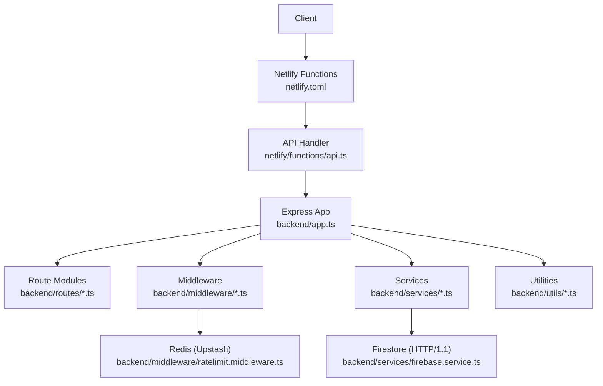
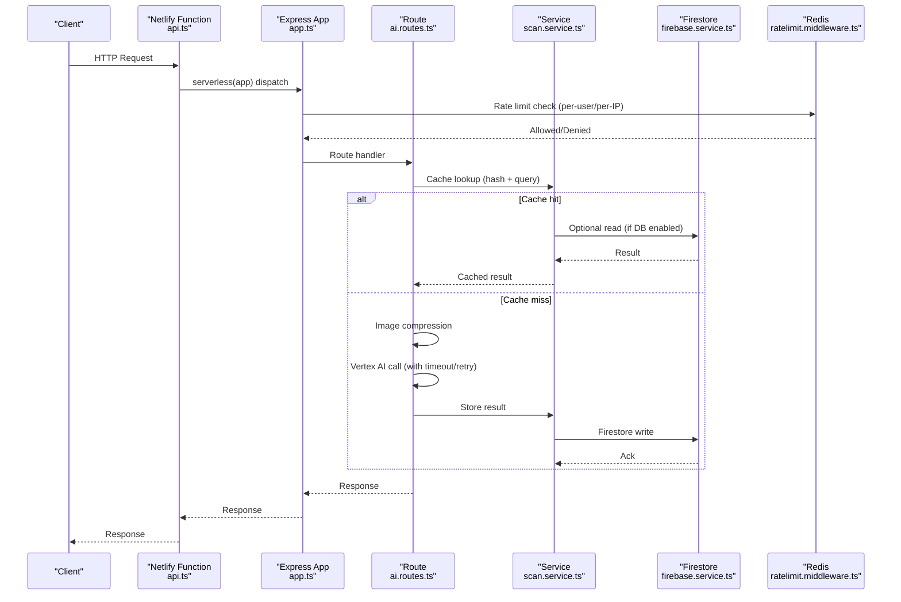
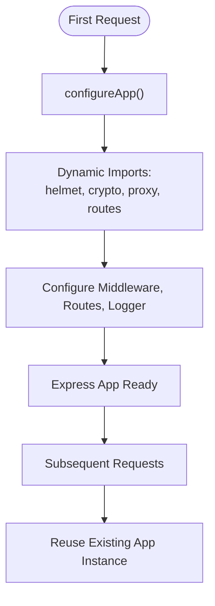
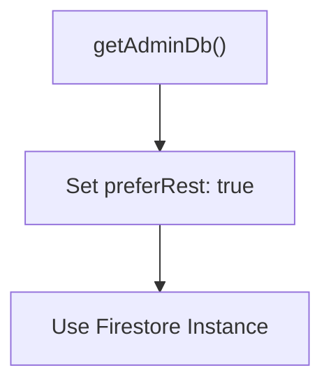
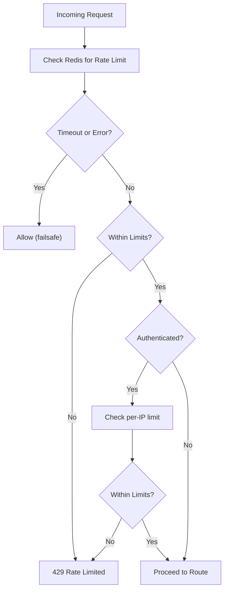
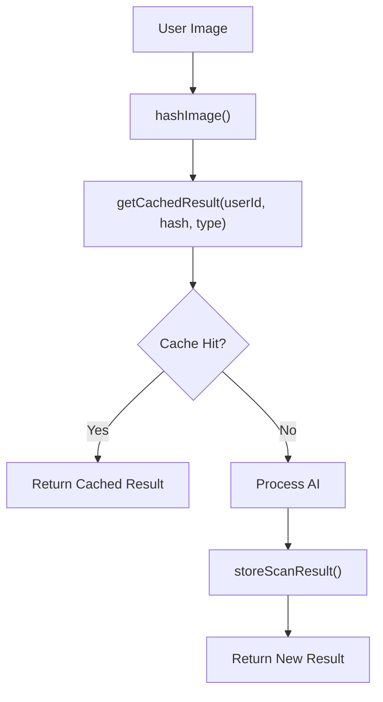
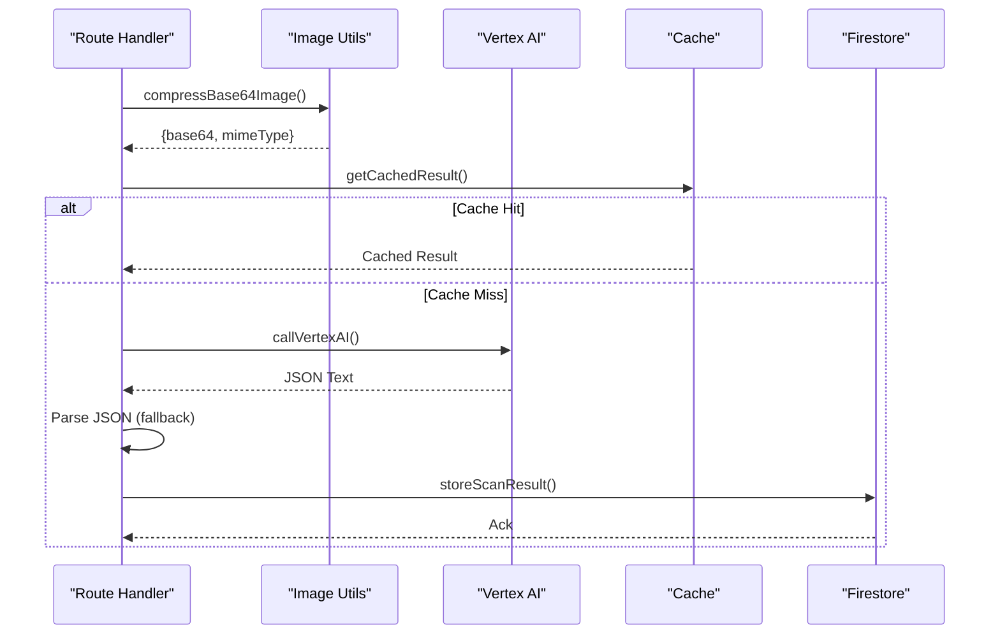
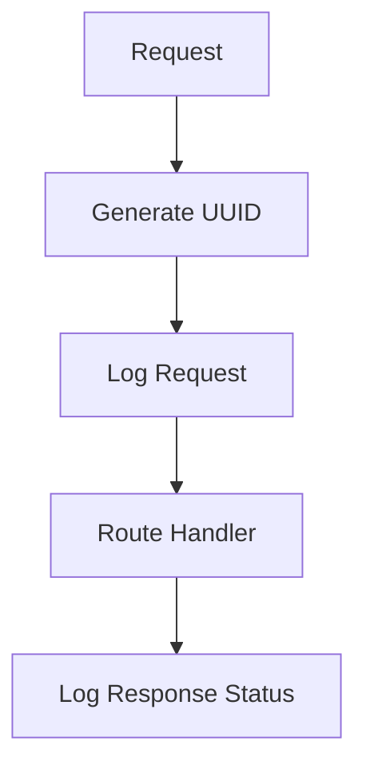
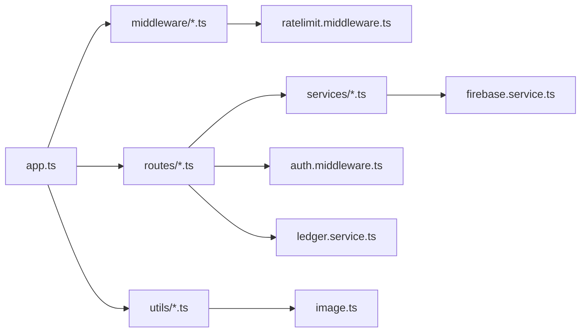

# Backend Performance

<cite>
**Referenced Files in This Document**
- [backend/index.ts](file://backend/index.ts)
- [backend/app.ts](file://backend/app.ts)
- [netlify/functions/api.ts](file://netlify/functions/api.ts)
- [backend/middleware/ratelimit.middleware.ts](file://backend/middleware/ratelimit.middleware.ts)
- [backend/services/firebase.service.ts](file://backend/services/firebase.service.ts)
- [backend/utils/logger.ts](file://backend/utils/logger.ts)
- [backend/routes/ai.routes.ts](file://backend/routes/ai.routes.ts)
- [backend/services/scan.service.ts](file://backend/services/scan.service.ts)
- [backend/utils/config.ts](file://backend/utils/config.ts)
- [backend/middleware/auth.middleware.ts](file://backend/middleware/auth.middleware.ts)
- [backend/services/ledger.service.ts](file://backend/services/ledger.service.ts)
- [backend/utils/image.ts](file://backend/utils/image.ts)
- [package.json](file://package.json)
- [netlify.toml](file://netlify.toml)
</cite>

## Table of Contents
1. [Introduction](#introduction)
2. [Project Structure](#project-structure)
3. [Core Components](#core-components)
4. [Architecture Overview](#architecture-overview)
5. [Detailed Component Analysis](#detailed-component-analysis)
6. [Dependency Analysis](#dependency-analysis)
7. [Performance Considerations](#performance-considerations)
8. [Troubleshooting Guide](#troubleshooting-guide)
9. [Conclusion](#conclusion)
10. [Appendices](#appendices)

## Introduction
This document provides a comprehensive guide to backend performance optimization for FaceAnalytics Pro. It focuses on mitigating serverless cold starts, optimizing database connectivity for Firestore, implementing robust rate limiting and request throttling, leveraging caching strategies for frequently accessed data, optimizing AI processing and external API calls, managing memory and garbage collection in serverless environments, and establishing performance monitoring and logging practices.

## Project Structure
The backend is organized around an Express application with serverless deployment via Netlify Functions. Key performance-sensitive areas include:
- Serverless initialization and dynamic imports to reduce cold start duration
- Firestore configuration optimized for HTTP/1.1 in serverless contexts
- Redis-backed rate limiting and daily caps
- Image compression and caching for AI endpoints
- Credit-safe AI workflows with best-effort credit deduction
- Environment validation and configuration management
- Logging tailored for serverless constraints

**Diagram sources**
- [netlify/functions/api.ts:1-28](file://netlify/functions/api.ts#L1-L28)
- [backend/app.ts:1-205](file://backend/app.ts#L1-L205)
- [backend/routes/ai.routes.ts:1-1146](file://backend/routes/ai.routes.ts#L1-L1146)
- [backend/middleware/ratelimit.middleware.ts:1-134](file://backend/middleware/ratelimit.middleware.ts#L1-L134)
- [backend/services/firebase.service.ts:1-120](file://backend/services/firebase.service.ts#L1-L120)
- [backend/utils/logger.ts:1-71](file://backend/utils/logger.ts#L1-L71)

**Section sources**
- [backend/index.ts:1-29](file://backend/index.ts#L1-L29)
- [backend/app.ts:1-205](file://backend/app.ts#L1-L205)
- [netlify/functions/api.ts:1-28](file://netlify/functions/api.ts#L1-L28)
- [netlify.toml:1-42](file://netlify.toml#L1-L42)

## Core Components
- Serverless bootstrap and cold start mitigation:
  - Dynamic imports for heavy modules (security, proxies, route handlers) deferred until first request
  - Singleton-like initialization with memoization to avoid repeated work
- Firestore configuration:
  - Enforces HTTP/1.1 (REST) to avoid long gRPC handshakes in cold starts
- Rate limiting:
  - Sliding window with Redis; per-user and per-IP enforcement; daily usage caps
- Caching:
  - Image hashing and Firestore-backed scan result cache
- AI processing:
  - Image compression prior to AI calls; structured JSON parsing with robust fallbacks; timeouts and retries
- Credit management:
  - Transactional deductions with best-effort fallbacks and reconciliation queues
- Logging:
  - Console-based logger in serverless; pino upgrade in development for richer output

**Section sources**
- [backend/app.ts:3-8](file://backend/app.ts#L3-L8)
- [backend/app.ts:15-47](file://backend/app.ts#L15-L47)
- [backend/services/firebase.service.ts:97-108](file://backend/services/firebase.service.ts#L97-L108)
- [backend/middleware/ratelimit.middleware.ts:25-92](file://backend/middleware/ratelimit.middleware.ts#L25-L92)
- [backend/services/scan.service.ts:23-62](file://backend/services/scan.service.ts#L23-L62)
- [backend/routes/ai.routes.ts:125-157](file://backend/routes/ai.routes.ts#L125-L157)
- [backend/services/ledger.service.ts:189-240](file://backend/services/ledger.service.ts#L189-L240)
- [backend/utils/logger.ts:1-71](file://backend/utils/logger.ts#L1-L71)

## Architecture Overview
The backend leverages a serverless-first design with Express. Initialization is deferred to the first request to minimize cold start overhead. Netlify Functions proxy API traffic to the Express app, which enforces rate limits, authenticates requests, and orchestrates AI processing and database operations.

**Diagram sources**
- [netlify/functions/api.ts:24-27](file://netlify/functions/api.ts#L24-L27)
- [backend/app.ts:171-179](file://backend/app.ts#L171-L179)
- [backend/middleware/ratelimit.middleware.ts:38-91](file://backend/middleware/ratelimit.middleware.ts#L38-L91)
- [backend/routes/ai.routes.ts:271-516](file://backend/routes/ai.routes.ts#L271-L516)
- [backend/services/scan.service.ts:31-94](file://backend/services/scan.service.ts#L31-L94)
- [backend/services/firebase.service.ts:75-111](file://backend/services/firebase.service.ts#L75-L111)

## Detailed Component Analysis

### Cold Start Mitigation and Module Loading
- Dynamic imports cluster heavy modules (security headers, proxies, route handlers) to avoid bloating the initialization phase.
- The Express app is configured on-demand and reused across invocations via memoization.
- Netlify Functions initialize the serverless wrapper lazily, deferring heavy imports until first invocation.

**Diagram sources**
- [backend/app.ts:15-47](file://backend/app.ts#L15-L47)
- [netlify/functions/api.ts:12-22](file://netlify/functions/api.ts#L12-L22)

**Section sources**
- [backend/app.ts:3-8](file://backend/app.ts#L3-L8)
- [backend/app.ts:15-47](file://backend/app.ts#L15-L47)
- [netlify/functions/api.ts:3-7](file://netlify/functions/api.ts#L3-L7)
- [netlify/functions/api.ts:12-22](file://netlify/functions/api.ts#L12-L22)

### Database Connection Pooling and Firestore Settings
- Firestore is configured to prefer HTTP/1.1 (REST) to avoid long gRPC handshakes during cold starts, ensuring connections establish well within Netlify’s 26s function timeout.
- Firestore settings are applied before any read/write operations on the instance.

**Diagram sources**
- [backend/services/firebase.service.ts:97-108](file://backend/services/firebase.service.ts#L97-L108)

**Section sources**
- [backend/services/firebase.service.ts:97-108](file://backend/services/firebase.service.ts#L97-L108)
- [netlify.toml:22-26](file://netlify.toml#L22-L26)

### Rate Limiting and Request Throttling
- Sliding window rate limiting via Upstash Redis with a 2-second timeout on checks.
- Composite identifiers: user-based when authenticated, IP-based otherwise.
- Daily usage caps per user stored as Redis keys with TTL reset at midnight UTC.
- Fallback behavior: if Redis is unavailable or slow, requests are allowed to protect availability.

**Diagram sources**
- [backend/middleware/ratelimit.middleware.ts:38-91](file://backend/middleware/ratelimit.middleware.ts#L38-L91)
- [backend/middleware/ratelimit.middleware.ts:98-133](file://backend/middleware/ratelimit.middleware.ts#L98-L133)

**Section sources**
- [backend/middleware/ratelimit.middleware.ts:25-92](file://backend/middleware/ratelimit.middleware.ts#L25-L92)
- [backend/middleware/ratelimit.middleware.ts:98-133](file://backend/middleware/ratelimit.middleware.ts#L98-L133)

### Caching Strategies
- Image fingerprinting using SHA-256 to deduplicate identical scans.
- Firestore-backed cache keyed by user, image hash, and scan type, returning cached results when available.
- Best-effort storage of new results to improve future performance.

**Diagram sources**
- [backend/utils/image.ts:23-25](file://backend/utils/image.ts#L23-L25)
- [backend/services/scan.service.ts:31-62](file://backend/services/scan.service.ts#L31-L62)
- [backend/services/scan.service.ts:68-94](file://backend/services/scan.service.ts#L68-L94)

**Section sources**
- [backend/utils/image.ts:23-25](file://backend/utils/image.ts#L23-L25)
- [backend/services/scan.service.ts:31-62](file://backend/services/scan.service.ts#L31-L62)
- [backend/services/scan.service.ts:68-94](file://backend/services/scan.service.ts#L68-L94)

### AI Processing and External API Calls
- Vertex AI calls are protected by AbortController timeouts aligned with platform limits.
- Retry logic with exponential backoff and respect for 429 retry delays.
- Structured JSON parsing with robust fallbacks to extract the outermost JSON object.
- Image compression reduces payload sizes and improves latency.

**Diagram sources**
- [backend/routes/ai.routes.ts:125-157](file://backend/routes/ai.routes.ts#L125-L157)
- [backend/routes/ai.routes.ts:176-254](file://backend/routes/ai.routes.ts#L176-L254)
- [backend/utils/image.ts:11-41](file://backend/utils/image.ts#L11-L41)
- [backend/services/scan.service.ts:31-62](file://backend/services/scan.service.ts#L31-L62)
- [backend/services/scan.service.ts:68-94](file://backend/services/scan.service.ts#L68-L94)

**Section sources**
- [backend/routes/ai.routes.ts:125-157](file://backend/routes/ai.routes.ts#L125-L157)
- [backend/routes/ai.routes.ts:176-254](file://backend/routes/ai.routes.ts#L176-L254)
- [backend/utils/image.ts:11-41](file://backend/utils/image.ts#L11-L41)

### Memory Management and Garbage Collection
- Minimize module loading at initialization by deferring heavy imports.
- Avoid spawning worker threads in serverless; the logger uses a fully synchronous console-based implementation in production to prevent crashes.
- Use short-lived buffers and avoid retaining large objects unnecessarily; image compression produces intermediate buffers that are promptly used and released.

**Section sources**
- [backend/utils/logger.ts:1-7](file://backend/utils/logger.ts#L1-L7)
- [backend/utils/logger.ts:21-32](file://backend/utils/logger.ts#L21-L32)
- [backend/utils/image.ts:15-41](file://backend/utils/image.ts#L15-L41)

### Performance Monitoring and Logging
- Request tracing via unique request IDs injected into middleware.
- Centralized logging with a console-based logger in serverless and pino upgrade in development for richer output.
- Health check endpoint for quick status verification.

**Diagram sources**
- [backend/app.ts:72-88](file://backend/app.ts#L72-L88)
- [backend/utils/logger.ts:1-71](file://backend/utils/logger.ts#L1-L71)

**Section sources**
- [backend/app.ts:68-88](file://backend/app.ts#L68-L88)
- [backend/utils/logger.ts:1-71](file://backend/utils/logger.ts#L1-L71)

## Dependency Analysis
- Express app depends on middleware, route modules, and services.
- Routes depend on services for caching, scanning, and credit management.
- Services depend on Firestore and Redis (via rate limiting).
- Utilities provide shared helpers for image processing and configuration.

**Diagram sources**
- [backend/app.ts:171-179](file://backend/app.ts#L171-L179)
- [backend/routes/ai.routes.ts:1-16](file://backend/routes/ai.routes.ts#L1-L16)
- [backend/middleware/ratelimit.middleware.ts:1-134](file://backend/middleware/ratelimit.middleware.ts#L1-L134)
- [backend/services/firebase.service.ts:1-120](file://backend/services/firebase.service.ts#L1-L120)
- [backend/utils/image.ts:1-42](file://backend/utils/image.ts#L1-L42)
- [backend/middleware/auth.middleware.ts:1-40](file://backend/middleware/auth.middleware.ts#L1-L40)
- [backend/services/ledger.service.ts:1-269](file://backend/services/ledger.service.ts#L1-L269)

**Section sources**
- [backend/app.ts:171-179](file://backend/app.ts#L171-L179)
- [backend/routes/ai.routes.ts:1-16](file://backend/routes/ai.routes.ts#L1-L16)
- [backend/middleware/ratelimit.middleware.ts:1-134](file://backend/middleware/ratelimit.middleware.ts#L1-L134)
- [backend/services/firebase.service.ts:1-120](file://backend/services/firebase.service.ts#L1-L120)
- [backend/utils/image.ts:1-42](file://backend/utils/image.ts#L1-L42)
- [backend/middleware/auth.middleware.ts:1-40](file://backend/middleware/auth.middleware.ts#L1-L40)
- [backend/services/ledger.service.ts:1-269](file://backend/services/ledger.service.ts#L1-L269)

## Performance Considerations
- Cold start mitigation:
  - Keep top-level imports minimal; defer heavy modules to configureApp().
  - Reuse the Express app instance across invocations via memoization.
- Database connectivity:
  - Use HTTP/1.1 (REST) for Firestore in serverless to avoid long gRPC handshakes.
- Rate limiting:
  - Use Redis-backed sliding windows with per-user and per-IP enforcement.
  - Implement daily caps with TTL to bound usage.
- AI and external APIs:
  - Apply timeouts aligned with platform limits; use retries with exponential backoff.
  - Compress images to reduce payload sizes.
- Caching:
  - Cache identical scans using image hashes; store results for history and reuse.
- Logging:
  - Use synchronous logging in serverless to avoid worker-thread crashes; upgrade to pino in development.
- Environment validation:
  - Validate environment variables early to fail fast in production.

[No sources needed since this section provides general guidance]

## Troubleshooting Guide
- Cold start failures (502 Bad Gateway):
  - Ensure heavy imports are deferred and the Express app is configured lazily.
  - Confirm serverless-http memoization and first-request initialization.
- Rate limiting issues:
  - Verify Upstash Redis credentials and network access.
  - Check that composite identifiers (user vs IP) are correctly derived.
- Firestore errors:
  - Confirm preferRest is set before any Firestore operations.
  - Validate service account configuration and database ID.
- AI call failures:
  - Inspect Vertex AI timeouts and retry logic.
  - Validate API key formats and endpoint selection.
- Logging anomalies:
  - In serverless, confirm console-based logger is used; pino upgrades are development-only.

**Section sources**
- [netlify/functions/api.ts:3-7](file://netlify/functions/api.ts#L3-L7)
- [netlify/functions/api.ts:12-22](file://netlify/functions/api.ts#L12-L22)
- [backend/middleware/ratelimit.middleware.ts:5-13](file://backend/middleware/ratelimit.middleware.ts#L5-L13)
- [backend/services/firebase.service.ts:97-108](file://backend/services/firebase.service.ts#L97-L108)
- [backend/routes/ai.routes.ts:165-165](file://backend/routes/ai.routes.ts#L165-L165)
- [backend/utils/logger.ts:1-7](file://backend/utils/logger.ts#L1-L7)

## Conclusion
By deferring heavy initialization, configuring Firestore for serverless, enforcing robust rate limits, caching frequently accessed results, optimizing AI calls, and maintaining efficient logging, FaceAnalytics Pro achieves reliable performance in a serverless environment. These practices mitigate cold starts, bound resource usage, and provide resilient operation under varying loads.

[No sources needed since this section summarizes without analyzing specific files]

## Appendices
- Environment variables validated at startup include Firebase, Vertex AI, Upstash Redis, PayPal, email providers, and fraud thresholds.
- Netlify Functions configuration sets a 26-second timeout and externalizes heavy Node modules to optimize cold start packaging.

**Section sources**
- [backend/utils/config.ts:59-82](file://backend/utils/config.ts#L59-L82)
- [netlify.toml:6-17](file://netlify.toml#L6-L17)
- [netlify.toml:19-26](file://netlify.toml#L19-L26)