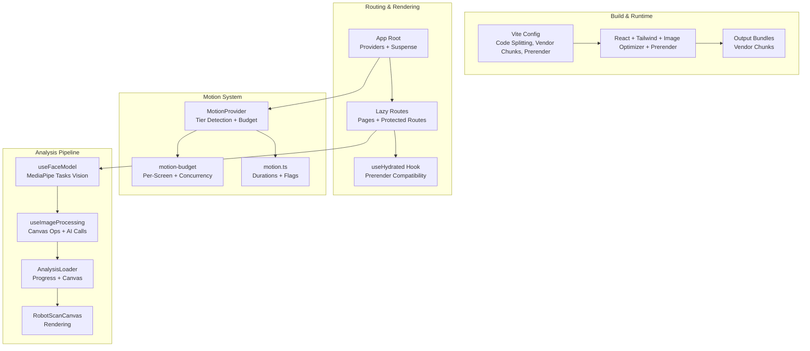
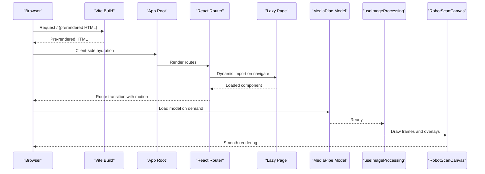
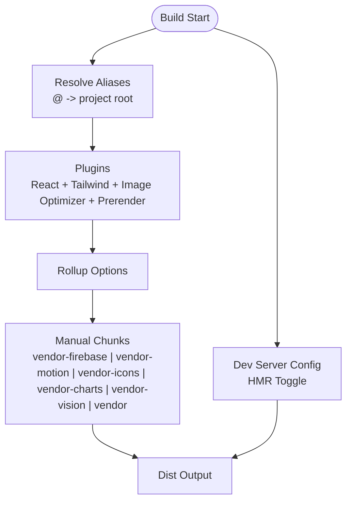
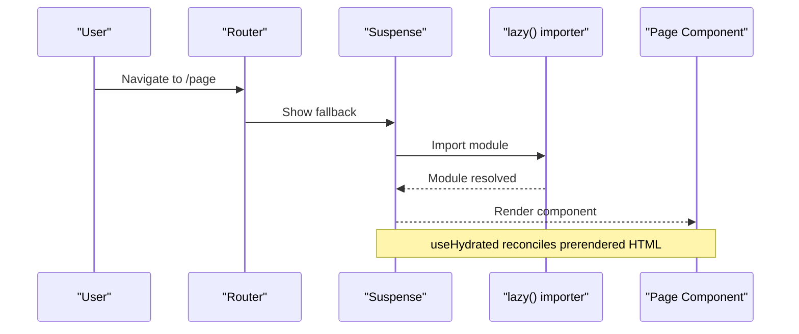
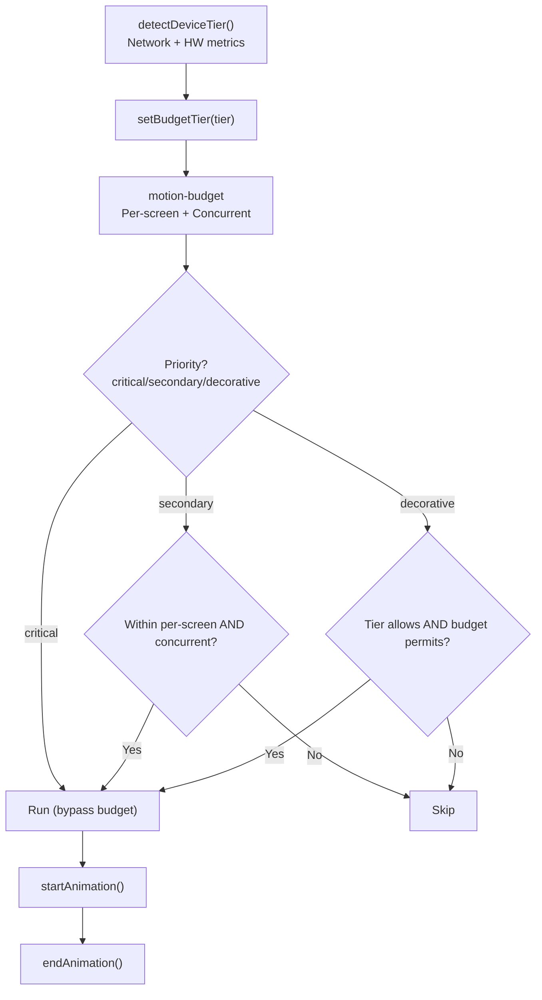
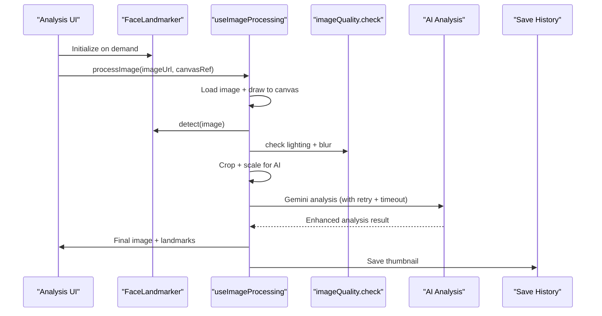
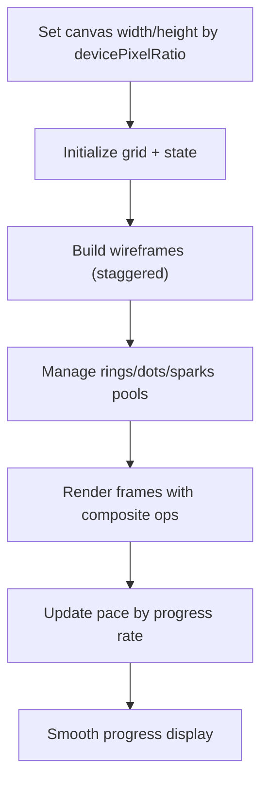
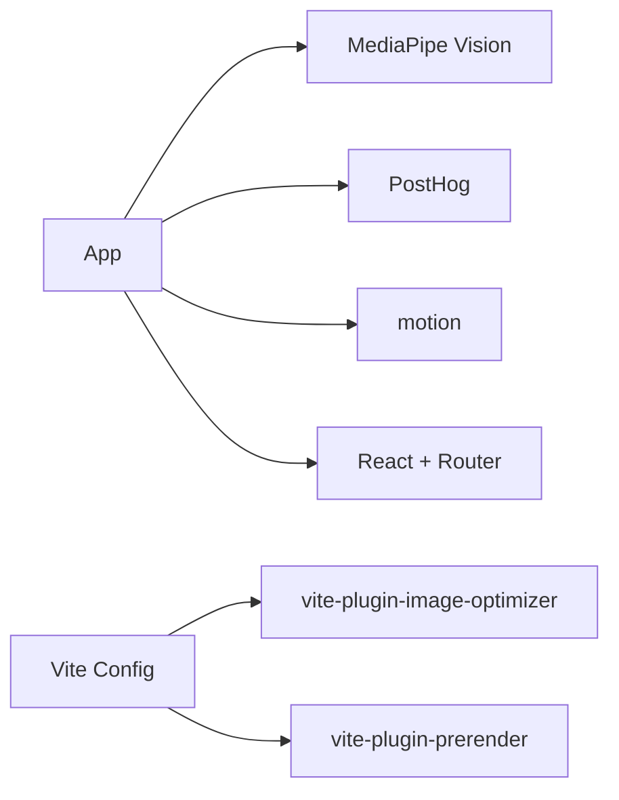

# Frontend Performance

<cite>
**Referenced Files in This Document**
- [vite.config.ts](file://vite.config.ts)
- [package.json](file://package.json)
- [src/main.tsx](file://src/main.tsx)
- [src/App.tsx](file://src/App.tsx)
- [src/hooks/useHydrated.ts](file://src/hooks/useHydrated.ts)
- [src/context/MotionProvider.tsx](file://src/context/MotionProvider.tsx)
- [src/lib/motion.ts](file://src/lib/motion.ts)
- [src/lib/motion-budget.ts](file://src/lib/motion-budget.ts)
- [docs/MOTION.md](file://docs/MOTION.md)
- [src/components/FaceAnalyzer/hooks/useFaceModel.ts](file://src/components/FaceAnalyzer/hooks/useFaceModel.ts)
- [src/components/FaceAnalyzer/hooks/useImageProcessing.ts](file://src/components/FaceAnalyzer/hooks/useImageProcessing.ts)
- [src/components/FaceAnalyzer/hooks/useAnalysis.ts](file://src/components/FaceAnalyzer/hooks/useAnalysis.ts)
- [src/components/FaceAnalyzer/utils/imageQuality.ts](file://src/components/FaceAnalyzer/utils/imageQuality.ts)
- [src/components/FaceAnalyzer/utils/geometry.ts](file://src/components/FaceAnalyzer/utils/geometry.ts)
- [src/components/FaceAnalyzer/AnalysisLoader.tsx](file://src/components/FaceAnalyzer/AnalysisLoader.tsx)
- [src/components/FaceAnalyzer/canvas/RobotScanCanvas.tsx](file://src/components/FaceAnalyzer/canvas/RobotScanCanvas.tsx)
</cite>

## Table of Contents
1. [Introduction](#introduction)
2. [Project Structure](#project-structure)
3. [Core Components](#core-components)
4. [Architecture Overview](#architecture-overview)
5. [Detailed Component Analysis](#detailed-component-analysis)
6. [Dependency Analysis](#dependency-analysis)
7. [Performance Considerations](#performance-considerations)
8. [Troubleshooting Guide](#troubleshooting-guide)
9. [Conclusion](#conclusion)

## Introduction
This document provides comprehensive frontend performance optimization guidance for FaceAnalytics Pro. It covers Vite build configuration for bundle optimization and asset handling, lazy loading strategies for React components and routes, the motion budget system for controlling animation complexity, canvas optimization techniques for facial analysis, profiling and bottleneck identification, image processing optimizations for large-scale facial analysis, and progressive loading/preloading strategies for an optimal user experience.

## Project Structure
The frontend is a React 19 application with Vite 6, using React Router for routing, PostHog for analytics, and device-tiered motion controls. Key performance-related areas:
- Vite build pipeline with code splitting, vendor chunking, and prerendering
- Lazy-loaded routes and pages
- Motion budget and tiered motion system
- MediaPipe Vision model loaded on demand
- Canvas-based facial analysis and rendering
- Progressive loading for analysis steps and shimmer effects

**Diagram sources**
- [vite.config.ts:14-75](file://vite.config.ts#L14-L75)
- [src/App.tsx:1-473](file://src/App.tsx#L1-L473)
- [src/hooks/useHydrated.ts:1-33](file://src/hooks/useHydrated.ts#L1-L33)
- [src/context/MotionProvider.tsx:1-153](file://src/context/MotionProvider.tsx#L1-L153)
- [src/lib/motion.ts:1-226](file://src/lib/motion.ts#L1-L226)
- [src/lib/motion-budget.ts:1-89](file://src/lib/motion-budget.ts#L1-L89)
- [src/components/FaceAnalyzer/hooks/useFaceModel.ts:1-36](file://src/components/FaceAnalyzer/hooks/useFaceModel.ts#L1-L36)
- [src/components/FaceAnalyzer/hooks/useImageProcessing.ts:1-234](file://src/components/FaceAnalyzer/hooks/useImageProcessing.ts#L1-L234)
- [src/components/FaceAnalyzer/AnalysisLoader.tsx:1-286](file://src/components/FaceAnalyzer/AnalysisLoader.tsx#L1-L286)
- [src/components/FaceAnalyzer/canvas/RobotScanCanvas.tsx:1-800](file://src/components/FaceAnalyzer/canvas/RobotScanCanvas.tsx#L1-L800)

**Section sources**
- [vite.config.ts:14-75](file://vite.config.ts#L14-L75)
- [src/App.tsx:1-473](file://src/App.tsx#L1-L473)
- [src/hooks/useHydrated.ts:1-33](file://src/hooks/useHydrated.ts#L1-L33)
- [src/context/MotionProvider.tsx:1-153](file://src/context/MotionProvider.tsx#L1-L153)
- [src/lib/motion.ts:1-226](file://src/lib/motion.ts#L1-L226)
- [src/lib/motion-budget.ts:1-89](file://src/lib/motion-budget.ts#L1-L89)

## Core Components
- Vite build configuration with:
  - Manual chunking for vendor libraries (Firebase, motion, icons, charts, MediaPipe Vision)
  - Image optimization plugin for PNG/JPEG/WebP/AVIF
  - Static prerendering for marketing pages
  - Environment-driven HMR toggle
- Lazy loading:
  - Dynamic imports for all pages and blog pages
  - useHydrated to reconcile prerendered HTML with client animations
- Motion budget system:
  - Device tier detection (low/mid/high) based on hardware/network
  - Per-screen and concurrent animation budgets
  - Priority gating (critical/secondary/decorative) with reduced-motion respect
- MediaPipe Vision:
  - On-demand model loading with GPU delegate
  - Progressive image processing with quality checks and cropping
- Canvas optimization:
  - Device pixel ratio scaling
  - Staggered wireframe builds and capped particle pools
  - Time-based pacing to maintain smoothness under load

**Section sources**
- [vite.config.ts:14-75](file://vite.config.ts#L14-L75)
- [src/App.tsx:23-44](file://src/App.tsx#L23-L44)
- [src/hooks/useHydrated.ts:1-33](file://src/hooks/useHydrated.ts#L1-L33)
- [src/context/MotionProvider.tsx:45-132](file://src/context/MotionProvider.tsx#L45-L132)
- [src/lib/motion.ts:167-220](file://src/lib/motion.ts#L167-L220)
- [src/lib/motion-budget.ts:44-79](file://src/lib/motion-budget.ts#L44-L79)
- [src/components/FaceAnalyzer/hooks/useFaceModel.ts:9-33](file://src/components/FaceAnalyzer/hooks/useFaceModel.ts#L9-L33)
- [src/components/FaceAnalyzer/hooks/useImageProcessing.ts:26-232](file://src/components/FaceAnalyzer/hooks/useImageProcessing.ts#L26-L232)
- [src/components/FaceAnalyzer/canvas/RobotScanCanvas.tsx:503-551](file://src/components/FaceAnalyzer/canvas/RobotScanCanvas.tsx#L503-L551)

## Architecture Overview
The frontend architecture emphasizes progressive delivery and runtime adaptivity:
- Build-time: chunking and prerendering
- Runtime: lazy routes, motion tiering, and canvas-driven analysis
- Analytics: PostHog integration with suppression for noisy logs

**Diagram sources**
- [vite.config.ts:27-45](file://vite.config.ts#L27-L45)
- [src/App.tsx:23-44](file://src/App.tsx#L23-L44)
- [src/components/FaceAnalyzer/hooks/useFaceModel.ts:9-33](file://src/components/FaceAnalyzer/hooks/useFaceModel.ts#L9-L33)
- [src/components/FaceAnalyzer/hooks/useImageProcessing.ts:26-232](file://src/components/FaceAnalyzer/hooks/useImageProcessing.ts#L26-L232)
- [src/components/FaceAnalyzer/canvas/RobotScanCanvas.tsx:503-551](file://src/components/FaceAnalyzer/canvas/RobotScanCanvas.tsx#L503-L551)

## Detailed Component Analysis

### Vite Build Configuration and Bundle Optimization
Key strategies:
- Vendor chunking separates frequently shared libraries into dedicated chunks for caching and parallel loading.
- Image optimization reduces payload sizes for PNG/JPEG/WebP/AVIF.
- Prerendering improves Time to First Meaningful Paint for marketing pages.
- HMR toggle supports development ergonomics without impacting production.

**Diagram sources**
- [vite.config.ts:48-72](file://vite.config.ts#L48-L72)

**Section sources**
- [vite.config.ts:14-75](file://vite.config.ts#L14-L75)
- [package.json:19-79](file://package.json#L19-L79)

### Lazy Loading Implementation (React, Routes, Heavy Dependencies)
- All pages and blog pages are lazy-loaded using dynamic imports.
- useHydrated ensures prerendered HTML is not jarringly replaced by initial motion states.
- Protected routes wrap private content to avoid loading unnecessary bundles until authenticated.

**Diagram sources**
- [src/App.tsx:23-44](file://src/App.tsx#L23-L44)
- [src/hooks/useHydrated.ts:24-33](file://src/hooks/useHydrated.ts#L24-L33)

**Section sources**
- [src/App.tsx:23-44](file://src/App.tsx#L23-L44)
- [src/hooks/useHydrated.ts:1-33](file://src/hooks/useHydrated.ts#L1-L33)

### Motion Budget System (Control Animation Complexity)
The motion system adapts to device capabilities and user preferences:
- Tier detection considers network conditions, device memory/cores, and viewport width.
- Budget enforces per-screen and concurrent limits; priorities gate execution.
- Reduced-motion preference is respected; critical animations still run with minimal transforms.
- Debug helper exposes current budget state in development.

**Diagram sources**
- [src/lib/motion.ts:167-220](file://src/lib/motion.ts#L167-L220)
- [src/lib/motion-budget.ts:44-79](file://src/lib/motion-budget.ts#L44-L79)
- [src/context/MotionProvider.tsx:94-109](file://src/context/MotionProvider.tsx#L94-L109)

**Section sources**
- [src/lib/motion.ts:1-226](file://src/lib/motion.ts#L1-L226)
- [src/lib/motion-budget.ts:1-89](file://src/lib/motion-budget.ts#L1-L89)
- [src/context/MotionProvider.tsx:1-153](file://src/context/MotionProvider.tsx#L1-L153)
- [docs/MOTION.md:1-107](file://docs/MOTION.md#L1-L107)

### MediaPipe Vision and Progressive Loading
- Model loads on demand via MediaPipe Tasks Vision with GPU delegate for acceleration.
- Image processing pipeline:
  - Loads image and draws to canvas
  - Detects landmarks and validates expression neutrality
  - Checks lighting and blur thresholds
  - Crops region of interest and scales for downstream AI
  - Renders face mesh overlay and final image
  - Saves thumbnail to history

**Diagram sources**
- [src/components/FaceAnalyzer/hooks/useFaceModel.ts:9-33](file://src/components/FaceAnalyzer/hooks/useFaceModel.ts#L9-L33)
- [src/components/FaceAnalyzer/hooks/useImageProcessing.ts:26-232](file://src/components/FaceAnalyzer/hooks/useImageProcessing.ts#L26-L232)
- [src/components/FaceAnalyzer/utils/imageQuality.ts:3-73](file://src/components/FaceAnalyzer/utils/imageQuality.ts#L3-L73)
- [src/components/FaceAnalyzer/hooks/useAnalysis.ts:9-206](file://src/components/FaceAnalyzer/hooks/useAnalysis.ts#L9-L206)

**Section sources**
- [src/components/FaceAnalyzer/hooks/useFaceModel.ts:1-36](file://src/components/FaceAnalyzer/hooks/useFaceModel.ts#L1-L36)
- [src/components/FaceAnalyzer/hooks/useImageProcessing.ts:1-234](file://src/components/FaceAnalyzer/hooks/useImageProcessing.ts#L1-L234)
- [src/components/FaceAnalyzer/utils/imageQuality.ts:1-73](file://src/components/FaceAnalyzer/utils/imageQuality.ts#L1-L73)
- [src/components/FaceAnalyzer/hooks/useAnalysis.ts:1-207](file://src/components/FaceAnalyzer/hooks/useAnalysis.ts#L1-L207)

### Canvas Optimization for Facial Analysis
Canvas rendering is optimized for performance:
- Device pixel ratio scaling to match display density
- Staggered wireframe construction with capped pools
- Particle systems with lifecycle management
- Time-based pacing to sustain smoothness under load
- Progressive smoothing of the progress indicator to avoid stalls

**Diagram sources**
- [src/components/FaceAnalyzer/canvas/RobotScanCanvas.tsx:503-551](file://src/components/FaceAnalyzer/canvas/RobotScanCanvas.tsx#L503-L551)
- [src/components/FaceAnalyzer/canvas/RobotScanCanvas.tsx:750-780](file://src/components/FaceAnalyzer/canvas/RobotScanCanvas.tsx#L750-L780)
- [src/components/FaceAnalyzer/canvas/RobotScanCanvas.tsx:888-922](file://src/components/FaceAnalyzer/canvas/RobotScanCanvas.tsx#L888-L922)
- [src/components/FaceAnalyzer/AnalysisLoader.tsx:20-55](file://src/components/FaceAnalyzer/AnalysisLoader.tsx#L20-L55)

**Section sources**
- [src/components/FaceAnalyzer/canvas/RobotScanCanvas.tsx:1-800](file://src/components/FaceAnalyzer/canvas/RobotScanCanvas.tsx#L1-L800)
- [src/components/FaceAnalyzer/AnalysisLoader.tsx:1-286](file://src/components/FaceAnalyzer/AnalysisLoader.tsx#L1-L286)

### Progressive Loading and Preloading Strategies
- Prerendered HTML for marketing pages improves first paint
- Suspense fallback during route transitions
- useHydrated remounts motion components after hydration to replay animations
- AnalysisLoader provides a polished, time-based progress display with milestone markers
- Image quality checks run asynchronously to avoid blocking the UI thread

**Section sources**
- [vite.config.ts:27-45](file://vite.config.ts#L27-L45)
- [src/App.tsx:232-353](file://src/App.tsx#L232-L353)
- [src/hooks/useHydrated.ts:1-33](file://src/hooks/useHydrated.ts#L1-L33)
- [src/components/FaceAnalyzer/AnalysisLoader.tsx:1-286](file://src/components/FaceAnalyzer/AnalysisLoader.tsx#L1-L286)
- [src/components/FaceAnalyzer/utils/imageQuality.ts:1-73](file://src/components/FaceAnalyzer/utils/imageQuality.ts#L1-L73)

## Dependency Analysis
External dependencies relevant to performance:
- MediaPipe Vision for face landmark detection
- PostHog for analytics with console log suppression for noisy delegates
- Vite ecosystem plugins for image optimization and prerendering
- motion library for device-tiered animations

**Diagram sources**
- [package.json:19-52](file://package.json#L19-L52)
- [vite.config.ts:17-27](file://vite.config.ts#L17-L27)
- [src/main.tsx:5-31](file://src/main.tsx#L5-L31)

**Section sources**
- [package.json:19-79](file://package.json#L19-L79)
- [vite.config.ts:14-75](file://vite.config.ts#L14-L75)
- [src/main.tsx:1-40](file://src/main.tsx#L1-L40)

## Performance Considerations
- Bundle size and caching:
  - Keep vendor chunking focused on stable libraries; avoid unnecessary churn.
  - Monitor chunk sizes and split points to minimize initial JS payload.
- Lazy loading:
  - Continue using dynamic imports for non-critical routes and heavy dependencies.
  - Ensure Suspense boundaries are placed strategically to avoid long fallbacks.
- Motion system:
  - Prefer critical animations for essential feedback; reserve secondary/decorative for non-essential motion.
  - Respect reduced-motion preferences to improve accessibility and reduce CPU/GPU usage.
- MediaPipe and canvas:
  - Load models on demand and reuse instances when possible.
  - Use device pixel ratio scaling and limit particle counts to maintain 60fps.
  - Apply quality checks early to fail fast and avoid wasted computation.
- Image processing:
  - Downscale images for quality checks to reduce CPU load.
  - Use efficient image formats and compression levels appropriate for the use case.
- Analytics:
  - Suppress noisy logs to reduce console overhead in production.

[No sources needed since this section provides general guidance]

## Troubleshooting Guide
Common performance issues and remedies:
- Excessive animations on low-tier devices:
  - Verify motion tier detection and budget decisions; confirm reduced-motion is respected.
  - Reduce decorative animations and rely on critical ones.
- Stuttering during analysis:
  - Confirm canvas DPR scaling and wireframe build pacing.
  - Ensure image quality checks are yielding to the main thread.
- Slow initial load:
  - Review prerendered pages and ensure they are static and cacheable.
  - Check vendor chunk sizes and consider further splitting if needed.
- Model load delays:
  - Confirm GPU delegate is available and model is initialized lazily.
  - Add a loading indicator and consider preloading strategies for critical paths.

**Section sources**
- [src/context/MotionProvider.tsx:94-109](file://src/context/MotionProvider.tsx#L94-L109)
- [src/lib/motion-budget.ts:44-79](file://src/lib/motion-budget.ts#L44-L79)
- [src/components/FaceAnalyzer/canvas/RobotScanCanvas.tsx:503-551](file://src/components/FaceAnalyzer/canvas/RobotScanCanvas.tsx#L503-L551)
- [src/components/FaceAnalyzer/utils/imageQuality.ts:1-73](file://src/components/FaceAnalyzer/utils/imageQuality.ts#L1-L73)
- [vite.config.ts:27-45](file://vite.config.ts#L27-L45)
- [src/components/FaceAnalyzer/hooks/useFaceModel.ts:9-33](file://src/components/FaceAnalyzer/hooks/useFaceModel.ts#L9-L33)

## Conclusion
FaceAnalytics Pro achieves strong performance through a combination of build-time optimizations (chunking, prerendering, image optimization), runtime adaptivity (device-tiered motion, lazy loading), and careful canvas and image processing practices. The motion budget system and MediaPipe integration are central to delivering a smooth, responsive experience across a wide range of devices while maintaining high-quality facial analysis results.