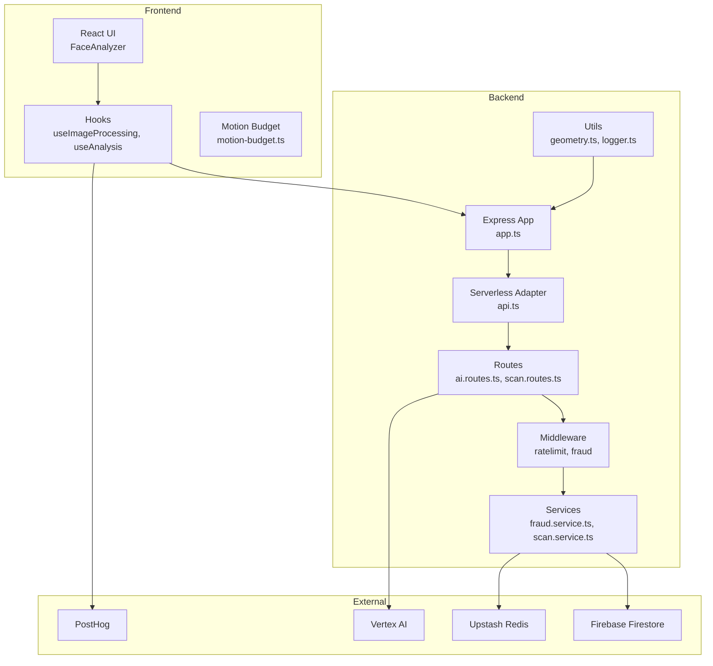
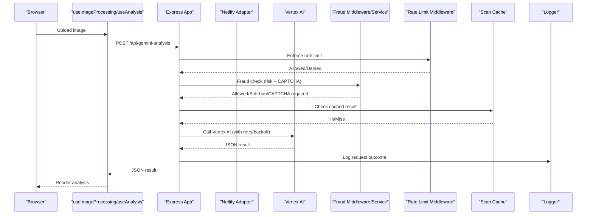
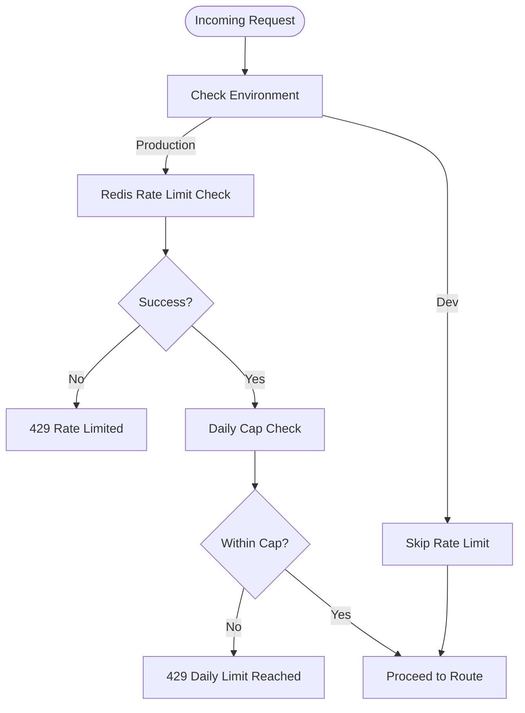
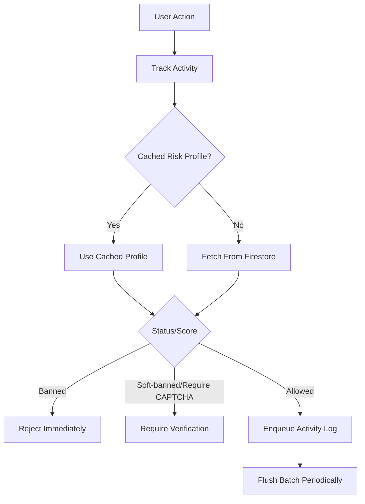
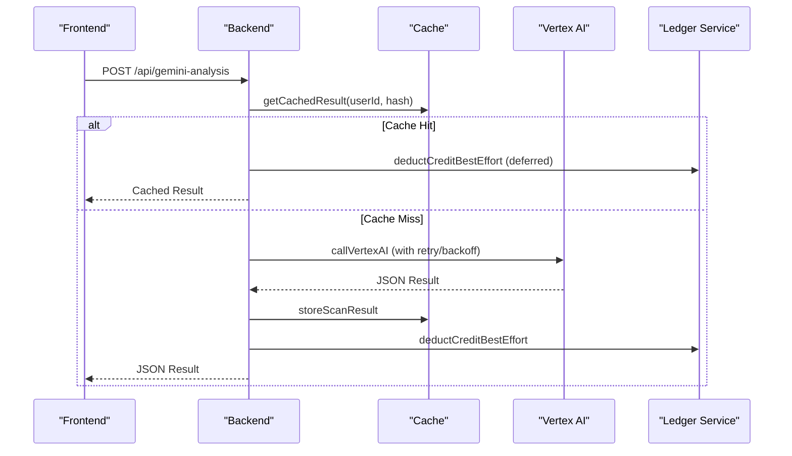
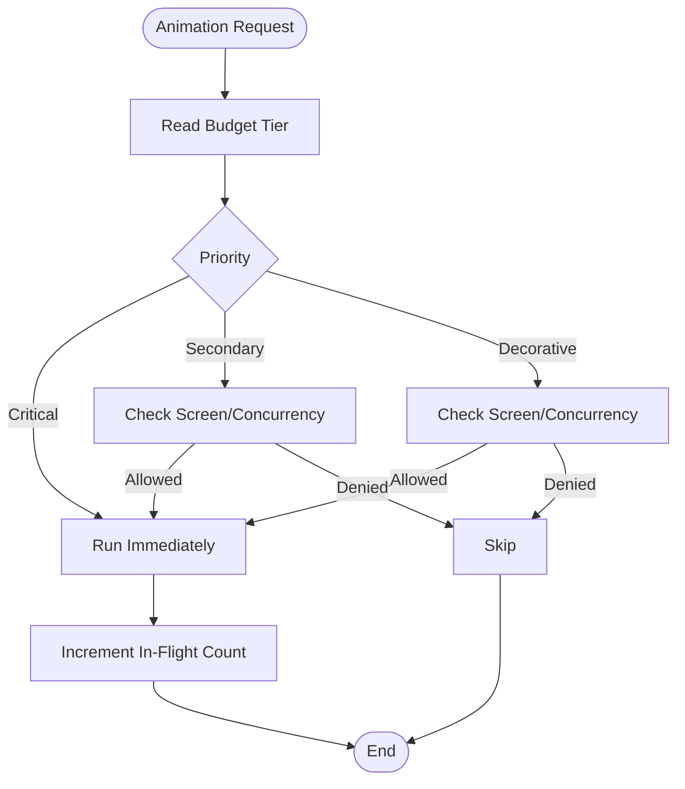
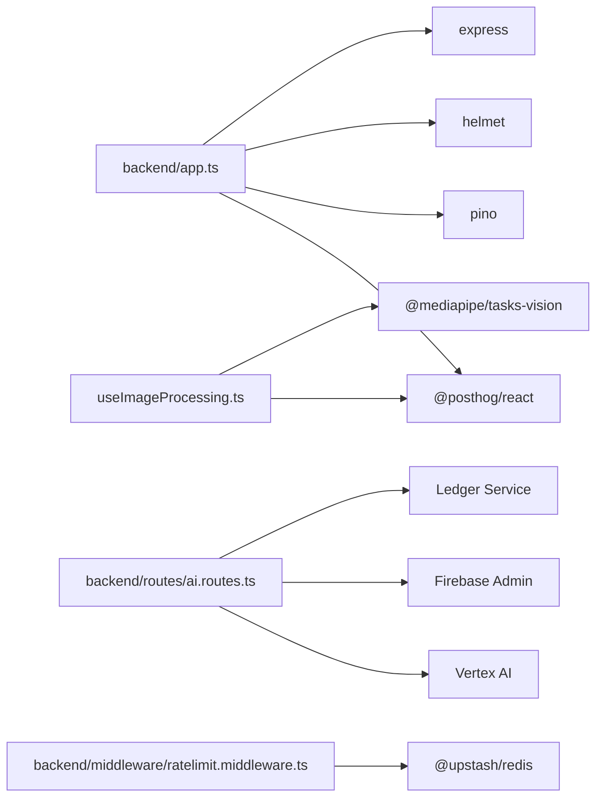

# Monitoring and Profiling

<cite>
**Referenced Files in This Document**
- [logger.ts](file://backend/utils/logger.ts)
- [app.ts](file://backend/app.ts)
- [api.ts](file://netlify/functions/api.ts)
- [ratelimit.middleware.ts](file://backend/middleware/ratelimit.middleware.ts)
- [fraud.middleware.ts](file://backend/middleware/fraud.middleware.ts)
- [fraud.service.ts](file://backend/services/fraud.service.ts)
- [scan.service.ts](file://backend/services/scan.service.ts)
- [ai.routes.ts](file://backend/routes/ai.routes.ts)
- [scan.routes.ts](file://backend/routes/scan.routes.ts)
- [motion-budget.ts](file://src/lib/motion-budget.ts)
- [useImageProcessing.ts](file://src/components/FaceAnalyzer/hooks/useImageProcessing.ts)
- [useAnalysis.ts](file://src/components/FaceAnalyzer/hooks/useAnalysis.ts)
- [geometry.ts](file://backend/utils/geometry.ts)
- [package.json](file://package.json)
- [ci.yml](file://.github/workflows/ci.yml)
</cite>

## Table of Contents
1. [Introduction](#introduction)
2. [Project Structure](#project-structure)
3. [Core Components](#core-components)
4. [Architecture Overview](#architecture-overview)
5. [Detailed Component Analysis](#detailed-component-analysis)
6. [Dependency Analysis](#dependency-analysis)
7. [Performance Considerations](#performance-considerations)
8. [Troubleshooting Guide](#troubleshooting-guide)
9. [Conclusion](#conclusion)
10. [Appendices](#appendices)

## Introduction
This document provides comprehensive monitoring and profiling guidance for FaceAnalytics Pro. It focuses on performance monitoring setup, key metrics tracking, performance budgets, alerting, profiling techniques for frontend and backend, logging strategies, real-time dashboards, performance analytics, automated performance testing, continuous performance monitoring, Application Performance Monitoring (APM) integration, and custom metric collection. It leverages the existing codebase’s logging, rate limiting, fraud detection, caching, and request lifecycle patterns to define practical, implementable strategies.

## Project Structure
The project comprises:
- Frontend React application with performance-sensitive image processing and AI analysis flows.
- Backend Express server with modularized routes, middleware, and services.
- Serverless deployment via Netlify Functions with lazy initialization to reduce cold start overhead.
- Monitoring and observability dependencies (PostHog, Pino) integrated into the stack.

**Diagram sources**
- [app.ts:15-201](file://backend/app.ts#L15-L201)
- [api.ts:12-27](file://netlify/functions/api.ts#L12-L27)
- [ai.routes.ts:256-516](file://backend/routes/ai.routes.ts#L256-L516)
- [scan.routes.ts:22-60](file://backend/routes/scan.routes.ts#L22-L60)
- [ratelimit.middleware.ts:25-92](file://backend/middleware/ratelimit.middleware.ts#L25-L92)
- [fraud.middleware.ts:30-104](file://backend/middleware/fraud.middleware.ts#L30-L104)
- [fraud.service.ts:127-204](file://backend/services/fraud.service.ts#L127-L204)
- [scan.service.ts:31-94](file://backend/services/scan.service.ts#L31-L94)
- [geometry.ts:1-453](file://backend/utils/geometry.ts#L1-L453)
- [logger.ts:21-68](file://backend/utils/logger.ts#L21-L68)

**Section sources**
- [app.ts:15-201](file://backend/app.ts#L15-L201)
- [api.ts:12-27](file://netlify/functions/api.ts#L12-L27)
- [package.json:19-52](file://package.json#L19-L52)

## Core Components
- Logging and request tracing: centralized logger abstraction with development upgrades and request ID injection.
- Rate limiting and daily caps: sliding window rate limiter with Redis and IP/user-based identifiers.
- Fraud detection and risk gating: device fingerprinting, risk profiles, and preemptive blocking for expensive operations.
- Caching and storage: image hashing, cached results, and scan history retrieval.
- AI analysis pipeline: Vertex AI integration with retry/backoff, timeouts, and credit-safe ordering.
- Motion budget: frontend animation budgeting to maintain responsiveness under constrained devices.

**Section sources**
- [logger.ts:21-68](file://backend/utils/logger.ts#L21-L68)
- [app.ts:68-88](file://backend/app.ts#L68-L88)
- [ratelimit.middleware.ts:25-92](file://backend/middleware/ratelimit.middleware.ts#L25-L92)
- [fraud.middleware.ts:30-104](file://backend/middleware/fraud.middleware.ts#L30-L104)
- [fraud.service.ts:127-204](file://backend/services/fraud.service.ts#L127-L204)
- [scan.service.ts:31-94](file://backend/services/scan.service.ts#L31-L94)
- [ai.routes.ts:256-516](file://backend/routes/ai.routes.ts#L256-L516)
- [motion-budget.ts:30-79](file://src/lib/motion-budget.ts#L30-L79)

## Architecture Overview
The system integrates frontend and backend monitoring and profiling through:
- Request tracing via request IDs and structured logging.
- Real-time telemetry via PostHog ingestion proxy.
- Backend resilience via rate limiting, fraud checks, and retries.
- Frontend animation budgeting to preserve UX performance.

**Diagram sources**
- [useImageProcessing.ts:26-197](file://src/components/FaceAnalyzer/hooks/useImageProcessing.ts#L26-L197)
- [useAnalysis.ts:9-160](file://src/components/FaceAnalyzer/hooks/useAnalysis.ts#L9-L160)
- [ai.routes.ts:256-516](file://backend/routes/ai.routes.ts#L256-L516)
- [ratelimit.middleware.ts:38-91](file://backend/middleware/ratelimit.middleware.ts#L38-L91)
- [fraud.middleware.ts:30-104](file://backend/middleware/fraud.middleware.ts#L30-L104)
- [scan.service.ts:31-62](file://backend/services/scan.service.ts#L31-L62)
- [logger.ts:21-68](file://backend/utils/logger.ts#L21-L68)

## Detailed Component Analysis

### Logging and Request Tracing
- Centralized logger abstraction supports synchronous console logging in production and asynchronous development logging with pretty output.
- Request ID injection in Express enables correlation across logs and telemetry.
- Structured logging with redaction of sensitive headers/body fields.

Implementation highlights:
- Logger creation and environment-specific behavior.
- Request ID propagation and response logging hook.
- Redaction of sensitive fields for security.

**Section sources**
- [logger.ts:21-68](file://backend/utils/logger.ts#L21-L68)
- [app.ts:68-88](file://backend/app.ts#L68-L88)

### Rate Limiting and Daily Caps
- Sliding window rate limiting with Upstash Redis.
- Composite identifiers (user ID or IP) to prevent abuse.
- Per-endpoint rate limits and daily usage caps with TTL-based expiry.
- Graceful degradation on Redis failures.

**Diagram sources**
- [ratelimit.middleware.ts:38-91](file://backend/middleware/ratelimit.middleware.ts#L38-L91)
- [ratelimit.middleware.ts:98-133](file://backend/middleware/ratelimit.middleware.ts#L98-L133)

**Section sources**
- [ratelimit.middleware.ts:25-92](file://backend/middleware/ratelimit.middleware.ts#L25-L92)
- [ratelimit.middleware.ts:98-133](file://backend/middleware/ratelimit.middleware.ts#L98-L133)

### Fraud Detection and Risk Gating
- Device fingerprinting from request headers and optional client-provided fingerprint.
- In-memory risk profile cache with TTL and eviction.
- Preemptive blocking for expensive operations based on risk thresholds.
- Batched activity logging with periodic flushing.

**Diagram sources**
- [fraud.service.ts:127-204](file://backend/services/fraud.service.ts#L127-L204)
- [fraud.service.ts:429-472](file://backend/services/fraud.service.ts#L429-L472)
- [fraud.service.ts:531-588](file://backend/services/fraud.service.ts#L531-L588)

**Section sources**
- [fraud.middleware.ts:30-104](file://backend/middleware/fraud.middleware.ts#L30-L104)
- [fraud.service.ts:99-121](file://backend/services/fraud.service.ts#L99-L121)
- [fraud.service.ts:127-204](file://backend/services/fraud.service.ts#L127-L204)
- [fraud.service.ts:429-529](file://backend/services/fraud.service.ts#L429-L529)

### AI Analysis Pipeline and Caching
- Credit-safe ordering: Vertex call first, then credit deduction; on failure no charge is applied.
- Image compression prior to Vertex call; image hashing for cache key.
- Retry/backoff with exponential delay and 429-aware retry-after handling.
- Timeout management tailored to platform constraints.

**Diagram sources**
- [ai.routes.ts:256-516](file://backend/routes/ai.routes.ts#L256-L516)
- [scan.service.ts:31-94](file://backend/services/scan.service.ts#L31-L94)

**Section sources**
- [ai.routes.ts:256-516](file://backend/routes/ai.routes.ts#L256-L516)
- [scan.service.ts:31-94](file://backend/services/scan.service.ts#L31-L94)

### Frontend Motion Budget and Animation Responsiveness
- Motion budget enforces per-screen and concurrent animation limits based on device capability tiers.
- Critical animations always run; secondary/decorative animations are gated by budget and concurrency.
- Reset triggers on route/tab/modal changes to refresh budgets.

**Diagram sources**
- [motion-budget.ts:44-79](file://src/lib/motion-budget.ts#L44-L79)

**Section sources**
- [motion-budget.ts:30-79](file://src/lib/motion-budget.ts#L30-L79)
- [useImageProcessing.ts:16-233](file://src/components/FaceAnalyzer/hooks/useImageProcessing.ts#L16-L233)

### Geometry and Metric Calculation
- Efficient geometric calculations for EAR, alignment, symmetry, face shape, and facial metrics.
- Balanced scoring and strength/weakness categorization derived from computed metrics.

**Section sources**
- [geometry.ts:14-453](file://backend/utils/geometry.ts#L14-L453)

## Dependency Analysis
Key runtime dependencies supporting monitoring and profiling:
- PostHog client and reverse proxy for ingestion.
- Pino for structured logging.
- Upstash Redis for rate limiting.
- Firebase Admin for Firestore operations.

**Diagram sources**
- [app.ts:19-47](file://backend/app.ts#L19-L47)
- [ai.routes.ts:1-18](file://backend/routes/ai.routes.ts#L1-L18)
- [ratelimit.middleware.ts:1-17](file://backend/middleware/ratelimit.middleware.ts#L1-L17)
- [useImageProcessing.ts:1-7](file://src/components/FaceAnalyzer/hooks/useImageProcessing.ts#L1-L7)

**Section sources**
- [package.json:19-52](file://package.json#L19-L52)

## Performance Considerations
- Cold start mitigation: serverless adapter defers heavy imports until first request to minimize initialization time.
- Request tracing: unique request IDs enable correlation across logs and telemetry.
- Rate limiting and daily caps: protect backend resources and bound credit burn.
- Fraud preemption: preemptively block risky users for expensive operations to avoid unnecessary compute.
- Caching: reuse previous AI results for identical images to reduce latency and cost.
- Retry/backoff: robust handling of transient Vertex AI errors with suggested retry delays.
- Frontend animation budgeting: ensure smooth UX on constrained devices.

[No sources needed since this section provides general guidance]

## Troubleshooting Guide
Common issues and mitigations:
- Vertex AI timeouts: backend enforces platform-aware timeouts and aborts requests before platform termination.
- 429 responses: backend parses retry-after headers and applies exponential backoff; frontend respects extended timeouts for long-running analyses.
- Redis failures: rate limiting falls back gracefully; fraud checks continue with best-effort behavior.
- Insufficient credits: backend performs soft credit checks and rate-limiting to bound abuse; credit deductions are best-effort with reconciliation queue.

**Section sources**
- [ai.routes.ts:165-254](file://backend/routes/ai.routes.ts#L165-L254)
- [ai.routes.ts:125-157](file://backend/routes/ai.routes.ts#L125-L157)
- [ratelimit.middleware.ts:86-91](file://backend/middleware/ratelimit.middleware.ts#L86-L91)
- [fraud.middleware.ts:94-102](file://backend/middleware/fraud.middleware.ts#L94-L102)

## Conclusion
FaceAnalytics Pro integrates logging, rate limiting, fraud detection, caching, and retry/backoff to deliver a resilient, observable system. By leveraging request tracing, motion budgeting, and structured telemetry, teams can monitor performance, identify bottlenecks, and maintain reliability under varying loads. The existing patterns provide a strong foundation for extending monitoring and profiling with APM integrations, custom metrics, and automated performance testing.

[No sources needed since this section summarizes without analyzing specific files]

## Appendices

### A. Performance Monitoring Setup Checklist
- Enable request tracing with unique IDs and structured logging.
- Integrate telemetry for critical endpoints (AI analysis, scans).
- Configure rate limits and daily caps per endpoint.
- Implement fraud preemption for expensive operations.
- Add caching for repeated AI workloads.
- Instrument frontend animation budgeting and performance budgets.
- Establish alerting for 429 rates, Vertex AI error spikes, and backend latency p95.

[No sources needed since this section provides general guidance]

### B. Automated Performance Testing and CI/CD
- CI pipeline validates TypeScript, linting, and tests.
- Extend CI with performance benchmarks for image processing and AI analysis endpoints.
- Use synthetic traffic to simulate peak loads and measure latency/throughput.

**Section sources**
- [.github/workflows/ci.yml:10-21](file://.github/workflows/ci.yml#L10-L21)

### C. APM Integration and Custom Metrics
- Capture request IDs and endpoint metrics in logs for correlation.
- Export logs to APM backends for dashboards and alerts.
- Add custom metrics for cache hit rate, retry counts, and fraud signal frequency.
- Monitor motion budget utilization and animation stalls.

[No sources needed since this section provides general guidance]