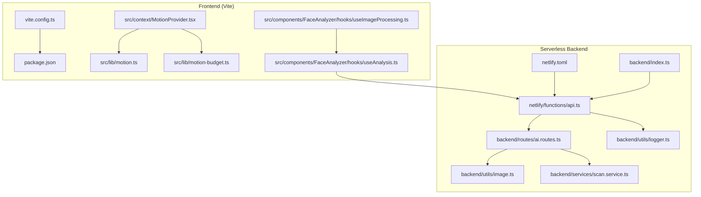
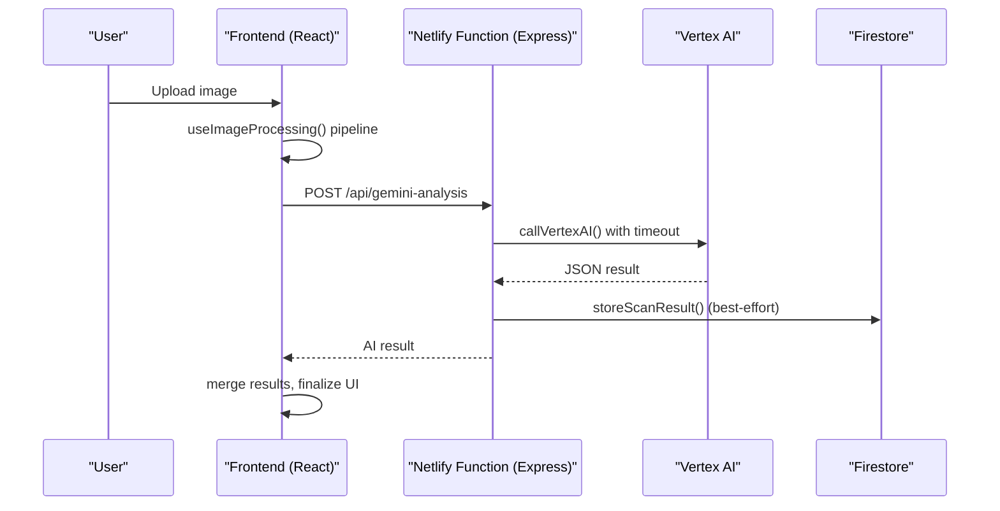
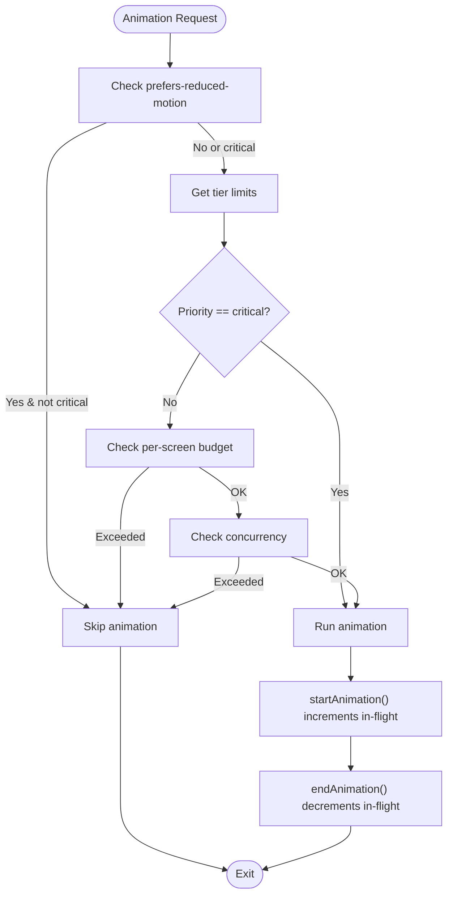
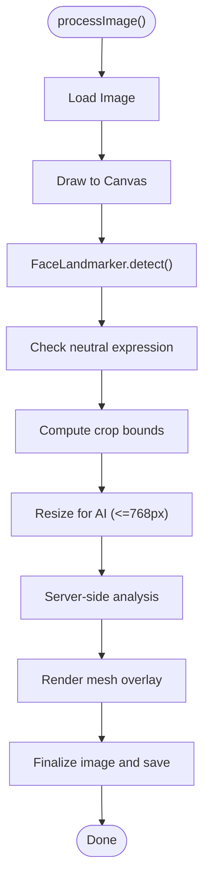
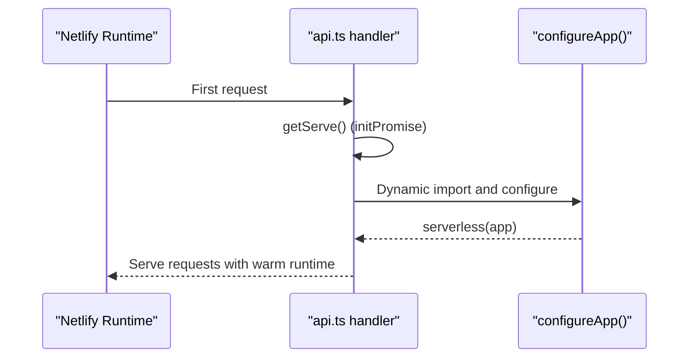
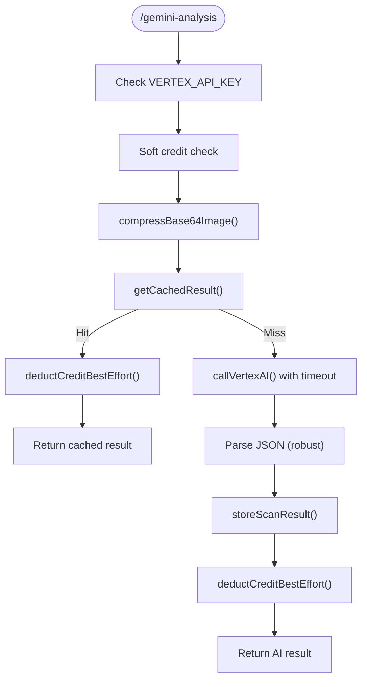
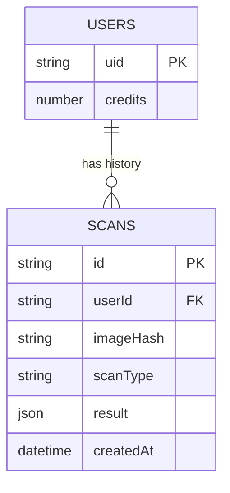
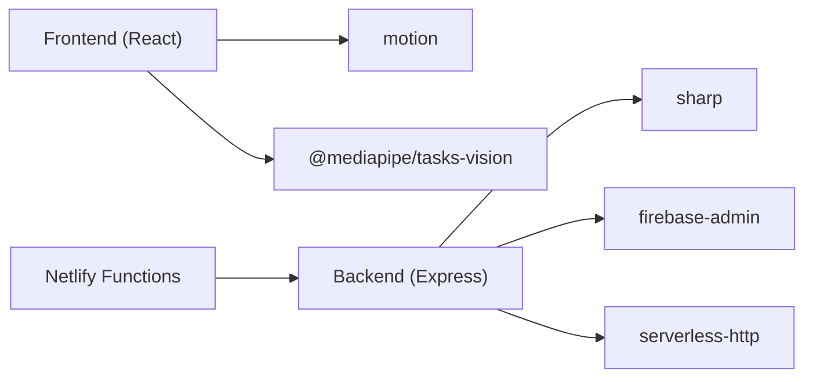

# Performance and Optimization

<cite>
**Referenced Files in This Document**
- [vite.config.ts](file://vite.config.ts)
- [package.json](file://package.json)
- [netlify/functions/api.ts](file://netlify/functions/api.ts)
- [netlify.toml](file://netlify.toml)
- [backend/index.ts](file://backend/index.ts)
- [src/lib/motion.ts](file://src/lib/motion.ts)
- [src/lib/motion-budget.ts](file://src/lib/motion-budget.ts)
- [src/context/MotionProvider.tsx](file://src/context/MotionProvider.tsx)
- [docs/MOTION.md](file://docs/MOTION.md)
- [src/components/FaceAnalyzer/hooks/useImageProcessing.ts](file://src/components/FaceAnalyzer/hooks/useImageProcessing.ts)
- [src/components/FaceAnalyzer/hooks/useAnalysis.ts](file://src/components/FaceAnalyzer/hooks/useAnalysis.ts)
- [backend/utils/image.ts](file://backend/utils/image.ts)
- [backend/services/scan.service.ts](file://backend/services/scan.service.ts)
- [backend/routes/ai.routes.ts](file://backend/routes/ai.routes.ts)
- [backend/utils/logger.ts](file://backend/utils/logger.ts)
</cite>

## Table of Contents
1. [Introduction](#introduction)
2. [Project Structure](#project-structure)
3. [Core Components](#core-components)
4. [Architecture Overview](#architecture-overview)
5. [Detailed Component Analysis](#detailed-component-analysis)
6. [Dependency Analysis](#dependency-analysis)
7. [Performance Considerations](#performance-considerations)
8. [Troubleshooting Guide](#troubleshooting-guide)
9. [Conclusion](#conclusion)
10. [Appendices](#appendices)

## Introduction
This document provides a comprehensive performance and optimization guide for FaceAnalytics Pro. It covers frontend optimization (build, lazy loading, animations), motion budget controls, backend optimization (cold start mitigation, AI processing, caching, logging), memory management for image processing, monitoring and profiling, scalability, and performance testing and continuous monitoring strategies.

## Project Structure
The project is a React SPA with a Vite build pipeline and a serverless Express backend deployed on Netlify Functions. AI analysis is performed via Vertex AI/Gemini with robust retry and timeout handling. Motion animations are tiered and budget-controlled to preserve responsiveness across devices.

**Diagram sources**
- [vite.config.ts:14-75](file://vite.config.ts#L14-L75)
- [package.json:10-79](file://package.json#L10-L79)
- [src/lib/motion.ts:123-226](file://src/lib/motion.ts#L123-L226)
- [src/lib/motion-budget.ts:18-89](file://src/lib/motion-budget.ts#L18-L89)
- [src/context/MotionProvider.tsx:45-132](file://src/context/MotionProvider.tsx#L45-L132)
- [src/components/FaceAnalyzer/hooks/useImageProcessing.ts:26-234](file://src/components/FaceAnalyzer/hooks/useImageProcessing.ts#L26-L234)
- [src/components/FaceAnalyzer/hooks/useAnalysis.ts:9-207](file://src/components/FaceAnalyzer/hooks/useAnalysis.ts#L9-L207)
- [netlify/functions/api.ts:12-27](file://netlify/functions/api.ts#L12-L27)
- [netlify.toml:1-42](file://netlify.toml#L1-L42)
- [backend/index.ts:7-29](file://backend/index.ts#L7-L29)
- [backend/routes/ai.routes.ts:271-516](file://backend/routes/ai.routes.ts#L271-L516)
- [backend/utils/image.ts:11-42](file://backend/utils/image.ts#L11-L42)
- [backend/services/scan.service.ts:31-94](file://backend/services/scan.service.ts#L31-L94)
- [backend/utils/logger.ts:21-71](file://backend/utils/logger.ts#L21-L71)

**Section sources**
- [vite.config.ts:14-75](file://vite.config.ts#L14-L75)
- [package.json:10-79](file://package.json#L10-L79)
- [netlify/functions/api.ts:12-27](file://netlify/functions/api.ts#L12-L27)
- [netlify.toml:1-42](file://netlify.toml#L1-L42)
- [backend/index.ts:7-29](file://backend/index.ts#L7-L29)

## Core Components
- Vite build configuration with image optimization and prerendering, plus chunk splitting for vendor libraries.
- Motion system with device-tier detection, budget/concurrency control, and priority gating.
- Serverless cold start mitigation via deferred initialization of heavy modules.
- AI analysis pipeline with compression, caching, retries, timeouts, and credit-safe ordering.
- Image processing pipeline with canvas-based cropping, resizing, and quality checks.
- Logging tailored for serverless constraints.

**Section sources**
- [vite.config.ts:14-75](file://vite.config.ts#L14-L75)
- [src/lib/motion.ts:123-226](file://src/lib/motion.ts#L123-L226)
- [src/lib/motion-budget.ts:18-89](file://src/lib/motion-budget.ts#L18-L89)
- [netlify/functions/api.ts:12-27](file://netlify/functions/api.ts#L12-L27)
- [backend/routes/ai.routes.ts:271-516](file://backend/routes/ai.routes.ts#L271-L516)
- [backend/utils/image.ts:11-42](file://backend/utils/image.ts#L11-L42)
- [backend/utils/logger.ts:21-71](file://backend/utils/logger.ts#L21-L71)

## Architecture Overview
The system separates concerns across frontend and backend:
- Frontend: React UI, motion budget enforcement, image processing, and AI request orchestration.
- Backend: Serverless Express API, AI inference, caching, and credit management.
- Infrastructure: Netlify Functions with explicit timeouts and bundler configuration.

**Diagram sources**
- [src/components/FaceAnalyzer/hooks/useImageProcessing.ts:26-234](file://src/components/FaceAnalyzer/hooks/useImageProcessing.ts#L26-L234)
- [src/components/FaceAnalyzer/hooks/useAnalysis.ts:25-160](file://src/components/FaceAnalyzer/hooks/useAnalysis.ts#L25-L160)
- [netlify/functions/api.ts:12-27](file://netlify/functions/api.ts#L12-L27)
- [backend/routes/ai.routes.ts:176-254](file://backend/routes/ai.routes.ts#L176-L254)
- [backend/services/scan.service.ts:68-94](file://backend/services/scan.service.ts#L68-L94)

## Detailed Component Analysis

### Frontend Performance: Vite Build and Lazy Loading
- Image optimization: Built-in plugin with tuned quality and lossless toggles for PNG/AVIF/WebP.
- Prerendering: Pre-renders marketing and blog routes to improve first paint and SEO.
- Chunk splitting: Manual chunks separate vendor libraries (Firebase, motion, icons, charts, MediaPipe/Vision) to improve caching and parallelism.
- HMR behavior: Controlled via environment variable to avoid flickering during development.

Optimization recommendations:
- Enable dynamic imports for non-critical routes and components to reduce initial bundle size.
- Use React.lazy with Suspense for dashboard-heavy sections.
- Consider route-based code splitting for large pages.

**Section sources**
- [vite.config.ts:17-75](file://vite.config.ts#L17-L75)
- [package.json:10-79](file://package.json#L10-L79)

### Frontend Performance: Animation Budget and Motion System
- Device-tier detection: Automatically selects low/mid/high tiers based on device/network capabilities.
- Budget and concurrency: Per-screen limits and concurrent animation caps enforced by a singleton budget manager.
- Priority gating: Animations are classified as critical/secondary/decorative; reduced-motion overrides apply.
- Provider integration: Exposes hooks to request slots, start/end animations, and reset budgets on navigation/modals.

**Diagram sources**
- [src/lib/motion-budget.ts:44-79](file://src/lib/motion-budget.ts#L44-L79)
- [src/lib/motion.ts:167-220](file://src/lib/motion.ts#L167-L220)
- [src/context/MotionProvider.tsx:94-108](file://src/context/MotionProvider.tsx#L94-L108)

**Section sources**
- [src/lib/motion.ts:123-226](file://src/lib/motion.ts#L123-L226)
- [src/lib/motion-budget.ts:18-89](file://src/lib/motion-budget.ts#L18-L89)
- [src/context/MotionProvider.tsx:45-132](file://src/context/MotionProvider.tsx#L45-L132)
- [docs/MOTION.md:1-107](file://docs/MOTION.md#L1-L107)

### Frontend Performance: Image Processing Pipeline
- Canvas-based processing: Loads image, draws to canvas, detects landmarks, crops region of interest, resizes for AI, and renders overlays.
- Quality checks: Verifies lighting and blur thresholds before proceeding.
- Progress tracking: Milestone-driven updates to keep users informed without blocking rendering.
- Memory-conscious sizing: Limits canvas sizes and uses offscreen canvases for intermediate steps.

**Diagram sources**
- [src/components/FaceAnalyzer/hooks/useImageProcessing.ts:26-234](file://src/components/FaceAnalyzer/hooks/useImageProcessing.ts#L26-L234)

**Section sources**
- [src/components/FaceAnalyzer/hooks/useImageProcessing.ts:26-234](file://src/components/FaceAnalyzer/hooks/useImageProcessing.ts#L26-L234)

### Backend Performance: Cold Start Mitigation
- Deferred initialization: Heavy modules (Express app, Firebase Admin, Sharp, Pino) are dynamically imported on first invocation to minimize Lambda initialization time.
- Timeout alignment: Backend AbortController aligns with Netlify’s 26s function timeout to avoid premature termination.

**Diagram sources**
- [netlify/functions/api.ts:12-27](file://netlify/functions/api.ts#L12-L27)
- [netlify.toml:19-26](file://netlify.toml#L19-L26)
- [backend/index.ts:7-29](file://backend/index.ts#L7-L29)

**Section sources**
- [netlify/functions/api.ts:12-27](file://netlify/functions/api.ts#L12-L27)
- [netlify.toml:19-26](file://netlify.toml#L19-L26)
- [backend/index.ts:7-29](file://backend/index.ts#L7-L29)

### Backend Performance: AI Processing and Resource Utilization
- Vertex AI endpoint selection: Chooses Gemini Developer API or Vertex OAuth endpoint depending on API key format.
- Compression: Reduces base64 image size to a fixed dimension and JPEG quality to minimize payload and latency.
- Retry and timeout: Robust retry with exponential backoff and platform-aligned timeouts.
- Credit-safe flow: Deduction occurs after successful AI result; soft credit checks prevent unnecessary failures.
- Parsing resilience: Strips markdown fences and extracts JSON safely.

**Diagram sources**
- [backend/routes/ai.routes.ts:271-516](file://backend/routes/ai.routes.ts#L271-L516)
- [backend/utils/image.ts:11-42](file://backend/utils/image.ts#L11-L42)
- [backend/services/scan.service.ts:31-94](file://backend/services/scan.service.ts#L31-L94)

**Section sources**
- [backend/routes/ai.routes.ts:176-254](file://backend/routes/ai.routes.ts#L176-L254)
- [backend/utils/image.ts:11-42](file://backend/utils/image.ts#L11-L42)
- [backend/services/scan.service.ts:31-94](file://backend/services/scan.service.ts#L31-L94)

### Backend Performance: Caching and Database Strategies
- Image hashing: SHA-256 of compressed image data enables cross-user deduplication and cache hits.
- Firestore caching: Stores analysis results with timestamps; retrieval returns latest matching record.
- Pagination: History queries use limit and optional cursor for scalable pagination.

**Diagram sources**
- [backend/services/scan.service.ts:11-94](file://backend/services/scan.service.ts#L11-L94)

**Section sources**
- [backend/services/scan.service.ts:31-94](file://backend/services/scan.service.ts#L31-L94)

### Backend Performance: Logging and Observability
- Serverless-friendly logger: Avoids pino worker threads in production; falls back to synchronous console logging.
- Development upgrade: Asynchronously switches to pino in dev for richer output.

**Section sources**
- [backend/utils/logger.ts:1-71](file://backend/utils/logger.ts#L1-L71)

## Dependency Analysis
- Frontend dependencies include React, motion libraries, charting, and MediaPipe for facial landmarking.
- Backend depends on Express, serverless-http, sharp for image processing, Firebase Admin for Firestore, and rate limiting utilities.
- Netlify configuration externalizes heavy Node modules and sets function timeout aligned with AI latency.

**Diagram sources**
- [package.json:19-52](file://package.json#L19-L52)
- [netlify.toml:6-17](file://netlify.toml#L6-L17)

**Section sources**
- [package.json:19-52](file://package.json#L19-L52)
- [netlify.toml:6-17](file://netlify.toml#L6-L17)

## Performance Considerations
- Frontend
  - Keep animations under budget; prefer critical animations for key interactions.
  - Use lazy loading for non-critical routes and components.
  - Optimize images and leverage prerendering for marketing pages.
- Backend
  - Maintain cold start boundaries; avoid importing heavy modules at module top-level.
  - Align timeouts with platform limits and AI latency expectations.
  - Compress payloads and reuse cached results to reduce compute and bandwidth.
- AI Processing
  - Respect retry delays from 429 responses; back off exponentially.
  - Use structured JSON prompts and parsing safeguards to avoid retries on malformed responses.
- Memory Management
  - Limit canvas sizes and reuse canvases where possible.
  - Avoid retaining large buffers in memory after processing.
- Monitoring and Profiling
  - Use PostHog ingestion redirection for analytics.
  - Log meaningful spans around AI calls and cache decisions.
- Scalability
  - Horizontal scaling via Netlify Functions; ensure stateless endpoints.
  - Use rate limits and daily caps to protect resources.
  - Offload heavy work to serverless and keep frontend lean.

[No sources needed since this section provides general guidance]

## Troubleshooting Guide
- Cold start spikes
  - Confirm deferred initialization is active and heavy modules are imported lazily.
  - Verify Netlify function timeout is set appropriately.
- AI timeouts or 502s
  - Check backend AbortController alignment with platform timeout.
  - Inspect retry logic and suggested retry-after headers.
- Excessive animation lag
  - Review motion tier detection and budget resets on route/tab/modal changes.
  - Disable decorative animations on low tiers.
- Logging issues in production
  - Ensure synchronous console logger is used; avoid pino worker threads.

**Section sources**
- [netlify/functions/api.ts:12-27](file://netlify/functions/api.ts#L12-L27)
- [netlify.toml:19-26](file://netlify.toml#L19-L26)
- [backend/routes/ai.routes.ts:198-242](file://backend/routes/ai.routes.ts#L198-L242)
- [src/context/MotionProvider.tsx:74-80](file://src/context/MotionProvider.tsx#L74-L80)
- [backend/utils/logger.ts:1-71](file://backend/utils/logger.ts#L1-L71)

## Conclusion
FaceAnalytics Pro employs a layered performance strategy: optimized frontend builds and motion budgets, serverless cold start mitigation, efficient AI processing with compression and caching, and robust logging. By adhering to motion tiering, respecting platform timeouts, and leveraging caching and retries, the system maintains responsiveness and reliability across diverse devices and loads.

[No sources needed since this section summarizes without analyzing specific files]

## Appendices

### Appendix A: Motion System Reference
- Duration tokens and presets are enforced via CSS variables and TypeScript helpers.
- Budget resets occur on route changes and can be manually triggered for tabs/modals.
- Reduced-motion preference gates non-critical animations.

**Section sources**
- [docs/MOTION.md:1-107](file://docs/MOTION.md#L1-L107)
- [src/lib/motion.ts:123-226](file://src/lib/motion.ts#L123-L226)
- [src/context/MotionProvider.tsx:74-80](file://src/context/MotionProvider.tsx#L74-L80)

### Appendix B: AI Analysis Flow Details
- Endpoint selection based on API key format.
- Compression to 768px and JPEG quality 80%.
- Cache lookup keyed by user and image hash.
- Deduction after successful result; soft checks prevent unnecessary failures.

**Section sources**
- [backend/routes/ai.routes.ts:176-254](file://backend/routes/ai.routes.ts#L176-L254)
- [backend/utils/image.ts:11-42](file://backend/utils/image.ts#L11-L42)
- [backend/services/scan.service.ts:31-94](file://backend/services/scan.service.ts#L31-L94)