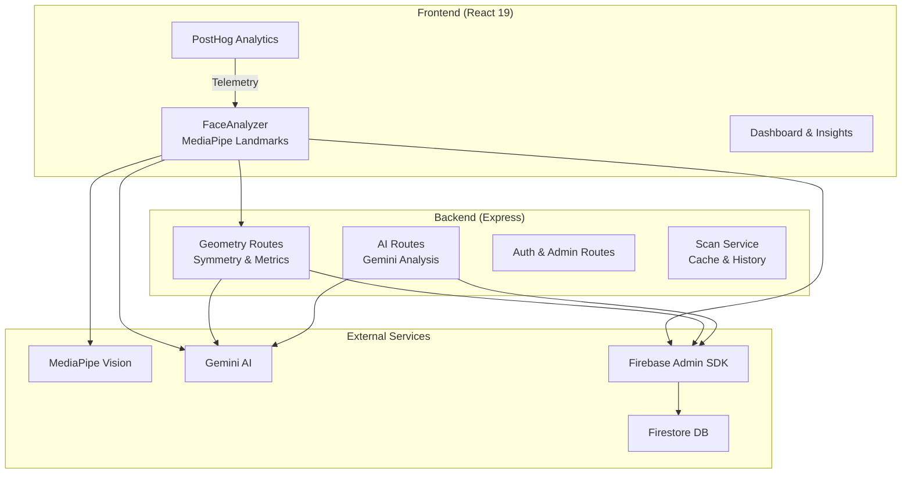
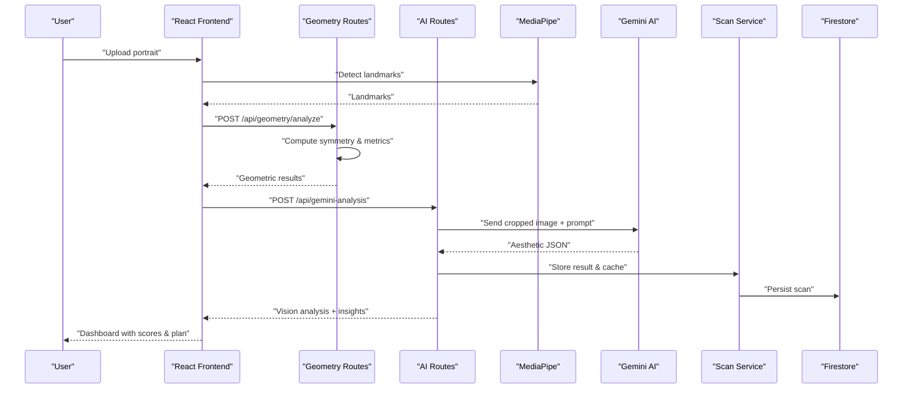
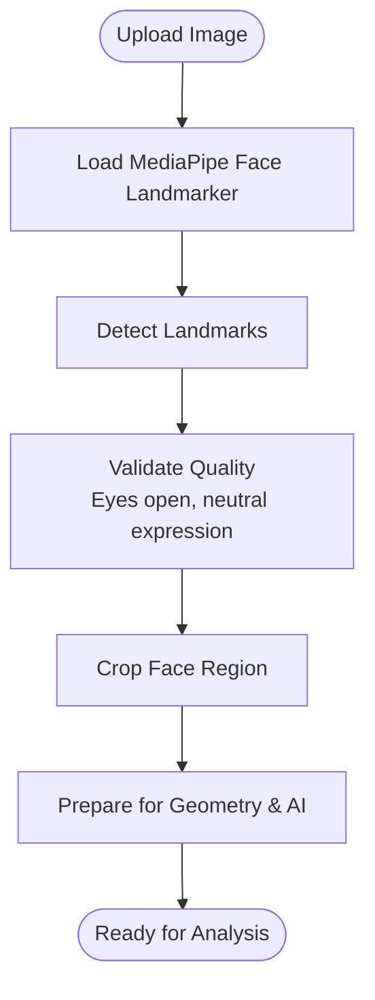
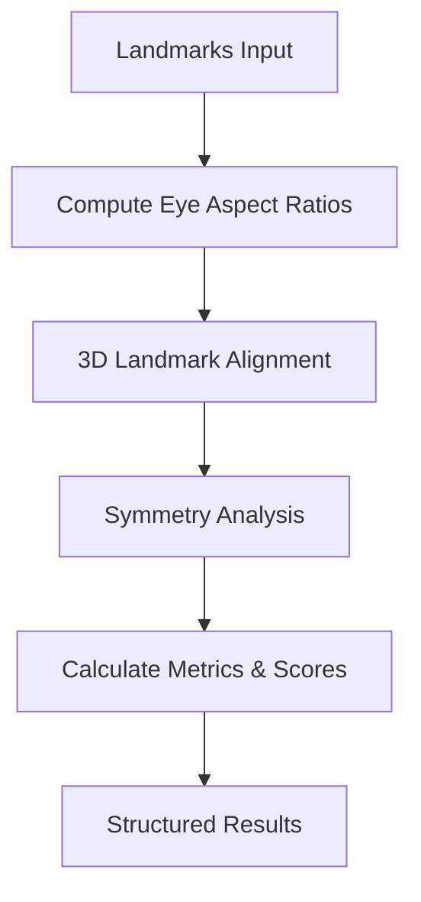
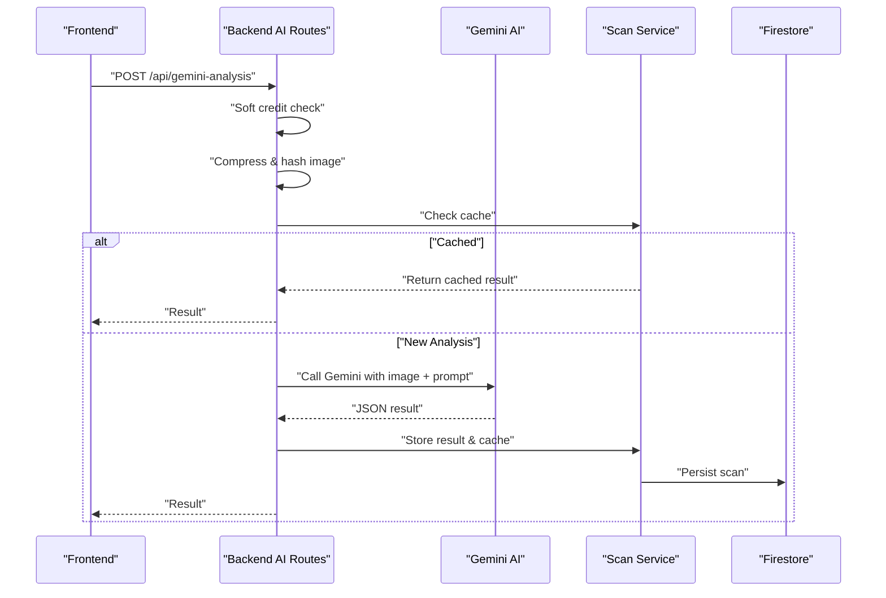
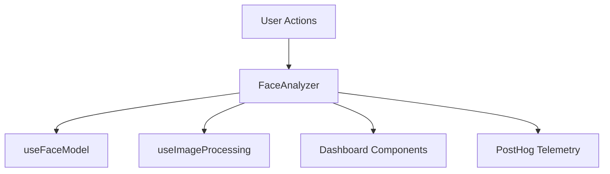
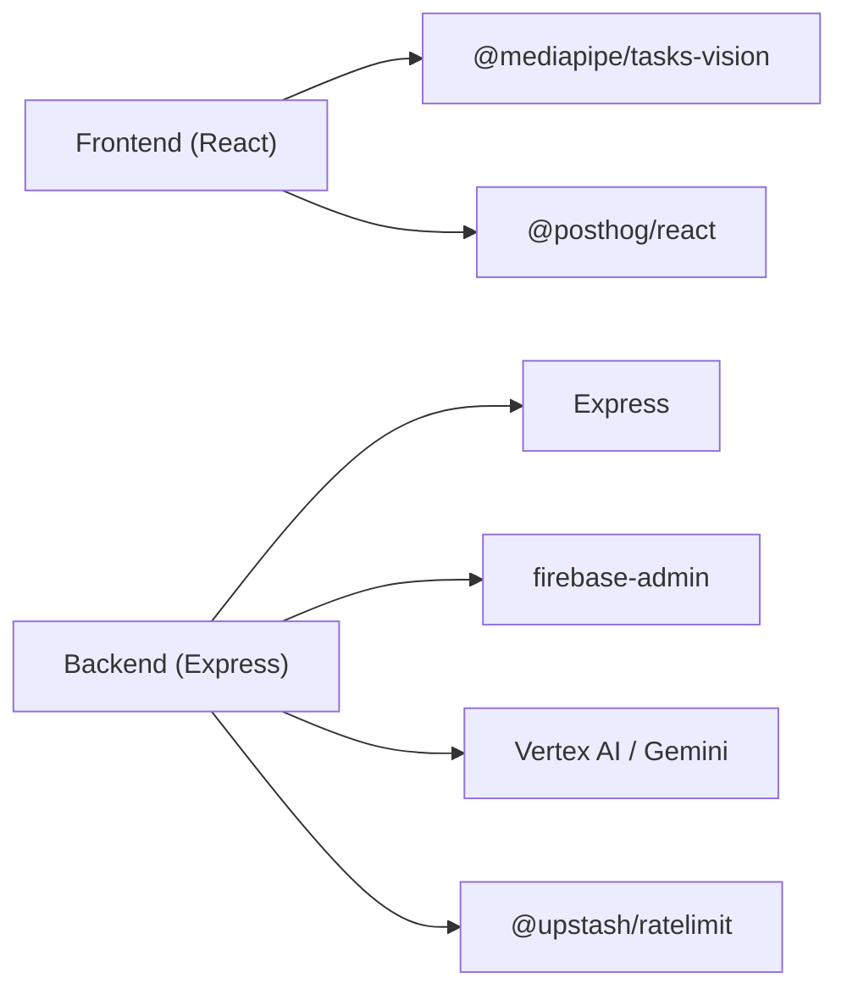

# Project Overview

<cite>
**Referenced Files in This Document**
- [README.md](file://README.md)
- [package.json](file://package.json)
- [backend/app.ts](file://backend/app.ts)
- [backend/routes/ai.routes.ts](file://backend/routes/ai.routes.ts)
- [backend/routes/geometry.routes.ts](file://backend/routes/geometry.routes.ts)
- [backend/services/scan.service.ts](file://backend/services/scan.service.ts)
- [backend/types/mediapipe.ts](file://backend/types/mediapipe.ts)
- [src/App.tsx](file://src/App.tsx)
- [src/main.tsx](file://src/main.tsx)
- [src/components/FaceAnalyzer/FaceAnalyzer.tsx](file://src/components/FaceAnalyzer/FaceAnalyzer.tsx)
- [src/components/FaceAnalyzer/hooks/useFaceModel.ts](file://src/components/FaceAnalyzer/hooks/useFaceModel.ts)
- [src/components/FaceAnalyzer/hooks/useImageProcessing.ts](file://src/components/FaceAnalyzer/hooks/useImageProcessing.ts)
- [src/tokens/analysis.ts](file://src/tokens/analysis.ts)
</cite>

## Table of Contents
1. [Introduction](#introduction)
2. [Project Structure](#project-structure)
3. [Core Components](#core-components)
4. [Architecture Overview](#architecture-overview)
5. [Detailed Component Analysis](#detailed-component-analysis)
6. [Dependency Analysis](#dependency-analysis)
7. [Performance Considerations](#performance-considerations)
8. [Troubleshooting Guide](#troubleshooting-guide)
9. [Conclusion](#conclusion)

## Introduction
FaceAnalytics Pro is a professional AI-powered facial analysis and symmetry scoring platform. It combines MediaPipe for precise facial landmark detection with Gemini AI for detailed aesthetic analysis, delivering structured insights into facial structure, symmetry, skin quality, and personalized improvement recommendations. The platform targets individuals interested in facial aesthetics and beauty, as well as professionals who require reliable, reproducible measurements and visual feedback.

Core value proposition:
- MediaPipe-based landmark detection ensures robust, real-time facial geometry extraction.
- Gemini AI delivers comprehensive aesthetic assessments, including skin analysis, face shape classification, seasonal color analysis, and actionable improvement plans.
- The system emphasizes privacy and performance, processing images efficiently while maintaining user trust.

Target audience:
- Beauty enthusiasts seeking self-awareness and improvement guidance.
- Individuals exploring facial symmetry and aesthetic balance.
- Professionals in aesthetics, dermatology, and beauty consulting who need quantifiable insights.

## Project Structure
The project follows a modern full-stack architecture:
- Frontend built with React 19, Vite, and TypeScript, providing an interactive, animated user experience.
- Backend powered by Express.js and TypeScript, serving APIs for geometry analysis, AI-driven aesthetic insights, and user management.
- Firebase integrates for authentication, user data, and analytics.
- AI services powered by MediaPipe and Gemini, enabling on-device landmark detection and cloud-based aesthetic analysis.

**Diagram sources**
- [backend/app.ts:15-201](file://backend/app.ts#L15-L201)
- [backend/routes/geometry.routes.ts:19-74](file://backend/routes/geometry.routes.ts#L19-L74)
- [backend/routes/ai.routes.ts:271-516](file://backend/routes/ai.routes.ts#L271-L516)
- [backend/services/scan.service.ts:68-94](file://backend/services/scan.service.ts#L68-L94)
- [src/components/FaceAnalyzer/hooks/useFaceModel.ts:9-33](file://src/components/FaceAnalyzer/hooks/useFaceModel.ts#L9-L33)

**Section sources**
- [README.md:5-23](file://README.md#L5-L23)
- [package.json:19-52](file://package.json#L19-L52)
- [backend/app.ts:15-201](file://backend/app.ts#L15-L201)

## Core Components
- MediaPipe Face Landmarker: Loads the 3D face model in the browser and detects facial landmarks from uploaded images.
- Geometry Analysis: Computes symmetry, facial proportions, and breakdown scores using aligned landmarks.
- Gemini AI Analysis: Performs detailed aesthetic analysis, including skin quality, face shape, color season, and improvement recommendations.
- Scan Service: Handles caching, deduplication, and persistence of analysis results for user history.
- Frontend Dashboard: Presents structured insights, symmetry visuals, and personalized improvement plans.

Practical examples of common use cases:
- Symmetry scoring and facial proportion analysis for personal development.
- Skin quality and aesthetic insights to guide skincare and grooming choices.
- Celebrity lookalike analysis to explore facial similarities.
- Hair recommendations tailored to face shape and features.

**Section sources**
- [src/components/FaceAnalyzer/hooks/useFaceModel.ts:9-33](file://src/components/FaceAnalyzer/hooks/useFaceModel.ts#L9-L33)
- [backend/routes/geometry.routes.ts:19-74](file://backend/routes/geometry.routes.ts#L19-L74)
- [backend/routes/ai.routes.ts:271-516](file://backend/routes/ai.routes.ts#L271-L516)
- [backend/services/scan.service.ts:68-94](file://backend/services/scan.service.ts#L68-L94)
- [src/components/FaceAnalyzer/FaceAnalyzer.tsx:11-119](file://src/components/FaceAnalyzer/FaceAnalyzer.tsx#L11-L119)

## Architecture Overview
The system processes facial images through a pipeline that leverages MediaPipe for geometry and Gemini for aesthetic insights. The backend orchestrates rate limiting, fraud checks, credit management, and result caching. Firebase secures user sessions and stores analysis history.

**Diagram sources**
- [src/components/FaceAnalyzer/hooks/useFaceModel.ts:9-33](file://src/components/FaceAnalyzer/hooks/useFaceModel.ts#L9-L33)
- [backend/routes/geometry.routes.ts:19-74](file://backend/routes/geometry.routes.ts#L19-L74)
- [backend/routes/ai.routes.ts:271-516](file://backend/routes/ai.routes.ts#L271-L516)
- [backend/services/scan.service.ts:68-94](file://backend/services/scan.service.ts#L68-L94)

## Detailed Component Analysis

### Technology Stack Overview
- Frontend: React 19, Vite 6, Tailwind 4, Framer Motion, Lenis.
- Backend: Node.js, Express, TypeScript.
- Database/Auth: Firebase & Firestore.
- Analytics: PostHog.
- Payments: PayPal.
- AI: MediaPipe Vision for landmarks, Gemini AI for aesthetic analysis.

**Section sources**
- [README.md:18-22](file://README.md#L18-L22)
- [package.json:19-52](file://package.json#L19-L52)

### MediaPipe Landmark Detection
MediaPipe loads the face landmarker in the browser and detects 468–478 landmarks per face. The frontend validates image quality, crops the face region, and prepares the image for AI analysis.

**Diagram sources**
- [src/components/FaceAnalyzer/hooks/useFaceModel.ts:9-33](file://src/components/FaceAnalyzer/hooks/useFaceModel.ts#L9-L33)
- [src/components/FaceAnalyzer/hooks/useImageProcessing.ts:26-147](file://src/components/FaceAnalyzer/hooks/useImageProcessing.ts#L26-L147)

**Section sources**
- [src/components/FaceAnalyzer/hooks/useFaceModel.ts:9-33](file://src/components/FaceAnalyzer/hooks/useFaceModel.ts#L9-L33)
- [src/components/FaceAnalyzer/hooks/useImageProcessing.ts:26-147](file://src/components/FaceAnalyzer/hooks/useImageProcessing.ts#L26-L147)

### Geometry Analysis Pipeline
The backend computes eye aspect ratios, aligns landmarks, calculates symmetry, and derives facial metrics and breakdown scores. Results include overall score, symmetry, proportions, and strengths/weaknesses.

**Diagram sources**
- [backend/routes/geometry.routes.ts:19-74](file://backend/routes/geometry.routes.ts#L19-L74)
- [backend/types/mediapipe.ts:18-44](file://backend/types/mediapipe.ts#L18-L44)

**Section sources**
- [backend/routes/geometry.routes.ts:19-74](file://backend/routes/geometry.routes.ts#L19-L74)
- [backend/types/mediapipe.ts:18-44](file://backend/types/mediapipe.ts#L18-L44)

### AI Aesthetic Analysis
Gemini AI receives a cropped, resized image and a structured prompt to produce a comprehensive aesthetic report. The backend enforces rate limits, daily caps, fraud checks, and credit-safe ordering: AI calls occur before credit deduction, ensuring users receive results even if the database is temporarily unavailable.

**Diagram sources**
- [backend/routes/ai.routes.ts:271-516](file://backend/routes/ai.routes.ts#L271-L516)
- [backend/services/scan.service.ts:31-94](file://backend/services/scan.service.ts#L31-L94)

**Section sources**
- [backend/routes/ai.routes.ts:271-516](file://backend/routes/ai.routes.ts#L271-L516)
- [backend/services/scan.service.ts:31-94](file://backend/services/scan.service.ts#L31-L94)

### Frontend Dashboard and User Experience
The React frontend provides an animated, privacy-focused experience. It guides users through upload, editing, and analysis, displaying structured insights, symmetry visuals, and personalized improvement plans. PostHog telemetry captures user actions for product insights.

**Diagram sources**
- [src/App.tsx:456-472](file://src/App.tsx#L456-L472)
- [src/main.tsx:33-39](file://src/main.tsx#L33-L39)
- [src/components/FaceAnalyzer/FaceAnalyzer.tsx:11-119](file://src/components/FaceAnalyzer/FaceAnalyzer.tsx#L11-L119)

**Section sources**
- [src/App.tsx:456-472](file://src/App.tsx#L456-L472)
- [src/main.tsx:33-39](file://src/main.tsx#L33-L39)
- [src/components/FaceAnalyzer/FaceAnalyzer.tsx:11-119](file://src/components/FaceAnalyzer/FaceAnalyzer.tsx#L11-L119)

## Dependency Analysis
The system’s dependencies span frontend, backend, and external services:
- Frontend depends on MediaPipe for landmarks, React for UI, and PostHog for analytics.
- Backend depends on Express for routing, Firebase Admin for Firestore, and Gemini for AI inference.
- Geometry and AI endpoints depend on shared validation and rate-limiting middleware.

**Diagram sources**
- [package.json:19-52](file://package.json#L19-L52)
- [backend/app.ts:15-201](file://backend/app.ts#L15-L201)

**Section sources**
- [package.json:19-52](file://package.json#L19-L52)
- [backend/app.ts:15-201](file://backend/app.ts#L15-L201)

## Performance Considerations
- MediaPipe model loading occurs once and is reused for subsequent analyses.
- Image compression and cropping reduce payload sizes for AI inference.
- Rate limiting and daily caps protect resources while preventing abuse.
- Progressive UI updates maintain perceived responsiveness during long AI calls.
- Cache hits eliminate redundant AI calls for identical images.

[No sources needed since this section provides general guidance]

## Troubleshooting Guide
Common issues and resolutions:
- Model loading failures: Refresh the page; ensure CDN availability for MediaPipe WASM assets.
- No face detected or multiple faces: Use a clear front-facing selfie with eyes open and neutral expression.
- Insufficient credits: Purchase credits or wait until the daily cap resets.
- Slow AI responses: Gemini latency varies; the UI maintains progress feedback during analysis.
- Cache misses: First-time analyses or edited images may not be cached; expect a fresh AI call.

**Section sources**
- [src/components/FaceAnalyzer/hooks/useFaceModel.ts:26-30](file://src/components/FaceAnalyzer/hooks/useFaceModel.ts#L26-L30)
- [src/components/FaceAnalyzer/hooks/useImageProcessing.ts:60-83](file://src/components/FaceAnalyzer/hooks/useImageProcessing.ts#L60-L83)
- [backend/routes/ai.routes.ts:304-322](file://backend/routes/ai.routes.ts#L304-L322)
- [backend/routes/geometry.routes.ts:23-29](file://backend/routes/geometry.routes.ts#L23-L29)

## Conclusion
FaceAnalytics Pro delivers a seamless, privacy-conscious platform for facial analysis and symmetry scoring. By combining MediaPipe’s robust landmark detection with Gemini’s nuanced aesthetic insights, it empowers users to understand their facial structure, track improvements, and make informed decisions about skincare, grooming, and lifestyle choices. The architecture balances performance, scalability, and user experience, making it suitable for both individual exploration and professional use.