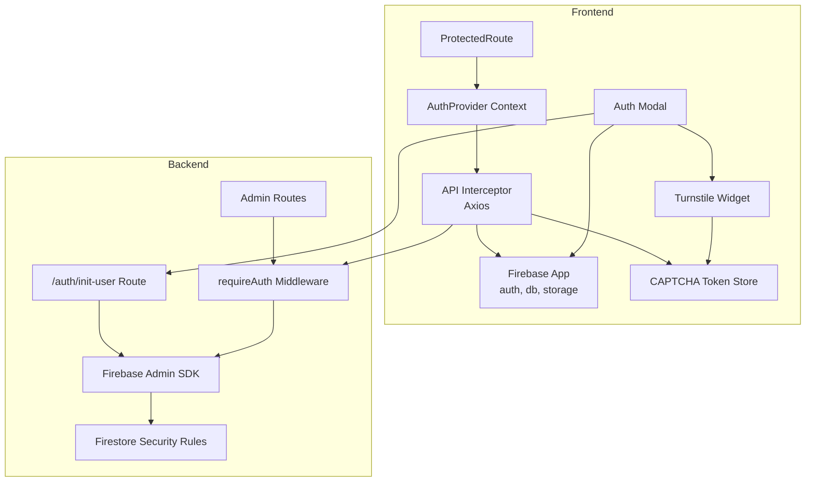
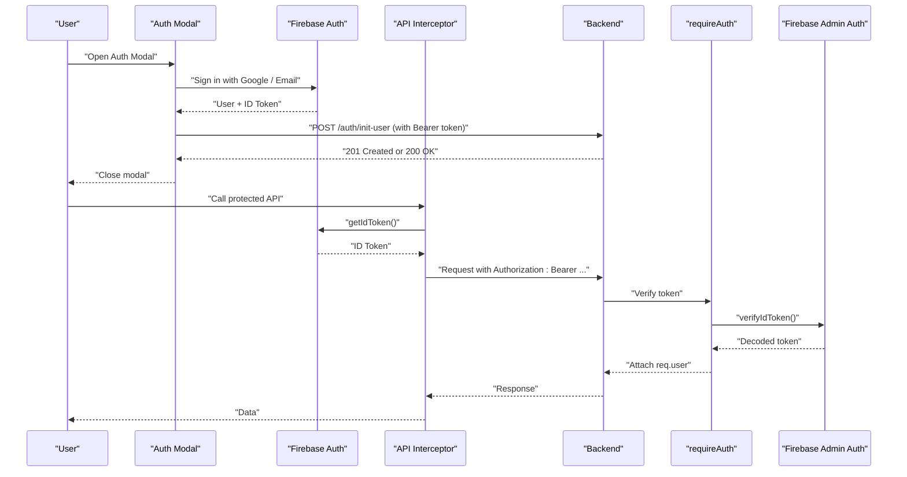
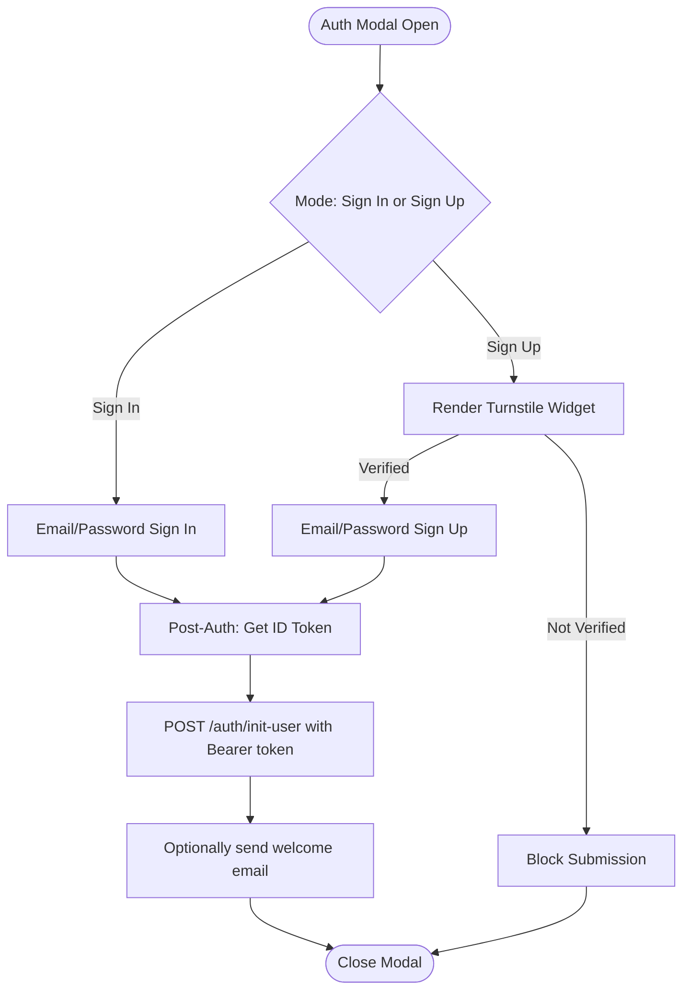
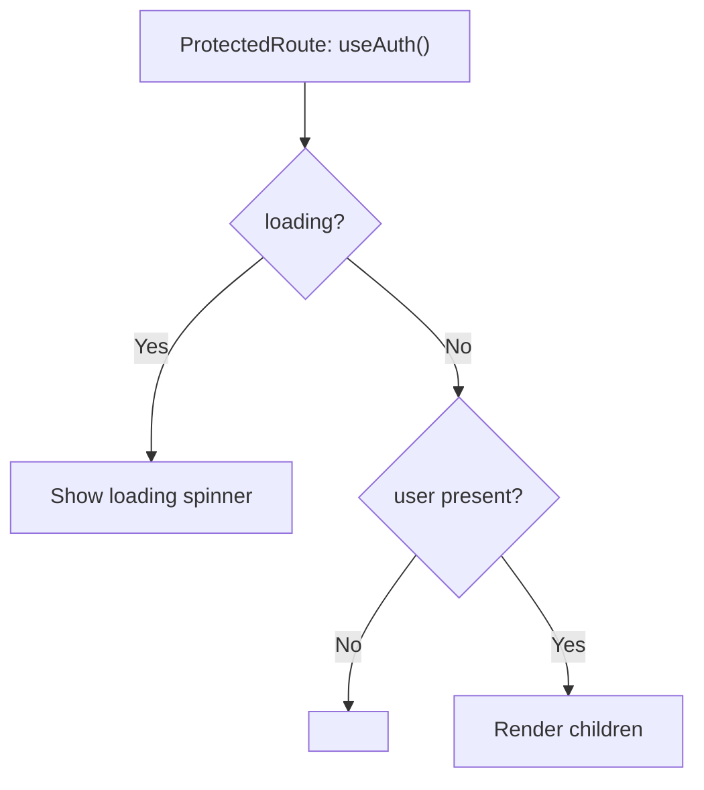
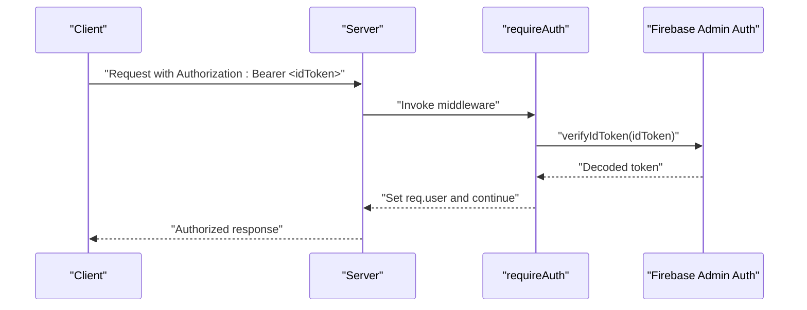
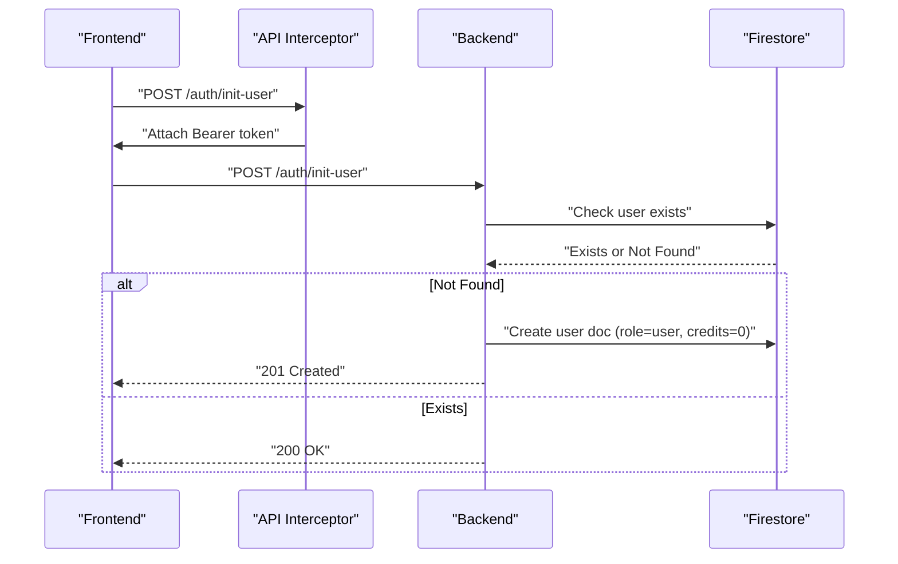
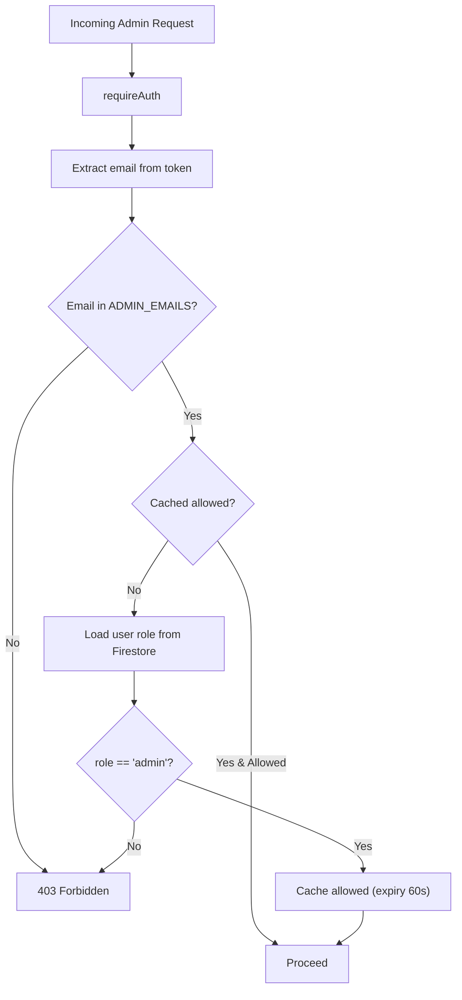
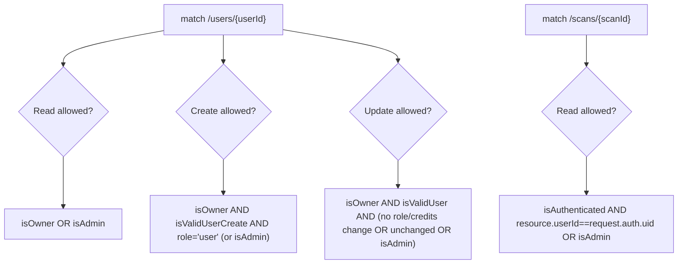
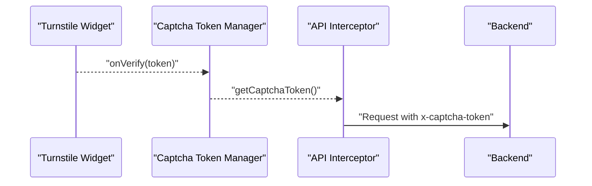
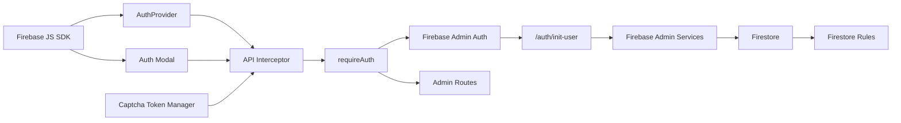

# Authentication and Authorization

<cite>
**Referenced Files in This Document**
- [AuthProvider.tsx](file://src/context/AuthProvider.tsx)
- [Auth.tsx](file://src/components/Auth.tsx)
- [ProtectedRoute.tsx](file://src/routes/ProtectedRoute.tsx)
- [api.ts](file://src/lib/api.ts)
- [firebase.ts](file://src/firebase.ts)
- [captcha.ts](file://src/lib/captcha.ts)
- [Turnstile.tsx](file://src/components/Turnstile.tsx)
- [auth.middleware.ts](file://backend/middleware/auth.middleware.ts)
- [auth.routes.ts](file://backend/routes/auth.routes.ts)
- [firebase.service.ts](file://backend/services/firebase.service.ts)
- [admin.routes.ts](file://backend/routes/admin.routes.ts)
- [firestore.rules](file://firestore.rules)
- [config.ts](file://backend/utils/config.ts)
</cite>

## Table of Contents
1. [Introduction](#introduction)
2. [Project Structure](#project-structure)
3. [Core Components](#core-components)
4. [Architecture Overview](#architecture-overview)
5. [Detailed Component Analysis](#detailed-component-analysis)
6. [Dependency Analysis](#dependency-analysis)
7. [Performance Considerations](#performance-considerations)
8. [Troubleshooting Guide](#troubleshooting-guide)
9. [Conclusion](#conclusion)
10. [Appendices](#appendices)

## Introduction
This document explains the authentication and authorization architecture for FaceAnalytics Pro. It covers Firebase Authentication integration for user registration and login, session management on the frontend, backend authentication middleware, JWT verification, and role-based access control. It also documents protected routes, security token management, refresh token strategies, and best practices for password policies, account security, and session timeouts.

## Project Structure
Authentication spans the frontend React application and the backend Node.js service:
- Frontend: Firebase Auth initialization, AuthProvider context, Auth modal, API interceptor, and Turnstile CAPTCHA integration.
- Backend: Firebase Admin SDK initialization, authentication middleware, user initialization endpoint, admin-only routes, and Firestore security rules.

**Diagram sources**
- [firebase.ts:1-21](file://src/firebase.ts#L1-L21)
- [api.ts:1-36](file://src/lib/api.ts#L1-L36)
- [captcha.ts:1-25](file://src/lib/captcha.ts#L1-L25)
- [Turnstile.tsx:1-278](file://src/components/Turnstile.tsx#L1-L278)
- [AuthProvider.tsx:1-75](file://src/context/AuthProvider.tsx#L1-L75)
- [Auth.tsx:1-696](file://src/components/Auth.tsx#L1-L696)
- [ProtectedRoute.tsx:1-22](file://src/routes/ProtectedRoute.tsx#L1-L22)
- [auth.middleware.ts:1-40](file://backend/middleware/auth.middleware.ts#L1-L40)
- [auth.routes.ts:1-91](file://backend/routes/auth.routes.ts#L1-L91)
- [firebase.service.ts:1-120](file://backend/services/firebase.service.ts#L1-L120)
- [admin.routes.ts:1-133](file://backend/routes/admin.routes.ts#L1-L133)
- [firestore.rules:1-118](file://firestore.rules#L1-L118)

**Section sources**
- [firebase.ts:1-21](file://src/firebase.ts#L1-L21)
- [api.ts:1-36](file://src/lib/api.ts#L1-L36)
- [captcha.ts:1-25](file://src/lib/captcha.ts#L1-L25)
- [Turnstile.tsx:1-278](file://src/components/Turnstile.tsx#L1-L278)
- [AuthProvider.tsx:1-75](file://src/context/AuthProvider.tsx#L1-L75)
- [Auth.tsx:1-696](file://src/components/Auth.tsx#L1-L696)
- [ProtectedRoute.tsx:1-22](file://src/routes/ProtectedRoute.tsx#L1-L22)
- [auth.middleware.ts:1-40](file://backend/middleware/auth.middleware.ts#L1-L40)
- [auth.routes.ts:1-91](file://backend/routes/auth.routes.ts#L1-L91)
- [firebase.service.ts:1-120](file://backend/services/firebase.service.ts#L1-L120)
- [admin.routes.ts:1-133](file://backend/routes/admin.routes.ts#L1-L133)
- [firestore.rules:1-118](file://firestore.rules#L1-L118)

## Core Components
- Firebase Initialization: Initializes Firebase app, auth, Firestore, and Storage for both frontend and backend.
- AuthProvider Context: Subscribes to Firebase Auth state, initializes user on backend, and exposes user/loading state.
- Auth Modal: Handles Google and email/password sign-in/sign-up, redirects, and post-auth flows.
- API Interceptor: Automatically attaches Firebase ID tokens and CAPTCHA tokens to outgoing requests.
- Authentication Middleware: Verifies Bearer tokens via Firebase Admin Auth.
- User Initialization Route: Creates user profiles in Firestore on first sign-in.
- Admin Routes: Role-based access control enforcing admin-only endpoints.
- Firestore Rules: Enforce ownership and role checks for users and scans.

**Section sources**
- [firebase.ts:1-21](file://src/firebase.ts#L1-L21)
- [AuthProvider.tsx:1-75](file://src/context/AuthProvider.tsx#L1-L75)
- [Auth.tsx:1-696](file://src/components/Auth.tsx#L1-L696)
- [api.ts:1-36](file://src/lib/api.ts#L1-L36)
- [auth.middleware.ts:1-40](file://backend/middleware/auth.middleware.ts#L1-L40)
- [auth.routes.ts:1-91](file://backend/routes/auth.routes.ts#L1-L91)
- [admin.routes.ts:1-133](file://backend/routes/admin.routes.ts#L1-L133)
- [firestore.rules:1-118](file://firestore.rules#L1-L118)

## Architecture Overview
The system uses Firebase Authentication for identity and Firebase Admin SDK for secure server-side verification. The frontend obtains ID tokens and attaches them to API requests. The backend verifies tokens and enforces role-based access control. Firestore rules provide an additional layer of authorization.

**Diagram sources**
- [Auth.tsx:88-116](file://src/components/Auth.tsx#L88-L116)
- [api.ts:9-33](file://src/lib/api.ts#L9-L33)
- [auth.routes.ts:23-88](file://backend/routes/auth.routes.ts#L23-L88)
- [auth.middleware.ts:18-39](file://backend/middleware/auth.middleware.ts#L18-L39)
- [firebase.service.ts:113-119](file://backend/services/firebase.service.ts#L113-L119)

## Detailed Component Analysis

### Frontend Authentication Flow: AuthProvider and Auth Modal
- AuthProvider subscribes to Firebase Auth state, caches initialization per user, and calls the backend initialization endpoint once per session.
- The Auth modal supports Google OAuth (popup/redirect fallback), email/password sign-up/sign-in, and password reset. It integrates Turnstile CAPTCHA for bot protection and sends a welcome email after successful sign-up.

**Diagram sources**
- [AuthProvider.tsx:18-60](file://src/context/AuthProvider.tsx#L18-L60)
- [Auth.tsx:133-183](file://src/components/Auth.tsx#L133-L183)
- [Auth.tsx:185-248](file://src/components/Auth.tsx#L185-L248)
- [auth.routes.ts:23-88](file://backend/routes/auth.routes.ts#L23-L88)

**Section sources**
- [AuthProvider.tsx:1-75](file://src/context/AuthProvider.tsx#L1-L75)
- [Auth.tsx:1-696](file://src/components/Auth.tsx#L1-L696)

### Protected Route Implementation
- ProtectedRoute renders a loading spinner while AuthProvider resolves, then either navigates to home or renders children based on user presence.

**Diagram sources**
- [ProtectedRoute.tsx:5-21](file://src/routes/ProtectedRoute.tsx#L5-L21)

**Section sources**
- [ProtectedRoute.tsx:1-22](file://src/routes/ProtectedRoute.tsx#L1-L22)

### Backend Authentication Middleware and JWT Verification
- requireAuth extracts the Bearer token from the Authorization header, verifies it using Firebase Admin Auth, and attaches decoded claims to req.user.

**Diagram sources**
- [auth.middleware.ts:18-39](file://backend/middleware/auth.middleware.ts#L18-L39)
- [firebase.service.ts:113-119](file://backend/services/firebase.service.ts#L113-L119)

**Section sources**
- [auth.middleware.ts:1-40](file://backend/middleware/auth.middleware.ts#L1-L40)
- [firebase.service.ts:1-120](file://backend/services/firebase.service.ts#L1-L120)

### User Initialization and Session Management
- The frontend calls POST /auth/init-user after sign-in to create a Firestore user profile if it does not exist. AuthProvider caches initialization per tab and persists a small marker in localStorage to avoid repeated backend calls.
- The backend caches “user exists” in memory for the lifetime of the process to reduce Firestore reads.

**Diagram sources**
- [AuthProvider.tsx:39-60](file://src/context/AuthProvider.tsx#L39-L60)
- [auth.routes.ts:23-88](file://backend/routes/auth.routes.ts#L23-L88)

**Section sources**
- [AuthProvider.tsx:1-75](file://src/context/AuthProvider.tsx#L1-L75)
- [auth.routes.ts:1-91](file://backend/routes/auth.routes.ts#L1-L91)

### Role-Based Access Control and Admin Routes
- Admin-only routes enforce two-layer checks: verified admin email from the token and a Firestore role field. A short-lived cache prevents frequent DB reads.

**Diagram sources**
- [admin.routes.ts:14-42](file://backend/routes/admin.routes.ts#L14-L42)
- [config.ts:88-94](file://backend/utils/config.ts#L88-L94)

**Section sources**
- [admin.routes.ts:1-133](file://backend/routes/admin.routes.ts#L1-L133)
- [config.ts:1-110](file://backend/utils/config.ts#L1-L110)

### Firestore Security Rules and Ownership Checks
- Firestore rules enforce ownership for user and scan collections and restrict updates to prevent unauthorized role/credits changes. Admins can read/update/delete any resource.

**Diagram sources**
- [firestore.rules:89-111](file://firestore.rules#L89-L111)

**Section sources**
- [firestore.rules:1-118](file://firestore.rules#L1-L118)

### CAPTCHA Integration and Token Management
- Turnstile widget renders and provides a token. The token manager stores and exposes the latest token to API interceptors. The interceptor attaches x-captcha-token to requests.

**Diagram sources**
- [Turnstile.tsx:155-178](file://src/components/Turnstile.tsx#L155-L178)
- [captcha.ts:1-25](file://src/lib/captcha.ts#L1-L25)
- [api.ts:22-26](file://src/lib/api.ts#L22-L26)

**Section sources**
- [Turnstile.tsx:1-278](file://src/components/Turnstile.tsx#L1-L278)
- [captcha.ts:1-25](file://src/lib/captcha.ts#L1-L25)
- [api.ts:1-36](file://src/lib/api.ts#L1-L36)

## Dependency Analysis
- Frontend depends on Firebase JS SDK for authentication and Firestore. The API interceptor depends on Firebase Auth for tokens and the CAPTCHA token manager for headers.
- Backend depends on Firebase Admin SDK for token verification and Firestore access. Admin routes depend on environment configuration for admin email lists.

**Diagram sources**
- [firebase.ts:1-21](file://src/firebase.ts#L1-L21)
- [AuthProvider.tsx:1-75](file://src/context/AuthProvider.tsx#L1-L75)
- [Auth.tsx:1-696](file://src/components/Auth.tsx#L1-L696)
- [api.ts:1-36](file://src/lib/api.ts#L1-L36)
- [captcha.ts:1-25](file://src/lib/captcha.ts#L1-L25)
- [auth.middleware.ts:1-40](file://backend/middleware/auth.middleware.ts#L1-L40)
- [auth.routes.ts:1-91](file://backend/routes/auth.routes.ts#L1-L91)
- [firebase.service.ts:1-120](file://backend/services/firebase.service.ts#L1-L120)
- [admin.routes.ts:1-133](file://backend/routes/admin.routes.ts#L1-L133)
- [firestore.rules:1-118](file://firestore.rules#L1-L118)

**Section sources**
- [firebase.ts:1-21](file://src/firebase.ts#L1-L21)
- [api.ts:1-36](file://src/lib/api.ts#L1-L36)
- [auth.middleware.ts:1-40](file://backend/middleware/auth.middleware.ts#L1-L40)
- [auth.routes.ts:1-91](file://backend/routes/auth.routes.ts#L1-L91)
- [firebase.service.ts:1-120](file://backend/services/firebase.service.ts#L1-L120)
- [admin.routes.ts:1-133](file://backend/routes/admin.routes.ts#L1-L133)
- [firestore.rules:1-118](file://firestore.rules#L1-L118)

## Performance Considerations
- Frontend initialization caching: AuthProvider avoids redundant backend calls by caching initialization per tab and persisting a small marker in localStorage.
- Backend user existence caching: A process-wide Set tracks known user IDs to minimize Firestore reads.
- Firestore HTTP/1.1 transport: Backend switches Firestore to REST to avoid cold-start gRPC delays in serverless environments.
- Rate limiting: Authentication endpoints use shared rate limiters to mitigate abuse.

**Section sources**
- [AuthProvider.tsx:18-60](file://src/context/AuthProvider.tsx#L18-L60)
- [auth.routes.ts:17-21](file://backend/routes/auth.routes.ts#L17-L21)
- [firebase.service.ts:97-108](file://backend/services/firebase.service.ts#L97-L108)

## Troubleshooting Guide
Common issues and resolutions:
- Unauthorized: No token provided or Invalid token
  - Cause: Missing or expired Bearer token.
  - Resolution: Ensure the API interceptor is attached and Firebase Auth is signed in; re-fetch token if needed.
  - Section sources
    - [auth.middleware.ts:18-39](file://backend/middleware/auth.middleware.ts#L18-L39)
    - [api.ts:9-33](file://src/lib/api.ts#L9-L33)

- Frontend initialization not completing
  - Cause: Backend initialization endpoint failing or not called.
  - Resolution: Verify AuthProvider subscription and POST /auth/init-user is invoked after sign-in; check network tab for errors.
  - Section sources
    - [AuthProvider.tsx:18-60](file://src/context/AuthProvider.tsx#L18-L60)
    - [Auth.tsx:88-116](file://src/components/Auth.tsx#L88-L116)

- Admin access denied
  - Cause: Email not in ADMIN_EMAILS or user role not set to admin.
  - Resolution: Confirm ADMIN_EMAILS environment variable and Firestore user role.
  - Section sources
    - [admin.routes.ts:14-42](file://backend/routes/admin.routes.ts#L14-L42)
    - [config.ts:88-94](file://backend/utils/config.ts#L88-L94)

- Firestore permission denied
  - Cause: Attempting to modify another user’s profile or unauthorized update.
  - Resolution: Ensure ownership and avoid changing role/credits unless admin.
  - Section sources
    - [firestore.rules:89-111](file://firestore.rules#L89-L111)

- CAPTCHA verification failures
  - Cause: Missing or expired Turnstile token.
  - Resolution: Ensure Turnstile widget loads and token is stored; interceptor will attach x-captcha-token.
  - Section sources
    - [Turnstile.tsx:155-178](file://src/components/Turnstile.tsx#L155-L178)
    - [captcha.ts:1-25](file://src/lib/captcha.ts#L1-L25)
    - [api.ts:22-26](file://src/lib/api.ts#L22-L26)

## Conclusion
FaceAnalytics Pro implements a robust authentication and authorization system using Firebase Authentication and Admin SDK. The frontend manages sessions via AuthProvider and API interceptors, while the backend enforces token verification and role-based access control. Firestore rules provide an additional authorization layer. The design emphasizes performance, security, and resilience with caching, rate limiting, and strict environment validation.

## Appendices

### Security Best Practices
- Password policies: Enforce strong passwords and consider enabling multi-factor authentication in Firebase Authentication settings.
- Session timeout: Rely on Firebase ID token lifetimes; refresh tokens are managed by Firebase. Avoid storing long-lived credentials client-side.
- Token handling: Never log raw tokens; use Bearer tokens only over HTTPS; rotate service account keys periodically.
- Rate limiting: Keep current rate limits; monitor abuse indicators.
- Admin access: Limit ADMIN_EMAILS to trusted individuals; review role assignments in Firestore.

### Refresh Token Strategies
- Firebase ID tokens refresh automatically when requested by the SDK. There is no explicit refresh token endpoint in this codebase; rely on getIdToken() usage in the interceptor.

### Environment Configuration Examples
- Required backend environment variables include Firebase service account configuration, admin email list, and external service keys. Validation occurs at startup.

**Section sources**
- [config.ts:7-48](file://backend/utils/config.ts#L7-L48)
- [firebase.service.ts:14-49](file://backend/services/firebase.service.ts#L14-L49)