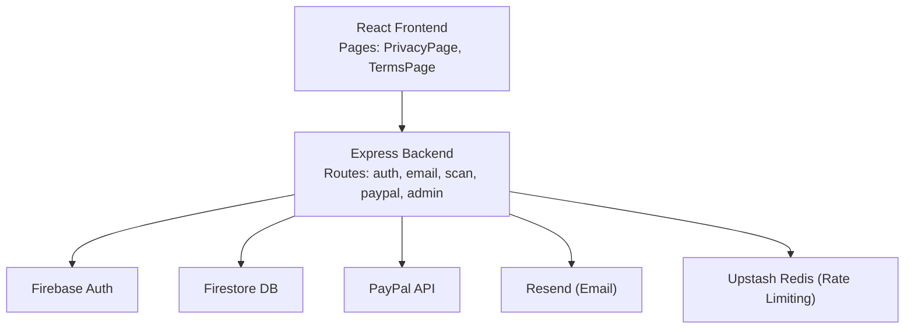
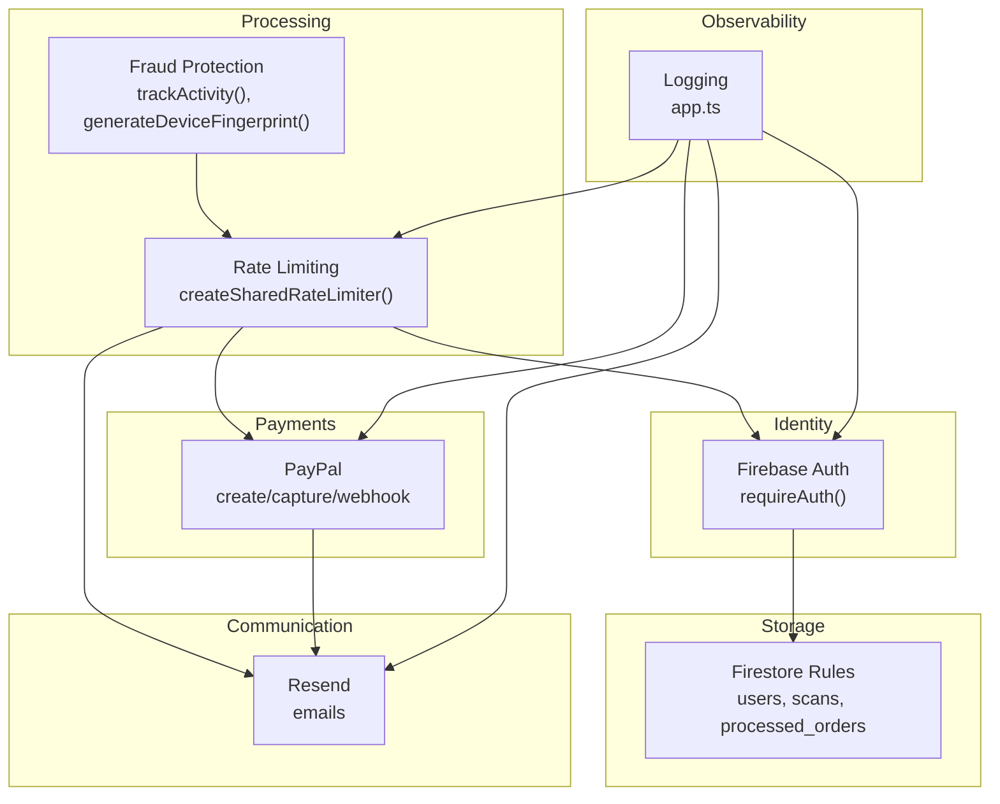
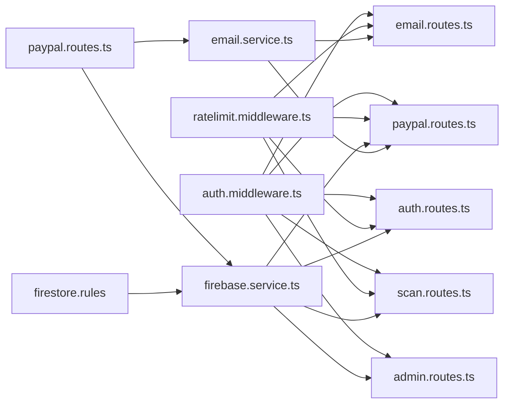
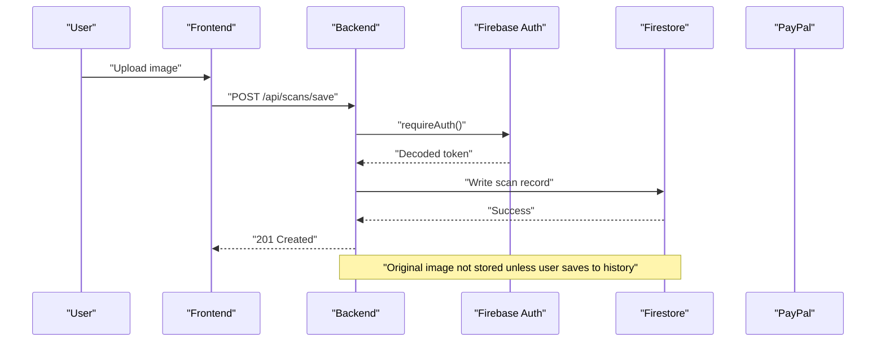
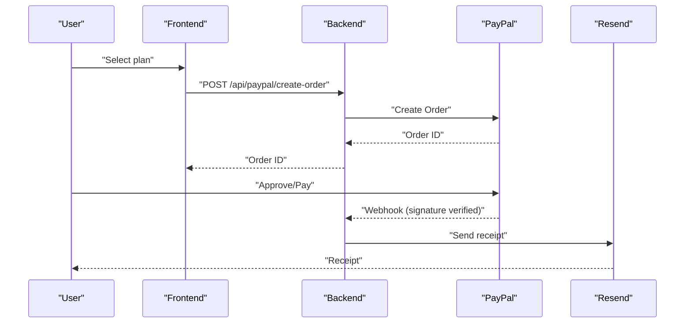
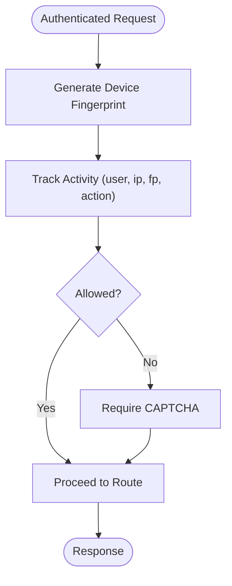

# Compliance and Regulatory

<cite>
**Referenced Files in This Document**
- [README.md](file://README.md)
- [PrivacyPolicy.tsx](file://src/components/PrivacyPolicy.tsx)
- [TermsOfService.tsx](file://src/components/TermsOfService.tsx)
- [PrivacyPage.tsx](file://src/pages/PrivacyPage.tsx)
- [TermsPage.tsx](file://src/pages/TermsPage.tsx)
- [auth.middleware.ts](file://backend/middleware/auth.middleware.ts)
- [ratelimit.middleware.ts](file://backend/middleware/ratelimit.middleware.ts)
- [firebase.service.ts](file://backend/services/firebase.service.ts)
- [auth.routes.ts](file://backend/routes/auth.routes.ts)
- [email.routes.ts](file://backend/routes/email.routes.ts)
- [email.service.ts](file://backend/services/email.service.ts)
- [scan.routes.ts](file://backend/routes/scan.routes.ts)
- [paypal.routes.ts](file://backend/routes/paypal.routes.ts)
- [admin.routes.ts](file://backend/routes/admin.routes.ts)
- [fraud.service.ts](file://backend/services/fraud.service.ts)
- [firestore.rules](file://firestore.rules)
- [app.ts](file://backend/app.ts)
</cite>

## Table of Contents
1. [Introduction](#introduction)
2. [Project Structure](#project-structure)
3. [Core Components](#core-components)
4. [Architecture Overview](#architecture-overview)
5. [Detailed Component Analysis](#detailed-component-analysis)
6. [Dependency Analysis](#dependency-analysis)
7. [Performance Considerations](#performance-considerations)
8. [Troubleshooting Guide](#troubleshooting-guide)
9. [Conclusion](#conclusion)
10. [Appendices](#appendices)

## Introduction
This document provides comprehensive compliance and regulatory documentation for FaceAnalytics Pro (“VisageX”). It consolidates the current implementation posture across data processing, consent, deletion, privacy, security, and financial transaction handling as evidenced by the repository. It also outlines how to operationalize compliance for GDPR, CCPA, HIPAA, PCI DSS, and international data transfer regimes, grounded in the existing codebase and deployment stack.

Where the repository does not yet implement specific controls (for example, explicit CCPA opt-out mechanisms or HIPAA-specific safeguards), this document provides recommended policies and procedures aligned with the current architecture and technology choices.

## Project Structure
The system comprises:
- Frontend (React 19) exposing user-facing pages for privacy and terms, and integrating with backend APIs.
- Backend (Node.js/Express) implementing authentication, rate-limiting, analytics, scanning, payments, and administrative functions.
- Firebase (Firestore, Auth) for identity, user profiles, and analytics data.
- PayPal for payment processing.
- Optional integrations for analytics and email delivery.

**Diagram sources**
- [README.md:18-22](file://README.md#L18-L22)
- [PrivacyPage.tsx:1-23](file://src/pages/PrivacyPage.tsx#L1-L23)
- [TermsPage.tsx:1-23](file://src/pages/TermsPage.tsx#L1-L23)
- [auth.routes.ts:1-91](file://backend/routes/auth.routes.ts#L1-L91)
- [email.routes.ts:1-63](file://backend/routes/email.routes.ts#L1-L63)
- [scan.routes.ts:1-63](file://backend/routes/scan.routes.ts#L1-L63)
- [paypal.routes.ts:1-302](file://backend/routes/paypal.routes.ts#L1-L302)
- [admin.routes.ts:1-134](file://backend/routes/admin.routes.ts#L1-L134)
- [firebase.service.ts:1-120](file://backend/services/firebase.service.ts#L1-L120)
- [email.service.ts:1-17](file://backend/services/email.service.ts#L1-L17)
- [ratelimit.middleware.ts:1-134](file://backend/middleware/ratelimit.middleware.ts#L1-L134)

**Section sources**
- [README.md:18-22](file://README.md#L18-L22)
- [PrivacyPage.tsx:1-23](file://src/pages/PrivacyPage.tsx#L1-L23)
- [TermsPage.tsx:1-23](file://src/pages/TermsPage.tsx#L1-L23)

## Core Components
- Authentication and Authorization: Firebase Admin Auth verifies Bearer tokens; routes enforce requireAuth; admin access is gated by email and Firestore role.
- Data Access Control: Firestore Security Rules restrict user reads/writes and scans to authenticated owners or admins.
- Consent and Policies: Privacy and Terms components are rendered from dedicated pages.
- Rate Limiting and Abuse Mitigation: Shared rate limiter with per-user and per-IP enforcement; daily usage cap; optional device fingerprinting for fraud.
- Payments: PayPal checkout/capture with webhook verification and replay protection; receipts via Resend.
- Email Delivery: Resend client initialization with environment guard; welcome and receipt emails.
- Logging and Observability: Centralized request logging and security headers.

**Section sources**
- [auth.middleware.ts:18-40](file://backend/middleware/auth.middleware.ts#L18-L40)
- [firebase.service.ts:10-120](file://backend/services/firebase.service.ts#L10-L120)
- [firestore.rules:89-116](file://firestore.rules#L89-L116)
- [PrivacyPolicy.tsx:1-143](file://src/components/PrivacyPolicy.tsx#L1-L143)
- [TermsOfService.tsx:1-132](file://src/components/TermsOfService.tsx#L1-L132)
- [ratelimit.middleware.ts:19-134](file://backend/middleware/ratelimit.middleware.ts#L19-L134)
- [fraud.service.ts:93-134](file://backend/services/fraud.service.ts#L93-L134)
- [paypal.routes.ts:161-302](file://backend/routes/paypal.routes.ts#L161-L302)
- [email.service.ts:1-17](file://backend/services/email.service.ts#L1-L17)
- [email.routes.ts:17-63](file://backend/routes/email.routes.ts#L17-L63)
- [app.ts:74-116](file://backend/app.ts#L74-L116)

## Architecture Overview
The compliance-relevant architecture integrates identity, storage, analytics, payments, and email delivery with layered controls.

**Diagram sources**
- [auth.middleware.ts:18-40](file://backend/middleware/auth.middleware.ts#L18-L40)
- [ratelimit.middleware.ts:19-134](file://backend/middleware/ratelimit.middleware.ts#L19-L134)
- [fraud.service.ts:93-134](file://backend/services/fraud.service.ts#L93-L134)
- [paypal.routes.ts:161-302](file://backend/routes/paypal.routes.ts#L161-L302)
- [email.service.ts:1-17](file://backend/services/email.service.ts#L1-L17)
- [firestore.rules:89-116](file://firestore.rules#L89-L116)
- [app.ts:74-116](file://backend/app.ts#L74-L116)

## Detailed Component Analysis

### GDPR Compliance Measures
- Lawfulness, fairness, transparency: Privacy Policy communicates data collection and processing purpose.
- Purpose limitation and data minimization: Scanning stores minimal analysis data; original high-resolution images are not stored permanently unless saved by the user.
- Storage limitation: Admin endpoint purges old activity logs; Firestore documents are not retained indefinitely.
- Integrity and confidentiality: Security headers and HTTPS-first configuration; Firestore via REST in serverless; Firebase Admin SDK credentials guarded by environment variables.
- Data subject rights: The repository does not implement explicit data portability or erasure endpoints. These are documented as gaps below with recommended remediation steps.

Recommended GDPR-aligned policies and procedures:
- Data Processing Agreements (DPAs): Enter DPAs with Firebase, Upstash, Resend, and PayPal.
- Consent Management: Terms of Service component references consent for biometric processing; ensure a separate, granular consent flow for analytics and marketing.
- Data Deletion Procedures: Implement user-triggered deletion of scans and user profiles; purge analytics logs per retention schedule.
- Privacy Impact Assessments (PIAs): Conduct PIAs for facial recognition and AI processing; maintain records of processing activities.
- Data Protection Officer (DPO): Appoint a DPO and publish contact details in Privacy Policy.

**Section sources**
- [PrivacyPolicy.tsx:32-119](file://src/components/PrivacyPolicy.tsx#L32-L119)
- [TermsOfService.tsx:107-118](file://src/components/TermsOfService.tsx#L107-L118)
- [admin.routes.ts:121-131](file://backend/routes/admin.routes.ts#L121-L131)
- [firestore.rules:89-116](file://firestore.rules#L89-L116)
- [app.ts:90-116](file://backend/app.ts#L90-L116)
- [firebase.service.ts:14-49](file://backend/services/firebase.service.ts#L14-L49)

### CCPA Compliance (California Consumer Rights)
- Right to Know: Implement a “what data do we collect” disclosure in Privacy Policy and expose a data inventory.
- Right to Delete: Add a user-controlled deletion endpoint for scans and user data; confirm deletion in Firestore and email receipts.
- Right to Opt-Out: Add a global opt-out preference and a mechanism to stop targeted advertising or data sharing.
- Do-Not-Sell/Do-Not-Share: The Privacy Policy states no third-party sales; extend to “do-not-share” for cross-context sharing.
- Authorized Agent: Support agent requests with appropriate documentation.

Operational steps:
- Introduce a CCPA-optout endpoint and preference toggle.
- Add a “Do Not Sell or Share My Personal Information” link in the footer and privacy page.
- Implement a deletion API mirroring scan deletion semantics.

Note: The repository currently lacks explicit CCPA opt-out and deletion endpoints.

**Section sources**
- [PrivacyPolicy.tsx:108-119](file://src/components/PrivacyPolicy.tsx#L108-L119)
- [scan.routes.ts:22-60](file://backend/routes/scan.routes.ts#L22-L60)

### HIPAA Considerations (Protected Health Information)
Health-related data processing and medical information protection require additional safeguards:
- PHI Definition: Determine whether facial analysis results constitute PHI under applicable interpretations; if yes, treat accordingly.
- Minimum Necessary: Restrict processing to strictly necessary purposes; avoid storing original images unless explicitly saved by the user.
- Access Controls: Enforce role-based access; ensure Firestore rules and admin verification are hardened.
- Business Associate Agreements: Enter BAAs with Firebase, Upstash, Resend, and PayPal.
- Audit Logs: Maintain detailed access and modification logs for PHI-related operations.
- Training: Train developers and operators on HIPAA requirements and incident response.

Current repository posture:
- No explicit HIPAA-specific controls; implement the above safeguards as part of a HIPAA-compliant enhancement.

**Section sources**
- [firestore.rules:89-116](file://firestore.rules#L89-L116)
- [admin.routes.ts:13-42](file://backend/routes/admin.routes.ts#L13-L42)

### PCI DSS Compliance (Payment Card Data)
PCI DSS applies when handling cardholder data. Current PayPal integration avoids storing cardholder data:
- No Primary Account Numbers (PAN) stored server-side.
- Payment initiated via PayPal APIs; receipts sent via Resend.
- Webhook signature verification and replay protection reduce risk.

Remediation checklist:
- Maintain SAQ A or SAQ At depending on environment; document network diagram.
- Restrict access to PCI-related logs and configurations.
- Perform quarterly vulnerability scans and annual PA-DSS assessment.
- Retain logs per PCI requirements.

**Section sources**
- [paypal.routes.ts:161-302](file://backend/routes/paypal.routes.ts#L161-L302)
- [email.routes.ts:17-63](file://backend/routes/email.routes.ts#L17-L63)

### International Data Transfers, Data Localization, and Cross-Border Agreements
- Firebase and Firestore are provisioned globally; ensure data residency by selecting regional projects and databases.
- Use Firebase project-level controls and regional endpoints where available.
- Document data transfers to third-party processors (Upstash, Resend, PayPal) with model clauses or binding contracts.
- Implement Standard Contractual Clauses (SCCs) or equivalent contractual terms for any cross-border data flows.

**Section sources**
- [firebase.service.ts:75-120](file://backend/services/firebase.service.ts#L75-L120)
- [paypal.routes.ts:161-302](file://backend/routes/paypal.routes.ts#L161-L302)

### Regulatory Impact Assessments, Monitoring, and Audit Trails
- PIAs: Document AI processing, facial recognition risks, and mitigation measures.
- Compliance Monitoring: Use centralized logging and security headers; monitor rate-limit violations and webhook anomalies.
- Audit Trails: Track user actions (scans, purchases) and administrative operations; purge logs per retention policy.

**Section sources**
- [app.ts:74-116](file://backend/app.ts#L74-L116)
- [admin.routes.ts:121-131](file://backend/routes/admin.routes.ts#L121-L131)
- [ratelimit.middleware.ts:19-134](file://backend/middleware/ratelimit.middleware.ts#L19-L134)

### Legal Policy Updates, User Agreement Enforcement, and Dispute Resolution
- Privacy and Terms pages: Published and linked from the frontend; ensure regular updates and versioning.
- Enforcement: Require acceptance of updated terms; retain evidence of consent.
- Disputes: Include jurisdiction and governing law in Terms; provide a support email address.

**Section sources**
- [PrivacyPage.tsx:1-23](file://src/pages/PrivacyPage.tsx#L1-L23)
- [TermsPage.tsx:1-23](file://src/pages/TermsPage.tsx#L1-L23)
- [PrivacyPolicy.tsx:27-29](file://src/components/PrivacyPolicy.tsx#L27-L29)
- [TermsOfService.tsx:33-35](file://src/components/TermsOfService.tsx#L33-L35)

### Compliance Training and Change Adaptation
- Training: Educate developers on data minimization, consent, deletion, and secure coding practices.
- Change Management: Document policy changes, obtain approvals, and re-validate controls after modifications.

[No sources needed since this section provides general guidance]

## Dependency Analysis
The following diagram maps compliance-relevant dependencies among backend modules and external services.

**Diagram sources**
- [auth.middleware.ts:18-40](file://backend/middleware/auth.middleware.ts#L18-L40)
- [auth.routes.ts:1-91](file://backend/routes/auth.routes.ts#L1-L91)
- [scan.routes.ts:1-63](file://backend/routes/scan.routes.ts#L1-L63)
- [paypal.routes.ts:1-302](file://backend/routes/paypal.routes.ts#L1-L302)
- [email.routes.ts:1-63](file://backend/routes/email.routes.ts#L1-L63)
- [admin.routes.ts:1-134](file://backend/routes/admin.routes.ts#L1-L134)
- [ratelimit.middleware.ts:19-134](file://backend/middleware/ratelimit.middleware.ts#L19-L134)
- [firebase.service.ts:1-120](file://backend/services/firebase.service.ts#L1-L120)
- [email.service.ts:1-17](file://backend/services/email.service.ts#L1-L17)
- [firestore.rules:89-116](file://firestore.rules#L89-L116)

**Section sources**
- [auth.middleware.ts:18-40](file://backend/middleware/auth.middleware.ts#L18-L40)
- [ratelimit.middleware.ts:19-134](file://backend/middleware/ratelimit.middleware.ts#L19-L134)
- [firebase.service.ts:1-120](file://backend/services/firebase.service.ts#L1-L120)
- [paypal.routes.ts:1-302](file://backend/routes/paypal.routes.ts#L1-L302)
- [email.routes.ts:1-63](file://backend/routes/email.routes.ts#L1-L63)
- [admin.routes.ts:1-134](file://backend/routes/admin.routes.ts#L1-L134)
- [firestore.rules:89-116](file://firestore.rules#L89-L116)

## Performance Considerations
- Rate-limiting timeouts and per-identifier enforcement prevent abuse without blocking legitimate users.
- Firestore REST transport reduces cold-start latency in serverless environments.
- Device fingerprinting adds entropy for fraud detection but should be balanced with privacy expectations.

[No sources needed since this section provides general guidance]

## Troubleshooting Guide
Common compliance-related issues and resolutions:
- Missing or invalid Firebase credentials: Initialization fails in strict environments; ensure FIREBASE_SERVICE_ACCOUNT is valid and properly escaped.
- Rate-limiting disabled: If Redis is not configured, requests may succeed despite intended throttling; configure UPSTASH_REDIS_REST_URL and token.
- Webhook verification failures: If PAYPAL_WEBHOOK_ID is missing in production, webhooks are rejected; set the webhook ID and verify signature.
- Email sending disabled: Without RESEND_API_KEY, emails are logged instead of sent; set the key for production.

**Section sources**
- [firebase.service.ts:14-49](file://backend/services/firebase.service.ts#L14-L49)
- [ratelimit.middleware.ts:5-13](file://backend/middleware/ratelimit.middleware.ts#L5-L13)
- [paypal.routes.ts:215-221](file://backend/routes/paypal.routes.ts#L215-L221)
- [email.service.ts:7-12](file://backend/services/email.service.ts#L7-L12)

## Conclusion
The repository demonstrates strong foundational controls for identity, access, storage, and payments. To achieve comprehensive regulatory compliance, augment the current implementation with explicit consent and deletion mechanisms for GDPR and CCPA, HIPAA-specific safeguards for health-related data, and formal contracts for international data transfers. Establish continuous monitoring, auditing, and training programs to sustain compliance over time.

[No sources needed since this section summarizes without analyzing specific files]

## Appendices

### Appendix A: Data Flow for a Typical Scan (GDPR/CCPA Aligned)

**Diagram sources**
- [scan.routes.ts:22-44](file://backend/routes/scan.routes.ts#L22-L44)
- [auth.middleware.ts:18-40](file://backend/middleware/auth.middleware.ts#L18-L40)
- [firestore.rules:107-111](file://firestore.rules#L107-L111)

### Appendix B: Payment Flow with PCI DSS Alignment

**Diagram sources**
- [paypal.routes.ts:18-76](file://backend/routes/paypal.routes.ts#L18-L76)
- [paypal.routes.ts:161-302](file://backend/routes/paypal.routes.ts#L161-L302)
- [email.routes.ts:17-63](file://backend/routes/email.routes.ts#L17-L63)

### Appendix C: Fraud Detection and Device Fingerprinting

**Diagram sources**
- [fraud.service.ts:93-134](file://backend/services/fraud.service.ts#L93-L134)
- [ratelimit.middleware.ts:19-92](file://backend/middleware/ratelimit.middleware.ts#L19-L92)