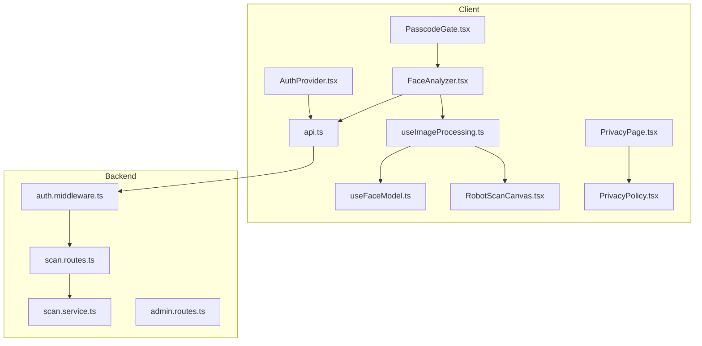
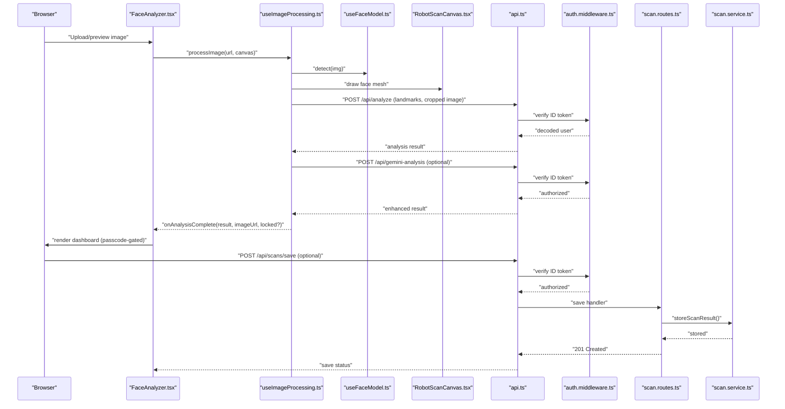
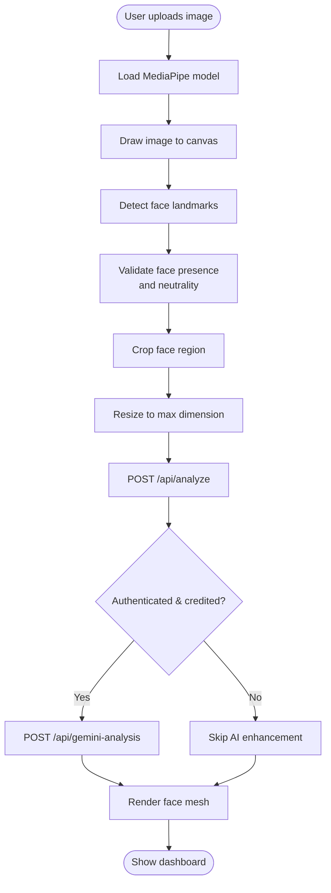
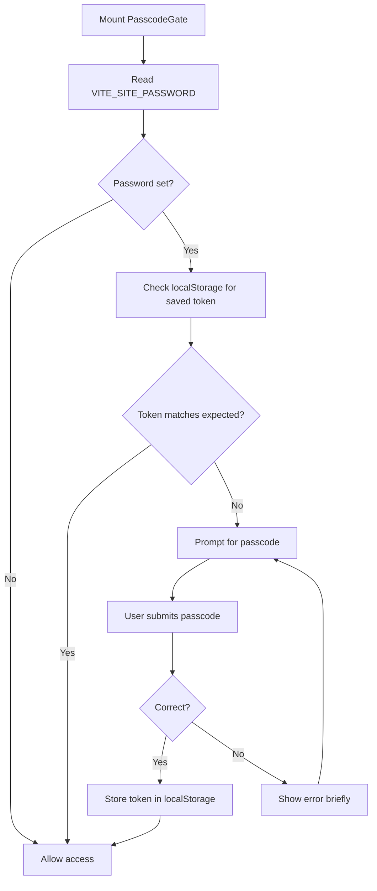
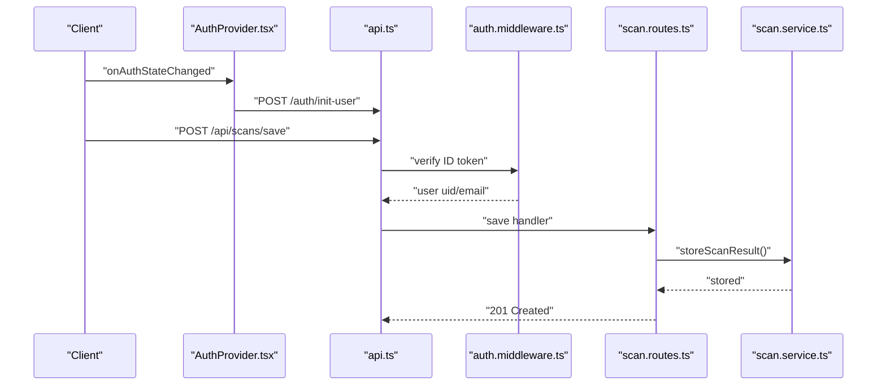
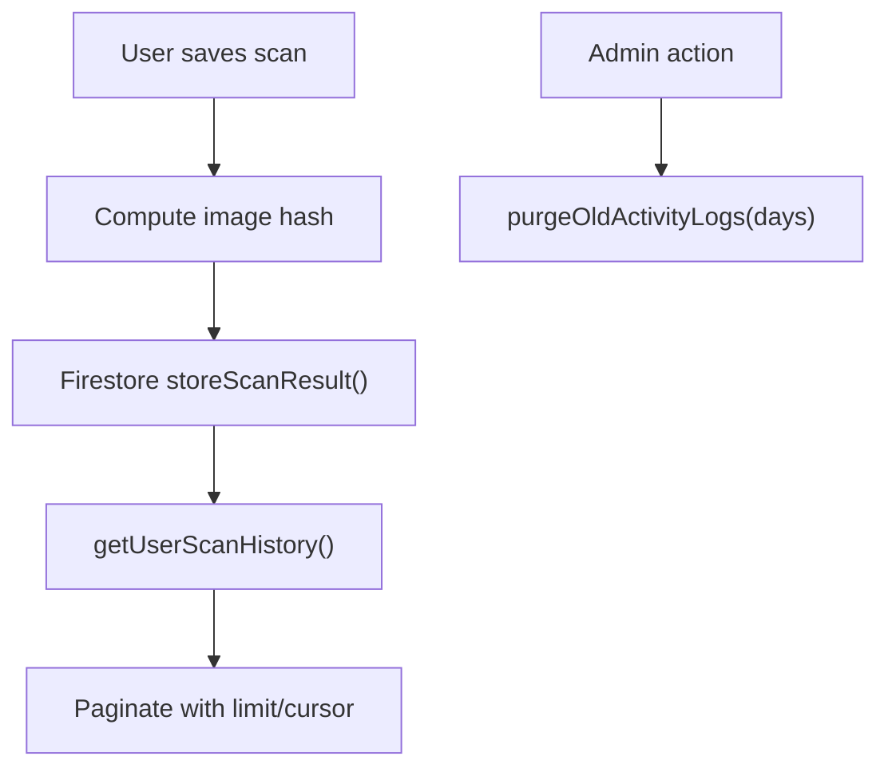
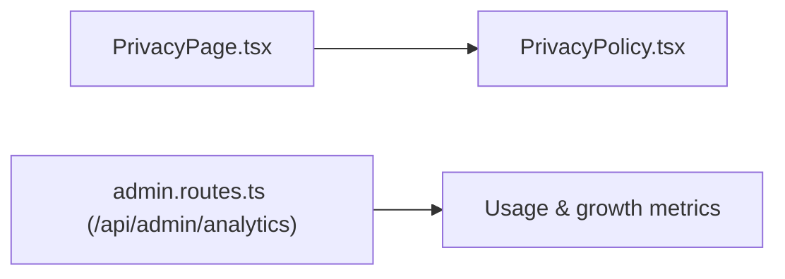
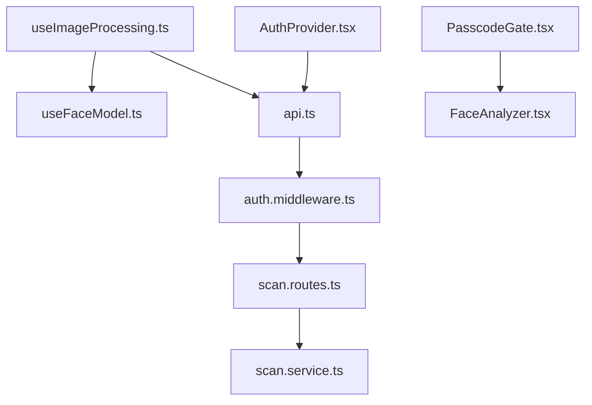

# Privacy and Data Protection

<cite>
**Referenced Files in This Document**
- [PasscodeGate.tsx](file://src/components/PasscodeGate.tsx)
- [PrivacyPolicy.tsx](file://src/components/PrivacyPolicy.tsx)
- [PrivacyPage.tsx](file://src/pages/PrivacyPage.tsx)
- [FaceAnalyzer.tsx](file://src/components/FaceAnalyzer/FaceAnalyzer.tsx)
- [useImageProcessing.ts](file://src/components/FaceAnalyzer/hooks/useImageProcessing.ts)
- [useFaceModel.ts](file://src/components/FaceAnalyzer/hooks/useFaceModel.ts)
- [RobotScanCanvas.tsx](file://src/components/FaceAnalyzer/canvas/RobotScanCanvas.tsx)
- [useAnalysis.ts](file://src/components/FaceAnalyzer/hooks/useAnalysis.ts)
- [AuthProvider.tsx](file://src/context/AuthProvider.tsx)
- [api.ts](file://src/lib/api.ts)
- [auth.middleware.ts](file://backend/middleware/auth.middleware.ts)
- [scan.routes.ts](file://backend/routes/scan.routes.ts)
- [scan.service.ts](file://backend/services/scan.service.ts)
- [admin.routes.ts](file://backend/routes/admin.routes.ts)
</cite>

## Table of Contents
1. [Introduction](#introduction)
2. [Project Structure](#project-structure)
3. [Core Components](#core-components)
4. [Architecture Overview](#architecture-overview)
5. [Detailed Component Analysis](#detailed-component-analysis)
6. [Dependency Analysis](#dependency-analysis)
7. [Performance Considerations](#performance-considerations)
8. [Troubleshooting Guide](#troubleshooting-guide)
9. [Conclusion](#conclusion)
10. [Appendices](#appendices)

## Introduction
This document details the privacy and data protection posture of FaceAnalytics Pro (VisageX). It explains how facial images are processed entirely in the user’s browser using in-memory canvas-based operations, how sensitive results are gated by a passcode, and how data retention, cleanup, and user controls are implemented. It also outlines GDPR-aligned measures such as consent, right to erasure, data portability, data minimization, encryption at rest and in transit, and third-party sharing restrictions. Finally, it documents user privacy controls, data access logging, and transparency reporting capabilities.

## Project Structure
The privacy-critical parts of the system span client-side React components and hooks, Firebase-based authentication, and backend routes/services responsible for optional persistence and administrative oversight.

**Diagram sources**
- [FaceAnalyzer.tsx:1-512](file://src/components/FaceAnalyzer/FaceAnalyzer.tsx#L1-L512)
- [useImageProcessing.ts:1-234](file://src/components/FaceAnalyzer/hooks/useImageProcessing.ts#L1-L234)
- [useFaceModel.ts:1-37](file://src/components/FaceAnalyzer/hooks/useFaceModel.ts#L1-L37)
- [RobotScanCanvas.tsx:1-800](file://src/components/FaceAnalyzer/canvas/RobotScanCanvas.tsx#L1-L800)
- [PasscodeGate.tsx:1-115](file://src/components/PasscodeGate.tsx#L1-L115)
- [AuthProvider.tsx:1-75](file://src/context/AuthProvider.tsx#L1-L75)
- [api.ts:1-36](file://src/lib/api.ts#L1-L36)
- [auth.middleware.ts:1-40](file://backend/middleware/auth.middleware.ts#L1-L40)
- [scan.routes.ts:1-63](file://backend/routes/scan.routes.ts#L1-L63)
- [scan.service.ts:1-134](file://backend/services/scan.service.ts#L1-L134)
- [admin.routes.ts:1-134](file://backend/routes/admin.routes.ts#L1-L134)
- [PrivacyPolicy.tsx:1-143](file://src/components/PrivacyPolicy.tsx#L1-L143)
- [PrivacyPage.tsx:1-23](file://src/pages/PrivacyPage.tsx#L1-L23)

**Section sources**
- [FaceAnalyzer.tsx:1-512](file://src/components/FaceAnalyzer/FaceAnalyzer.tsx#L1-L512)
- [useImageProcessing.ts:1-234](file://src/components/FaceAnalyzer/hooks/useImageProcessing.ts#L1-L234)
- [useFaceModel.ts:1-37](file://src/components/FaceAnalyzer/hooks/useFaceModel.ts#L1-L37)
- [RobotScanCanvas.tsx:1-800](file://src/components/FaceAnalyzer/canvas/RobotScanCanvas.tsx#L1-L800)
- [PasscodeGate.tsx:1-115](file://src/components/PasscodeGate.tsx#L1-L115)
- [AuthProvider.tsx:1-75](file://src/context/AuthProvider.tsx#L1-L75)
- [api.ts:1-36](file://src/lib/api.ts#L1-L36)
- [auth.middleware.ts:1-40](file://backend/middleware/auth.middleware.ts#L1-L40)
- [scan.routes.ts:1-63](file://backend/routes/scan.routes.ts#L1-L63)
- [scan.service.ts:1-134](file://backend/services/scan.service.ts#L1-L134)
- [admin.routes.ts:1-134](file://backend/routes/admin.routes.ts#L1-L134)
- [PrivacyPolicy.tsx:1-143](file://src/components/PrivacyPolicy.tsx#L1-L143)
- [PrivacyPage.tsx:1-23](file://src/pages/PrivacyPage.tsx#L1-L23)

## Core Components
- In-memory facial analysis pipeline: The client loads a MediaPipe model, draws the image to a canvas, detects landmarks, crops the face region, and performs server-side augmentation only when the user is authenticated and has credits. All intermediate image data remains in memory and is not uploaded to servers except for small cropped segments when AI enhancement is requested.
- Passcode gate: A local-only access control stored in browser storage to gate access to private areas of the UI.
- Authentication and authorization: Firebase Auth verifies ID tokens on backend routes; optional persistence requires explicit user authentication.
- Data retention and cleanup: Optional scan history is stored in Firestore with hashing for deduplication and caching; administrative endpoints support log purging.
- Privacy policy and transparency: A dedicated page surfaces the company’s privacy commitments and contact information.

**Section sources**
- [FaceAnalyzer.tsx:460-472](file://src/components/FaceAnalyzer/FaceAnalyzer.tsx#L460-L472)
- [useImageProcessing.ts:26-222](file://src/components/FaceAnalyzer/hooks/useImageProcessing.ts#L26-L222)
- [useAnalysis.ts:9-23](file://src/components/FaceAnalyzer/hooks/useAnalysis.ts#L9-L23)
- [PasscodeGate.tsx:13-46](file://src/components/PasscodeGate.tsx#L13-L46)
- [AuthProvider.tsx:18-63](file://src/context/AuthProvider.tsx#L18-L63)
- [auth.middleware.ts:18-39](file://backend/middleware/auth.middleware.ts#L18-L39)
- [scan.routes.ts:22-60](file://backend/routes/scan.routes.ts#L22-L60)
- [scan.service.ts:11-94](file://backend/services/scan.service.ts#L11-L94)
- [admin.routes.ts:121-131](file://backend/routes/admin.routes.ts#L121-L131)
- [PrivacyPolicy.tsx:40-118](file://src/components/PrivacyPolicy.tsx#L40-L118)

## Architecture Overview
The system enforces privacy by design: most processing occurs locally in the browser, and sensitive results are gated by a passcode. Optional persistence is opt-in and protected by authentication.

**Diagram sources**
- [FaceAnalyzer.tsx:104-119](file://src/components/FaceAnalyzer/FaceAnalyzer.tsx#L104-L119)
- [useImageProcessing.ts:26-222](file://src/components/FaceAnalyzer/hooks/useImageProcessing.ts#L26-L222)
- [useFaceModel.ts:9-33](file://src/components/FaceAnalyzer/hooks/useFaceModel.ts#L9-L33)
- [RobotScanCanvas.tsx:313-520](file://src/components/FaceAnalyzer/canvas/RobotScanCanvas.tsx#L313-L520)
- [api.ts:9-33](file://src/lib/api.ts#L9-L33)
- [auth.middleware.ts:18-39](file://backend/middleware/auth.middleware.ts#L18-L39)
- [scan.routes.ts:22-44](file://backend/routes/scan.routes.ts#L22-L44)
- [scan.service.ts:68-94](file://backend/services/scan.service.ts#L68-L94)

## Detailed Component Analysis

### In-Memory Processing and Canvas-Based Image Operations
- Model loading: The MediaPipe face landmarker is loaded from CDN and configured for GPU acceleration. The model is initialized once and reused for detection.
- Image ingestion: The uploaded image is drawn onto a hidden canvas to enable pixel-level operations and cropping.
- Landmark detection: Landmarks are extracted from the image; the system validates face presence and neutrality (no smile) to ensure reliable geometry.
- Cropping and resizing: The face region is cropped and resized to a bounded dimension suitable for AI analysis.
- Rendering: A separate canvas renders the face mesh overlay for the dashboard experience.
- Optional AI enhancement: When authenticated and credited, a cropped segment is sent to the backend for AI augmentation; otherwise, the geometry-only result is returned.

**Diagram sources**
- [useFaceModel.ts:9-33](file://src/components/FaceAnalyzer/hooks/useFaceModel.ts#L9-L33)
- [useImageProcessing.ts:26-222](file://src/components/FaceAnalyzer/hooks/useImageProcessing.ts#L26-L222)
- [RobotScanCanvas.tsx:313-520](file://src/components/FaceAnalyzer/canvas/RobotScanCanvas.tsx#L313-L520)
- [useAnalysis.ts:9-23](file://src/components/FaceAnalyzer/hooks/useAnalysis.ts#L9-L23)

**Section sources**
- [useFaceModel.ts:1-37](file://src/components/FaceAnalyzer/hooks/useFaceModel.ts#L1-L37)
- [useImageProcessing.ts:26-222](file://src/components/FaceAnalyzer/hooks/useImageProcessing.ts#L26-L222)
- [RobotScanCanvas.tsx:313-520](file://src/components/FaceAnalyzer/canvas/RobotScanCanvas.tsx#L313-L520)
- [useAnalysis.ts:25-160](file://src/components/FaceAnalyzer/hooks/useAnalysis.ts#L25-L160)

### Passcode Gate Mechanism
- Purpose: Gate access to private UI sections using a configurable passcode.
- Behavior: Reads a site-wide passcode from environment configuration. On successful entry, stores a token in local storage to bypass repeated prompts until cleared.
- Security: The passcode is enforced client-side; no server-side secrets are stored in the client.

**Diagram sources**
- [PasscodeGate.tsx:13-46](file://src/components/PasscodeGate.tsx#L13-L46)

**Section sources**
- [PasscodeGate.tsx:1-115](file://src/components/PasscodeGate.tsx#L1-L115)

### Authentication, Authorization, and Optional Persistence
- Authentication: Firebase Auth state is tracked globally; on sign-in, the app initializes the user on the backend and attaches ID tokens to outgoing requests.
- Authorization: Backend routes require a valid Firebase ID token in the Authorization header.
- Optional persistence: Saved scans are stored in Firestore under the authenticated user’s ID. The service hashes the image data to deduplicate results and supports pagination and caching.

**Diagram sources**
- [AuthProvider.tsx:18-63](file://src/context/AuthProvider.tsx#L18-L63)
- [api.ts:9-33](file://src/lib/api.ts#L9-L33)
- [auth.middleware.ts:18-39](file://backend/middleware/auth.middleware.ts#L18-L39)
- [scan.routes.ts:22-44](file://backend/routes/scan.routes.ts#L22-L44)
- [scan.service.ts:68-94](file://backend/services/scan.service.ts#L68-L94)

**Section sources**
- [AuthProvider.tsx:1-75](file://src/context/AuthProvider.tsx#L1-L75)
- [api.ts:1-36](file://src/lib/api.ts#L1-L36)
- [auth.middleware.ts:1-40](file://backend/middleware/auth.middleware.ts#L1-L40)
- [scan.routes.ts:1-63](file://backend/routes/scan.routes.ts#L1-L63)
- [scan.service.ts:1-134](file://backend/services/scan.service.ts#L1-L134)

### Data Retention, Automatic Cleanup, and User Controls
- Optional persistence: Saved scans are stored in Firestore with a server timestamp and hashed image data for deduplication. Pagination is supported with cursors.
- Cleanup: Administrative endpoints can purge activity logs older than a specified retention period.
- User deletion: The system does not expose a user-initiated deletion endpoint in the provided code; however, users can rely on account deletion at the identity provider level and request removal of any stored data via the privacy contact.

**Diagram sources**
- [scan.service.ts:23-94](file://backend/services/scan.service.ts#L23-L94)
- [scan.routes.ts:46-60](file://backend/routes/scan.routes.ts#L46-L60)
- [admin.routes.ts:121-131](file://backend/routes/admin.routes.ts#L121-L131)

**Section sources**
- [scan.service.ts:1-134](file://backend/services/scan.service.ts#L1-L134)
- [scan.routes.ts:1-63](file://backend/routes/scan.routes.ts#L1-L63)
- [admin.routes.ts:1-134](file://backend/routes/admin.routes.ts#L1-L134)

### GDPR Compliance Measures
- Consent: The privacy policy communicates the purpose of processing and the user’s ability to control data via passcode gating and optional persistence.
- Right to erasure: While explicit deletion endpoints are not shown, users can delete their accounts and request data removal via the privacy contact.
- Data portability: The system does not expose export endpoints; users can download their own saved scans from the dashboard.
- Data minimization: Only cropped, anonymized image segments are transmitted for AI enhancement when requested.
- Encryption: Stored scans are encrypted at rest in Firestore; transport is secured via HTTPS and Firebase Auth tokens.
- Third-party sharing: The privacy policy explicitly prohibits selling or sharing biometric data.

**Section sources**
- [PrivacyPolicy.tsx:40-118](file://src/components/PrivacyPolicy.tsx#L40-L118)
- [scan.service.ts:78-89](file://backend/services/scan.service.ts#L78-L89)
- [useAnalysis.ts:162-203](file://src/components/FaceAnalyzer/hooks/useAnalysis.ts#L162-L203)

### Privacy Policy Implementation and Transparency Reporting
- Privacy page: Dedicated route renders the privacy policy component with dark/light theme support.
- Transparency: Administrative analytics endpoints provide usage metrics and growth indicators for internal reporting.

**Diagram sources**
- [PrivacyPage.tsx:1-23](file://src/pages/PrivacyPage.tsx#L1-L23)
- [PrivacyPolicy.tsx:1-143](file://src/components/PrivacyPolicy.tsx#L1-L143)
- [admin.routes.ts:44-119](file://backend/routes/admin.routes.ts#L44-L119)

**Section sources**
- [PrivacyPage.tsx:1-23](file://src/pages/PrivacyPage.tsx#L1-L23)
- [PrivacyPolicy.tsx:1-143](file://src/components/PrivacyPolicy.tsx#L1-L143)
- [admin.routes.ts:44-119](file://backend/routes/admin.routes.ts#L44-L119)

## Dependency Analysis
- Client-side dependencies: The analyzer depends on the MediaPipe model, canvas rendering, and the API client. The API client attaches Firebase ID tokens and CAPTCHA tokens to requests.
- Backend dependencies: Routes depend on Firebase Admin Auth for token verification and Firestore for persistence. Administrative routes enforce role checks.

**Diagram sources**
- [useImageProcessing.ts:1-234](file://src/components/FaceAnalyzer/hooks/useImageProcessing.ts#L1-L234)
- [useFaceModel.ts:1-37](file://src/components/FaceAnalyzer/hooks/useFaceModel.ts#L1-L37)
- [api.ts:1-36](file://src/lib/api.ts#L1-L36)
- [auth.middleware.ts:1-40](file://backend/middleware/auth.middleware.ts#L1-L40)
- [scan.routes.ts:1-63](file://backend/routes/scan.routes.ts#L1-L63)
- [scan.service.ts:1-134](file://backend/services/scan.service.ts#L1-L134)
- [AuthProvider.tsx:1-75](file://src/context/AuthProvider.tsx#L1-L75)
- [PasscodeGate.tsx:1-115](file://src/components/PasscodeGate.tsx#L1-L115)

**Section sources**
- [useImageProcessing.ts:1-234](file://src/components/FaceAnalyzer/hooks/useImageProcessing.ts#L1-L234)
- [useFaceModel.ts:1-37](file://src/components/FaceAnalyzer/hooks/useFaceModel.ts#L1-L37)
- [api.ts:1-36](file://src/lib/api.ts#L1-L36)
- [auth.middleware.ts:1-40](file://backend/middleware/auth.middleware.ts#L1-L40)
- [scan.routes.ts:1-63](file://backend/routes/scan.routes.ts#L1-L63)
- [scan.service.ts:1-134](file://backend/services/scan.service.ts#L1-L134)
- [AuthProvider.tsx:1-75](file://src/context/AuthProvider.tsx#L1-L75)
- [PasscodeGate.tsx:1-115](file://src/components/PasscodeGate.tsx#L1-L115)

## Performance Considerations
- In-memory processing: Canvas operations and MediaPipe detection occur in the browser, minimizing network overhead and reducing exposure windows for sensitive data.
- Progressive rendering: The UI uses a time-based progress loop to maintain smooth visuals even under variable latency.
- Optional AI enhancement: Requests are retried with timeouts and aborted appropriately to prevent premature cancellation.

[No sources needed since this section provides general guidance]

## Troubleshooting Guide
- Authentication failures: Verify that the Authorization header contains a valid Firebase ID token and that the user is signed in.
- Save failures: Confirm that the user is authenticated and that the backend responds with a success status; errors are surfaced via save status messages.
- Passcode issues: Ensure the environment variable is set and that the passcode matches the expected value; localStorage tokens persist until cleared.

**Section sources**
- [auth.middleware.ts:18-39](file://backend/middleware/auth.middleware.ts#L18-L39)
- [useAnalysis.ts:162-203](file://src/components/FaceAnalyzer/hooks/useAnalysis.ts#L162-L203)
- [PasscodeGate.tsx:19-46](file://src/components/PasscodeGate.tsx#L19-L46)

## Conclusion
FaceAnalytics Pro implements a privacy-first architecture: facial data is processed in-memory using canvas operations, with optional AI enhancement only when the user is authenticated and opted in. Sensitive results are gated by a passcode, and optional persistence is protected by authentication and stored securely. GDPR-aligned policies emphasize consent, minimization, and transparency, with administrative tools supporting data hygiene and oversight.

[No sources needed since this section summarizes without analyzing specific files]

## Appendices
- Data minimization: Only cropped, anonymized segments are transmitted for AI enhancement.
- Encryption: Stored scans are encrypted at rest; transport is secured via HTTPS and Firebase Auth.
- Cookie management: The codebase relies on Firebase Auth and does not implement custom cookies for authentication.
- Third-party sharing: Explicitly prohibited in the privacy policy.

[No sources needed since this section provides general guidance]