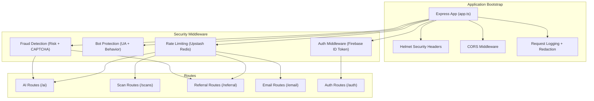
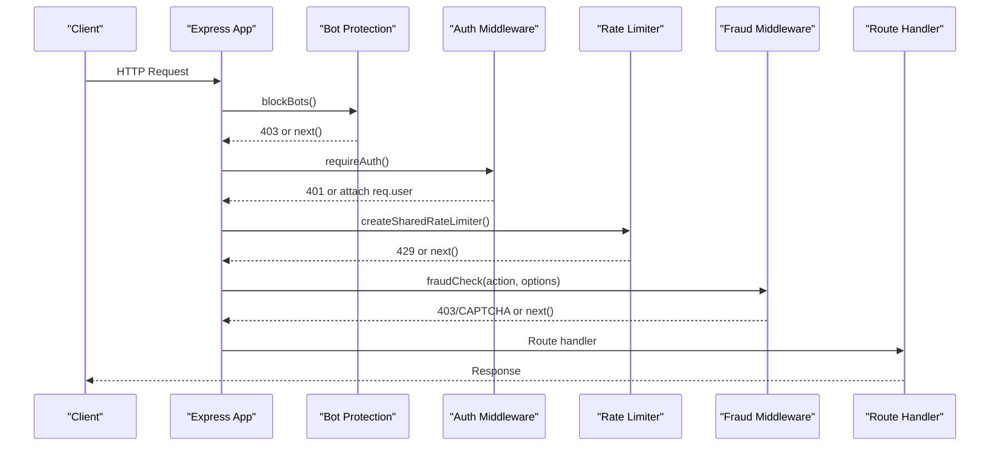
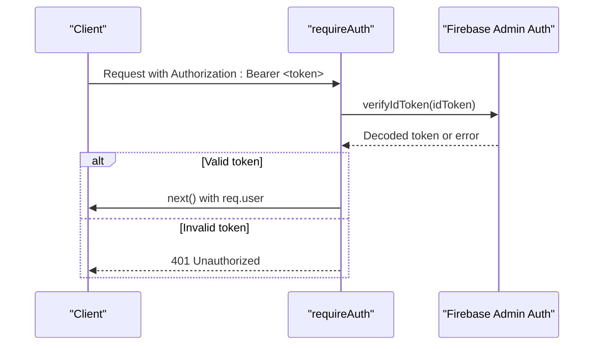
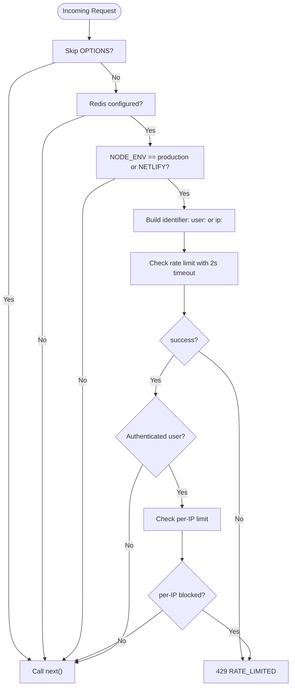
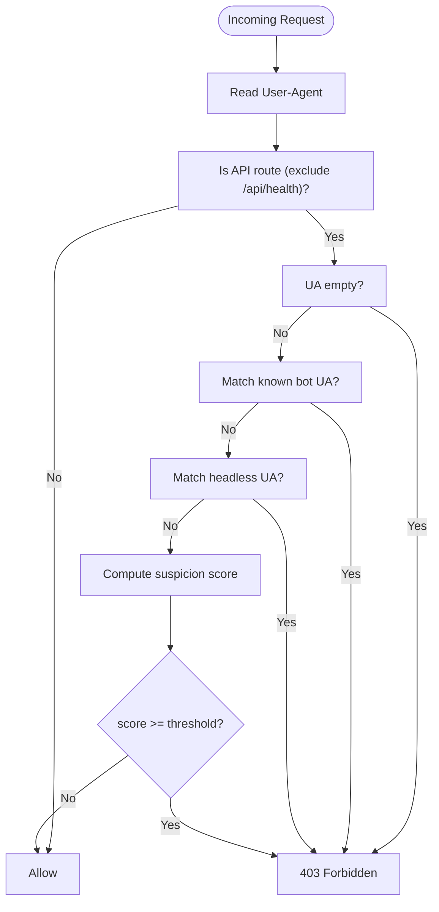
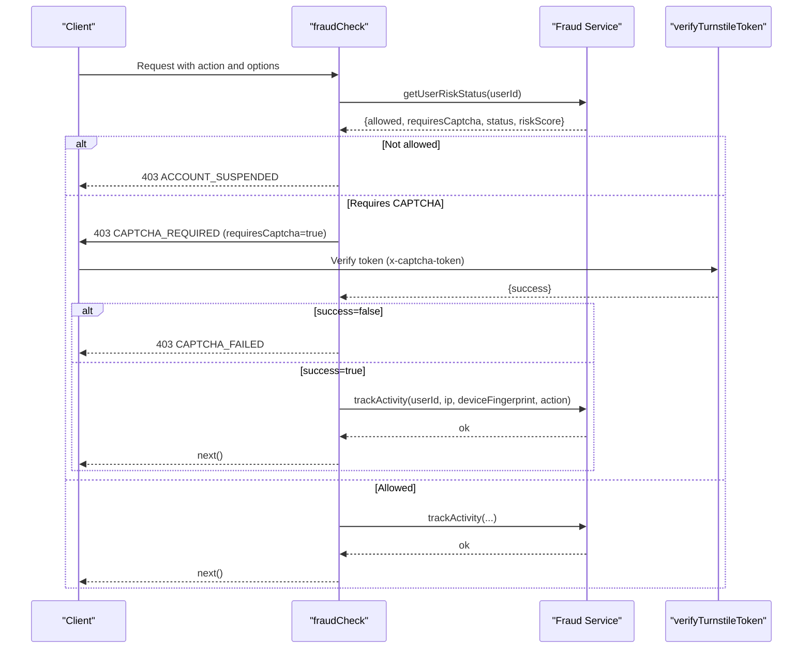
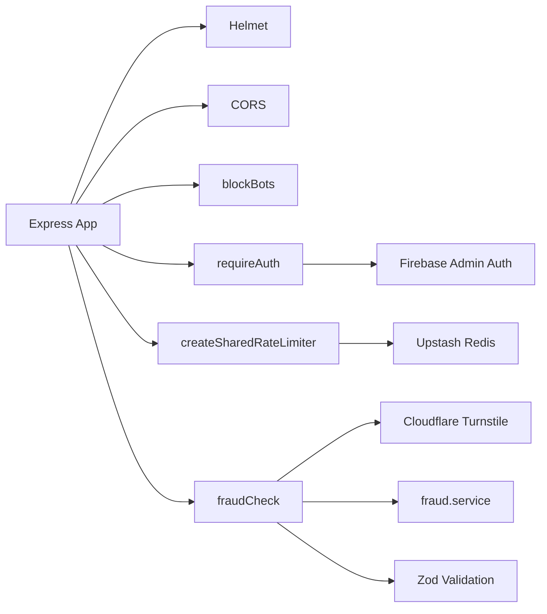

# Security Middleware

<cite>
**Referenced Files in This Document**
- [auth.middleware.ts](file://backend/middleware/auth.middleware.ts)
- [bot.middleware.ts](file://backend/middleware/bot.middleware.ts)
- [fraud.middleware.ts](file://backend/middleware/fraud.middleware.ts)
- [ratelimit.middleware.ts](file://backend/middleware/ratelimit.middleware.ts)
- [app.ts](file://backend/app.ts)
- [config.ts](file://backend/utils/config.ts)
- [validation.ts](file://backend/utils/validation.ts)
- [turnstile.ts](file://backend/utils/turnstile.ts)
- [firebase.service.ts](file://backend/services/firebase.service.ts)
- [fraud.service.ts](file://backend/services/fraud.service.ts)
- [auth.routes.ts](file://backend/routes/auth.routes.ts)
- [ai.routes.ts](file://backend/routes/ai.routes.ts)
- [scan.routes.ts](file://backend/routes/scan.routes.ts)
- [referral.routes.ts](file://backend/routes/referral.routes.ts)
- [email.routes.ts](file://backend/routes/email.routes.ts)
- [logger.ts](file://backend/utils/logger.ts)
</cite>

## Table of Contents
1. [Introduction](#introduction)
2. [Project Structure](#project-structure)
3. [Core Components](#core-components)
4. [Architecture Overview](#architecture-overview)
5. [Detailed Component Analysis](#detailed-component-analysis)
6. [Dependency Analysis](#dependency-analysis)
7. [Performance Considerations](#performance-considerations)
8. [Troubleshooting Guide](#troubleshooting-guide)
9. [Conclusion](#conclusion)
10. [Appendices](#appendices)

## Introduction
This document provides comprehensive security middleware documentation for FaceAnalytics Pro. It covers authentication, session verification, user authorization, rate limiting, bot protection, fraud detection, security headers, CORS configuration, input sanitization, and operational guidance for configuration, custom middleware development, monitoring, and incident response.

## Project Structure
Security middleware is implemented as Express middleware modules and integrated into the application bootstrap and route handlers. Key elements:
- Authentication middleware verifies Firebase ID tokens and attaches user context to requests.
- Bot protection middleware blocks known scrapers, headless browsers, and suspicious automation patterns.
- Fraud detection middleware enforces risk-aware policies, integrates CAPTCHA verification, and tracks suspicious activity.
- Rate limiting middleware uses Upstash Redis for sliding-window and daily caps with graceful fallbacks.
- Security headers and CORS are configured centrally in the application bootstrap.
- Input validation uses Zod schemas and middleware to sanitize and enforce request shapes.

**Diagram sources**
- [app.ts:90-164](file://backend/app.ts#L90-L164)
- [auth.middleware.ts:18-39](file://backend/middleware/auth.middleware.ts#L18-L39)
- [bot.middleware.ts:102-133](file://backend/middleware/bot.middleware.ts#L102-L133)
- [ratelimit.middleware.ts:25-92](file://backend/middleware/ratelimit.middleware.ts#L25-L92)
- [fraud.middleware.ts:30-104](file://backend/middleware/fraud.middleware.ts#L30-L104)
- [ai.routes.ts:271-516](file://backend/routes/ai.routes.ts#L271-L516)
- [scan.routes.ts:22-60](file://backend/routes/scan.routes.ts#L22-L60)
- [referral.routes.ts:24-144](file://backend/routes/referral.routes.ts#L24-L144)
- [email.routes.ts:18-37](file://backend/routes/email.routes.ts#L18-L37)

**Section sources**
- [app.ts:90-164](file://backend/app.ts#L90-L164)

## Core Components
- Authentication middleware: Validates Authorization header, decodes Firebase ID token, and attaches user identity to the request.
- Bot protection middleware: Blocks known bot user agents, headless automation, and suspicious behavior via header analysis.
- Rate limiting middleware: Sliding window per composite identifier (user or IP), plus daily usage caps with timeouts and graceful fallbacks.
- Fraud detection middleware: Enforces risk-aware policies, integrates Cloudflare Turnstile CAPTCHA, and tracks activity with asynchronous batching.
- Security headers and CORS: Helmet CSP and COOP/COEP policies, and dynamic origin allowlist with vary handling.
- Input validation: Zod-based validation middleware to sanitize and enforce request schemas.

**Section sources**
- [auth.middleware.ts:18-39](file://backend/middleware/auth.middleware.ts#L18-L39)
- [bot.middleware.ts:102-133](file://backend/middleware/bot.middleware.ts#L102-L133)
- [ratelimit.middleware.ts:25-133](file://backend/middleware/ratelimit.middleware.ts#L25-L133)
- [fraud.middleware.ts:30-132](file://backend/middleware/fraud.middleware.ts#L30-L132)
- [app.ts:90-164](file://backend/app.ts#L90-L164)
- [validation.ts:89-102](file://backend/utils/validation.ts#L89-L102)

## Architecture Overview
The security architecture layers middleware around routes to protect endpoints from abuse and fraud. Authentication is mandatory for protected routes. Rate limiting protects resources from excessive load. Fraud detection gates expensive operations and integrates CAPTCHA when required. Bot protection reduces automated scraping. Security headers and CORS are applied globally.

**Diagram sources**
- [app.ts:142-144](file://backend/app.ts#L142-L144)
- [auth.middleware.ts:18-39](file://backend/middleware/auth.middleware.ts#L18-L39)
- [ratelimit.middleware.ts:38-91](file://backend/middleware/ratelimit.middleware.ts#L38-L91)
- [fraud.middleware.ts:30-104](file://backend/middleware/fraud.middleware.ts#L30-L104)
- [ai.routes.ts:271-516](file://backend/routes/ai.routes.ts#L271-L516)

## Detailed Component Analysis

### Authentication Middleware
- Purpose: Verify Authorization Bearer token against Firebase Admin Auth and attach user identity to the request.
- Key behaviors:
  - Expects Authorization: Bearer <idToken>.
  - Uses Firebase Admin Auth to verify token.
  - Attaches req.user with uid and email.
  - Returns 401 on missing/invalid token.
- Integration: Mounted globally; routes requiring auth chain this middleware.

**Diagram sources**
- [auth.middleware.ts:18-39](file://backend/middleware/auth.middleware.ts#L18-L39)
- [firebase.service.ts:113-119](file://backend/services/firebase.service.ts#L113-L119)

**Section sources**
- [auth.middleware.ts:18-39](file://backend/middleware/auth.middleware.ts#L18-L39)
- [firebase.service.ts:113-119](file://backend/services/firebase.service.ts#L113-L119)

### Rate Limiting Middleware
- Purpose: Prevent abuse and protect against DDoS via sliding windows and daily caps.
- Key behaviors:
  - Composite identifier: user:<userId> if authenticated, otherwise ip:<ip>.
  - Per-endpoint shared rate limiter with sliding window.
  - Optional daily cap per user with Redis TTL.
  - Graceful fallback when Redis is unavailable (dev mode bypass, production failsafe open).
  - X-RateLimit-* headers for observability.
  - 2-second timeout on Redis calls; timeouts allow requests to proceed.
- Configuration:
  - Max requests and window string per endpoint.
  - Environment variables for Upstash Redis connection.
  - Dev mode disables rate limiting to ease local testing.

**Diagram sources**
- [ratelimit.middleware.ts:38-91](file://backend/middleware/ratelimit.middleware.ts#L38-L91)
- [ratelimit.middleware.ts:98-133](file://backend/middleware/ratelimit.middleware.ts#L98-L133)

**Section sources**
- [ratelimit.middleware.ts:25-133](file://backend/middleware/ratelimit.middleware.ts#L25-L133)
- [ai.routes.ts:51-80](file://backend/routes/ai.routes.ts#L51-L80)
- [scan.routes.ts:11-20](file://backend/routes/scan.routes.ts#L11-L20)
- [referral.routes.ts:16-21](file://backend/routes/referral.routes.ts#L16-L21)
- [email.routes.ts:10-15](file://backend/routes/email.routes.ts#L10-L15)
- [auth.routes.ts:10-15](file://backend/routes/auth.routes.ts#L10-L15)

### Bot Protection Middleware
- Purpose: Detect and block bots and suspicious automation attempts.
- Key behaviors:
  - Layer 1: Block requests with no user-agent on API routes.
  - Layer 2: Regex-based blocklist of known bot and headless browser UAs.
  - Layer 3: Behavioral scoring based on missing browser headers and fetch signals; blocks when score exceeds threshold.
  - Applies only to API routes excluding health checks.
- Tuning: Threshold tuned to avoid false positives for normal browsers with unusual configs while catching automation.

**Diagram sources**
- [bot.middleware.ts:102-133](file://backend/middleware/bot.middleware.ts#L102-L133)

**Section sources**
- [bot.middleware.ts:3-133](file://backend/middleware/bot.middleware.ts#L3-L133)

### Fraud Detection Middleware
- Purpose: Enforce risk-aware policies, integrate CAPTCHA, and track suspicious activity.
- Key behaviors:
  - Enforces risk status: allowed, soft_banned, banned.
  - Optional strict mode blocks high-risk users from expensive operations early.
  - Integrates Cloudflare Turnstile CAPTCHA verification with graceful degradation and circuit breaker.
  - Attaches device fingerprint and IP metadata to the request for downstream use.
  - Asynchronous, non-blocking activity tracking with batching.
- Integration:
  - Place after requireAuth to access req.user.
  - Use strict option for expensive endpoints to preemptively block.

**Diagram sources**
- [fraud.middleware.ts:30-104](file://backend/middleware/fraud.middleware.ts#L30-L104)
- [turnstile.ts:71-145](file://backend/utils/turnstile.ts#L71-L145)
- [fraud.service.ts:429-472](file://backend/services/fraud.service.ts#L429-L472)
- [fraud.service.ts:127-204](file://backend/services/fraud.service.ts#L127-L204)

**Section sources**
- [fraud.middleware.ts:14-104](file://backend/middleware/fraud.middleware.ts#L14-L104)
- [turnstile.ts:11-145](file://backend/utils/turnstile.ts#L11-L145)
- [fraud.service.ts:34-472](file://backend/services/fraud.service.ts#L34-L472)

### Security Headers and CORS
- Security headers:
  - Helmet applied with Content-Security-Policy directives for scripts, connections, frames, fonts, and workers.
  - Cross-Origin-Opener-Policy set to allow popups for Firebase sign-in.
  - Cross-Origin-Embedder-Policy disabled to allow external resources.
- CORS:
  - Origin allowlist derived from APP_URL environment variable.
  - Sets Access-Control-Allow-Origin and Vary: Origin when applicable.
  - Supports GET, POST, OPTIONS with Content-Type, Authorization headers.

**Section sources**
- [app.ts:90-164](file://backend/app.ts#L90-L164)

### Input Validation
- Purpose: Enforce request schemas and sanitize inputs using Zod.
- Implementation:
  - Define endpoint-specific schemas (e.g., analysis, geometry, referral, scan).
  - validate() middleware parses and returns structured 400 errors on failure.
- Benefits:
  - Prevents malformed payloads from reaching business logic.
  - Provides consistent error reporting.

**Section sources**
- [validation.ts:13-102](file://backend/utils/validation.ts#L13-L102)

### Route-Level Security Patterns
- AI analysis endpoints:
  - Sliding window rate limits, daily caps, requireAuth, strict fraudCheck, and Zod validation.
  - Preemptive risk gating for expensive operations.
- Scan history and save:
  - Shared rate limits per endpoint with requireAuth and validation.
- Referral redemption:
  - Shared rate limit, requireAuth, Zod validation, and fraud checks for multi-account and referral abuse.
- Email endpoints:
  - Shared rate limit, requireAuth, and Zod validation.

**Section sources**
- [ai.routes.ts:51-80](file://backend/routes/ai.routes.ts#L51-L80)
- [ai.routes.ts:271-516](file://backend/routes/ai.routes.ts#L271-L516)
- [scan.routes.ts:11-20](file://backend/routes/scan.routes.ts#L11-L20)
- [scan.routes.ts:22-60](file://backend/routes/scan.routes.ts#L22-L60)
- [referral.routes.ts:16-21](file://backend/routes/referral.routes.ts#L16-L21)
- [referral.routes.ts:24-144](file://backend/routes/referral.routes.ts#L24-L144)
- [email.routes.ts:10-15](file://backend/routes/email.routes.ts#L10-L15)
- [email.routes.ts:18-37](file://backend/routes/email.routes.ts#L18-L37)
- [auth.routes.ts:10-15](file://backend/routes/auth.routes.ts#L10-L15)
- [auth.routes.ts:23-88](file://backend/routes/auth.routes.ts#L23-L88)

## Dependency Analysis
- Express app bootstraps middleware and routes dynamically to optimize cold starts.
- Security middleware depends on:
  - Firebase Admin for auth verification.
  - Upstash Redis for rate limiting and caching.
  - Cloudflare Turnstile for CAPTCHA verification.
  - Zod for input validation.
- Fraud service caches risk profiles and batches activity logs to reduce Firestore writes.

**Diagram sources**
- [app.ts:15-47](file://backend/app.ts#L15-L47)
- [auth.middleware.ts:26-32](file://backend/middleware/auth.middleware.ts#L26-L32)
- [ratelimit.middleware.ts:30-36](file://backend/middleware/ratelimit.middleware.ts#L30-L36)
- [fraud.middleware.ts:4-8](file://backend/middleware/fraud.middleware.ts#L4-L8)
- [turnstile.ts:11-145](file://backend/utils/turnstile.ts#L11-L145)
- [fraud.service.ts:1-634](file://backend/services/fraud.service.ts#L1-L634)
- [validation.ts:89-102](file://backend/utils/validation.ts#L89-L102)

**Section sources**
- [app.ts:15-47](file://backend/app.ts#L15-L47)
- [firebase.service.ts:113-119](file://backend/services/firebase.service.ts#L113-L119)
- [turnstile.ts:71-145](file://backend/utils/turnstile.ts#L71-L145)
- [fraud.service.ts:529-588](file://backend/services/fraud.service.ts#L529-L588)

## Performance Considerations
- Redis latency and availability:
  - 2-second timeout on rate-limit checks; timeouts allow requests to proceed to avoid blocking legitimate traffic.
  - Graceful fallback when Redis is unavailable (dev mode bypass, production failsafe open).
- Fraud system caching:
  - In-memory cache for risk profiles with TTL to minimize Firestore reads.
  - Batching of activity logs to reduce write volume.
- Request logging and redaction:
  - Request IDs per request; sensitive headers and image bodies are redacted in logs.
- Environment validation:
  - Strict environment validation in production to prevent misconfiguration.

[No sources needed since this section provides general guidance]

## Troubleshooting Guide
- Authentication failures:
  - Ensure Authorization header is present and valid; verify Firebase Admin initialization and credentials.
- Rate limiting:
  - Confirm Upstash Redis environment variables; verify NODE_ENV and NETLIFY flags; inspect X-RateLimit-* headers.
- Bot protection:
  - Review suspicion scoring and UA patterns; adjust thresholds if needed.
- Fraud detection:
  - Check Turnstile secret key configuration; review circuit breaker logs; verify risk status and CAPTCHA requirements.
- Input validation:
  - Inspect structured 400 responses for field-level errors; update schemas as needed.
- Logging and redaction:
  - Verify request IDs and redaction rules; ensure sensitive data is not leaked.

**Section sources**
- [auth.middleware.ts:25-38](file://backend/middleware/auth.middleware.ts#L25-L38)
- [ratelimit.middleware.ts:53-90](file://backend/middleware/ratelimit.middleware.ts#L53-L90)
- [bot.middleware.ts:122-130](file://backend/middleware/bot.middleware.ts#L122-L130)
- [turnstile.ts:79-87](file://backend/utils/turnstile.ts#L79-L87)
- [turnstile.ts:124-144](file://backend/utils/turnstile.ts#L124-L144)
- [validation.ts:90-101](file://backend/utils/validation.ts#L90-L101)
- [logger.ts:41-44](file://backend/utils/logger.ts#L41-L44)

## Conclusion
FaceAnalytics Pro’s security middleware stack provides layered protection: robust authentication, bot mitigation, rate limiting, fraud detection with CAPTCHA, and strong security headers and CORS. The design emphasizes resilience (graceful fallbacks), observability (headers, logs, batching), and developer ergonomics (centralized configuration and modular middleware). Proper configuration of environment variables and Redis ensures effective protection in production.

[No sources needed since this section summarizes without analyzing specific files]

## Appendices

### Security Headers Reference
- Content-Security-Policy directives include script, connect, frame, style, font, and worker sources.
- Cross-Origin-Opener-Policy configured to allow popups for authentication flows.
- Cross-Origin-Embedder-Policy disabled to permit external resources.

**Section sources**
- [app.ts:90-164](file://backend/app.ts#L90-L164)

### CORS Configuration Reference
- Origin allowlist sourced from APP_URL environment variable.
- Dynamic Vary: Origin header and allowlisted origin header.
- Methods and headers are standardized for API access.

**Section sources**
- [app.ts:145-164](file://backend/app.ts#L145-L164)

### Environment Variables for Security
- Firebase Admin credentials and Firestore database ID.
- Upstash Redis connection for rate limiting and caching.
- Cloudflare Turnstile secret key for CAPTCHA.
- Application URL for CORS allowlist.
- Fraud thresholds and risk configuration.

**Section sources**
- [config.ts:7-48](file://backend/utils/config.ts#L7-L48)
- [turnstile.ts:76-87](file://backend/utils/turnstile.ts#L76-L87)

### Monitoring and Alerting Strategies
- Use X-RateLimit-* headers to monitor effective limits and remaining quotas.
- Monitor Turnstile circuit breaker state and consecutive failures for outages.
- Track fraud signals and risk score changes to identify emerging threats.
- Centralize logs with request IDs and redaction rules for incident investigations.

**Section sources**
- [ratelimit.middleware.ts:67-69](file://backend/middleware/ratelimit.middleware.ts#L67-L69)
- [turnstile.ts:25-50](file://backend/utils/turnstile.ts#L25-L50)
- [fraud.service.ts:417-422](file://backend/services/fraud.service.ts#L417-L422)
- [logger.ts:41-44](file://backend/utils/logger.ts#L41-L44)

### Incident Response Procedures
- Immediate actions:
  - Temporarily disable rate limits in controlled environments if Redis is degraded.
  - Review Turnstile circuit breaker and escalate on sustained outages.
  - Investigate elevated fraud signals and CAPTCHA failures.
- Forensic steps:
  - Correlate request IDs with logs and headers.
  - Audit risk profile changes and activity logs.
  - Validate environment configuration and secrets.

**Section sources**
- [turnstile.ts:124-144](file://backend/utils/turnstile.ts#L124-L144)
- [fraud.service.ts:529-588](file://backend/services/fraud.service.ts#L529-L588)
- [logger.ts:13-71](file://backend/utils/logger.ts#L13-L71)