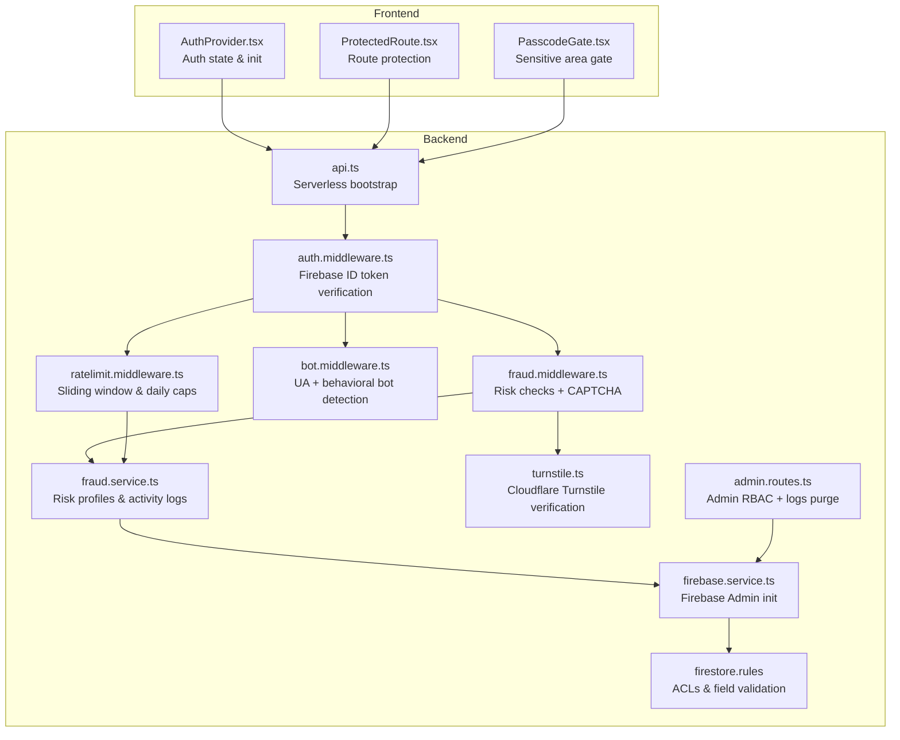
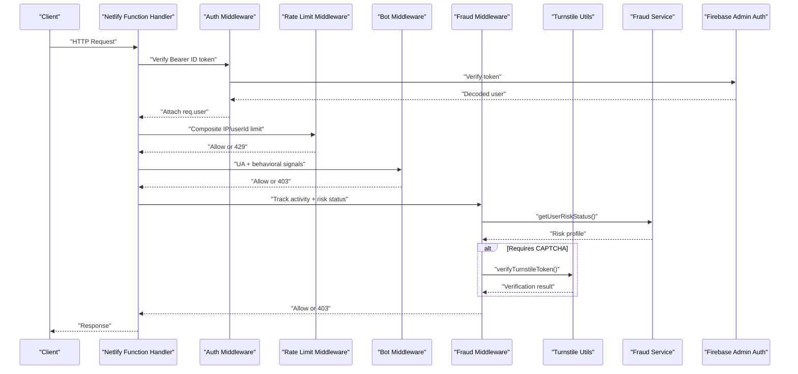
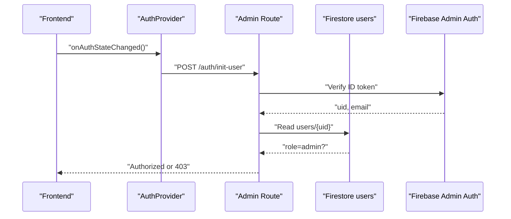
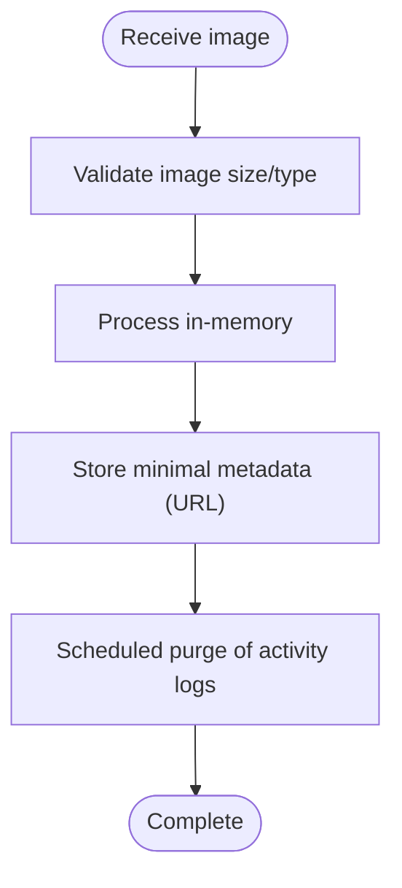
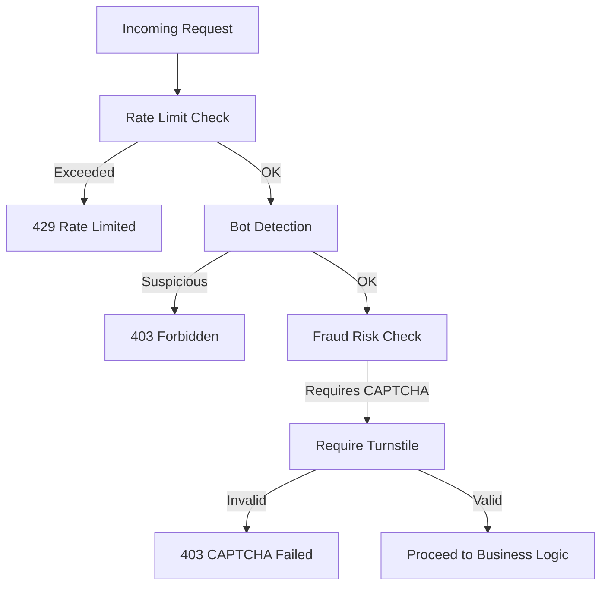
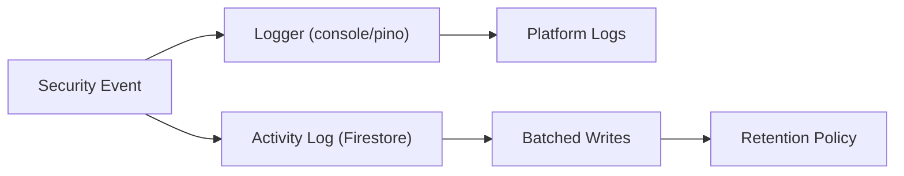
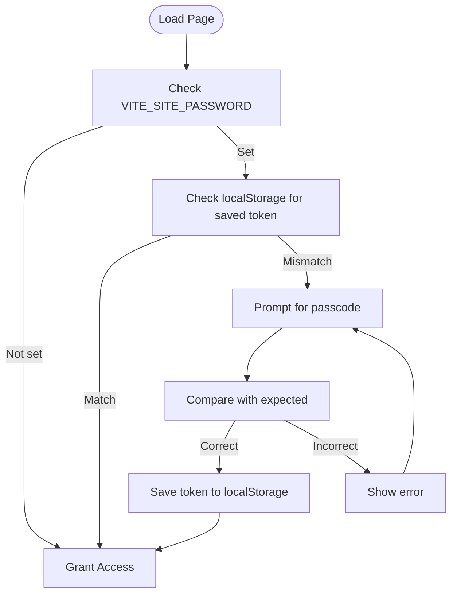
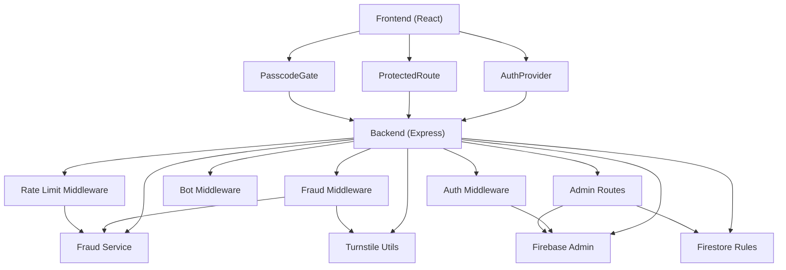

# Security and Compliance

<cite>
**Referenced Files in This Document**
- [auth.middleware.ts](file://backend/middleware/auth.middleware.ts)
- [firebase.service.ts](file://backend/services/firebase.service.ts)
- [ratelimit.middleware.ts](file://backend/middleware/ratelimit.middleware.ts)
- [bot.middleware.ts](file://backend/middleware/bot.middleware.ts)
- [fraud.middleware.ts](file://backend/middleware/fraud.middleware.ts)
- [fraud.service.ts](file://backend/services/fraud.service.ts)
- [turnstile.ts](file://backend/utils/turnstile.ts)
- [admin.routes.ts](file://backend/routes/admin.routes.ts)
- [logger.ts](file://backend/utils/logger.ts)
- [config.ts](file://backend/utils/config.ts)
- [firestore.rules](file://firestore.rules)
- [api.ts](file://netlify/functions/api.ts)
- [AuthProvider.tsx](file://src/context/AuthProvider.tsx)
- [ProtectedRoute.tsx](file://src/routes/ProtectedRoute.tsx)
- [PasscodeGate.tsx](file://src/components/PasscodeGate.tsx)
</cite>

## Table of Contents
1. [Introduction](#introduction)
2. [Project Structure](#project-structure)
3. [Core Components](#core-components)
4. [Architecture Overview](#architecture-overview)
5. [Detailed Component Analysis](#detailed-component-analysis)
6. [Dependency Analysis](#dependency-analysis)
7. [Performance Considerations](#performance-considerations)
8. [Troubleshooting Guide](#troubleshooting-guide)
9. [Conclusion](#conclusion)
10. [Appendices](#appendices)

## Introduction
This document provides comprehensive security and compliance documentation for FaceAnalytics Pro. It covers authentication and authorization using Firebase Authentication, session management, role-based access control, privacy-focused image processing, data retention, middleware protections (authentication, rate limiting, bot detection, fraud detection), GDPR compliance measures, best practices for API and image processing security, monitoring and logging, and the passcode gate for sensitive operations.

## Project Structure
Security and compliance spans both the frontend and backend:
- Frontend: Authentication state management, protected routing, and a passcode gate for sensitive areas.
- Backend: Firebase Admin initialization, middleware stack, fraud detection, rate limiting, bot protection, CAPTCHA verification, and Firestore security rules.

**Diagram sources**
- [api.ts:12-27](file://netlify/functions/api.ts#L12-L27)
- [auth.middleware.ts:18-39](file://backend/middleware/auth.middleware.ts#L18-L39)
- [ratelimit.middleware.ts:25-92](file://backend/middleware/ratelimit.middleware.ts#L25-L92)
- [bot.middleware.ts:102-133](file://backend/middleware/bot.middleware.ts#L102-L133)
- [fraud.middleware.ts:30-104](file://backend/middleware/fraud.middleware.ts#L30-L104)
- [fraud.service.ts:127-204](file://backend/services/fraud.service.ts#L127-L204)
- [turnstile.ts:71-145](file://backend/utils/turnstile.ts#L71-L145)
- [admin.routes.ts:14-42](file://backend/routes/admin.routes.ts#L14-L42)
- [firebase.service.ts:103-119](file://backend/services/firebase.service.ts#L113-L119)
- [firestore.rules:37-116](file://firestore.rules#L37-L116)

**Section sources**
- [api.ts:12-27](file://netlify/functions/api.ts#L12-L27)
- [AuthProvider.tsx:13-66](file://src/context/AuthProvider.tsx#L13-L66)
- [ProtectedRoute.tsx:5-21](file://src/routes/ProtectedRoute.tsx#L5-L21)
- [PasscodeGate.tsx:6-35](file://src/components/PasscodeGate.tsx#L6-L35)
- [auth.middleware.ts:18-39](file://backend/middleware/auth.middleware.ts#L18-L39)
- [ratelimit.middleware.ts:25-92](file://backend/middleware/ratelimit.middleware.ts#L25-L92)
- [bot.middleware.ts:102-133](file://backend/middleware/bot.middleware.ts#L102-L133)
- [fraud.middleware.ts:30-104](file://backend/middleware/fraud.middleware.ts#L30-L104)
- [fraud.service.ts:127-204](file://backend/services/fraud.service.ts#L127-L204)
- [turnstile.ts:71-145](file://backend/utils/turnstile.ts#L71-L145)
- [admin.routes.ts:14-42](file://backend/routes/admin.routes.ts#L14-L42)
- [firebase.service.ts:103-119](file://backend/services/firebase.service.ts#L113-L119)
- [firestore.rules:37-116](file://firestore.rules#L37-L116)

## Core Components
- Authentication and Authorization: Firebase ID token verification middleware and admin RBAC enforcement.
- Session Management: Frontend auth state synchronization and backend user initialization.
- Role-Based Access Control: Firestore rules and admin route guards.
- Privacy-Focused Image Processing: In-memory processing and minimal data retention.
- Security Middleware: Rate limiting, bot detection, and fraud detection with CAPTCHA.
- Monitoring and Logging: Structured logging with redactions and serverless-friendly transports.
- Passcode Gate: Environment-driven access control for sensitive content.

**Section sources**
- [auth.middleware.ts:18-39](file://backend/middleware/auth.middleware.ts#L18-L39)
- [admin.routes.ts:14-42](file://backend/routes/admin.routes.ts#L14-L42)
- [AuthProvider.tsx:18-62](file://src/context/AuthProvider.tsx#L18-L62)
- [ProtectedRoute.tsx:5-21](file://src/routes/ProtectedRoute.tsx#L5-L21)
- [PasscodeGate.tsx:13-31](file://src/components/PasscodeGate.tsx#L13-L31)
- [ratelimit.middleware.ts:25-92](file://backend/middleware/ratelimit.middleware.ts#L25-L92)
- [bot.middleware.ts:102-133](file://backend/middleware/bot.middleware.ts#L102-L133)
- [fraud.middleware.ts:30-104](file://backend/middleware/fraud.middleware.ts#L30-L104)
- [turnstile.ts:71-145](file://backend/utils/turnstile.ts#L71-L145)
- [logger.ts:21-68](file://backend/utils/logger.ts#L21-L68)
- [firestore.rules:37-116](file://firestore.rules#L37-L116)

## Architecture Overview
The system enforces authentication early, then applies layered protections before reaching business logic. Fraud detection augments risk checks with CAPTCHA verification and device fingerprinting. Rate limiting and bot detection protect resources. Admin endpoints enforce strict RBAC and data retention controls.

**Diagram sources**
- [api.ts:24-27](file://netlify/functions/api.ts#L24-L27)
- [auth.middleware.ts:18-39](file://backend/middleware/auth.middleware.ts#L18-L39)
- [ratelimit.middleware.ts:38-91](file://backend/middleware/ratelimit.middleware.ts#L38-L91)
- [bot.middleware.ts:102-133](file://backend/middleware/bot.middleware.ts#L102-L133)
- [fraud.middleware.ts:30-104](file://backend/middleware/fraud.middleware.ts#L30-L104)
- [turnstile.ts:71-145](file://backend/utils/turnstile.ts#L71-L145)
- [fraud.service.ts:429-472](file://backend/services/fraud.service.ts#L429-L472)

## Detailed Component Analysis

### Authentication and Authorization with Firebase
- ID Token Verification: The auth middleware extracts the Bearer token from the Authorization header, verifies it via Firebase Admin Auth, and attaches the decoded user to the request.
- Admin RBAC: Admin routes validate both the user’s email against a configured list and the Firestore users document for a role field, with short-lived caching to reduce reads.
- Frontend Auth State: The AuthProvider subscribes to Firebase auth state changes, initializes the user on the backend, and persists a flag to avoid repeated initialization.

**Diagram sources**
- [AuthProvider.tsx:18-62](file://src/context/AuthProvider.tsx#L18-L62)
- [admin.routes.ts:14-42](file://backend/routes/admin.routes.ts#L14-L42)
- [auth.middleware.ts:18-39](file://backend/middleware/auth.middleware.ts#L18-L39)

**Section sources**
- [auth.middleware.ts:18-39](file://backend/middleware/auth.middleware.ts#L18-L39)
- [admin.routes.ts:14-42](file://backend/routes/admin.routes.ts#L14-L42)
- [AuthProvider.tsx:18-62](file://src/context/AuthProvider.tsx#L18-L62)
- [firebase.service.ts:103-119](file://backend/services/firebase.service.ts#L113-L119)

### Privacy-Focused Image Processing and Data Retention
- In-memory processing: The backend does not persist facial images beyond the analysis lifecycle. Firestore documents for scans include a URL field and a base64 string for analysis data, but the system’s design intent is to process images in-memory and minimize persistent storage.
- Data retention: Activity logs are purged after a configurable retention period via an admin endpoint, reducing long-term data exposure.

**Diagram sources**
- [firestore.rules:74-83](file://firestore.rules#L74-L83)
- [admin.routes.ts:121-131](file://backend/routes/admin.routes.ts#L121-L131)
- [fraud.service.ts:595-633](file://backend/services/fraud.service.ts#L595-L633)

**Section sources**
- [firestore.rules:74-83](file://firestore.rules#L74-L83)
- [admin.routes.ts:121-131](file://backend/routes/admin.routes.ts#L121-L131)
- [fraud.service.ts:595-633](file://backend/services/fraud.service.ts#L595-L633)

### Security Middleware Layer
- Rate Limiting: Sliding window limits per user or IP, with a 2-second timeout and per-IP check for authenticated users to prevent rotation abuse. Daily usage caps reset at midnight UTC.
- Bot Protection: Blocks known bot UAs, headless browser indicators, and behavioral signals indicating automation.
- Fraud Detection: Tracks user activity, maintains risk profiles, and can require CAPTCHA or soft bans. Includes a preemptive block for expensive operations.

**Diagram sources**
- [ratelimit.middleware.ts:38-91](file://backend/middleware/ratelimit.middleware.ts#L38-L91)
- [bot.middleware.ts:102-133](file://backend/middleware/bot.middleware.ts#L102-L133)
- [fraud.middleware.ts:30-104](file://backend/middleware/fraud.middleware.ts#L30-L104)
- [turnstile.ts:71-145](file://backend/utils/turnstile.ts#L71-L145)

**Section sources**
- [ratelimit.middleware.ts:25-92](file://backend/middleware/ratelimit.middleware.ts#L25-L92)
- [bot.middleware.ts:102-133](file://backend/middleware/bot.middleware.ts#L102-L133)
- [fraud.middleware.ts:30-104](file://backend/middleware/fraud.middleware.ts#L30-L104)
- [turnstile.ts:71-145](file://backend/utils/turnstile.ts#L71-L145)

### GDPR Compliance Measures
- Consent and Controls: The frontend includes dedicated pages for Privacy Policy and Terms of Service, enabling users to manage preferences and withdraw consent where applicable.
- Data Deletion Requests: The admin route exposes a purge endpoint for activity logs, supporting data minimization and erasure upon request.
- Privacy Controls: The passcode gate restricts access to sensitive content, aligning with data minimization and least-privilege access.

Note: Specific consent mechanisms (e.g., granular cookie consent) and automated deletion workflows for personal data are not implemented in the referenced files. These should be added to meet full GDPR requirements.

**Section sources**
- [admin.routes.ts:121-131](file://backend/routes/admin.routes.ts#L121-L131)
- [PasscodeGate.tsx:13-31](file://src/components/PasscodeGate.tsx#L13-L31)

### Security Best Practices for Image Processing, APIs, and Data Transmission
- Transport Security: Enforce HTTPS at the CDN and serverless edge; avoid transmitting secrets in URLs.
- API Security: Use bearer tokens, validate scopes, and apply rate limits and bot detection.
- Image Processing: Validate image size and type, avoid storing unnecessary copies, and sanitize inputs.
- Secrets Management: Load Firebase credentials and third-party keys from environment variables validated at startup.

**Section sources**
- [config.ts:59-82](file://backend/utils/config.ts#L59-L82)
- [firebase.service.ts:10-73](file://backend/services/firebase.service.ts#L10-L73)
- [firestore.rules:74-83](file://firestore.rules#L74-L83)

### Monitoring and Logging Strategies
- Logging: A serverless-friendly logger is used in production; development upgrades to pino with redactions for sensitive headers and payloads. Logs capture security-relevant events without exposing secrets.
- Audit Trails: Fraud service batches activity logs and maintains a purge mechanism to control retention.

**Diagram sources**
- [logger.ts:21-68](file://backend/utils/logger.ts#L21-L68)
- [fraud.service.ts:531-588](file://backend/services/fraud.service.ts#L531-L588)

**Section sources**
- [logger.ts:21-68](file://backend/utils/logger.ts#L21-L68)
- [fraud.service.ts:531-588](file://backend/services/fraud.service.ts#L531-L588)

### Passcode Gate Implementation
- Purpose: Restrict access to sensitive content or administrative areas using an environment-defined password.
- Behavior: Stores a hashed token in local storage after successful authentication; if no password is configured, access is granted.

**Diagram sources**
- [PasscodeGate.tsx:13-46](file://src/components/PasscodeGate.tsx#L13-L46)

**Section sources**
- [PasscodeGate.tsx:13-46](file://src/components/PasscodeGate.tsx#L13-L46)

## Dependency Analysis
- Frontend depends on Firebase for auth state and on the backend for protected routes and initialization.
- Backend depends on Firebase Admin for auth verification and Firestore ACLs, Upstash Redis for rate limiting, and Cloudflare Turnstile for CAPTCHA verification.
- Firestore rules enforce ownership and admin-only access to sensitive collections.

**Diagram sources**
- [AuthProvider.tsx:18-62](file://src/context/AuthProvider.tsx#L18-L62)
- [ProtectedRoute.tsx:5-21](file://src/routes/ProtectedRoute.tsx#L5-L21)
- [PasscodeGate.tsx:13-46](file://src/components/PasscodeGate.tsx#L13-L46)
- [auth.middleware.ts:18-39](file://backend/middleware/auth.middleware.ts#L18-L39)
- [ratelimit.middleware.ts:25-92](file://backend/middleware/ratelimit.middleware.ts#L25-L92)
- [bot.middleware.ts:102-133](file://backend/middleware/bot.middleware.ts#L102-L133)
- [fraud.middleware.ts:30-104](file://backend/middleware/fraud.middleware.ts#L30-L104)
- [turnstile.ts:71-145](file://backend/utils/turnstile.ts#L71-L145)
- [fraud.service.ts:127-204](file://backend/services/fraud.service.ts#L127-L204)
- [admin.routes.ts:14-42](file://backend/routes/admin.routes.ts#L14-L42)
- [firebase.service.ts:103-119](file://backend/services/firebase.service.ts#L113-L119)
- [firestore.rules:37-116](file://firestore.rules#L37-L116)

**Section sources**
- [AuthProvider.tsx:18-62](file://src/context/AuthProvider.tsx#L18-L62)
- [ProtectedRoute.tsx:5-21](file://src/routes/ProtectedRoute.tsx#L5-L21)
- [PasscodeGate.tsx:13-46](file://src/components/PasscodeGate.tsx#L13-L46)
- [auth.middleware.ts:18-39](file://backend/middleware/auth.middleware.ts#L18-L39)
- [ratelimit.middleware.ts:25-92](file://backend/middleware/ratelimit.middleware.ts#L25-L92)
- [bot.middleware.ts:102-133](file://backend/middleware/bot.middleware.ts#L102-L133)
- [fraud.middleware.ts:30-104](file://backend/middleware/fraud.middleware.ts#L30-L104)
- [turnstile.ts:71-145](file://backend/utils/turnstile.ts#L71-L145)
- [fraud.service.ts:127-204](file://backend/services/fraud.service.ts#L127-L204)
- [admin.routes.ts:14-42](file://backend/routes/admin.routes.ts#L14-L42)
- [firebase.service.ts:103-119](file://backend/services/firebase.service.ts#L113-L119)
- [firestore.rules:37-116](file://firestore.rules#L37-L116)

## Performance Considerations
- Cold Starts: Serverless bootstrap defers heavy imports until first invocation to keep initialization small.
- Firestore: Prefer REST transport for serverless environments to avoid timeouts; use batching and caching to reduce read/write costs.
- Rate Limits: Composite identifiers and per-IP checks mitigate abuse without impacting legitimate users.
- Fraud Cache: In-memory risk profile cache reduces Firestore reads and latency.

**Section sources**
- [api.ts:12-27](file://netlify/functions/api.ts#L12-L27)
- [firebase.service.ts:93-108](file://backend/services/firebase.service.ts#L93-L108)
- [ratelimit.middleware.ts:38-91](file://backend/middleware/ratelimit.middleware.ts#L38-L91)
- [fraud.service.ts:45-80](file://backend/services/fraud.service.ts#L45-L80)

## Troubleshooting Guide
- Authentication Failures: Verify Authorization header format and token validity; check Firebase Admin initialization and environment variables.
- Rate Limiting Issues: Confirm Upstash Redis configuration and environment variables; review X-RateLimit headers for diagnostics.
- Bot Detection: Review suspicious request scores and headers; adjust thresholds if needed.
- Fraud Detection: Inspect risk profile status and activity logs; ensure CAPTCHA verification is functioning.
- Logging: Ensure logs are captured and redactions are applied; confirm serverless platform supports stdout.

**Section sources**
- [auth.middleware.ts:18-39](file://backend/middleware/auth.middleware.ts#L18-L39)
- [ratelimit.middleware.ts:53-91](file://backend/middleware/ratelimit.middleware.ts#L53-L91)
- [bot.middleware.ts:121-133](file://backend/middleware/bot.middleware.ts#L121-L133)
- [fraud.middleware.ts:96-104](file://backend/middleware/fraud.middleware.ts#L96-L104)
- [turnstile.ts:71-145](file://backend/utils/turnstile.ts#L71-L145)
- [logger.ts:21-68](file://backend/utils/logger.ts#L21-L68)

## Conclusion
FaceAnalytics Pro implements a robust, layered security model centered on Firebase Authentication, strict admin RBAC, comprehensive middleware protections, and privacy-conscious data handling. Administrators can enforce access controls, monitor activity, and manage retention. To achieve full GDPR alignment, additional consent and automated deletion mechanisms should be integrated alongside the existing controls.

## Appendices
- Environment Validation: Centralized schema validation ensures critical environment variables are present in production and provides graceful degradation in development.
- Firestore ACLs: Ownership-based rules and admin-only access to sensitive collections enforce least privilege.

**Section sources**
- [config.ts:59-82](file://backend/utils/config.ts#L59-L82)
- [firestore.rules:89-116](file://firestore.rules#L89-L116)