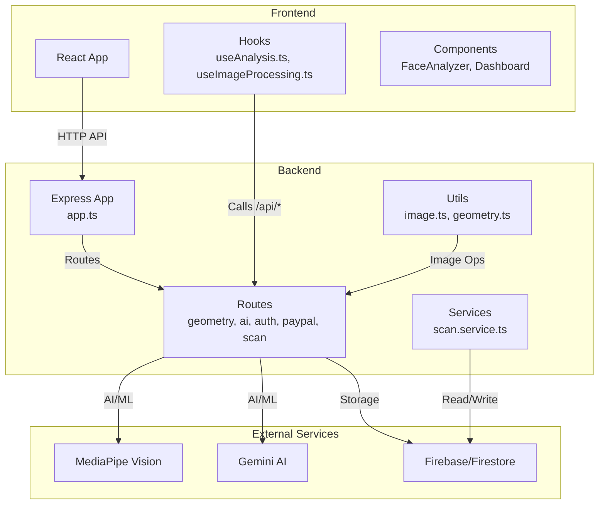
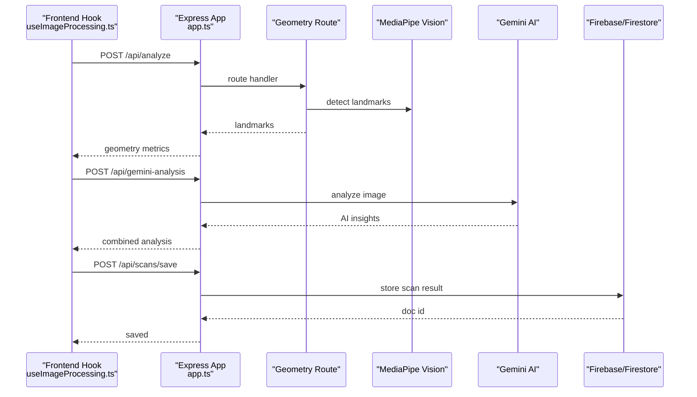
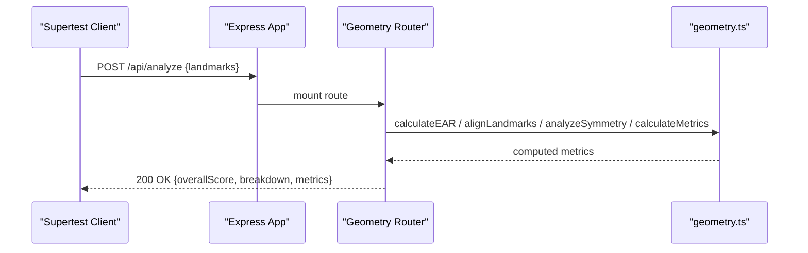
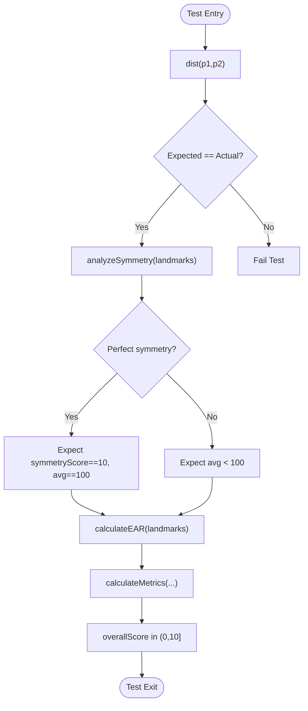
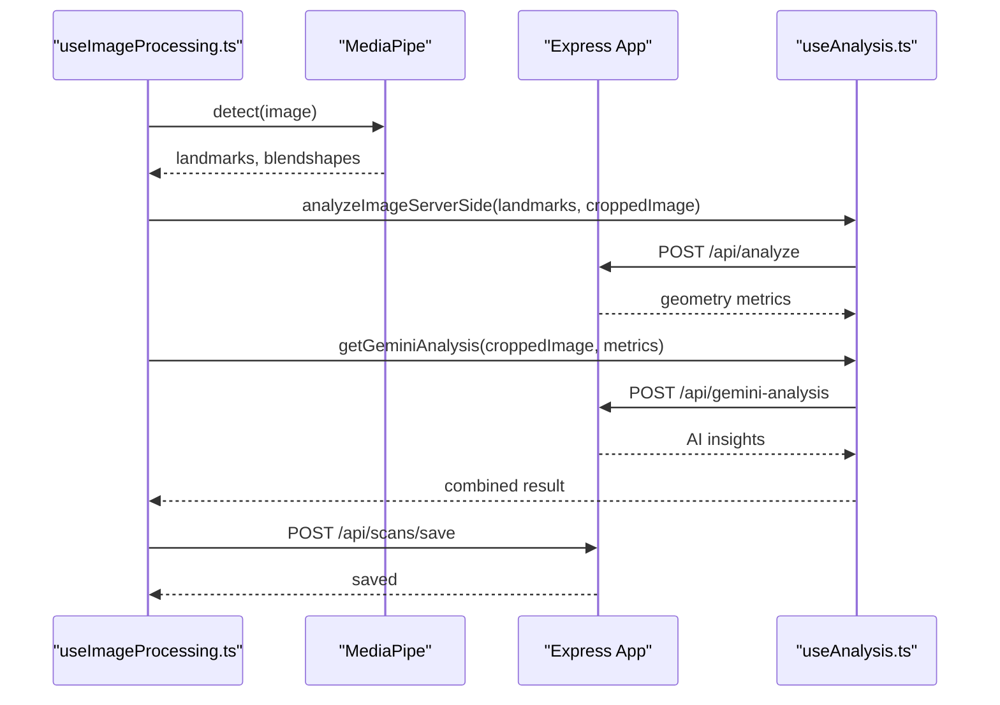
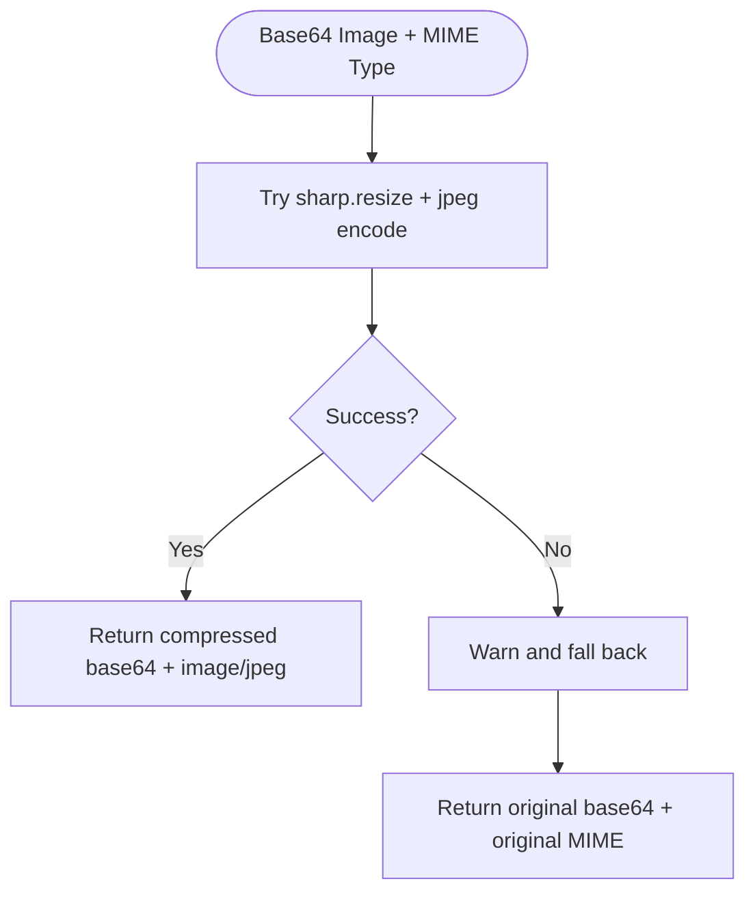
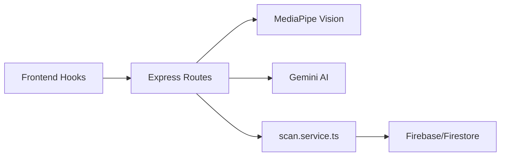

# Testing Strategy

<cite>
**Referenced Files in This Document**
- [package.json](file://package.json)
- [README.md](file://README.md)
- [.github/workflows/ci.yml](file://.github/workflows/ci.yml)
- [backend/app.ts](file://backend/app.ts)
- [backend/routes/geometry.routes.test.ts](file://backend/routes/geometry.routes.test.ts)
- [backend/utils/geometry.test.ts](file://backend/utils/geometry.test.ts)
- [backend/utils/image.ts](file://backend/utils/image.ts)
- [backend/services/scan.service.ts](file://backend/services/scan.service.ts)
- [src/components/FaceAnalyzer/hooks/useAnalysis.ts](file://src/components/FaceAnalyzer/hooks/useAnalysis.ts)
- [src/components/FaceAnalyzer/hooks/useImageProcessing.ts](file://src/components/FaceAnalyzer/hooks/useImageProcessing.ts)
</cite>

## Table of Contents
1. [Introduction](#introduction)
2. [Project Structure](#project-structure)
3. [Core Components](#core-components)
4. [Architecture Overview](#architecture-overview)
5. [Detailed Component Analysis](#detailed-component-analysis)
6. [Dependency Analysis](#dependency-analysis)
7. [Performance Considerations](#performance-considerations)
8. [Troubleshooting Guide](#troubleshooting-guide)
9. [Conclusion](#conclusion)
10. [Appendices](#appendices)

## Introduction
This document defines the comprehensive testing strategy for FaceAnalytics Pro. It covers unit testing for React components and hooks, backend services and routes, and AI/image processing utilities. It also documents integration testing for API endpoints, database operations, and third-party service integrations (MediaPipe, Gemini AI, Firebase). Guidance is included for end-to-end testing of user workflows, best practices for AI processing components, continuous integration and automated pipelines, debugging strategies, and performance/load testing approaches.

## Project Structure
The repository is a full-stack TypeScript application:
- Frontend: React 19 with Vite, Tailwind, and Framer Motion.
- Backend: Node.js/Express with dynamic route mounting and middleware.
- AI/ML: MediaPipe Tasks Vision for landmark detection; Gemini AI for aesthetic analysis.
- Data: Firebase/Firestore for authentication and storage.
- Testing: Vitest for unit/integration tests; Supertest for API tests; CI via GitHub Actions.

**Diagram sources**
- [backend/app.ts:15-201](file://backend/app.ts#L15-L201)
- [backend/routes/geometry.routes.test.ts:1-60](file://backend/routes/geometry.routes.test.ts#L1-L60)
- [backend/utils/image.ts:1-42](file://backend/utils/image.ts#L1-L42)
- [backend/services/scan.service.ts:1-134](file://backend/services/scan.service.ts#L1-L134)
- [src/components/FaceAnalyzer/hooks/useAnalysis.ts:1-207](file://src/components/FaceAnalyzer/hooks/useAnalysis.ts#L1-L207)
- [src/components/FaceAnalyzer/hooks/useImageProcessing.ts:1-234](file://src/components/FaceAnalyzer/hooks/useImageProcessing.ts#L1-L234)

**Section sources**
- [README.md:18-22](file://README.md#L18-L22)
- [package.json:10-17](file://package.json#L10-L17)
- [backend/app.ts:15-201](file://backend/app.ts#L15-L201)

## Core Components
- Unit testing framework: Vitest.
- API testing library: Supertest.
- Test runner command: npm test invokes Vitest in run mode.
- CI pipeline: GitHub Actions job runs typecheck, lint, and tests.

Key testing artifacts present:
- Backend route tests using Supertest and Vitest mocks.
- Backend utility tests for geometry calculations.
- Frontend hooks tests are not present; see “Unit Testing” section for recommendations.

**Section sources**
- [package.json:17](file://package.json#L17)
- [.github/workflows/ci.yml:21](file://.github/workflows/ci.yml#L21)
- [backend/routes/geometry.routes.test.ts:1-60](file://backend/routes/geometry.routes.test.ts#L1-L60)
- [backend/utils/geometry.test.ts:1-106](file://backend/utils/geometry.test.ts#L1-L106)

## Architecture Overview
The testing strategy aligns with the application’s layered architecture:
- Frontend hooks and components trigger API calls to the backend.
- Backend routes orchestrate AI/ML inference and database operations.
- Third-party integrations are isolated behind route handlers and services.

**Diagram sources**
- [backend/app.ts:171-179](file://backend/app.ts#L171-L179)
- [src/components/FaceAnalyzer/hooks/useImageProcessing.ts:26-222](file://src/components/FaceAnalyzer/hooks/useImageProcessing.ts#L26-L222)
- [src/components/FaceAnalyzer/hooks/useAnalysis.ts:9-23](file://src/components/FaceAnalyzer/hooks/useAnalysis.ts#L9-L23)
- [src/components/FaceAnalyzer/hooks/useAnalysis.ts:25-160](file://src/components/FaceAnalyzer/hooks/useAnalysis.ts#L25-L160)
- [backend/services/scan.service.ts:68-94](file://backend/services/scan.service.ts#L68-L94)

## Detailed Component Analysis

### Backend Geometry API Tests
These tests validate route-level behavior and error handling for geometry-based facial analysis:
- Positive path: valid landmarks produce a successful response with scores and breakdown.
- Negative paths: missing landmarks, invalid EAR thresholds, and malformed requests return appropriate errors.

**Diagram sources**
- [backend/routes/geometry.routes.test.ts:29-58](file://backend/routes/geometry.routes.test.ts#L29-L58)
- [backend/utils/geometry.test.ts:4-104](file://backend/utils/geometry.test.ts#L4-L104)

**Section sources**
- [backend/routes/geometry.routes.test.ts:1-60](file://backend/routes/geometry.routes.test.ts#L1-L60)
- [backend/utils/geometry.test.ts:1-106](file://backend/utils/geometry.test.ts#L1-L106)

### Backend Utility Tests (Geometry)
These tests assert correctness of geometric computations:
- Distance calculation between 3D points.
- Symmetry scoring for centered vs. asymmetric landmarks.
- EAR computation and metric aggregation.

**Diagram sources**
- [backend/utils/geometry.test.ts:4-104](file://backend/utils/geometry.test.ts#L4-L104)

**Section sources**
- [backend/utils/geometry.test.ts:1-106](file://backend/utils/geometry.test.ts#L1-L106)

### Frontend Hooks: useAnalysis and useImageProcessing
These hooks coordinate client-side processing and API interactions:
- useAnalysis: orchestrates server-side geometry analysis, optional Gemini AI enhancement, retry logic, timeout handling, and saving results to history.
- useImageProcessing: integrates MediaPipe detection, image quality checks, cropping, canvas rendering, and progressive UI updates.

**Diagram sources**
- [src/components/FaceAnalyzer/hooks/useImageProcessing.ts:26-222](file://src/components/FaceAnalyzer/hooks/useImageProcessing.ts#L26-L222)
- [src/components/FaceAnalyzer/hooks/useAnalysis.ts:9-23](file://src/components/FaceAnalyzer/hooks/useAnalysis.ts#L9-L23)
- [src/components/FaceAnalyzer/hooks/useAnalysis.ts:25-160](file://src/components/FaceAnalyzer/hooks/useAnalysis.ts#L25-L160)
- [backend/app.ts:171-179](file://backend/app.ts#L171-L179)

**Section sources**
- [src/components/FaceAnalyzer/hooks/useAnalysis.ts:1-207](file://src/components/FaceAnalyzer/hooks/useAnalysis.ts#L1-L207)
- [src/components/FaceAnalyzer/hooks/useImageProcessing.ts:1-234](file://src/components/FaceAnalyzer/hooks/useImageProcessing.ts#L1-L234)

### Backend Image Utilities and Scan Service
- Image compression utility: resizes and re-encodes base64 images safely with fallback on failure.
- Scan service: hashing, caching, storing, and retrieving scan results; integrates with Firestore.

**Diagram sources**
- [backend/utils/image.ts:11-41](file://backend/utils/image.ts#L11-L41)

**Section sources**
- [backend/utils/image.ts:1-42](file://backend/utils/image.ts#L1-L42)
- [backend/services/scan.service.ts:1-134](file://backend/services/scan.service.ts#L1-L134)

## Dependency Analysis
- Frontend depends on backend routes for AI analysis and history persistence.
- Backend depends on MediaPipe for landmark detection and Gemini for aesthetic insights.
- Backend persists data to Firebase/Firestore via scan service.

**Diagram sources**
- [src/components/FaceAnalyzer/hooks/useImageProcessing.ts:26-222](file://src/components/FaceAnalyzer/hooks/useImageProcessing.ts#L26-L222)
- [backend/app.ts:171-179](file://backend/app.ts#L171-L179)
- [backend/services/scan.service.ts:1-134](file://backend/services/scan.service.ts#L1-L134)

**Section sources**
- [backend/app.ts:15-201](file://backend/app.ts#L15-L201)
- [src/components/FaceAnalyzer/hooks/useAnalysis.ts:1-207](file://src/components/FaceAnalyzer/hooks/useAnalysis.ts#L1-L207)

## Performance Considerations
- Asynchronous initialization: Backend lazily imports heavy modules to avoid cold-start timeouts in serverless environments.
- Request logging and request IDs enable tracing across asynchronous operations.
- Image compression reduces payload sizes for AI inference, improving throughput and latency.
- Frontend uses progressive rendering and controlled timeouts to maintain responsiveness during long AI calls.

Recommendations:
- Add performance budgets for bundle sizes and image uploads.
- Instrument AI inference latency and cache hit rates.
- Monitor backend cold-start durations and optimize module loading order.

**Section sources**
- [backend/app.ts:15-201](file://backend/app.ts#L15-L201)
- [backend/utils/image.ts:11-41](file://backend/utils/image.ts#L11-L41)
- [src/components/FaceAnalyzer/hooks/useAnalysis.ts:34-58](file://src/components/FaceAnalyzer/hooks/useAnalysis.ts#L34-L58)

## Troubleshooting Guide
Common issues and debugging strategies:
- Backend health endpoint: use GET /api/health to verify runtime availability.
- Logging: request IDs are attached to logs for correlation across middleware and routes.
- Error handling: global error handler returns structured 500 responses with request IDs.
- Frontend timeouts: Gemini requests include a 70-second timeout to accommodate long-running AI calls; adjust if needed.
- Image failures: image compression falls back to original data on errors; verify logs for warnings.

Actionable checks:
- Confirm environment variables for Gemini and Firebase are set.
- Verify CORS allowlist and Content-Security-Policy headers.
- Inspect network tab for 4xx/5xx responses and backend logs.

**Section sources**
- [backend/app.ts:167-169](file://backend/app.ts#L167-L169)
- [backend/app.ts:72-88](file://backend/app.ts#L72-L88)
- [backend/app.ts:182-191](file://backend/app.ts#L182-L191)
- [src/components/FaceAnalyzer/hooks/useAnalysis.ts:51-60](file://src/components/FaceAnalyzer/hooks/useAnalysis.ts#L51-L60)
- [backend/utils/image.ts:37-41](file://backend/utils/image.ts#L37-L41)

## Conclusion
The testing strategy leverages Vitest and Supertest to validate backend routes and utilities, while frontend hooks orchestrate AI-driven workflows. The CI pipeline ensures type safety, linting, and test execution. To strengthen coverage, add unit tests for frontend hooks, expand integration tests for AI endpoints, and introduce performance/load tests for production readiness.

## Appendices

### Unit Testing Approach
- React components and hooks:
  - Use Vitest with React Testing Library patterns to mock dependencies (e.g., auth, APIs).
  - Focus on user interactions, state transitions, and error paths.
  - Example targets: useImageProcessing hook, useAnalysis hook, FaceAnalyzer components.
- Utility functions:
  - Continue the pattern established in geometry tests for pure functions.
  - Add tests for image processing helpers and quality checks.
- Backend services:
  - Expand existing route tests to cover more scenarios (validation, rate limiting, auth).
  - Add tests for scan service operations (hashing, caching, retrieval).

Coverage goals:
- Target 80%+ line coverage for backend utilities and routes.
- Aim for 70%+ for frontend hooks and critical components.

Quality assurance:
- Enforce linting and typechecks in CI.
- Run tests on every push and pull request.

**Section sources**
- [backend/routes/geometry.routes.test.ts:1-60](file://backend/routes/geometry.routes.test.ts#L1-L60)
- [backend/utils/geometry.test.ts:1-106](file://backend/utils/geometry.test.ts#L1-L106)
- [package.json:17](file://package.json#L17)
- [.github/workflows/ci.yml:10-21](file://.github/workflows/ci.yml#L10-L21)

### Integration Testing Strategy
- API endpoints:
  - Use Supertest to simulate requests to mounted routes (/api/analyze, /api/gemini-analysis, /api/scans/save).
  - Mock external dependencies (MediaPipe, Gemini, Firebase) to isolate backend logic.
- Database operations:
  - Use scan service tests as a model: mock Firestore calls and assert queries, writes, and pagination.
- Third-party integrations:
  - Validate error propagation for missing keys, quota limits, and timeouts.
  - Simulate network failures and partial responses.

**Section sources**
- [backend/routes/geometry.routes.test.ts:1-60](file://backend/routes/geometry.routes.test.ts#L1-L60)
- [backend/services/scan.service.ts:31-94](file://backend/services/scan.service.ts#L31-L94)

### End-to-End Testing Approaches
- User workflows:
  - Automate image upload, landmark detection, geometry analysis, optional AI enhancement, and saving to history.
  - Use Playwright or Cypress to drive browser automation and assert UI states and analytics events.
- Critical business processes:
  - Validate credit checks, authentication gating, and retry logic for AI calls.
  - Capture and verify PostHog analytics events.

[No sources needed since this section provides general guidance]

### AI Processing and Image Analysis Best Practices
- Isolate AI calls behind route handlers and inject clients via dependency injection or singletons.
- Add circuit breakers and exponential backoff for AI providers.
- Log request IDs and payload sizes for observability.
- Implement deterministic tests for image preprocessing and quality checks.

**Section sources**
- [src/components/FaceAnalyzer/hooks/useAnalysis.ts:25-160](file://src/components/FaceAnalyzer/hooks/useAnalysis.ts#L25-L160)
- [src/components/FaceAnalyzer/hooks/useImageProcessing.ts:125-140](file://src/components/FaceAnalyzer/hooks/useImageProcessing.ts#L125-L140)
- [backend/utils/image.ts:11-41](file://backend/utils/image.ts#L11-L41)

### Continuous Integration and Automated Pipelines
- CI job runs typecheck, lint, and tests on pushes and pull requests.
- Recommended enhancements:
  - Add coverage reporting and thresholds.
  - Parallelize heavy tasks (e.g., image compression tests) when applicable.

**Section sources**
- [.github/workflows/ci.yml:10-21](file://.github/workflows/ci.yml#L10-L21)

### Debugging Strategies and Maintenance
- Use request IDs to correlate logs across middleware and routes.
- Add targeted logs around AI inference and database operations.
- Maintain a changelog of test additions and fixes to track coverage improvements.

**Section sources**
- [backend/app.ts:72-88](file://backend/app.ts#L72-L88)
- [backend/app.ts:182-191](file://backend/app.ts#L182-L191)

### Performance and Load Testing
- Performance:
  - Measure median and p95 latencies for /api/analyze and /api/gemini-analysis.
  - Track cache hit ratio for repeated scans.
- Load testing:
  - Use Artillery or k6 to simulate concurrent users uploading images and triggering AI analysis.
  - Validate horizontal scaling and cold-start mitigation.

[No sources needed since this section provides general guidance]