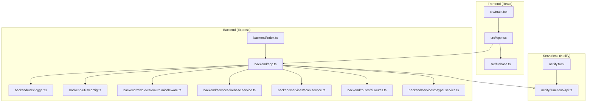
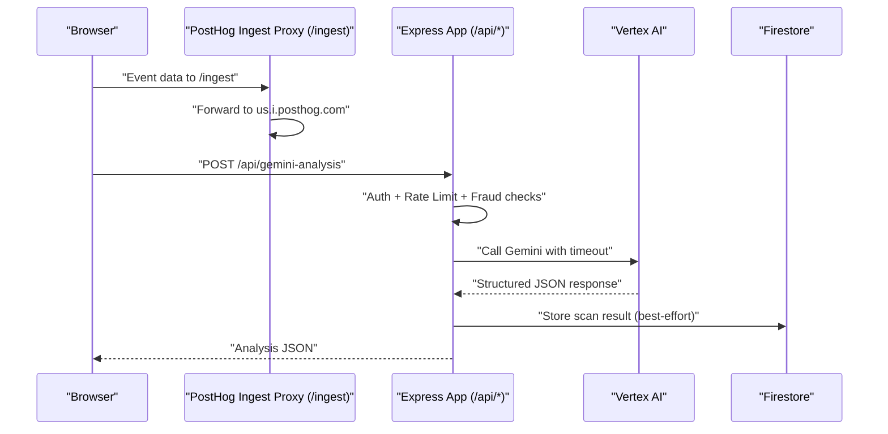

# Troubleshooting and FAQ

<cite>
**Referenced Files in This Document**
- [package.json](file://package.json)
- [netlify.toml](file://netlify.toml)
- [backend/index.ts](file://backend/index.ts)
- [backend/app.ts](file://backend/app.ts)
- [netlify/functions/api.ts](file://netlify/functions/api.ts)
- [backend/utils/logger.ts](file://backend/utils/logger.ts)
- [backend/services/firebase.service.ts](file://backend/services/firebase.service.ts)
- [backend/services/scan.service.ts](file://backend/services/scan.service.ts)
- [backend/middleware/auth.middleware.ts](file://backend/middleware/auth.middleware.ts)
- [backend/utils/config.ts](file://backend/utils/config.ts)
- [backend/routes/ai.routes.ts](file://backend/routes/ai.routes.ts)
- [backend/services/paypal.service.ts](file://backend/services/paypal.service.ts)
- [src/main.tsx](file://src/main.tsx)
- [src/App.tsx](file://src/App.tsx)
- [src/firebase.ts](file://src/firebase.ts)
</cite>

## Table of Contents
1. [Introduction](#introduction)
2. [Project Structure](#project-structure)
3. [Core Components](#core-components)
4. [Architecture Overview](#architecture-overview)
5. [Detailed Component Analysis](#detailed-component-analysis)
6. [Dependency Analysis](#dependency-analysis)
7. [Performance Considerations](#performance-considerations)
8. [Troubleshooting Guide](#troubleshooting-guide)
9. [Conclusion](#conclusion)
10. [Appendices](#appendices)

## Introduction
This document provides a comprehensive Troubleshooting and FAQ guide for FaceAnalytics Pro. It covers development environment issues, production deployment constraints, performance tuning, integration debugging (Firebase, AI services, payments), maintenance procedures, monitoring/logging, and emergency response protocols. The goal is to help developers and operators quickly diagnose and resolve common problems across the frontend, backend, and serverless infrastructure.

## Project Structure
The project is a full-stack TypeScript application with:
- Frontend built with React and Vite, instrumented with PostHog analytics proxying.
- Backend Express server with dynamic imports to optimize cold starts in serverless environments.
- Serverless entrypoint via Netlify Functions using serverless-http.
- Firebase Admin/Web SDK for authentication, Firestore, and storage.
- AI analysis powered by Vertex AI (Gemini) with robust retry and timeout controls.
- Payment integration via PayPal with token caching.

**Diagram sources**
- [src/main.tsx:1-40](file://src/main.tsx#L1-L40)
- [src/App.tsx:1-473](file://src/App.tsx#L1-L473)
- [src/firebase.ts:1-21](file://src/firebase.ts#L1-L21)
- [backend/index.ts:1-29](file://backend/index.ts#L1-L29)
- [backend/app.ts:1-205](file://backend/app.ts#L1-L205)
- [backend/utils/logger.ts:1-71](file://backend/utils/logger.ts#L1-L71)
- [backend/utils/config.ts:1-110](file://backend/utils/config.ts#L1-L110)
- [backend/middleware/auth.middleware.ts:1-40](file://backend/middleware/auth.middleware.ts#L1-L40)
- [backend/services/firebase.service.ts:1-120](file://backend/services/firebase.service.ts#L1-L120)
- [backend/services/scan.service.ts:1-134](file://backend/services/scan.service.ts#L1-L134)
- [backend/routes/ai.routes.ts:1-800](file://backend/routes/ai.routes.ts#L1-L800)
- [backend/services/paypal.service.ts:1-41](file://backend/services/paypal.service.ts#L1-L41)
- [netlify.toml:1-42](file://netlify.toml#L1-L42)
- [netlify/functions/api.ts:1-28](file://netlify/functions/api.ts#L1-L28)

**Section sources**
- [package.json:1-79](file://package.json#L1-L79)
- [netlify.toml:1-42](file://netlify.toml#L1-L42)
- [backend/index.ts:1-29](file://backend/index.ts#L1-L29)
- [backend/app.ts:1-205](file://backend/app.ts#L1-L205)
- [netlify/functions/api.ts:1-28](file://netlify/functions/api.ts#L1-L28)
- [src/main.tsx:1-40](file://src/main.tsx#L1-L40)
- [src/App.tsx:1-473](file://src/App.tsx#L1-L473)
- [src/firebase.ts:1-21](file://src/firebase.ts#L1-L21)

## Core Components
- Environment configuration and validation: Centralized schema ensures required variables are present in production and provides graceful degradation in development.
- Logger: Synchronous console logger in production; upgrades to pino in development for richer output.
- Firebase Admin/Web: Admin SDK initialization with environment-driven service account parsing and HTTP/1.1 Firestore settings for serverless stability.
- AI routes: Vertex AI integration with timeouts, retries, structured JSON parsing, and credit-safe ordering.
- Serverless bootstrap: Dynamic imports and serverless-http wrapper to avoid cold start timeouts and reduce init overhead.
- Payments: PayPal token caching with expiry buffer to minimize repeated auth calls.

**Section sources**
- [backend/utils/config.ts:1-110](file://backend/utils/config.ts#L1-L110)
- [backend/utils/logger.ts:1-71](file://backend/utils/logger.ts#L1-L71)
- [backend/services/firebase.service.ts:1-120](file://backend/services/firebase.service.ts#L1-L120)
- [backend/routes/ai.routes.ts:1-800](file://backend/routes/ai.routes.ts#L1-L800)
- [netlify/functions/api.ts:1-28](file://netlify/functions/api.ts#L1-L28)
- [backend/services/paypal.service.ts:1-41](file://backend/services/paypal.service.ts#L1-L41)

## Architecture Overview
The system integrates frontend analytics, backend APIs, and serverless hosting. The frontend initializes PostHog and suppresses noisy logs. The backend uses helmet for CSP, dynamic imports for cold start mitigation, and a reverse proxy for PostHog ingestion. Netlify enforces function timeouts and bundles dependencies for performance.

**Diagram sources**
- [backend/app.ts:49-59](file://backend/app.ts#L49-L59)
- [backend/app.ts:166-179](file://backend/app.ts#L166-L179)
- [backend/routes/ai.routes.ts:167-254](file://backend/routes/ai.routes.ts#L167-L254)
- [backend/services/scan.service.ts:68-94](file://backend/services/scan.service.ts#L68-L94)

**Section sources**
- [src/main.tsx:8-12](file://src/main.tsx#L8-L12)
- [backend/app.ts:49-59](file://backend/app.ts#L49-L59)
- [backend/app.ts:166-179](file://backend/app.ts#L166-L179)
- [backend/routes/ai.routes.ts:167-254](file://backend/routes/ai.routes.ts#L167-L254)
- [backend/services/scan.service.ts:68-94](file://backend/services/scan.service.ts#L68-L94)

## Detailed Component Analysis

### Environment Validation and Configuration
Common issues:
- Missing or malformed environment variables cause immediate crashes in production.
- Development mode tolerates missing values but may degrade functionality.

Resolution steps:
- Validate all required variables using the centralized schema.
- In production, ensure VERTEX_API_KEY, FIREBASE_SERVICE_ACCOUNT, and related secrets are set.
- Confirm APP_URL matches the deployed origin for CORS.

**Section sources**
- [backend/utils/config.ts:7-48](file://backend/utils/config.ts#L7-L48)
- [backend/utils/config.ts:59-82](file://backend/utils/config.ts#L59-L82)

### Logging and Diagnostics
- Production uses a synchronous console logger to avoid worker-thread issues in serverless.
- Development upgrades to pino with redaction of sensitive headers/body.
- Request IDs are attached to logs for traceability.

Resolution steps:
- Check function logs in Netlify for synchronous logs.
- In development, confirm LOG_LEVEL and redaction settings.
- Use request IDs to correlate client-side events with backend logs.

**Section sources**
- [backend/utils/logger.ts:1-71](file://backend/utils/logger.ts#L1-L71)

### Firebase Initialization and Firestore Settings
- Admin SDK supports environment-driven service account parsing with newline normalization.
- Strict environments (production/Netlify) prevent silent failures.
- Firestore switched to HTTP/1.1 (REST) to avoid gRPC cold start delays.

Resolution steps:
- Verify FIREBASE_SERVICE_ACCOUNT JSON validity and proper escaping.
- Ensure FIRESTORE_DATABASE_ID is set for serverless.
- Confirm service account key file presence in development if env var is absent.

**Section sources**
- [backend/services/firebase.service.ts:14-49](file://backend/services/firebase.service.ts#L14-L49)
- [backend/services/firebase.service.ts:80-108](file://backend/services/firebase.service.ts#L80-L108)

### Authentication Middleware
- Validates Authorization Bearer tokens via Firebase Admin Auth.
- Propagates decoded user info to downstream routes.

Resolution steps:
- Confirm Authorization header format and token freshness.
- Check Firebase Auth service availability and token verification logs.

**Section sources**
- [backend/middleware/auth.middleware.ts:18-39](file://backend/middleware/auth.middleware.ts#L18-L39)

### AI Analysis Pipeline (Vertex AI)
- Supports Gemini Developer API and Vertex OAuth endpoints based on key prefix.
- Enforces per-request timeouts aligned with Netlify’s 26s limit.
- Implements retry with exponential backoff and parses structured JSON responses.
- Credit-safe ordering: AI call first, then best-effort credit deduction.

Resolution steps:
- Verify VERTEX_API_KEY correctness and prefix.
- Monitor Vertex AI response parsing and retry logs.
- Confirm AI timeout alignment with platform limits.

**Section sources**
- [backend/routes/ai.routes.ts:41-49](file://backend/routes/ai.routes.ts#L41-L49)
- [backend/routes/ai.routes.ts:167-254](file://backend/routes/ai.routes.ts#L167-L254)
- [backend/routes/ai.routes.ts:271-516](file://backend/routes/ai.routes.ts#L271-L516)

### Serverless Cold Starts and Timeouts
- Dynamic imports in serverless entrypoint and backend app reduce init time.
- Netlify function timeout is 26s; backend uses 24s to flush responses.
- Vite dev server is injected in non-production environments.

Resolution steps:
- Avoid heavy synchronous operations in module scope.
- Keep route handlers lazy-loaded via dynamic imports.
- Validate function bundler and external modules in netlify.toml.

**Section sources**
- [netlify/functions/api.ts:12-22](file://netlify/functions/api.ts#L12-L22)
- [backend/app.ts:3-8](file://backend/app.ts#L3-L8)
- [netlify.toml:19-26](file://netlify.toml#L19-L26)
- [backend/index.ts:10-16](file://backend/index.ts#L10-L16)

### PostHog Analytics Proxy
- Reverse proxy for ingestion to PostHog host.
- Frontend initializes PostHog with a proxied ingest path.

Resolution steps:
- Confirm VITE_PUBLIC_POSTHOG_HOST and ingest redirects.
- Validate PostHog API key and project configuration.

**Section sources**
- [backend/app.ts:49-59](file://backend/app.ts#L49-L59)
- [src/main.tsx:8-12](file://src/main.tsx#L8-L12)

### PayPal Integration
- Token caching with expiry buffer to reduce auth frequency.
- Throws if credentials are missing.

Resolution steps:
- Ensure PAYPAL_CLIENT_ID and PAYPAL_CLIENT_SECRET are set.
- Monitor token expiry and refresh behavior.

**Section sources**
- [backend/services/paypal.service.ts:12-40](file://backend/services/paypal.service.ts#L12-L40)

## Dependency Analysis
Key dependencies and their roles:
- Express: Backend web server and routing.
- Firebase Admin/Web: Authentication, Firestore, and storage.
- PostHog: Analytics with reverse proxy.
- serverless-http: Wraps Express for Netlify Functions.
- pino: Structured logging in development.
- @google/genai: Vertex AI integration.
- sharp: Image compression for AI requests.

Potential conflicts:
- Native dependencies in serverless (e.g., pino worker threads) are avoided in production.
- Ensure consistent Node.js version per engines field.

**Section sources**
- [package.json:19-52](file://package.json#L19-L52)
- [backend/utils/logger.ts:1-10](file://backend/utils/logger.ts#L1-L10)
- [netlify.toml:7-16](file://netlify.toml#L7-L16)

## Performance Considerations
- Cold start mitigation: Dynamic imports and serverless-http wrapper.
- AI timeouts: Backend timeout tuned to platform limits; Vertex calls use AbortController.
- Image compression: Reduces payload sizes sent to Vertex AI.
- Firestore HTTP/1.1: Prevents gRPC handshake delays in cold starts.
- Logging overhead: Console-based logger in production; pino in development.

Recommendations:
- Minimize synchronous work in module scope.
- Use best-effort side effects (e.g., storing scan results) to avoid blocking responses.
- Monitor Vertex AI latency and adjust model or prompts if needed.

[No sources needed since this section provides general guidance]

## Troubleshooting Guide

### Development Environment Issues
- Dependency conflicts or missing packages
  - Symptom: Build fails or module resolution errors.
  - Resolution: Run a clean install and ensure Node.js version satisfies engines. Rebuild dependencies if native modules are involved.
  - Related files: [package.json:7-9](file://package.json#L7-L9), [package.json:10-17](file://package.json#L10-L17)

- Build errors (Vite)
  - Symptom: Vite build fails or hot reload issues.
  - Resolution: Clear dist and node_modules caches, reinstall, and rebuild. Check Vite config and plugins.
  - Related files: [package.json:11-12](file://package.json#L11-L12), [netlify.toml:1-3](file://netlify.toml#L1-L3)

- Configuration problems (missing environment variables)
  - Symptom: Immediate crash in production or degraded development behavior.
  - Resolution: Validate environment variables using the centralized schema. Ensure VERTEX_API_KEY, FIREBASE_SERVICE_ACCOUNT, and others are set.
  - Related files: [backend/utils/config.ts:59-82](file://backend/utils/config.ts#L59-L82)

### Production Deployment Issues
- Serverless function timeouts
  - Symptom: 502 Bad Gateway or function timeout around 26s.
  - Resolution: Confirm backend timeout aligns with platform limits. Reduce heavy synchronous work in init. Use dynamic imports for heavy modules.
  - Related files: [netlify/functions/api.ts:12-22](file://netlify/functions/api.ts#L12-L22), [netlify.toml:19-26](file://netlify.toml#L19-L26), [backend/routes/ai.routes.ts:165-166](file://backend/routes/ai.routes.ts#L165-L166)

- Cold start problems
  - Symptom: Slow first request or intermittent failures.
  - Resolution: Ensure dynamic imports are used for heavy modules. Avoid synchronous heavy work in module scope.
  - Related files: [backend/app.ts:3-8](file://backend/app.ts#L3-L8), [netlify/functions/api.ts:12-22](file://netlify/functions/api.ts#L12-L22)

- Resource limitations (memory/CPU)
  - Symptom: Out-of-memory or slow responses.
  - Resolution: Optimize image compression, reduce payload sizes, and avoid large synchronous computations in request handlers.
  - Related files: [backend/routes/ai.routes.ts:330-331](file://backend/routes/ai.routes.ts#L330-L331)

### Performance Troubleshooting
- Slow analysis processing
  - Symptom: Long Vertex AI response times.
  - Resolution: Adjust model, reduce payload size, enable retries, and monitor timeouts.
  - Related files: [backend/routes/ai.routes.ts:167-254](file://backend/routes/ai.routes.ts#L167-L254)

- Memory leaks
  - Symptom: Increasing memory usage over time.
  - Resolution: Avoid retaining large buffers or closures. Use streaming or chunked processing where applicable.
  - Related files: [backend/routes/ai.routes.ts:414-432](file://backend/routes/ai.routes.ts#L414-L432)

- UI responsiveness issues
  - Symptom: Jank during animations or route transitions.
  - Resolution: Review animation budgets and device tiers. Disable premium effects on low-tier devices.
  - Related files: [src/App.tsx:127-175](file://src/App.tsx#L127-L175)

### Integration Debugging
- Firebase connectivity
  - Symptom: Auth or Firestore calls failing or hanging.
  - Resolution: Validate FIREBASE_SERVICE_ACCOUNT JSON and newline normalization. Ensure Firestore settings switched to HTTP/1.1 in serverless.
  - Related files: [backend/services/firebase.service.ts:14-49](file://backend/services/firebase.service.ts#L14-L49), [backend/services/firebase.service.ts:97-108](file://backend/services/firebase.service.ts#L97-L108)

- AI service failures (Vertex AI)
  - Symptom: 502 errors or parsing failures.
  - Resolution: Check API key correctness, endpoint selection, and retry logs. Validate response parsing and structured JSON expectations.
  - Related files: [backend/routes/ai.routes.ts:167-254](file://backend/routes/ai.routes.ts#L167-L254), [backend/routes/ai.routes.ts:444-472](file://backend/routes/ai.routes.ts#L444-L472)

- Payment processing errors (PayPal)
  - Symptom: Token acquisition or transaction failures.
  - Resolution: Verify client credentials and token caching behavior. Check expiry buffer and refresh logic.
  - Related files: [backend/services/paypal.service.ts:12-40](file://backend/services/paypal.service.ts#L12-L40)

### Monitoring and Logging
- Enable debug logs locally by setting LOG_LEVEL appropriately.
- Use request IDs to trace requests across frontend and backend.
- In production, rely on Netlify logs for synchronous console output.

**Section sources**
- [backend/utils/logger.ts:26-28](file://backend/utils/logger.ts#L26-L28)
- [backend/app.ts:72-88](file://backend/app.ts#L72-L88)
- [netlify/functions/api.ts:24-27](file://netlify/functions/api.ts#L24-L27)

### Maintenance Procedures
- System updates
  - Steps: Update dependencies, rebuild, test locally, deploy to staging, verify logs and metrics, promote to production.
  - Related files: [package.json:19-52](file://package.json#L19-L52)

- Database migrations
  - Steps: Use Firebase Admin SDK to write migration scripts. Test in staging, back up collections, apply changes, verify data integrity.
  - Related files: [backend/services/firebase.service.ts:75-111](file://backend/services/firebase.service.ts#L75-L111)

- Security patches
  - Steps: Pin versions, audit dependencies, update certificates, rotate secrets, redeploy, and verify access.
  - Related files: [backend/utils/config.ts:59-82](file://backend/utils/config.ts#L59-L82), [backend/services/firebase.service.ts:14-49](file://backend/services/firebase.service.ts#L14-L49)

### Rollback and Emergency Response
- Rollback
  - Steps: Tag releases, keep previous builds, revert to last known good commit, redeploy, monitor logs and metrics.
  - Related files: [netlify.toml:1-3](file://netlify.toml#L1-L3)

- Emergency response
  - Steps: Enable debug logging, capture request IDs, isolate failing endpoints, temporarily disable rate limits if needed, and escalate to on-call.
  - Related files: [backend/utils/logger.ts:54-67](file://backend/utils/logger.ts#L54-L67), [backend/app.ts:182-191](file://backend/app.ts#L182-L191)

## Conclusion
This guide consolidates practical troubleshooting steps for FaceAnalytics Pro across development, deployment, performance, integrations, and operations. By leveraging environment validation, structured logging, serverless-aware design, and robust integrations, teams can maintain reliability and responsiveness in production.

## Appendices

### Frequently Encountered Problems and Step-by-Step Fixes
- Problem: “Vertex AI API key not configured”
  - Fix: Set VERTEX_API_KEY in environment. Validate key prefix and endpoint selection.
  - Related files: [backend/routes/ai.routes.ts:286-289](file://backend/routes/ai.routes.ts#L286-L289)

- Problem: “Firebase Admin init failed: FIREBASE_SERVICE_ACCOUNT is invalid JSON”
  - Fix: Correct JSON formatting and normalize escaped newlines. Ensure project ID is present.
  - Related files: [backend/services/firebase.service.ts:31-44](file://backend/services/firebase.service.ts#L31-L44)

- Problem: “PostHog token or host misconfiguration”
  - Fix: Set VITE_PUBLIC_POSTHOG_HOST and confirm ingest redirect in netlify.toml.
  - Related files: [src/main.tsx:8-12](file://src/main.tsx#L8-L12), [netlify.toml:32-36](file://netlify.toml#L32-L36)

- Problem: “PayPal credentials not configured”
  - Fix: Set PAYPAL_CLIENT_ID and PAYPAL_CLIENT_SECRET.
  - Related files: [backend/services/paypal.service.ts:12-15](file://backend/services/paypal.service.ts#L12-L15)

- Problem: “Function timeout around 26s”
  - Fix: Ensure backend timeout is set to 24s and platform timeout is 26s. Use dynamic imports and AbortController.
  - Related files: [netlify/functions/api.ts:12-22](file://netlify/functions/api.ts#L12-L22), [netlify.toml:19-26](file://netlify.toml#L19-L26), [backend/routes/ai.routes.ts:165-166](file://backend/routes/ai.routes.ts#L165-L166)