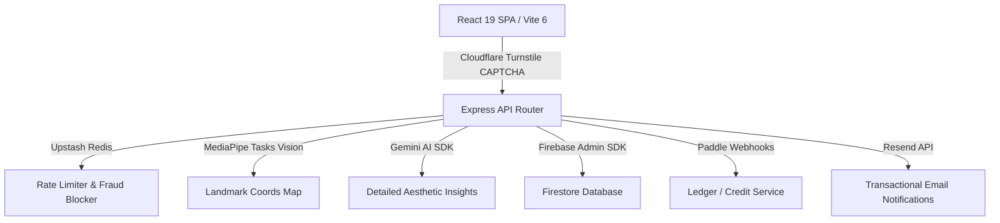

# VisageX (FaceAnalytics Pro) 🚀
> **State-of-the-Art AI-Powered Facial Analysis, Symmetry Scoring, and Personalized Glow-Up Coaching Platform.**

[](https://visagex.online)
[](./LICENSE)
[](https://react.dev)
[](https://vitejs.dev)
[](https://tailwindcss.com)

---

## 🎨 Interface Overview & Live Experience
VisageX features an ultra-premium, dark-mode-first aesthetic with rich micro-animations, custom canvases, and glassmorphic panels. It offers users a detailed assessment of their facial symmetry, features, skin health, and hairstyle recommendations, backed by Google Gemini AI and MediaPipe.

---

## ✨ Features

### 🔍 1. Real-Time Landmark Detection & Mapping
- Powered by `@mediapipe/tasks-vision` to map **478 3D facial landmarks** in the browser.
- Interactive **Facial Ratio Explorer** with custom canvas drawing overlay (`LerpLineCanvas`) showing facial geometry (canthal tilt, jawline angle, eye spacing, and vertical fifths).

### 🤖 2. Deep AI Aesthetic & Feature Analysis
- Integrated with Google **Gemini Pro (via Vertex AI / Gemini API)** for detailed aesthetic analysis.
- Instant, granular scores across asymmetry, facial shapes, facial profiles, and celebrity matches.
- Automated generation of structured findings (strengths and areas of improvement).

### 🧴 3. Dermatology & Skin Health Diagnostics
- Computer-vision-assisted scanning that highlights areas of concern (e.g., skin clarity, circles, hydration indicators) with interactive overlays.
- Diagnostic logs containing detailed coaching advice.

### 📅 4. Personalized Glow-Up Coach & Routine Planner
- Dynamic **Routine Planner** generating specialized day/night routines (skincare steps, facial exercise guides, mewing advice).
- Custom progress tracking timelines and routines.

### 💳 5. Premium Subscription Gating & Billing
- Fully integrated with **Paddle Billing** (sandbox/production ready).
- Responsive Pricing Tier matrices offering single analysis options, basic subscriptions, and pro access.
- Secure frontend client hooks (`use-paddle-prices.tsx` & `use-checkout.tsx`) synced with robust backend webhook handlers.

### 🔗 6. Viral Referral & Credit Engine
- Ledger-based credit economy. Users can share a referral code to gain additional scan credits.
- Dynamic overlay overlays showing referral statistics, pending rewards, and social share prompts.

### 🛡️ 7. Enterprise-Grade Security & Performance
- Server-side rate-limiting using **Upstash Redis REST API** and token-bucket algorithms.
- **Cloudflare Turnstile** CAPTCHA integration preventing automated bot scans.
- Secure encryption scripts to protect sensitive GCP/Firebase Service Accounts in serverless builds (`firebase-service-account.enc`).
- Pre-rendered static pages using `vite-plugin-prerender` for optimized SEO.

---

## 🏗️ Architecture

The platform uses a decoupled frontend-backend architecture structured for high scalability, rapid responses, and complete security.



### Key Components:
- **`src/`**: Modern React SPA. Uses Tailwind CSS v4, Framer Motion, and custom hooks.
- **`backend/`**: Express API serving routes for AI analysis, auth, referral ledger, Paddle webhook reconciliation, and scan histories.
- **`scripts/`**: Development helpers for service account encryption (`encrypt-service-account.js`) to secure Firebase credentials in public production repositories.
- **`netlify/`**: Serverless deployment configurations wrapping Express into a serverless Netlify function handler (`netlify/functions/api.ts`).

---

## 🚀 Getting Started

### 📋 Prerequisites
- **Node.js**: `v20.0.0` or higher
- **GCP/Vertex Project**: For AI-powered aesthetic generation
- **Firebase/Firestore**: For user database, transactions, and scan histories
- **Upstash Redis**: For rate-limiting and webhook replay protections

---

### ⚙️ Local Development Setup

1. **Clone the repository**:
   ```bash
   git clone https://github.com/yourusername/visagex.git
   cd visagex
   ```

2. **Install dependencies**:
   ```bash
   npm install
   ```

3. **Configure Environment Variables**:
   Copy `.env.example` to `.env`:
   ```bash
   cp .env.example .env
   ```
   Open `.env` and configure your API keys (Gemini API key, Firebase App configs, Upstash Redis endpoints, and Paddle Client Tokens).

4. **Verify / Generate Firebase Service Account**:
   If you have a local `firebase-service-account.json` file, you can encrypt it for CI/CD or production server builds:
   ```bash
   npm run build
   ```
   This triggers `generate-service-account.js`, decrypting the safe file or parsing environment variables to prepare for deployment.

5. **Start Dev Server**:
   ```bash
   npm run dev
   ```
   The local application will launch, running Vite in middleware mode under Express on [http://localhost:3000](http://localhost:3000).

---

### 🧪 Running Tests
Unit tests and integration schemas are built using **Vitest**:
```bash
npm test
```

---

## 🔒 Security Posture & Safeguards
- **Sensitive Key Exposure**: Standard `.env` and `firebase-service-account.json` credentials are strict-ignored via `.gitignore` configurations. Only encrypted descriptors (`firebase-service-account.enc`) are tracked.
- **Header Security**: Backend runs `helmet` middleware to enforce safe CSPs, prevent framejacking, and manage cross-origin resources.
- **CSRF & CAPTCHA**: Secure frontend challenges verifying token validity against Cloudflare APIs before hitting heavy computational AI endpoints.
- **Rate-Limiting**: IP-based limits using Redis to block scraper bots and API abuse.

---

## 📄 License
This project is licensed under the MIT License. See [LICENSE](./LICENSE) for details.
