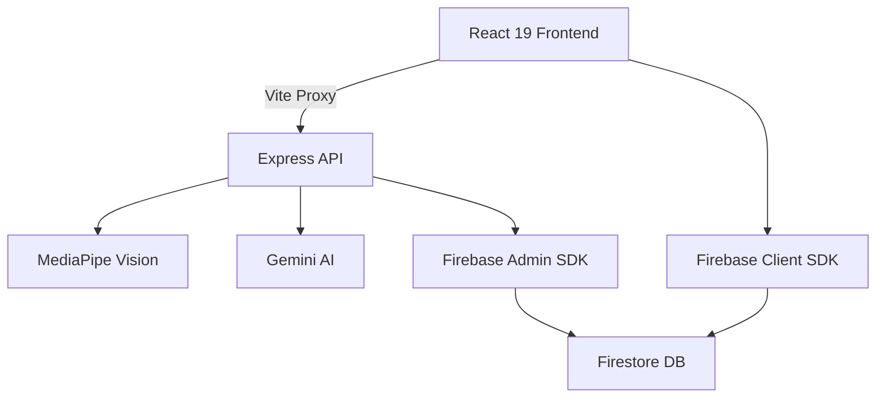

# FaceAnalytics Pro 🚀

Professional AI-powered facial analysis and symmetry scoring platform. This application uses MediaPipe for landmark detection and Gemini AI for detailed aesthetic analysis.

## 🏗️ Architecture



- **Frontend**: React 19, Vite 6, Tailwind 4, Framer Motion, Lenis.
- **Backend**: Node.js, Express, TypeScript.
- **Database/Auth**: Firebase & Firestore.
- **Analytics**: PostHog.
- **Payments**: PayPal.

## 🚀 Getting Started

### Prerequisites
- Node.js (v18+)
- Firebase Project
- Gemini API Key

### Installation

1. Clone the repository:
   ```bash
   git clone <repository-url>
   ```
2. Install dependencies:
   ```bash
   npm install
   ```
3. Configure environment variables:
   Copy `.env.example` to `.env` and fill in your keys:
   - `GEMINI_API_KEY`
   - Firebase configuration details.

### Development
Run the app locally:
```bash
npm run dev
```

### Production Build
Build for production:
```bash
npm run build
```

## 🧪 Testing

Run unit and integration tests:
```bash
npm test
```

## 🔒 Security
The project uses Firebase Security Rules for data protection. Administrative access is managed via the `role` field in the user document.

## 📄 License
Private. All rights reserved.
